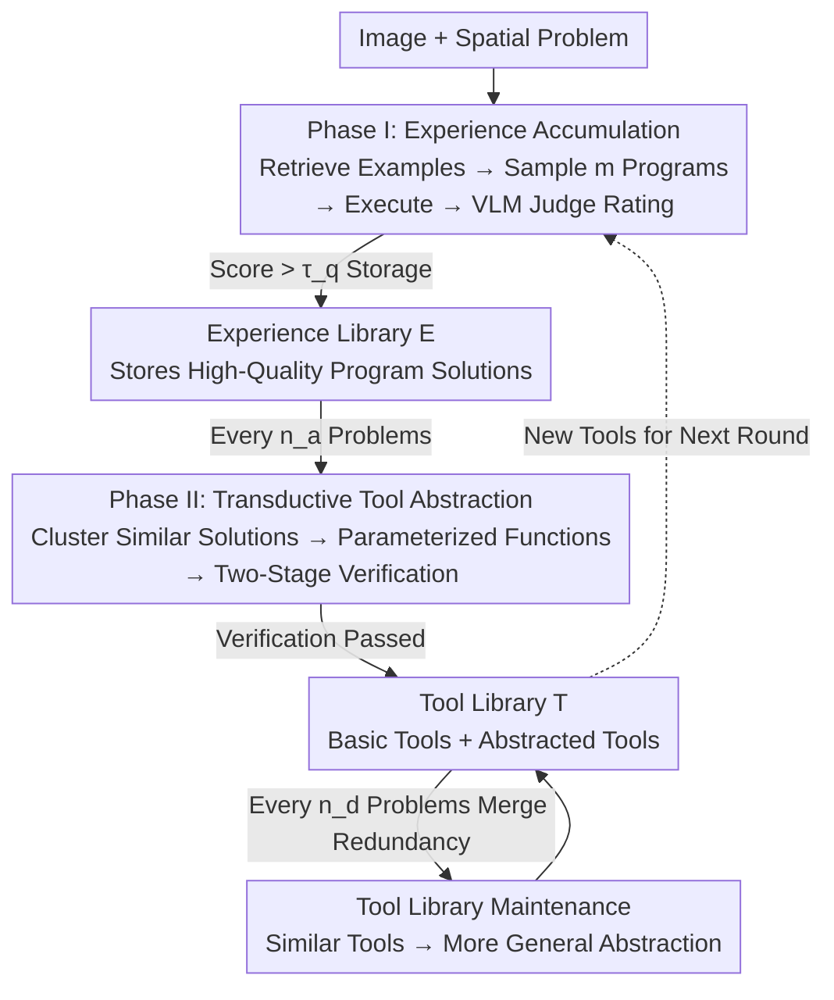

# Transductive Visual Programming: Evolving Tool Libraries from Experience for Spatial Reasoning

**Conference**: ICLR 2026  
**OpenReview**: [https://openreview.net/forum?id=XCW1l9qcxy](https://openreview.net/forum?id=XCW1l9qcxy)  
**Code**: https://transductive-visualprogram.github.io/  
**Area**: Multimodal VLM / Visual Programming / Spatial Reasoning  
**Keywords**: Visual Programming, Spatial Reasoning, Tool Abstraction, Self-Evolving Agents, Dual-Library System

## TL;DR
TVP enables visual programming agents to solve problems using basic tools and store high-quality programs in an "Experience Library." It then clusters and abstracts reusable high-level tools from these **successfully executed** programs into a "Tool Library," forming a "Program → Tool → Better Program" closed loop. It outperforms GPT-4o by 22% and previous visual programming systems by 11% on Omni3D-Bench, with the abstracted tools demonstrating zero-shot transferability to unseen spatial reasoning benchmarks.

## Background & Motivation

**Background**: Real-world 3D spatial reasoning (e.g., "How many cabinets must be stacked to match the height of a sofa and TV combined?") requires precise geometric calculations. Monolithic VLMs, even after spatial fine-tuning, struggle with such precision (GPT-4o achieves only 8.2% accuracy on floating-point calculation tasks). Visual programming (VisProg, ViperGPT, VADAR) approaches these tasks by decomposing problems into discrete steps that call specialized tools (depth estimation, object detection, geometric functions), using program logic to assemble intermediate results.

**Limitations of Prior Work**: The performance of visual programming systems depends on the development of their tool libraries. Early methods (VisProg, ViperGPT) relied on **fixed, predefined toolsets** that cannot adapt to new tasks. The more recent VADAR adopts an "inductive" approach, attempting to infer "which functions might be useful" based solely on problem descriptions **before solving the problem**. A critical issue with the latter is that these conjectured tools may appear useful in theory but fail to simplify problems in practice—94.2% of VADAR's programs still only utilize basic tools, with newly created tools rarely used.

**Key Challenge**: The correct sequence for tool development should be "Experience → Abstraction." Similar to human programmers, a system should first use basic tools to solve specific problems, recognize recurring patterns, and then abstract them into high-level functions. VADAR **reverses** this order (abstraction before problem-solving), creating an **open-loop** system where tools flow unidirectionally from "creation" to "application" without problem-solving experience to guide the abstraction, resulting in tools disconnected from actual needs.

**Goal**: Anchor tool creation in problem-solving experience to ensure every new tool originates from verified programs rather than conjectures.

**Key Insight**: The authors introduce a "transductive" perspective—directly transforming **concrete program solutions** into parameterized functions rather than deducing from abstract rules. This requires the system to have "experience" before performing "abstraction," naturally forming a closed loop.

**Core Idea**: Establish a "Program → Tool → Program" closed loop using two mutually reinforcing libraries (Experience Library + Tool Library). The system first solves problems with basic tools and stores successful programs in the Experience Library, then clusters and abstracts new tools from this library. These new tools, in turn, make future programs simpler and more accurate.

## Method

### Overall Architecture

TVP (Transductive Visual Programming) maintains two interconnected libraries: the **Experience Library $E$** (accumulating program solutions as experiential memory) and the **Tool Library $T$** (storing functions abstracted from programs, initially containing 5 basic visual tools). Given an image-question dataset $D=\{(I_i,q_i)\}_{i=1}^N$, the system alternates between two phases: **Phase I** solves problems using the current tool library and stores high-quality solutions in the Experience Library; **Phase II** periodically mines patterns from the Experience Library to abstract new tools into the Tool Library. As more problems are processed, both libraries grow—stronger tools and richer experiences lead to simpler and more precise programs. The entire process runs for $T$ iterations (experimentally $T=3$).

### Key Designs

**1. Dual-Library Closed Loop: Anchoring Tools in Verified Experience**

This design addresses the fundamental flaw of open-loop systems like VADAR, where tools are disconnected from real needs. TVP couples "programs" and "tools" in a cycle: the Experience Library $E$ stores successful programs as memory, and the Tool Library $T$ abstracts functions from these experiences. During problem-solving, similar examples are retrieved from $E$ as few-shot demonstrations to generate program candidates using functions from $T$. High-quality programs flow back into $E$, while similar solutions are clustered and abstracted into new parameterized functions in $T$. These new tools then facilitate better future programs.

The effectiveness stems from the fact that every tool is **backed by actual problem-solving experience**. It abstracts recurring patterns from solutions that have already been executed and verified, rather than being imagined from problem text. In experiments, transductively learned tools in TVP are used as core dependencies 5 times more frequently than in inductive methods, with 36.3% of programs solvable by calling only abstracted tools (compared to 5.8% for VADAR).

**2. Phase I Problem Solving & Experience Accumulation: Four-Step Quality Filtering**

To ensure the reliability of programs stored in the Experience Library, Phase I decomposes solving each problem into four rigorous steps. **① Example Retrieval**: For problem $q_i$, retrieve up to $k_{max}$ historical solutions from $E$ with text embedding similarity exceeding $\tau_{sim}$ (similar problems often share solution logic). **② Program Generation**: The generator samples $m$ candidate programs given the problem, retrieved examples, and the current Tool Library $T$ signatures. Multiple sampling increases the probability of finding a high-quality solution for complex geometric reasoning. **③ Program Execution**: Each candidate is executed in Python with image $I_i$ and the full toolset. Failed executions or empty results are filtered out. **④ Quality Rating**: A VLM judge evaluates the implementation, execution trace, and answer against the image as visual evidence. The highest-scoring candidate is selected, entering $E$ only if it exceeds the quality threshold $\tau_q$.

**3. Phase II Transductive Tool Abstraction: Cluster → Parameterize → Two-Stage Verification**

To refine reusable tools from concrete programs, Phase II employs a transductive approach. **Pattern Mining (Clustering)**: Problems in $E$ are clustered by embedding similarity; for clusters exceeding size $\tau_{cluster}$, an LLM assesses "abstraction potential" (identifying recurring patterns like relative camera distance). **Creating Parameterized Tools**: For clusters with high potential, an abstractor creates a parameterized function that captures the shared logic—e.g., a cluster calculating 3D size ratios produces `compute_3d_ratio`, replacing multi-step logic with a single call.

**Two-Stage Verification** is the critical defense: Stage 1 (Execution Verification) rewrites cluster programs using the new tool; **all must execute successfully (100%)**, or the tool is rejected. Stage 2 (Correctness Verification) uses a VLM judge to determine if new results are equivalent or better than originals, accounting for floating-point precision in geometric tasks. New tools enter $T$ only if accuracy exceeds $\tau_{correct}$.

**4. Tool Library Maintenance: Merging Redundancy for Generality**

As the system processes more problems, different clusters may produce redundant tools. Every $n_d$ problems, TVP identifies and merges similar tools—e.g., merging `compute_3d_ratio` (two objects) and `compute_3d_group_size_ratio` (two groups) into a more general `compute_objects_size_ratio`. Merged tools must pass the same two-stage verification across all examples that used the original tools. This ensures the library remains concise while tools evolve **hierarchically toward greater generality**.

## Key Experimental Results

### Main Results

On Omni3D-Bench (501 real-world, non-templated spatial reasoning questions), TVP was tested with GPT-4o as the generator/judge over three iterations:

| Method | Yes/No | Multi-choice | Counting | Float MRA | Float(±10%) | Overall |
| :--- | :--- | :--- | :--- | :--- | :--- | :--- |
| GPT-4o | 65.3 | 60.5 | 18.6 | 26.7 / 8.2 | — | 27.2 |
| SpaceMantis (Spatial FT) | 53.3 | 30.2 | 4.3 | 21.4 / 8.2 | — | 18.2 |
| VADAR (Prev. SOTA) | 56.0 | 57.6 | 21.7 | 35.5 / 15.9 | — | 29.9 |
| **TVP (Ours)** | 60.0 | **61.6** | **24.3** | **36.5 / 19.3** | — | **33.3** |
| TVP w/o Tool Lib | 60.0 | 61.6 | 21.4 | 35.5 / 17.0 | — | 31.7 |

TVP achieved an overall accuracy of 33.3%, outperforming VADAR by +11% (relative) and GPT-4o by +22%. While monolithic VLMs perform decently on perceptual tasks (Yes/No), they collapse on floating-point calculations requiring geometric reasoning (8.2%), highlighting the necessity of compositional approaches.

### Ablation Study

| Configuration | Overall | Note |
| :--- | :--- | :--- |
| TVP (Full) | 33.3 | Closed loop of Experience + Tool libraries |
| TVP w/o Tool Lib | 31.7 | Retrieval only; restricted to 5 basic tools |
| Full (Iter 1 → 2 → 3) | 31.3 → 31.9 → 33.3 | Continuous improvement |
| w/o Tool Lib (Iter 1 → 3) | 31.7 → 31.5 → 31.5 | Stagnation |

The Experience Library alone (31.7%) already surpasses baselines, but the addition of active tool creation allows the system to continue improving, whereas the experience-only version plateaus.

### Key Findings

- **Tool Abstraction Aids Hard Tasks**: On the most difficult problems, TVP (Full) surpassed the experience-only version by +6.7% by the third iteration. Abstract tools significantly reduce the reasoning burden by encapsulating complex code.
- **Quantifiable Gains from Closed Loop**: Median Cyclomatic Complexity (CCN) dropped from 3.0 to 1.0. Switching from basic to abstracted tools improved program accuracy by +3.4%.
- **Zero-Shot Transfer**: Using only the library built on Omni3D-Bench, TVP achieved 52.3% accuracy on SpatialScore-Hard, significantly higher than VADAR’s 32.8% (even though VADAR's tools were designed specifically for those benchmarks).
- **LLM Backbone Scalability**: Using Qwen2.5-Coder (7B→32B) showed monotonic performance increases, with the 32B model reaching 30.7%, surpassing VADAR using GPT-4o.

## Highlights & Insights

- **Transductive vs. Inductive Design**: The 5-fold difference in tool utilization (36.3% vs. 5.8%) quantifies the advantage of "Experience first" over "Abstraction first."
- **Two-Stage Verification for Generalization**: By requiring 100% execution success across a cluster, the system ensures that abstracted tools encode fundamental reasoning patterns rather than query-specific details.
- **Evolutionary "Snowball" Effect**: The merging mechanism allows tools to evolve from specific instances (ratios between two items) to general functions (ratios between arbitrary sets). This "create many, keep the best" approach is a generalizable recipe for self-evolving agent skill libraries.

## Limitations & Future Work

- **Dependency on Strong VLM Judges**: Quality assessment and verification rely on the VLM judge; biases or errors in the judge can propagate.
- **Threshold Sensitivity**: Parameters like $\tau_{sim}$ and $\tau_{cluster}$ require manual setting and may need tuning for new domains.
- **Domain Limitation**: The current focus is on 3D spatial reasoning where geometric calculations are parameterizable and floating-point results are numerically verifiable. Applying this to open-ended semantic tasks (e.g., standard VQA) may require different verification strategies.

## Related Work & Insights

- **vs. VADAR**: VADAR uses pure induction—conjecturing useful functions based on text—resulting in an open-loop system with high tool idle rates. TVP uses transduction, ensuring tools are backed by verified success, leading to 5x higher reuse and superior zero-shot transfer.
- **vs. VisProg / ViperGPT**: These use **static predefined** tools. TVP’s library continuously evolves and expands from experience.
- **vs. Self-Evolving Agents (LILO / Alita)**: While LILO uses lambda calculus compression for abstraction, TVP anchors abstraction in clustered, verified programs with a two-stage verification process, emphasizing the "Experience-first" transductive paradigm.

## Rating
- Novelty: ⭐⭐⭐⭐⭐ The transductive approach provides a measurable solution to the "Experience → Abstraction" sequence problem.
- Experimental Thoroughness: ⭐⭐⭐⭐⭐ Extensive validation across iterations, difficulty levels, and zero-shot transferability.
- Writing Quality: ⭐⭐⭐⭐ Logically sound and well-illustrated, though some algorithmic details are relegated to the appendix.
- Value: ⭐⭐⭐⭐⭐ Provides a reusable paradigm for building self-evolving visual programming agents with broad potential in other multimodal domains.

<!-- RELATED:START -->

## Related Papers

- [\[CVPR 2026\] SpaceTools: Tool-Augmented Spatial Reasoning via Double Interactive RL](../../CVPR2026/vlm_reasoning/spacetools_tool-augmented_spatial_reasoning_via_double_interactive_rl.md)
- [\[ICLR 2026\] Pursuing Minimal Sufficiency in Spatial Reasoning](pursuing_minimal_sufficiency_in_spatial_reasoning.md)
- [\[ICLR 2026\] AdaReasoner: Dynamic Tool Orchestration for Iterative Visual Reasoning](adareasoner_dynamic_tool_orchestration_for_iterative_visual_reasoning.md)
- [\[ICLR 2026\] Spatial CAPTCHA: Generatively Benchmarking Spatial Reasoning for Human-Machine Differentiation](spatial_captcha_generatively_benchmarking_spatial_reasoning_for_human-machine_di.md)
- [\[CVPR 2026\] Thinking with Programming Vision: Towards a Unified View for Thinking with Images](../../CVPR2026/vlm_reasoning/thinking_with_programming_vision_towards_a_unified_view_for_thinking_with_images.md)

<!-- RELATED:END -->
