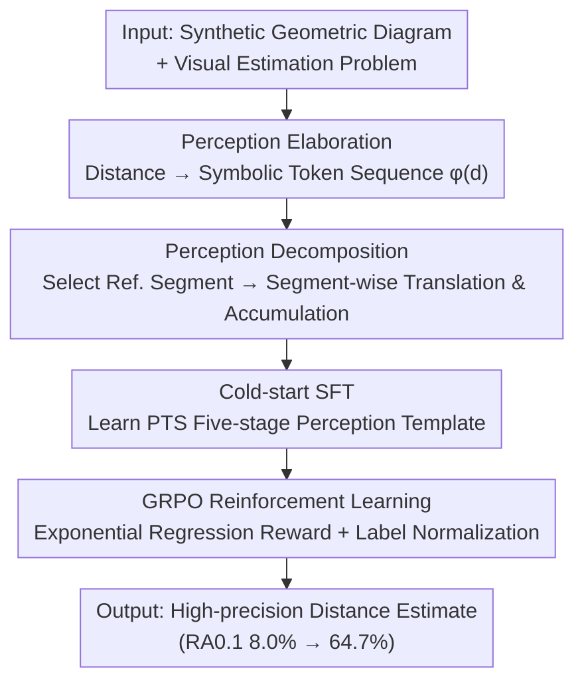

# Unleashing Perception-Time Scaling to Multimodal Reasoning Models

**Conference**: ICLR 2026  
**OpenReview**: [https://openreview.net/forum?id=WGIcXH9rk9](https://openreview.net/forum?id=WGIcXH9rk9)  
**Code**: https://github.com/RUCAIBox/PTS  
**Area**: Multimodal VLM / LLM Reasoning  
**Keywords**: Perception-time scaling, visual estimation, RLVR, symbolic tokens, GRPO

## TL;DR
Addressing the phenomenon where "inference-time scaling makes Large Vision-Language Models (LVLMs) think longer but not see more accurately," this paper proposes **Perception-Time Scaling (PTS)**. By rewriting perception as a token-dense, decomposable explicit process (symbolic distance + segment-wise accumulation) and employing SFT cold-start followed by GRPO reinforcement, the authors improve high-precision accuracy on their self-built perception benchmark, DisTANCE, from 8.0% to 64.7%, with the ability to generalize to out-of-distribution geometry and real-world multimodal tasks.

## Background & Motivation
**Background**: Reinforcement Learning with Verifiable Rewards (RLVR) has become the mainstream paradigm for enhancing the reasoning capabilities of LVLMs. It encourages models to generate longer chains of thought, achieving significant gains in "reasoning-intensive" multimodal tasks like mathematics and multidisciplinary problems. These approaches are collectively termed inference-time scaling.

**Limitations of Prior Work**: These gains are almost entirely confined to the "reasoning" stage; whether they aid "perception" remains unclear. Worse, existing studies find that reasoning-enhanced LVLMs are more prone to hallucinations. To systematically examine this, the authors constructed a pure perception benchmark, **DisTANCE** (synthetic geometric diagrams + visual estimation questions for length/perimeter/area). Results showed that open-source LVLMs rarely exceed 35% in RA$_{avg}$, with area estimation often below 20%. Reasoning-enhanced models (Vision-R1 22.7%, R1-OneVision 21.1%) performed nearly on par with the base Qwen2.5-VL-7B (21.5%). In other words, inference-time scaling lengthened the chain of thought but failed to fix perception.

**Key Challenge**: The authors attribute the root cause to the current **Fast Perception** paradigm of LVLMs—visual understanding is treated as a one-time output ("the radius is 2.5 units") without modeling intermediate perception processes. Two pieces of quantitative evidence support this: ① In the long responses of reasoning models, the proportion of perception-related tokens is extremely low (perception ratio only 12%–17%); ② As the distance to be estimated increases (ground truth from [1,2) to [5,∞)), the relative error increases monotonically from 0.45 to 1.66, indicating that models fail to "step-by-step decompose" complex perception as they do with reasoning.

**Goal**: To allow perception to enjoy the dividends of inference-time scaling—both by requiring the model to "write more tokens" for perception and by enabling it to decompose complex perception into controllable small steps.

**Key Insight**: When humans measure length with a ruler, they use a segment as a reference and "translate and accumulate it segment by segment," rather than calling out a number at a glance. By explicitly writing this "procedural perception" into the chain of thought, reward signals can act on every intermediate perception step.

**Core Idea**: Replace "one-time numerical output" with a "symbolic + decomposable explicit perception process" to align perception with inference-time scaling, allowing it to be step-wise optimized during RL.

## Method

### Overall Architecture
PTS aim to solve the problem of "unscalable perception": since reasoning can be optimized at every step via RL, perception is rewritten into a chain of multiple intermediate steps that can be refined by rewards. Given an image and a visual estimation problem, PTS first uses **Perception Elaboration** to represent abstract distances as symbolic token sequences (making perception token-dense and interpretable). It then uses **Perception Decomposition** to break "estimating a large distance" into local sub-goals of "accumulating segments based on a reference." Together, these steps define a structured perception reasoning template. Training is conducted in two stages: first, **SFT Cold-start** lets the model learn the PTS template; then, **GRPO Reinforcement Learning** uses continuous rewards tailored for regression tasks to allow the model to refine intermediate perception steps through trial and error, ultimately outputting high-precision estimates.

### Key Designs

**1. Perception Elaboration: Turning "One-time Numbers" into Token-dense Visual Representations**

To address the issue where "fast perception only spits out one numerical token, leaving perception information negligible in the CoT," PTS prevents the model from directly writing distance values. Instead, it defines a symbolic encoding function $\phi$ that maps the target distance $d_t$ to a sequence of discrete symbolic tokens. Each complete token group is rendered as `<==========>`, representing 1.0 unit of distance, where angle brackets are delimiters and each `=` represents a fixed length $\delta=0.1$ units. Given $d_t$, it is decomposed into an integer number of segments $k=\lfloor d_t/1.0 \rfloor$ and a residual $r=d_t-k$, encoded as:

$$\phi(d_t)=\underbrace{\texttt{<==========>}\cdots\texttt{<==========>}}_{k\ \text{times}}\ \|\ \phi_{res}(r),$$

where the residual part is $\phi_{res}(r)=\texttt{<}\underbrace{=\cdots=}_{m\ \text{times}}\texttt{>}$ with $m=\lfloor r/\delta \rfloor$. The benefit is that the model no longer dismisses the perception result with a single number; it is forced to "build" the distance block by block. This significantly increases the perception token ratio (e.g., the perception ratio for Length tasks increased from 20.4% in the base model to 30.2% in PTS) and establishes stronger grounding between vision and language—the symbolic length directly corresponds to physical length in the image.

**2. Perception Decomposition: Segment-wise Accumulation to Break Complex Perception into Controllable Steps**

To address the failure mode where "larger target distances lead to higher relative errors while the model still outputs one-time answers," PTS introduces a decomposition strategy. Instead of directly predicting $d_t$, the model first selects a reference segment $d_r$ in the image and defines it as 1.0 unit. Then, it simulates the process of "translating and accumulating this ruler segment by segment along the target distance":

$$\text{Initialize}:\ L=0,\ k=0;\qquad \text{While}\ L+d_r\le d_t:\ L\leftarrow L+d_r,\ k\leftarrow k+1.$$

Each step is merely a simple, local judgment of "whether to add another reference segment to the covered length," cutting a global difficulty into controllable steps. This aligns with how humans measure long objects. Crucially, turning perception into a "step-wise process" makes it compatible with inference-time scaling—reward signals can target each intermediate perception step, providing RL with the space to refine perception accuracy (the fundamental difference between PTS and standard CoT, where CoT contains little perception-specific content for RL to refine).

**3. Two-stage Training: Cold-start SFT + GRPO Rewards Tailored for Regression**

Possessing the PTS template is not enough; the model must learn the pattern and push accuracy further during reinforcement. The first stage is **Cold-start SFT**: the authors fix the PTS reasoning chain into five stages—Review (restate task), Hint (define symbolic encoding and decomposition), Reference (select reference segment), Estimation (visually compare other segments to the reference), and Calculation (apply formula for final result). They synthesized 6,000 PTS-style chains (2,000 each for length/perimeter/area) using few-shot human examples and GPT-4o expansion. The second stage is **GRPO Reinforcement**, modified for regression: ① **Continuous Exponential Reward**—binary rewards fail to capture "how far off" a model is, so they use $r(o)=e^{-\alpha\,|o-d_t|/d_t}$. The exponential form is highly sensitive to small errors, incentivizing fine-grained precision (shaping ablation showed this converges fastest). ② **Label Normalization**—the same relative error threshold results in vastly different absolute tolerances for small vs. large ground truths (0.1 threshold allows ±0.002 for 0.02, but ±5 for 50), which confuses the model early in training. Thus, models are first trained on normalized samples (target < 1) before introducing randomly distributed data.

### Main Results

| Configuration | Length RA$_{0.1}$ | Perimeter RA$_{0.1}$ | Area RA$_{0.1}$ | Average RA$_{0.1}$ | Average RA$_{avg}$ |
|------|------|------|------|------|------|
| Qwen2.5-VL-7B (base) | 11.0 | 11.0 | 2.0 | 8.0 | 21.5 |
| + Direct (SFT+RL) | 46.0 | 51.0 | 25.0 | 40.7 | 70.7 |
| + CoT (SFT+RL) | 38.0 | 48.0 | 27.0 | 37.7 | 71.3 |
| **+ PTS (SFT+RL)** | **70.0** | **74.0** | **50.0** | **64.7** | **88.3** |

PTS increased average RA$_{avg}$ from 21.5% to 88.3% and high-precision RA$_{0.1}$ from 8.0% to 64.7%, without using any spatial data or external tools, purely by internalizing perception into the CoT.

### Ablation Study

| Configuration | Average RA$_{0.1}$ | Description |
|------|------|------|
| PTS + SFT only | 16.3 | Only SFT; PTS is similar to or lower than CoT/Direct |
| Direct + SFT+RL | 40.7 | Direct numerical + RL |
| CoT + SFT+RL | 37.7 | Standard CoT + RL |
| **PTS + SFT+RL** | **64.7** | Full method; gap widens during RL stage |

### Key Findings
- **Gap emerges during RL, not SFT**: PTS and CoT perform similarly with only SFT (16.3 vs 13.7), but PTS surges to 64.7% during GRPO while CoT only reaches 37.7%—because the PTS chain embeds numerous refined perception steps, whereas CoT lacks perception content to optimize.
- **PTS increases attention to images**: Compared to vanilla Qwen2.5-VL, the PTS-trained model shows higher attention ratios to image tokens in early and late transformer layers, suggesting stronger grounding and image-conditioned reasoning.
- **Data scaling saturates**: Gains for Direct/CoT/PTS level off as data scale increases from 2k to 12k, implying that perception improvements require changes to the paradigm itself, not just more data.

## Highlights & Insights
- **"See" like "Think"**: The core insight is that current RLVR only scales reasoning, not perception. Scaling requires "proceduralization." PTS uses symbolic tokens + segment-wise accumulation to decompose one-time perception into an optimizable chain.
- **Symbolic tokens as a grounding mechanism**: Using visualizable tokens like `<==========>` naturally increases the perception ratio and ties linguistic length to physical image length, which is more stable than direct numerical regression.
- **Synthetic-to-real transfer**: Training on synthetic geometry improved performance on real-world tasks like LEGO 3D, CV-Bench, and BLINK, suggesting "procedural perception" is a transferable meta-ability rather than shape memorization.

## Limitations & Future Work
- **Narrow Task Domain**: DisTANCE and the training data are focused on geometric distances, perimeters, and areas. Whether this symbolic decomposition applies to non-metric perception (semantics, texture, relations) remains unverified.
- **Reliance on Reference Segments**: Decomposition requires selecting a reliable reference segment and defining it as 1.0 unit. In natural scenes lacking clear reference structures, this may fail.
- **Hyperparameter Sensitivity**: The symbolic granularity $\delta=0.1$ and reward weight $\alpha$ must be tuned; the optimal granularity may vary by task.

## Rating
- Novelty: ⭐⭐⭐⭐⭐ The perspective of "scaling perception rather than reasoning" is clear and the implementation is clever.
- Experimental Thoroughness: ⭐⭐⭐⭐⭐ Self-built benchmark + 3-layer evaluation + thorough ablations.
- Writing Quality: ⭐⭐⭐⭐ Clear motivation and causal links.
- Value: ⭐⭐⭐⭐⭐ Fixes a major blind spot in RLVR for perception.

<!-- RELATED:START -->

- **Vision-R1**: Applying RLVR to multimodal reasoning (baseline).
- **Visual Sketchpad**: Tool-augmentation for perception (PTS outperforms it without external tools).
- **Spatial-R1**: Size estimation for real-world objects.

<!-- RELATED:END -->

## Related Papers

- [\[ICLR 2026\] Perception-R1: Advancing Multimodal Reasoning Capabilities of MLLMs via Visual Perception Reward](perception-r1_advancing_multimodal_reasoning_capabilities_of_mllms_via_visual_pe.md)
- [\[ICLR 2026\] Perception-Aware Policy Optimization for Multimodal Reasoning](perception-aware_policy_optimization_for_multimodal_reasoning.md)
- [\[CVPR 2026\] UniT: Unified Multimodal Chain-of-Thought Test-time Scaling](../../CVPR2026/vlm_reasoning/unit_unified_multimodal_chain-of-thought_test-time_scaling.md)
- [\[ICLR 2026\] Test-Time Matching: Unlocking Compositional Reasoning in Multimodal Models](test-time_matching_unlocking_compositional_reasoning_in_multimodal_models.md)
- [\[CVPR 2026\] Scaling Test-Time Robustness of Vision-Language Models via Self-Critical Inference Framework](../../CVPR2026/vlm_reasoning/scaling_test-time_robustness_of_vision-language_models_via_self-critical_inferen.md)

<!-- RELATED:END -->
