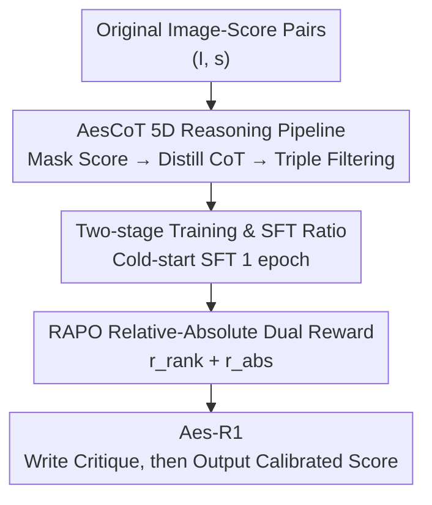

# Unlocking the Essence of Beauty: Advanced Aesthetic Reasoning with Relative-Absolute Policy Optimization

**Conference**: ICLR 2026  
**OpenReview**: [https://openreview.net/forum?id=or3ZukbrKw](https://openreview.net/forum?id=or3ZukbrKw)  
**Code**: https://github.com/ssssmark/AesR1  
**Area**: Multimodal VLM / Image Aesthetic Assessment / Reinforcement Learning  
**Keywords**: Image Aesthetic Assessment, Multimodal Reasoning, Relative-Absolute Reward, Cold-start SFT, GRPO

## TL;DR
This paper proposes the Aes-R1 framework, which utilizes an automated data pipeline, AesCoT, to distill aesthetic reasoning corpora across five dimensions for cold-start SFT. It then employs RAPO, a reinforcement learning algorithm that simultaneously optimizes "absolute score regression + relative ranking," allowing the MLLM to improve average PLCC/SRCC in image aesthetic assessment by 47.9%/34.8% relative to the backbone using only 15K training samples, surpassing SOTAs of the same scale.

## Background & Motivation
**Background**: Image Aesthetic Assessment (IAA) aims to capture high-level subjective perceptions such as composition, color, lighting, and emotion, rather than just pixel-level clarity. Current mainstream approaches involve Supervised Fine-Tuning (SFT) on datasets with Mean Opinion Score (MOS) labels, enabling Multimodal Large Language Models (MLLM) to directly regress an aesthetic score.

**Limitations of Prior Work**: Purely score-based supervision has two critical flaws. First, it lacks interpretability—the model outputs a single number without aligning visual elements with multi-dimensional aesthetic criteria; adding "explain-then-score" reasoning is hindered by the scarcity of high-quality, artist-level reasoning annotations, which are expensive and difficult to scale. Second, SFT itself is prone to overfitting: the authors observe in Tab. 3 that as SFT epochs increase, token entropy rapidly collapses from 1.609 to 0.705 after an initial rise, leading to dataset bias and restricted exploration space.

**Key Challenge**: Reinforcement Learning (RL) is a powerful alternative to SFT due to its data efficiency and generalization, but applying RL directly to IAA faces two obstacles. First, without aesthetic reasoning pre-training, end-to-end RL may achieve decent scores but fails to trigger genuine aesthetic reasoning, generating hollow and generic explanations (the Aes-R1-Zero phenomenon) with a risk of reward hacking. Second, there is no universal standard for aesthetics, making reward proxies difficult to design: the authors' replication found that VisualQuality-R1 using ranking rewards distinguishes quality (high SRCC) but fails in score calibration (PLCC only 0.4429), while Q-Insight using scalar rewards suffers from distribution peak mismatch.

**Goal**: To split the problem into two sub-tasks: (1) low-cost generation of reliable aesthetic reasoning data for cold-starting; (2) design of a reward mechanism that calibrates both absolute scores and relative preferences.

**Key Insight**: Borrowing from Kant’s assertion that "there are no objective rules of taste that can determine what is beautiful via concepts," the authors argue that human aesthetic judgment is inherently **context-dependent**—involving both absolute intrinsic quality assessment and relative lateral comparison. Therefore, IAA rewards should contain two complementary dimensions: relative ranking by attractive comparisons and absolute evaluation of intrinsic aesthetic value.

**Core Idea**: Use "AesCoT cold-start to inject aesthetic reasoning priors + RAPO dual rewards to govern both absolute scores and relative ranking" to address the issues of RL lacking reasoning and failed calibration.

## Method

### Overall Architecture
Aes-R1 is a two-stage pipeline that "teaches reasoning first, then aligns with human preferences via RL." The input is an image-score dataset $\mathcal{D}=\{(I_i,s_i)\}$, and the output is a policy model $\pi_\theta$ that provides a "structured aesthetic critique $c$, followed by a score $s$ in the $[0,1]$ range" for any image. The pipeline proceeds in three sequential parts: the **AesCoT data pipeline** distills raw image-score pairs into reasoning corpora with five-dimensional aesthetic explanations; this corpus is used for **cold-start SFT** to establish the "explain-then-score" cognitive habit; finally, **RAPO reinforcement learning** uses relative-absolute dual rewards to fine-tune the policy, enhancing both individual image scoring accuracy and cross-image preference judgment.

### Key Designs

**1. AesCoT: Automated Distillation of Image-Score Pairs into 5D Aesthetic Reasoning**

Cold-starting requires high-quality aesthetic reasoning data, but artist-level annotations are scarce. AesCoT is the (claimed) first automated aesthetic reasoning data construction pipeline. The core idea is "reverse utilization of existing scores": for each pair $(I_i,s_i)$, the continuous score is **masked from the output**, and a strong closed-source MLLM is prompted to write critical analyses across five dimensions (lighting, emotion & narrative, composition, color, exposure). To highlight differences, scores are categorized into bad (0–0.4), fair (0.4–0.7), and good (0.7–1.0) to guide the tone of the analysis. The generated analysis is then concatenated back with the ground truth score to form a reasoning trajectory $\mathcal{D}_{CoT}=\{(P,I_i,c_i,s_i)\}$.

To ensure reliability, the pipeline performs **triple filtering** $\mathcal{D}_{AesCoT}=\mathcal{F}(\mathcal{D}_{CoT})=\{(P,I_i,c_i,s_i)\mid \|E_i\|=0\}$, filtering out three types of errors $E_i=(e^{leak}_i, e^{align}_i, e^{fact}_i)$ via automated checks and manual review: score leakage (score mentioned in critique), reasoning-score inconsistency, and factual errors. This step ensures the critique truly supports the score, preventing the model from learning "hallucinated reasoning." The authors release AesCoT-3K and AesCoT-10K.

**2. RAPO: Dual Reward RL for Relative Ranking + Absolute Error**

To address the limitations where single-objective rewards either fail in calibration or ranking, RAPO samples a group of $K$ outputs per image-prompt input within the GRPO framework and calculates two complementary rewards.

*Relative Ranking Reward* $r_{rank}$ is based on FRank, which is continuous, bounded, and differentiable, directly aligning with pairwise ranking consistency. It assumes aesthetic scores follow a Gaussian distribution $s\sim\mathcal{N}(\mu,\sigma^2)$, thus the score difference between two images follows $s_i-s_j\sim\mathcal{N}(\mu_i-\mu_j,\sigma_i^2+\sigma_j^2)$. The pairwise comparison probability for the $k$-th predicted score $o_{ik}$ against image $j$ is:

$$p_{ik}(I_i,I_j)=\Phi\!\left(\frac{o_{ik}-\mu_j}{\sqrt{\sigma_i^2+\sigma_j^2+\gamma}}\right),\quad i\neq j$$

where $\Phi$ is the standard normal CDF, $\mu_j$ is estimated using the mean of $K$ predicted scores for image $j$, and $\gamma$ is a small constant. The ranking reward uses the binary preference label $p_c$ from the ground truth MOS ($1$ if $s_i\ge s_j$, else $0$) for cross-term weighting: $r_{rank}(o_{ik})=\frac{1}{N-1}\sum_{j\neq i}\sqrt{p_c\,p_{ik}}+\sqrt{(1-p_c)(1-p_{ik})}$.

*Absolute Error Reward* $r_{abs}$ calibrates the score to the ground truth MOS:

$$r_{abs}(o_{ik})=\exp\!\left(-\frac{1}{2}\left(\frac{|o_{ik}-s_i|}{\sigma}\right)^2\right)+\epsilon$$

The total reward is the sum $r=r_{rank}+r_{abs}$, which is then group-normalized per GRPO to obtain the advantage $\hat A_{k,t}=\frac{r_k-\mu(R_i)}{\sigma(R_i)}$. The dual reward ensures both correct cross-image preferences and accurate single-image scoring.

**3. Two-stage Training and SFT Ratio from an Entropy Perspective**

Why must SFT precede RL, and why should SFT be limited? The authors provide a quantitative answer using entropy. Cold-start SFT on AesCoT data aims to maximize the log-likelihood of reasoning trajectories: $\mathcal{L}_{sft}(\theta)=\mathbb{E}_{(P,I,c,s)\sim\mathcal{D}_{CoT}}[-\log\pi_\theta(c,s\mid P,I)]$. This is followed by RAPO, adopting the DAPO approach with higher clipping bounds and weaker KL penalties to encourage exploration.

The key is the number of SFT epochs. Skipping SFT (Aes-R1-Zero) reaches reasonable scores but with hollow explanations and reward hacking risks. Too much SFT leads to overfitting and entropy collapse, leaving little room for RL gains. Tab. 3 shows that 1 epoch of SFT yields moderate initial entropy (1.609) and the highest post-RL average PLCC/SRCC (0.6337/0.6186). At 10 epochs, entropy collapses to 0.705, and performance drops to 0.4624/0.4705 after RL. The conclusion is that "moderate SFT provides priors and format stability while preserving sufficient entropy for RL exploration."

### Loss & Training
The cold-start phase uses the NLL loss $\mathcal{L}_{sft}$ from Eq. (8). The RL phase maximizes the RAPO objective $J_{RAPO}(\theta)$ using the token-level clipping objective of GRPO with the dual-reward advantage $\hat A_{k,t}$ and a KL regularization term $-\beta D_{KL}(\pi_\theta\|\pi_{ref})$. Asymmetric clipping $\epsilon_{low}/\epsilon_{high}$ and small KL coefficients are used. Training uses 15K combined samples (AVA:TAD66K:FLICKR-AES = 2:2:1) with Qwen2.5-VL-7B as the backbone.

## Key Experimental Results

### Main Results
Average PLCC/SRCC across five datasets (TAD66K, AVA, FLICKR-AES as in-domain; PARA, AADB as OOD):

| Method | Type | Avg PLCC | Avg SRCC |
|------|------|-----------|-----------|
| Qwen2.5-VL-7B (backbone) | Vanilla MLLM | 0.4285 | 0.4589 |
| GPT-4.1 | Vanilla MLLM | 0.5171 | 0.5491 |
| Q-Align* | MLLM/SFT | 0.5120 | 0.5255 |
| Q-Insight* | MLLM/RL | 0.5954 | 0.5813 |
| VisualQuality-R1* | MLLM/RL (Rank only) | 0.4429 | 0.5930 |
| **Aes-R1 (Ours)** | MLLM/RL | **0.6337** | **0.6186** |

\*Results retrained on the 15K combined set. Aes-R1 improves average PLCC/SRCC by ~47.9%/34.8% over the backbone, achieving the highest scores across benchmarks. VisualQuality-R1 shows high SRCC (0.5930) but poor PLCC (0.4429), confirming the "ranking without calibration" issue that Aes-R1 addresses.

### Ablation Study

Reward Combination Ablation (RL without cold-start, Avg PLCC/SRCC):

| Configuration | Avg PLCC | Avg SRCC | Note |
|------|-----------|-----------|------|
| Binary only | 0.4255 | 0.4433 | Only "correct/wrong," weakest signal |
| Error only (Absolute) | 0.5655 | 0.5600 | Continuous signal, good calibration |
| Rank only (Relative) | 0.4542 | 0.5908 | Strong ranking (SRCC) but PLCC collapse |
| Binary + Rank | 0.5964 | 0.5825 | Similar to VisualQuality-R1 |
| **Error + Rank (RAPO)** | **0.6297** | **0.6102** | Complementary, most stable OOD |

SFT Ratio Ablation (Different SFT epochs followed by RAPO):

| SFT epoch | RL | Starting Entropy | Avg PLCC | Avg SRCC |
|-----------|-----|--------|-----------|-----------|
| 0 | RAPO | 0.961 | 0.6297 | 0.6102 |
| **1** | **RAPO** | **1.626** | **0.6337** | **0.6186** |
| 2 | RAPO | 1.391 | 0.6027 | 0.5903 |
| 10 | RAPO | 0.716 | 0.4624 | 0.4705 |

Reward weight ablation (Relative:Absolute) shows 0.5:0.5 achieves the best results; extreme weights toward either pure relative or pure absolute result in significant drops.

### Key Findings
- **Dual reward is the core gain**: Ranking reward alone yields only 0.4542 PLCC; error reward alone yields only 0.5600 SRCC. Their combination boosts both and stabilizes OOD generalization.
- **SFT "Sweet Spot"**: 1 epoch of cold-start is optimal. At 10 epochs, entropy collapses, and RL performance degrades, proving that excessive SFT hinders exploration.
- **Higher initial entropy leads to higher RL gains**: Checkpoints with lower initial performance but higher entropy show the most significant improvement after RAPO.
- **Skipping SFT results in vacuous reasoning**: Aes-R1-Zero generates generic explanations, highlighting the necessity of cold-starting to inject aesthetic priors.

## Highlights & Insights
- **"Reverse Distillation" is clever**: AesCoT masks scores to let strong models write analyses and then recovers the scores with filtering. This "label as answer, model for reasoning" approach is transferable to any scalar-label task missing reasoning.
- **Aesthetic judgment is split into relative and absolute axes**, implemented via FRank and Gaussian absolute error rewards. The alignment between theoretical motivation (Kant's subjective taste) and engineering implementation is strong.
- **Quantifying SFT/RL trade-offs via token entropy** transforms the intuition that "too much SFT kills RL gains" into a measurable metric, providing a recipe for other cold-start + RL designs.

## Limitations & Future Work
- Evaluation relies on PLCC/SRCC; the quality of generated explanations is not quantitatively measured (only via cases).
- Modeling aesthetic scores as a Gaussian distribution $s\sim\mathcal{N}(\mu,\sigma^2)$ may not hold for multi-modal or long-tail real-world preferences.
- AesCoT depends on closed-source MLLMs, potentially inheriting their aesthetic biases. The five dimensions are manually defined and may not cover all cultural/subjective aesthetics.
- Restricted training scale (15K) and backbone (Qwen2.5-VL-7B); the optimal reward ratio and SFT sweet spot may shift on larger models.

## Related Work & Insights
- **vs Q-Insight**: It uses scalar (absolute) rewards, leading to distribution peak mismatch. RAPO's relative ranking reward improves average PLCC from 0.5954 to 0.6337.
- **vs VisualQuality-R1**: It relies on ranking rewards alone, resulting in poor calibration (PLCC 0.4429). Aes-R1's dual rewards provide a significant lead.
- **vs Pure SFT Methods (Q-Align / ArtiMuse)**: SFT suffers from overfitting and entropy collapse. RL + cold-start exceeds SFT SOTA with only 15K samples and better OOD generalization.
- **vs DeepSeek-R1 Paradigm**: It follows the logic of "small high-quality reasoning data for cold-start + RL self-learning," but substitutes general reasoning with aesthetic reasoning and target-specific dual rewards.

## Rating
- Novelty: ⭐⭐⭐⭐ First automated aesthetic reasoning pipeline + Relative-Absolute RL, clear motivation.
- Experimental Thoroughness: ⭐⭐⭐⭐ Five datasets, comprehensive ablations, though lacking quantitative critique evaluation.
- Writing Quality: ⭐⭐⭐⭐ Clear logic, rigorous formulas, and entropy analysis.
- Value: ⭐⭐⭐⭐ Practical IAA solution with a reusable "reverse distillation + dual reward + entropy diagnosis" toolbox.

<!-- RELATED:START -->

## Related Papers

- [\[ICLR 2026\] Perception-Aware Policy Optimization for Multimodal Reasoning](perception-aware_policy_optimization_for_multimodal_reasoning.md)
- [\[ICCV 2025\] R1-VL: Learning to Reason with Multimodal Large Language Models via Step-wise Group Relative Policy Optimization](../../ICCV2025/vlm_reasoning/r1-vl_learning_to_reason_with_multimodal_large_language_models_via_step-wise_gro.md)
- [\[ICLR 2026\] Vision-SR1: Self-Rewarding Vision-Language Model via Reasoning Decomposition and Multi-Reward Policy Optimization](vision-sr1_self-rewarding_vision-language_model_via_reasoning_decomposition_and_.md)
- [\[ICLR 2026\] MM-HELIX: Boosting Multimodal Long-Chain Reflective Reasoning with Holistic Platform and Adaptive Hybrid Policy Optimization](mm-helix_boosting_multimodal_long-chain_reflective_reasoning_with_holistic_platf.md)
- [\[CVPR 2026\] CodeV: Code with Images for Faithful Visual Reasoning via Tool-Aware Policy Optimization](../../CVPR2026/vlm_reasoning/codev_code_with_images_for_faithful_visual_reasoning_via_tool-aware_policy_optim.md)

<!-- RELATED:END -->
