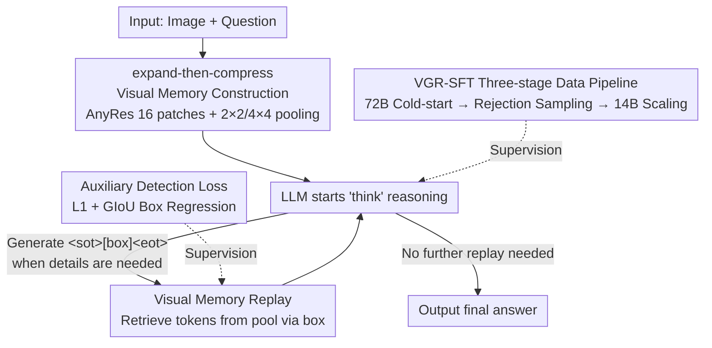

# VGR: Visual Grounded Reasoning

**Conference**: ICLR 2026  
**OpenReview**: [https://openreview.net/forum?id=kDhAiaGzrn](https://openreview.net/forum?id=kDhAiaGzrn)  
**Code**: https://huggingface.co/BytedanceDouyinContent/VGR (Data public)  
**Area**: Multimodal VLM / LLM Reasoning  
**Keywords**: Multimodal Reasoning, Visual Grounding, Visual Memory Replay, Chain-of-Thought, SFT Data Construction

## TL;DR
VGR enables Multimodal Large Language Models (MLLMs) to "replay visual memory" during the thinking process—autonomously framing key regions during reasoning and retrieving high-resolution visual tokens to continue thinking. Coupled with a set of VGR-SFT data containing grounding signals, it significantly outperforms baselines on fine-grained image understanding tasks such as ChartQA, AI2D, and MMStar, while using only 30% of LLaVA-NeXT's visual tokens.

## Background & Motivation
**Background**: Inspired by reasoning LLMs like OpenAI-o1 and DeepSeek-R1, multimodal reasoning has recently followed the path of "distilling the Chain-of-Thought (CoT) of strong LLMs into MLLMs," achieving good results in mathematics and science.

**Limitations of Prior Work**: Reasoning in these methods occurs almost entirely in the **pure language space**—the model looks at the image once, converts it into a text description, and performs chain inference solely on text. This introduces two problems: first, **language bias**, where the model over-relies on textual common sense and systematically performs worse on perception-intensive tasks requiring image details (prior work even found that CoT prompting can **degrade** performance on perception tasks); second, this paradigm is confined to math/science and cannot handle tasks like chart reading, document OCR, or fine-grained localization where "the answer is hidden in a small region of the image."

**Key Challenge**: The reasoning process requires repeatedly revisiting specific image regions. However, once a pure-text CoT compresses the image into a fixed description, subsequent reasoning loses access to original image details. Conversely, retaining details by stacking visual tokens leads to explosive computational costs. Precision and efficiency are contradictory in traditional architectures.

**Goal**: To enable MLLMs to **autonomously and on-demand** direct attention to any image region during reasoning and truly incorporate the visual features of that region into thinking, rather than merely outputting bounding box coordinates.

**Key Insight**: The authors draw an analogy to human cognition—humans not only use language for reasoning but also "replay" and simulate visual content in their minds. Thus, they extend traditional text-only CoT into interleaved multimodal reasoning trajectories, allowing models to **selectively retrieve visual memories** when needed.

**Core Idea**: Replace pure-language CoT with "grounding-then-answering"—the model generates replay signals during thinking to frame key regions. The system then retrieves corresponding tokens from a visual memory pool and appends them to the sequence, allowing fine-grained visual details to participate directly in subsequent reasoning.

## Method

### Overall Architecture
The input to VGR is an image and a question, and the output is an **interleaved vision-language CoT + final answer**. The system revolves around a "visual memory pool": the image is encoded into high-resolution patches using an AnyRes strategy, and all patch features are concatenated into a fine-grained feature map $S$ stored in **visual memory**. The model begins `<think>` reasoning like a standard MLLM; when it determines that a "region needs to be seen clearly," it generates a replay signal `<sot>[x1,y1,x2,y2]<eot>`. Once the parser detects `<eot>`, it extracts the coordinates, crops the corresponding region from the memory pool $S$, compresses it via pooling, and inserts these visual tokens immediately after the signal. The model continues reasoning with these "retrieved visual details," a process that can be triggered multiple times. On the training side, a **three-stage data pipeline** produces SFT data with grounding signals to teach the model this behavior.

### Key Designs

**1. Dynamic Visual Memory Replay: Retrieving visual details on-demand during thinking**

This is the core mechanism of VGR, addressing the pain point that "pure-text CoT loses original image details once compressed." The authors predefine a replay control signal where the region is denoted as `<sot>[x1, y1, x2, y2]<eot>`, with $[x_1, y_1]$ as the top-left and $[x_2, y_2]$ as the bottom-right corner. During reasoning, the model is encouraged to **self-generate** this signal when visual evidence needs expansion. The system monitors the output in real-time; upon parsing `<eot>`, it extracts coordinates and crops the region $R_{x_1,y_1,x_2,y_2}$ from the memory map $S$. This region is processed via $2\times2$ pooling into a 1D token sequence and inserted into the LLM input. Training is straightforward: retrieved tokens $R$ are added to the sequence following the signal and supervised via standard SFT—signal and text tokens use cross-entropy, while **all image tokens (original + replayed) are excluded from the loss**. Ablations show that if the model only outputs boxes without replaying features (w/o replay), gains are limited, proving that incorporating actual image features into reasoning is the key factor.

**2. Expand-then-compress Visual Memory Construction: Balancing high-resolution detail and token budget**

For the replay mechanism to work, the memory pool must be sufficiently fine-grained, which usually implies high token counts and overhead. The authors solve this via "expand-then-compress": increasing LLaVA AnyRes's maximum patches from 4 to **16** (expansion, supporting 5× resolution) and introducing a 2D pooling layer (compression). Specifically, the input image is resized to $H\times W$ (multiples of $p=336$) and cut into non-overlapping $p\times p$ patches $P_{ij}$. Patch features $T_{i,j}=F_{adapter}(F_{vision}(P_{ij}))$ are concatenated into the feature map $S$. Compression uses $2\times2$ pooling for snapshots and $4\times4$ pooling for high-res AnyRes patches. Consequently, while the baseline uses up to 2880 tokens (576/patch × 5), VGR uses only 144 for snapshots and up to 720 for high-res patches, **reducing overall tokens by ~70% while expanding resolution by 5×**.

**3. Auxiliary Detection Loss: Calibrating box coordinates via continuous regression**

The usefulness of retrieved details depends on the accuracy of the grounding box. However, coordinates are tokenized into discrete numbers, and pure cross-entropy suffers from **quantization errors and prediction discontinuity**. The authors add an auxiliary detection loss $L_{det}$ as a direct regression task: a small MLP maps the hidden state of `<eot>` to a 4-dimensional box. The loss is a combination of L1 and GIoU: $L_{det}=\ell_1+\beta\ell_{GIoU}$ ($\beta=2$). Here, $\ell_1=|\hat{x}_c-x_c|+|\hat{y}_c-y_c|+|\hat{w}-w|+|\hat{h}-h|$ measures absolute errors, and $\ell_{GIoU}=1-\big(\frac{\text{InterArea}}{\text{UnionArea}}-\frac{C-\text{UnionArea}}{C}\big)$ handles non-overlapping cases. Combining continuous regression with discrete generation ensures precise and stable localization.

**4. VGR-SFT Three-stage Data Construction: Generating reasoning data with autonomous grounding signals**

Models do not inherently learn to "ground then answer." The key lies in the data. Unlike prior works using pure-text CoT or rigid multi-turn interaction, in VGR data **all grounding regions are autonomously generated by the model** to avoid human annotation bias. The pipeline has three stages: ① **Cold-start**: A 72B MLLM produces reasoning chains and answers for image-question pairs, localizing key regions as JSON-formatted replay areas. ② **Rejection Sampling**: Format validation, correctness validation (ANLS for closed-set, semantic alignment for open-set), and visual grounding validation (verifying flipped/cropped content). ③ **Annotation Scaling**: Since the 72B model has a high rejection rate (14% pass rate), a 14B model is trained on the passed data + Open-R1 distilled data to scale up, increasing the pass rate to **40%** and speed by **3.2×**, resulting in 158K samples. All data is derived from original LLaVA-NeXT SFT data sources to ensure a fair comparison.

### Loss & Training
Ours follows the two-stage LLaVA-NeXT process: pre-training (LLaVA-558K, lr 1e-5) and SFT (merging LLaVA-770K with the curated 158K, lr 2e-5, ViT lr at 0.1× base). The vision encoder is CLIP-ViT-L/14@336, and the base LLM is Vicuna-v1.5 (7B/13B). Total loss = cross-entropy for text/signal tokens + $L_{det}$. Image tokens are excluded from the language loss.

## Key Experimental Results

### Main Results
Comparison of VGR-7B (Vicuna-7B) with various VLMs (selected representatives):

| Method | #Vtoken | MMStar | ChartQA | AI2D | InfoQA | RWQA | POPE |
|------|---------|--------|---------|------|--------|------|------|
| LLaVA-NeXT-7B | 2880 | 37.6 | 54.8 | 66.6 | 37.1 | 57.8 | 86.5 |
| LLaVA-NeXT-7B† (repro+pooling) | 864 | 37.2 | 58.7 | 68.5 | 34.7 | 56.8 | 87.8 |
| VGR-7B | 864 | 41.7 | 67.7 | 73.7 | 39.8 | 59.8 | 88.2 |
| VGR-7B | 3024 | 43.6 | 72.8 | 73.4 | 42.9 | 59.5 | 87.8 |

VGR leads across the board with similar or fewer tokens. Using 0.3× visual tokens, Ours achieves +4.1 MMStar, +7.1 AI2D, and +12.9 ChartQA gains over the baseline.

### Ablation Study
Data component ablation (Table 4, full VGR-7B: MMStar 41.7 / ChartQA 67.7):

| Configuration | MMStar | ChartQA | Description |
|------|--------|---------|------|
| VGR-7B (Full) | 41.7 | 67.7 | Grounding + reasoning are both essential |
| w/o Memory | 39.7 | 66.2 | Reasoning only; removing box and replay drops MMStar by 2.0 |
| w/o Reasoning | 39.3 | 59.6 | Removing reasoning process drops ChartQA by 8.1 |

Backbone Generalization: Applying VGR to Qwen2.5+SigLIP or Qwen2.5+InternViT leads to significant gains (+11~+14) on high-res tasks like V\* Bench and HR-Bench8K.

### Key Findings
- **"Box + Replay" requires reasoning**: Removing either visual memory or reasoning causes performance drops. Replaying features (vs. just predicting boxes) is the primary driver of performance.
- **Focusing on key regions > Stacking tokens**: VGR with 0.3× tokens outperforms a full-token baseline, proving that "looking at the right place" is more efficient than "looking at everything."
- **Off-the-shelf CoT data can be harmful**: Training on pure-text datasets like LLaVA-CoT can lead to systematic declines in perception tasks due to increased language bias.
- **Simplified rewritten data is superior**: Original 72B reasoning chains can be noisy; summarizing them into concise, clear trajectories improves grounding-reasoning capabilities.

## Highlights & Insights
- **Explicit "Visual Attention" in Reasoning**: Using `<sot>...<eot>` signals to let the model decide when and where to look turns human cognitive "revisiting" behavior into a trainable interface.
- **Efficiency via Expand-then-compress**: Breaking the "fidelity vs. cost" trade-off by increasing resolution while decreasing tokens through differential pooling is a highly transferable trick.
- **Data-driven and Autonomous**: By making grounding regions self-generated by the model rather than human-annotated, Ours avoids bias and utilizes a small labeling model to cost-effectively scale high-quality data.
- **Dual-track Localization**: The combination of discrete generation and continuous regression for coordinates handles quantization errors effectively, applicable to any MLLM task requiring precise numerical outputs.

## Limitations & Future Work
- **Lack of RL**: Current work relies on SFT; recent studies (VLM-R1, etc.) suggest RL might be superior for open-ended grounding exploration.
- **Dependency on Large Models for Data**: The cold-start requires a 72B MLLM with a relatively low pass rate (14%).
- **Base Model Bias**: Primarily validated on the LLaVA-NeXT lineage; performance on natively multimodal pre-trained models is yet to be explored.
- **Error Propagation**: If the model frames the wrong region, the retrieved visual noise might mislead the reasoning process.

## Related Work & Insights
- **vs. Pure-text CoT (LLaVA-CoT / MMPR)**: VGR addresses their "blindness" to image details during reasoning by re-incorporating visual features.
- **vs. Rigid Visual Search (Chain-of-Spot / V\* series)**: Unlike methods using fixed zooming or multi-turn interaction, VGR allows flexible, autonomous, and multiple replays within a single reasoning trajectory.
- **vs. RL Grounding (VLM-R1 / Visual-RFT)**: While others use GRPO for grounding, VGR uses SFT with grounding signals + detection loss, serving as a complementary methodology.

## Rating
- Novelty: ⭐⭐⭐⭐⭐ "Visual memory replay" as a trainable signal is a clear and novel paradigm.
- Experimental Thoroughness: ⭐⭐⭐⭐ Extensive benchmarks and ablations, though direct comparison with RL routes is absent.
- Writing Quality: ⭐⭐⭐⭐ Clear explanations of mechanisms and data pipelines.
- Value: ⭐⭐⭐⭐⭐ Efficiently improves performance with 0.3× tokens; data pipelines and architectural tricks are practical.

<!-- RELATED:START -->

## Related Papers

- [\[ICLR 2026\] Composition-Grounded Data Synthesis for Visual Reasoning](composition-grounded_data_synthesis_for_visual_reasoning.md)
- [\[CVPR 2026\] TerraScope: Pixel-Grounded Visual Reasoning for Earth Observation](../../CVPR2026/vlm_reasoning/terrascope_pixel-grounded_visual_reasoning_for_earth_observation.md)
- [\[CVPR 2026\] Thinking Diffusion: Penalize and Guide Visual-Grounded Reasoning in Diffusion Multimodal Language Models](../../CVPR2026/vlm_reasoning/thinking_diffusion_penalize_and_guide_visual-grounded_reasoning_in_diffusion_mul.md)
- [\[ICLR 2026\] IV-Bench: A Benchmark for Image-Grounded Video Perception and Reasoning in Multimodal LLMs](iv-bench_a_benchmark_for_image-grounded_video_perception_and_reasoning_in_multim.md)
- [\[CVPR 2026\] AV-Reasoner: Improving and Benchmarking Clue-Grounded Audio-Visual Counting for MLLMs](../../CVPR2026/vlm_reasoning/av-reasoner_improving_and_benchmarking_clue-grounded_audio-visual_counting_for_m.md)

<!-- RELATED:END -->
