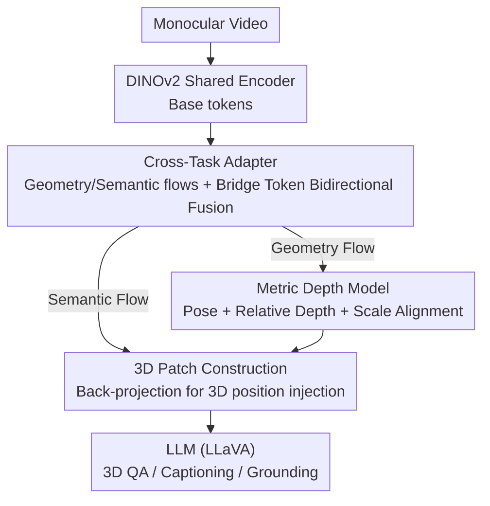

# Vid-LLM: A Compact Video-based 3D Multimodal LLM with Reconstruction–Reasoning Synergy

**Conference**: ICLR 2026  
**OpenReview**: [https://openreview.net/forum?id=l1cLdEjESj](https://openreview.net/forum?id=l1cLdEjESj)  
**Project Page**: https://chenhaijier.github.io/Vid-LLM/  
**Code**: Not yet public (committed to open source in the paper)  
**Area**: Multimodal VLM / 3D Vision  
**Keywords**: 3D Multimodal Large Language Model, Video Input, 3D Reconstruction, Geometry-Semantic Alignment, Dual-Teacher Distillation

## TL;DR
Vid-LLM utilizes only monocular video as input. Through a Cross-Task Adapter that mutually enhances "reconstruction" and "reasoning," it injects geometric priors directly reconstructed from the video into the LLM. It achieves performance levels close to models using explicit 3D point clouds across 3D Question Answering (QA), dense captioning, and visual grounding, without requiring any external point cloud, depth, or pose inputs.

## Background & Motivation
**Background**: Extending Multimodal Large Language Models (MLLMs) from 2D to 3D scene understanding is a current hot topic, leading to the development of 3D-MLLMs. These models unify 3D scene understanding and vision-language reasoning under a "language interface," using language to answer spatial questions such as "Where is the chair to the right of the sofa?" or "What is placed in the center of the room?"

**Limitations of Prior Work**: Almost all 3D-MLLMs rely on explicit 3D inputs—point clouds, reconstructed scenes, multi-view renderings, or semantically annotated objects. Obtaining these inputs requires a full pipeline of reconstruction, registration, and annotation, which involves high costs in data collection, pre-processing, VRAM usage, and latency. These rigid input requirements and system complexity fundamentally limit the scalability and transferability of 3D-MLLMs, making them difficult to deploy in real-world scenarios.

**Key Challenge**: To achieve good spatial reasoning, 3D-MLLMs require "expensive and hard-to-acquire geometric inputs"; to be cheap and scalable, they often revert to pure 2D, losing geometry and failing at spatial reasoning. A direct trade-off exists between geometric quality and system lightweightness.

**Goal**: To enable a model to "reconstruct geometry" and "perform 3D vision-language reasoning" simultaneously using only video, thereby removing dependence on external depth, pose, or registration modules. This involves solving two sub-problems: first, how to obtain geometry with true scale from video; second, how to inject these geometric priors compactly into the MLLM without damaging its linguistic capabilities.

**Key Insight**: The authors leverage a neglected observation—reconstruction and reasoning are inherently interdependent: geometric structure serves as the foundation for semantic understanding, while semantic reasoning provides contextual priors for geometric modeling. Therefore, "reconstruction" should not be treated as an independent pre-processing module but should be coupled and mutually constrained with reasoning at the feature level.

**Core Idea**: Utilize a Cross-Task Adapter to bridge the "geometric flow" and "semantic flow" bidirectionally, allowing the video-driven reconstruction branch and the language reasoning branch to reinforce each other on a shared set of features. This is complemented by a Metric Depth Model capable of recovering true scale and a two-stage distillation training process to compress this collaborative relationship into a compact model.

## Method

### Overall Architecture
Vid-LLM takes a monocular video as input and outputs linguistic responses for the 3D scene (QA / description / grounding coordinates) without touching external 3D data. The pipeline operates as follows: video frames pass through a shared vision encoder (DINOv2) to obtain base tokens; the Cross-Task Adapter (CTA) splits these tokens into geometric and semantic flows, using a set of learnable Bridge Tokens for bidirectional information exchange; the geometric flow enters the reconstruction branch, where a Global-Frame Attention backbone predicts camera poses and relative depth, followed by a Metric Depth Model to recover true scale; the semantic flow combines the reconstructed geometry to back-project each 2D feature into a "3D patch" with 3D positions, which is fed to the LLM for spatial reasoning. The entire architecture is converged using two-stage training (dual-teacher distillation followed by joint optimization).

### Key Designs

**1. Cross-Task Adapter: Bidirectional Fusion of Geometry and Semantics at the Feature Level**

This design addresses the pain point where reconstruction was previously an upstream module and reasoning a downstream one, where geometric priors were only fed uni-directionally to the LLM. In that setup, they do not constrain each other, geometric noise propagates blindly, and reasoning cannot correct geometry. The CTA uses two lightweight MLP projection heads $\phi_{geom}(\cdot)$ and $\phi_{lang}(\cdot)$ to split shared tokens $T_{base}$ into geometric features $T_{geom}=\phi_{geom}(T_{base})$ and semantic features $T_{lang}=\phi_{lang}(T_{base})$. It then introduces learnable Bridge Tokens $T_{bridge}\in\mathbb{R}^{K\times C}$ as "shared memory units" to attend to both flows:

$$T'_{bridge} = \mathrm{Attn}(T_{bridge}, T^{fused}_{geom}, T^{fused}_{geom}) + \mathrm{Attn}(T_{bridge}, T^{fused}_{lang}, T^{fused}_{lang})$$

The updated Bridge Tokens are written back into both flows to obtain enhanced $T'_{geom}$ and $T'_{lang}$. Bridge Tokens act as a bridge, dynamically carrying geometric and semantic signals back and forth during training, ensuring that "geometry constrains semantics and semantics guides geometry" occurs at the feature level.

**2. Metric Depth Model and Scale Alignment: Calibrating "Relative Geometry" to Real Units**

Video reconstruction naturally only provides relative geometry with unknown scale, but 3D visual grounding requires real coordinates. The authors attach a DPT-style decoder to DINOv2 features to produce multi-scale depth. Depth for each pixel is modeled via binning—the probability $p_i(k)$ of the $k$-th bin and the refined center $c_i(k)$ determine the prediction $\hat{d}(i)=\sum_{k=1}^{N}p_i(k)\,c_i(k)$. An order-aware normalization preserves relative depth ranking; bin centers are adaptively refined as $c_i(k)=c_k+\Delta c_i(k)$. After obtaining metric depth $\hat{D}_{metric}$, a scale factor is estimated via weighted least squares between the relative depth $\hat{D}_{rel}$ from the DPT head and $\hat{D}_{metric}$. A scene-level factor is derived from the median of 16 randomly sampled frames, converting relative depth and poses to real units.

**3. 3D Patch Construction: Sewing Geometric Coordinates into Semantic Tokens**

The semantic features from the CTA are 2D. This step sews the reconstructed geometry back into the semantics: using estimated depth $\hat{D}$, camera poses $(\hat{R},\hat{t})$, and intrinsics $K$, each 2D feature position $T'_{lang}(i,j)$ is back-projected to camera coordinates:

$$P_v(i,j) = \hat{R}^{-1}K^{-1}[i,j,1]^\top \hat{D}(i,j) - \hat{R}^{-1}\hat{t}$$

An MLP encodes the coordinates into positional embeddings $P'_v(i,j)$ of the same dimension as the semantic features. Finally, geometry and semantics are added to obtain 3D patch tokens $T_{3D}(i,j)=T'_{lang}(i,j)+P'_v(i,j)$, which are fed to the LLM.

**4. Two-Stage Training and Unidirectional Gradients: Distillation followed by Joint Tuning**

Direct end-to-end joint training causes interference and slow convergence. The authors use a two-stage approach. Stage-1 Dual-Teacher Distillation: The DINO encoder and CTA learn from two teachers simultaneously—a geometry teacher (DINO initialized from VGGT) and a semantic teacher (CLIP initialized from LLaVA-3D). The loss is $L_{distill}=L^{feat}_{geo}+L^{feat}_{lang}+\lambda L_{sc}$, where $L_{sc}$ is a structural consistency loss using the Gram matrix of concatenated tokens. Stage-2 Joint Optimization: $L_{joint}=L_{recon-task}+L_{VL-task}+L_{MD}$, where the metric depth loss $L_{MD}$ uses a robust formulation for large residuals. A key element is unidirectional gradients: losses from the 3D-VL reasoning branch do not back-propagate to optimize the reconstruction model; only reconstruction and metric depth losses update the reconstruction branch, while the shared CTA is optimized by both.

### Loss & Training
The total workflow involves: Stage-1 distillation $L_{distill}$ to endow the shared encoder with both geometric and semantic capabilities; Stage-2 joint loss $L_{joint}$ where $L_{recon-task}$ includes camera, depth, and point map losses (following VGGT), and $L_{VL-task}$ includes cross-entropy for instruction following and box regression/matching for grounding (following LLaVA-3D).

## Key Experimental Results

### Main Results
In 3D QA (ScanQA / SQA3D), Vid-LLM with pure video input approaches or matches models using 3D geometry:

| Task/Dataset | Metric | Vid-LLM | Strongest Video Rival 3DRS† | 3D Input SOTA 3DRS |
|------|------|------|------|------|
| ScanQA | CIDEr↑ | 101.9 | 94.7 | 104.8 |
| ScanQA | EM@1↑ | 27.6 | 23.9 | 30.3 |
| SQA3D | EM@1↑ | 57.3 | 54.5 | 60.6 |
| Scan2Cap (Dense Cap) | CIDEr@0.5↑ | 80.6 | — (ChatScene* 58.1) | 85.0 |
| ScanRefer (Grounding) | Acc@0.25↑ | 55.8 | — (ChatScene* 33.2) | 57.3 |

Vid-LLM leads significantly among video-based models and narrows the gap with 3D-input SOTA (only ~2.9 CIDEr difference on ScanQA; 1.5 Acc@0.25 on ScanRefer).

### Ablation Study
Ablation on ScanQA and ScanRefer adding components (CTA: Cross-Task Adapter; MDM: Metric Depth Model; TSD: Two-Stage Distillation):

| Configuration | ScanQA C↑ | ScanQA EM@1↑ | ScanRefer Acc@0.25↑ | Note |
|------|------|------|------|------|
| Baseline | 89.3 | 22.1 | 47.6 | Base model |
| +CTA | 95.4 | 24.8 | 51.2 | Bidirectional fusion added |
| +CTA+MDM | 99.1 | 26.3 | 53.7 | Real scale recovery added |
| +CTA+MDM+TSD | 101.9 | 27.6 | 55.8 | Full model |

### Key Findings
- CTA provides the largest contribution: adding CTA alone increases ScanQA CIDEr from 89.3 to 95.4 (+6.1) and ScanRefer Acc@0.25 by +3.6, confirming that "geometry-semantic bidirectional coupling" is a primary driver of performance.
- MDM is critical for grounding: adding scale recovery increases ScanRefer Acc by an additional +2.5, as visual grounding requires real-world coordinates.
- Two-Stage Distillation (TSD) serves as the final piece for stable convergence, adding +2.8 CIDEr.

## Highlights & Insights
- **Coupling Reconstruction and Reasoning instead of Splicing**: The CTA + Bridge Token bidirectional attention transforms an engineering pre-processing module into a learnable synergistic mechanism.
- **Using DPT for Detail and Metric for Stability**: Calibrating fine DPT depth with robust global metric scale is an effective "division of labor" applicable to various depth estimation scenarios.
- **Unidirectional Gradients Protect the Shared Bridge**: Preventing high-level semantic gradients from polluting low-level geometric structures is a valuable strategy for multi-task shared backbones.
- **3D Patch = Semantic Token + Back-projected PE**: A simple yet effective way to inject spatial coordinates into semantic tokens, providing a lightweight paradigm for 3D awareness in 2D LLMs.

## Limitations & Future Work
- The paper contains several typos (e.g., "sceen") and some simplified formula descriptions (e.g., bin refinement), necessitating care during reproduction.
- Reconstruction quality is limited by monocular video: heavy occlusion, lack of texture, or weak camera motion can degrade depth/pose estimation, affecting downstream reasoning.
- A small gap remains compared to 3D-input SOTA, particularly in precision-sensitive grounding tasks where video-only routes haven't fully caught up to point cloud routes.
- Real scale depends on heuristic calibration (median of 16 frames), which may be sensitive to frame sampling and scene scale.

## Related Work & Insights
- **vs VGLLM / Uni3DR2 (Video-based 3D-MLLM)**: These rely on extracting geometric features for use; Vid-LLM differentiates itself through bidirectional CTA coupling and explicit scale recovery.
- **vs LLaVA-3D / 3DRS (3D-input SOTA)**: These use point clouds or pre-generated 3D geometry; Vid-LLM trades a small amount of accuracy for deployment friendliness.
- **vs Explicit Geometry Injection VLMs**: Those treat geometry as an extra modality; Vid-LLM "self-produces" geometry via a video-driven branch and aligns it with semantics.

## Rating
- Novelty: ⭐⭐⭐⭐ Reconstruction-reasoning synergy + Bridge Token fusion is a strong design, though individual components build on existing works (VGGT/DPT/LLaVA-3D).
- Experimental Thoroughness: ⭐⭐⭐⭐ Covers various tasks with clear ablations, though lacks efficiency/VRAM comparisons or failure case analysis.
- Writing Quality: ⭐⭐⭐ Logic is clear, but typos and rough formula descriptions affect readability.
- Value: ⭐⭐⭐⭐ Approaching point-cloud-level 3D reasoning with pure video is significant for real-world deployment.

<!-- RELATED:START -->

## Related Papers

- [\[ICLR 2026\] Reasoning-Driven Multimodal LLM for Domain Generalization](reasoning-driven_multimodal_llm_for_domain_generalization.md)
- [\[CVPR 2026\] Self-Consistency for LLM-Based Motion Trajectory Generation and Verification](../../CVPR2026/vlm_reasoning/self-consistency_for_llm-based_motion_trajectory_generation_and_verification.md)
- [\[ICML 2026\] LIMSSR: LLM-Driven Sequence-to-Score Reasoning under Training-Time Incomplete Multimodal Observations](../../ICML2026/vlm_reasoning/limssr_llm-driven_sequence-to-score_reasoning_under_training-time_incomplete_mul.md)
- [\[CVPR 2026\] G$^2$VLM: Geometry Grounded Vision Language Model with Unified 3D Reconstruction and Spatial Reasoning](../../CVPR2026/vlm_reasoning/g2vlm_geometry_grounded_vision_language_model_with_unified_3d_reconstruction_and.md)
- [\[ICLR 2026\] MetaSpatial: Reinforcing 3D Spatial Reasoning in VLMs for the Metaverse](metaspatial_reinforcing_3d_spatial_reasoning_in_vlms_for_the_metaverse.md)

<!-- RELATED:END -->
