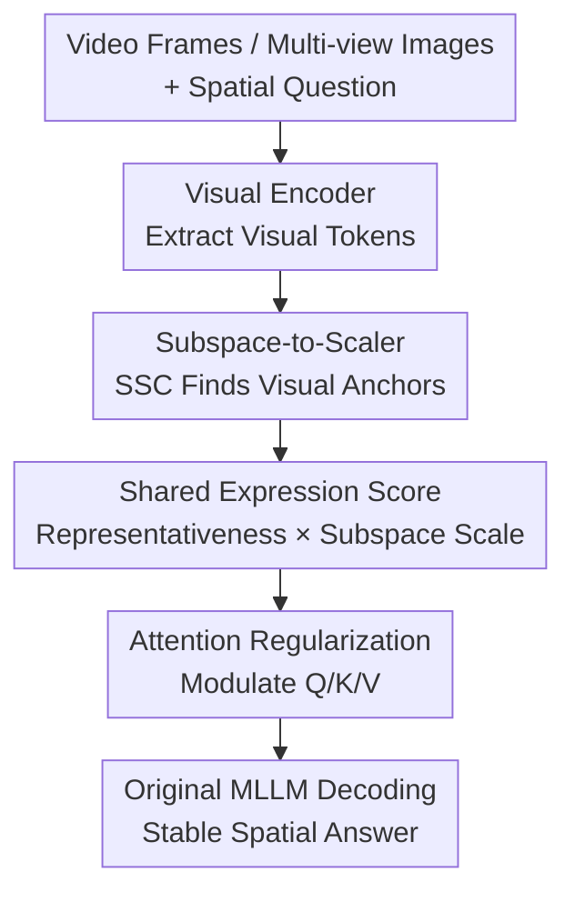

# VideoAnchor: Reinforcing Subspace-Structured Visual Cues for Coherent Visual-Spatial Reasoning

**Conference**: ICLR 2026  
**OpenReview**: [https://openreview.net/forum?id=2JLPQbHABc](https://openreview.net/forum?id=2JLPQbHABc)  
**Code**: https://github.com/feufhd/VideoAnchor  
**Area**: Multimodal VLM / Video Visual-Spatial Reasoning  
**Keywords**: Video Spatial Reasoning, Attention Reinforcement, Sparse Subspace Clustering, Test-time Plugin, Visual Anchors

## TL;DR
VideoAnchor is a training-free test-time plugin that identifies "visual anchors" stable across frames from video or multi-view image tokens using Sparse Subspace Clustering (SSC). These anchors are converted into Q/K/V attention scaling factors to mitigate the over-reliance of VLMs on textual priors, providing consistent improvements for multiple MLLMs on spatial tasks like VSI-Bench, All-Angles-Bench, SPAR-Bench, and Video-MME.

## Background & Motivation

**Background**: Video and multi-view VLMs are capable of handling image QA, video description, and long video understanding. However, visual-spatial reasoning remains a weakness. Spatial reasoning here is not just about identifying "a table" but maintaining a consistent understanding of objects, room structures, relative orientations, and common references across multiple frames—such as judging whether "the fireplace is on the left or behind when facing the entrance while standing next to the TV."

**Limitations of Prior Work**: Mainstream MLLMs often provide linguistically smooth but visually unreliable answers to such problems. The paper argues the critical reason lies in the attention layers: text tokens often hold stronger priors in multimodal contexts, while the contribution of individual visual tokens is too weak. This makes it difficult for the model to stably treat identical regions or objects appearing across frames as common references. Consequently, even if structures like sofas, cabinets, or fireplaces exist as spatial anchors, the model may "lose focus" across different frames.

**Key Challenge**: Video spatial reasoning requires continuous visual evidence across frames, but standard patch/token-level attention treats visual tokens as relatively independent points, lacking a mechanism to organize "visual tokens belonging to the same semantic structure that can explain each other." Simply increasing resolution, adding more visual tokens, or re-training on spatial datasets can alleviate some issues but involves higher inference costs, extra training costs, and may not generalize across different MLLMs.

**Goal**: The authors aim to make MLLMs prioritize cross-frame stable visual structures during inference without re-training. Specifically, the method must find shared regions or object cues from visual tokens, transform these cues into modulation signals insertable into Transformer attention, and be compatible with various backbones like InternVL, Qwen2.5-VL, and LLaVA-Video.

**Key Insight**: The paper connects the self-expressiveness property of Sparse Subspace Clustering (SSC) with Transformer attention. SSC assumes that data points within the same subspace can be linearly reconstructed by each other. For visual tokens, this means if a batch of tokens repeatedly appears in similar semantic regions or shared structures across frames, they should form a more stable subspace. Such tokens are suitable as visual anchors.

**Core Idea**: Use SSC at test time to discover shared visual subspaces across frames, then transform the subspace representativeness of tokens into attention scaling factors. This encourages MLLMs to allocate more attention and representation capacity to stable visual evidence during answer generation, rather than reasoning solely based on textual priors.

## Method

### Overall Architecture
VideoAnchor takes a sequence of video frames or multi-view images plus a user question as input; the output is still generated by the original MLLM without parameter updates. It is inserted during the inference stage: it first extracts all visual tokens from the visual encoder, uses SSC to construct a self-expression matrix and subspace labels between tokens, computes a shared expression score for each visual token, and finally expands these scores into scaling factors for Q/K/V to be injected into every self-attention layer.

Overall, VideoAnchor does not "re-train a spatial reasoning model" but adds a visual evidence bias to existing attention: visual tokens that resemble cross-frame stable anchors are magnified during query-key matching and value aggregation. The scaling scores for text tokens are fixed at 0, thus avoiding additional reinforcement of textual priors.

### Key Designs

**1. Subspace-to-Scaler: Finding Cross-Frame Visual Anchors via Self-Expression**

The first step of VideoAnchor is to flatten all visual tokens into a matrix $X_{Vis}\in\mathbb{R}^{N_{Vis}\times D}$, where $N_{Vis}$ is the number of visual tokens and $D$ is the feature dimension. The authors use SSC to learn a self-expression matrix $W\in\mathbb{R}^{N_{Vis}\times N_{Vis}}$:

$$
\min_W \lambda_e\|X_{Vis}-X_{Vis}W\|_1+\lambda_z\|W\|_1,\quad \text{s.t. }\mathrm{diag}(W)=0.
$$

The intuition is straightforward: if a token belongs to a stable visual structure, it should be sparsely reconstructible by other tokens in the same subspace; $\|W\|_1$ encourages each token to select only a few relevant neighbors, and $\mathrm{diag}(W)=0$ prevents tokens from trivially reconstructing themselves. Compared to hard clustering methods like k-Means based on Euclidean distance, SSC is better at capturing structures where "the same semantic region in different frames remains mutually explainable despite viewpoint changes."

After solving for $W$, the method constructs a symmetric adjacency matrix using $W+W^\top$ and performs spectral clustering to obtain subspace labels $c_i$ for each visual token. These labels tell the subsequent modules which visual tokens likely constitute a cross-frame shared region, such as the same set of sofas, rugs, cabinets, or room boundaries.

**2. Shared Expression Score: Balancing Subspace Stability and Self-Interpretability**

Knowing which subspace a token belongs to is insufficient, as some small clusters might be noise, while large clusters might contain peripheral tokens. VideoAnchor defines a sharing expression score by combining subspace scale and self-expression intensity. For token $i$, it first calculates the number of tokens in its subspace $\pi_i$, and its row sum in the self-expression matrix $r_i$:

$$
\pi_i=\sum_{j=1}^{N} \mathbf{1}(c_j=c_i),\quad
r_i=\sum_{j=1}^{N} W_{ij},\quad
\hat{s}_i=\pi_i\cdot r_i.
$$

Here $\pi_i$ indicates whether the structure the token belongs to is sufficiently "grouped," and $r_i$ indicates its strength in reconstructing other tokens. High-score tokens typically reside in stable shared subspaces and possess strong explanatory power for cluster-mate tokens, making them ideal visual anchors. Min-max normalization is then applied:

$$
s_i=\frac{\hat{s}_i-\min(\hat{s})}{\max(\hat{s})-\min(\hat{s})+\epsilon}.
$$

This normalization is crucial because token counts, scene complexity, and matrix scales vary across videos; squashing scores to $[0,1]$ prevents the attention modulation from being dominated by a few outliers.

**3. Attention Regularization: Transforming Visual Anchors into Test-Time Biases**

Once visual token scores $s$ are obtained, VideoAnchor expands them to the full text-visual sequence. Text token positions are filled with 0 to get $\tilde{s}$, which is then transformed into three sets of multiplicative scalers:

$$
\gamma_Q=1+\alpha_Q\tilde{s}^\top,\quad
\gamma_K=1+\alpha_K\tilde{s}^\top,\quad
\gamma_V=1+\alpha_V\tilde{s}^\top.
$$

This achieves two effects: first, text tokens are not amplified; second, higher visual anchor scores lead to larger weights in query-key similarity and value representation. The attention matrix is written as:

$$
A=\frac{(\gamma_Q\gamma_K^\top)\odot \exp(QK^\top/\sqrt{d_h})}{\sum_j(\gamma_Q\gamma_K^\top)_{:,j}\odot \exp(QK^\top/\sqrt{d_h})_{:,j}},
$$

And the output representation is:

$$
Y=A\left(\mathrm{Expand}_c(\gamma_V)\odot V\right).
$$

Implementation-wise, the authors utilize the equivalent form $A=\mathrm{softmax}(QK^\top/\sqrt{d_h}+\log(\gamma_Q\gamma_K^\top))$, making VideoAnchor easy to insert into existing Transformer libraries as a low-rank bias added to attention logits plus a per-token value amplification.

**4. Mechanism: Plug-and-play Inference**

VideoAnchor is designed as a plug-and-play test-time module. It does not modify MLLM weights, requires no new annotated data, and does not depend on manual region selection. The Attention Regularization Unit is inserted into every MLLM block, allowing the reinforcement of visual anchors to persist throughout the decoding process.

The trade-off is the additional inference overhead from SSC/ADMM, with complexity approximately $O(N^2)$ relative to the number of visual tokens. The paper uses CuPy for GPU acceleration and notes that ADMM convergence thresholds can be relaxed; on InternVL2-8B with 8 frames on VSI-Bench, single-sample inference time increases from 6.0s to 6.8s in exchange for an average score improvement from 34.6 to 37.8.

### Loss & Training
VideoAnchor has no training loss as it does not train the MLLM or update parameters. The only part requiring solving is the test-time optimization of SSC, solved via ADMM. Key hyperparameters include $\rho=300$, $\lambda_z=800$, $\lambda_e=800$, a convergence threshold of $2e^{-4}$, a maximum of 10,000 iterations, and 24 subspaces for spectral clustering.

Inference uses deterministic generation: `do_sample=False`, `num_beams=1`. $\alpha_Q, \alpha_K, \alpha_V$ are set manually for different models (e.g., $(4.0, 9.5, 2.5)$ for InternVL2-8B).

## Key Experimental Results

### Main Results
The paper validates VideoAnchor on four types of benchmarks: VSI-Bench for video spatial intelligence, All-Angles-Bench for multi-view spatial understanding, SPAR-Bench for single/multi-view tasks, and Video-MME for general spatial sub-tasks. The general conclusion is that VideoAnchor consistently improves average scores across InternVL, Qwen2.5-VL, and LLaVA series.

| Benchmark | Model / Setting | Baseline | + VideoAnchor | Gain |
|------|-------------|----------|---------------|------|
| VSI-Bench | InternVL2-8B, 8 frames | 34.6 | 37.8 | +3.2 |
| VSI-Bench | Qwen2.5-VL-7B, 16 frames | 31.8 | 33.3 | +1.5 |
| VSI-Bench | LLaVA-Video-72B, 16 frames | 39.4 | 40.9 | +1.5 |
| All-Angles-Bench | LLaVA-OneVision-7B | 44.1 | 46.7 | +2.6 |
| All-Angles-Bench | LLaVA-Video-72B | 49.9 | 53.0 | +3.1 |
| SPAR-Bench | InternVL2.5-4B | 30.5 | 33.1 | +2.6 |
| Video-MME spatial | Qwen2.5VL-72B, 16 frames | 75.4 | 80.0 | +4.6 |

On VSI-Bench, VideoAnchor helped InternVL2-8B improve object counting from 23.1 to 39.3 and approaching order from 29.9 to 36.1. On All-Angles-Bench, LLaVA-Video-72B saw significant gains in counting, relative direction, and overall spatial attributes.

### Ablation Study
| Configuration | Key Metric | Description |
|------|----------|------|
| Baseline | 34.6 | Original results of InternVL2-8B on VSI-Bench |
| UniformBoost | 34.2 | Uniformly boosting visual tokens actually drops performance |
| k-Means | 35.2 | Simple clustering provides a minor gain (+0.6) |
| SSC | 37.8 | Subspace clustering provides the core gain (+3.2) |
| Cluster number & self-expression | 37.8 | Combining both components yields the best results |

Ablations on Q/K/V positions show that value amplification is the primary driver, while query-key gating provides additional stability in attention allocation.

### Key Findings
- **SSC significantly outperforms k-Means**: Visualization shows SSC more easily clusters consistent areas (sofas, rugs) into semantically pure clusters, whereas k-Means produces fragmented results in high-dimensional Euclidean space.
- **Shared expression scores must dual-focus**: Relying on only one dimension either biases toward large clusters or local strong connections.
- **Robustness to frame count**: InternVL2-8B maintains gains as frames increase from 8 to 64.
- **Prompts cannot replace structural reinforcement**: Explicitly asking the model to "anchor objects" via text prompts only yields marginal gains (+0.5).

## Highlights & Insights
- Connecting SSC self-expressiveness to Transformer attention is the most innovative aspect. It treats the property that "points in the same subspace can represent each other" as a computable signal for cross-frame visual anchors.
- The score design is disciplined: $\hat{s}_i=\pi_i\cdot r_i$ requires a token to be part of a stable structure and be representative themselves.
- The attention injection is engineering-friendly. By writing the gate as an additive bias $\log(\gamma_Q\gamma_K^\top)$, it leverages standard attention implementations.
- It provides a "post-training spatial patch" philosophy. Many MLLMs are strong in semantics but lose focus in spatial grounding; this test-time enhancement could serve as a lightweight adapter layer for robotics or 3D understanding.

## Limitations & Future Work
- **Computational Overhead**: SSC/ADMM is approximately $O(N^2)$ relative to visual tokens, becoming expensive for long videos or high resolutions.
- **Parameter Sensitivity**: Subspace counts and scaling coefficients $\alpha$ require manual tuning for different backbones.
- **Instance Confusion**: SSC might merge highly similar instances (e.g., multiple identical sofas), meaning VideoAnchor is better at finding stable regions than distinguishing instance boundaries.
- **Sampling Reliance**: If key spatial relationships occur in unsampled frames, VideoAnchor cannot recover missing evidence.

## Related Work & Insights
- **vs. High-resolution / Multi-token Perception**: Methods like LLaVA-UHD add information; VideoAnchor improves grounding on existing tokens. The two are potentially complementary.
- **vs. Training-free Visual Prompting**: Unlike methods requiring manual regions, VideoAnchor automatically identifies anchors from token subspaces.
- **vs. Training on Spatial Datasets**: VideoAnchor avoids overfitting to specific frame counts or data distributions. Its performance on Qwen2.5-VL outperformed some training-based methods like Video-R1.

## Rating
- **Novelty**: ⭐⭐⭐⭐☆ Converting SSC subspace structures into attention scaling signals is clever and well-connected.
- **Experimental Thoroughness**: ⭐⭐⭐⭐☆ Covers major benchmarks and backbones with extensive ablations.
- **Writing Quality**: ⭐⭐⭐⭐☆ Clear formulas and logic; comprehensive appendix addressing runtime and failure cases.
- **Value**: ⭐⭐⭐⭐☆ Highly practical for spatial grounding in video/multi-view VLMs, especially where re-training is not feasible.

<!-- RELATED:START -->

## Related Papers

- [\[ICLR 2026\] MetaSpatial: Reinforcing 3D Spatial Reasoning in VLMs for the Metaverse](metaspatial_reinforcing_3d_spatial_reasoning_in_vlms_for_the_metaverse.md)
- [\[CVPR 2026\] Reinforcing Structured Chain-of-Thought for Video Understanding](../../CVPR2026/vlm_reasoning/reinforcing_structured_chain-of-thought_for_video_understanding.md)
- [\[ICLR 2026\] Unfolding Spatial Cognition: Evaluating Multimodal Models on Visual Simulations](unfolding_spatial_cognition_evaluating_multimodal_models_on_visual_simulations.md)
- [\[CVPR 2026\] VRR-QA: Visual Relational Reasoning in Videos Beyond Explicit Cues](../../CVPR2026/vlm_reasoning/vrr-qa_visual_relational_reasoning_in_videos_beyond_explicit_cues.md)
- [\[ICLR 2026\] Transductive Visual Programming: Evolving Tool Libraries from Experience for Spatial Reasoning](transductive_visual_programming_evolving_tool_libraries_from_experience_for_spat.md)

<!-- RELATED:END -->
