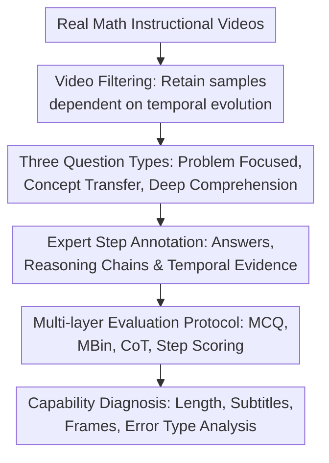

# VideoMathQA: Benchmarking Mathematical Reasoning via Multimodal Understanding in Video

**Conference**: ICLR2026  
**OpenReview**: [https://openreview.net/forum?id=VI4kGUfPio](https://openreview.net/forum?id=VI4kGUfPio)  
**Paper**: [Project Page](https://mbzuai-oryx.github.io/VideoMathQA)  
**Code**: To be confirmed  
**Area**: Multimodal VLM / Video Reasoning / Math Reasoning Evaluation  
**Keywords**: Video mathematical reasoning, multimodal understanding, long-video QA, step-by-step reasoning annotation, benchmark  

## TL;DR
VideoMathQA constructs a mathematical reasoning benchmark for real instructional videos, using 420 video QAs, 2,945 expert step annotations, and a multi-layer evaluation protocol to test whether models can perform long-range, multi-step, and diagnostic reasoning across video, subtitles, speech, and mathematical knowledge.

## Background & Motivation
**Background**: Multimodal math reasoning evaluation already includes static image or text sets like MathVista, Math-V, and MMMU. The video understanding field also features long-video benchmarks like Video-MME, LongVideoBench, and Video-MMMU. These have driven the development of visual math reasoning and video QA respectively, but the two lines are usually separate: the former focuses on a single image or problem page, while the latter tests event understanding, narrative comprehension, or general knowledge QA.

**Limitations of Prior Work**: Math problems in real instructional videos cannot be solved by simply capturing a single frame. Key clues may appear in formulas written step-by-step on a blackboard, conditions orally supplemented by the speaker, diagrams drawn and then erased minutes ago, numerical values flashing in animated charts, or even instructional contexts such as "this method should be migrated to the next example." Evaluating only the final answer mixes many errors together: it is difficult to diagnose whether the model failed to see numbers clearly, failed to find the right time segment, chose the wrong formula, or made an arithmetic error.

**Key Challenge**: Video mathematical reasoning requires simultaneous perception and reasoning. The model must find key visual, subtitle, and speech evidence from long and noisy video streams and convert this evidence into executable mathematical steps; however, existing benchmarks often cover only one end, emphasizing either static visual problems or general video understanding, and lack "cross-temporal, multimodal, step-by-step verifiable" mathematical tasks.

**Goal**: The authors aim to establish a benchmark specifically for evaluating video mathematical reasoning, covering different mathematical concepts, video lengths, and problem types. Simultaneously, providing expert-level step-by-step reasoning annotations for each question allows evaluation to go beyond option accuracy to measure whether the model's intermediate reasoning aligns with video evidence.

**Key Insight**: The paper starts with real educational videos rather than synthetic short videos or static textbook diagrams. Such materials naturally contain handwritten formulas, dynamic graphs, oral explanations, chart switching, and long-range dependencies, forcing models to handle the "needle in a multimodal haystack" problem. The authors further decompose the problem types into direct problem solving, concept transfer, and deep instructional comprehension, making the benchmark closer to the actual process of humans watching lessons, learning methods, and solving problems.

**Core Idea**: Using real instructional videos + expert step-by-step reasoning annotations to advance mathematical reasoning evaluation from "answering based on images" to "locating evidence in long videos, understanding explanations, transferring methods, and completing multi-step problem solving."

## Method

### Overall Architecture
VideoMathQA is essentially a benchmark construction and evaluation framework. The input consists of math instructional videos from sources like YouTube. The authors first filter segments that must rely on video temporal evolution and multimodal information, then experts construct multiple-choice questions, answers, step-by-step reasoning chains, and temporal localization; the evaluation end uses MCQ, Multi-Binary, CoT, and step-level scoring to jointly measure model performance.

Since the contribution of this paper is primarily the dataset and evaluation protocol rather than a new model, the method section can be understood as two parallel lines: one ensuring samples indeed require video math understanding, and the other ensuring model evaluation can distinguish "getting the answer right" from "reasoning correctly."

### Key Designs

**1. Video Filtering: Retaining only math problems that cannot be solved by static frames or audio transcripts alone**

The first threshold of VideoMathQA is sample selection. Instead of simply collecting "math videos + questions," the authors require that questions cannot be answered solely by a few static screenshots or audio transcripts. Selected videos must include meaningful temporal evolution, such as the step-by-step construction of geometric figures, incremental derivation of formulas, dynamic charts showing multiple values over time, or a speaker demonstrating a method before asking the audience to transfer it to a new example.

This filtering criterion directly corresponds to the capability the paper intends to test: models must locate and integrate evidence within the video stream rather than degrading the video into OCR text problems or single-image problems. The authors also exclude static slides and videos with minimal visual change, and crop segments to the scope relevant to the question to reduce noise while retaining the long-range context required for problem solving. The final benchmark contains 420 video-question pairs, with video lengths ranging from 10 seconds to over 1 hour, covering short, medium, and long dependency ranges.

**2. Three Question Types: Decomposing "Understanding Video Math" into Direct Solving, Method Transfer, and Instructional Comprehension**

The paper does not mix all questions into general VQA but defines three reasoning types. Problem Focused questions require the model to complete problem solving directly from the problem statement, graphics, or data in the video; Concept Transfer questions first have the video demonstrate a method and then require the model to apply the method to a similar but new problem; Deep Instructional Comprehension questions require the model to follow longer explanations, understand context, partially completed solutions, and subsequent steps needing completion.

The value of these three categories is that they layer the difficulties of video math reasoning. Direct solving leans towards "accurate evidence localization + correct calculation," concept transfer towards "abstracting methods from video," and deep comprehension towards "long-range memory + instructional context modeling." Thus, when a model fails on long videos or hard questions, researchers can more specifically judge whether the failure stems from perception, transfer, context retention, or mathematical execution.

**3. Expert Step Annotation: Extending final answer evaluation into locatable reasoning diagnosis**

For each question, not only is the correct option provided, but independent experts also write 4 to 10 reasoning steps and label key steps with timestamps. The entire dataset contains 2,945 expert-annotated steps; quality control was not a one-time process, with approximately 30% of the questions further revised during the step annotation phase, and 788 steps modified during final review.

This annotation allows the benchmark to answer a more detailed question: whether the model truly followed a reasonable mathematical path to the answer. If the number of expert steps for a question is $N$, the step-level score roughly measures how many steps in the model-generated reasoning align with the reference steps in mathematical purpose, mapping the ratio to a score from $0$ to $10$; meanwhile, the evaluation rubric allows different but logically valid alternative solutions to receive full marks. This avoids two extremes: neither looking only at whether the option was guessed correctly, nor mechanically requiring the model to reproduce reference solutions verbatim.

**4. Multi-layer Evaluation Protocol: Using MCQ, MBin, CoT, and Error Types to Suppress Chance**

The authors designed four complementary evaluations. MCQ is a 1-out-of-5 choice, most intuitive and reproducible; Multi-Binary (MBin) decomposes the correct answer and each distractor into 1-out-of-2 comparisons, where the model must choose correctly in all binary comparisons to be considered correct, which significantly reduces the space for small models to guess randomly. The direct answer mode requires models to output only options, while CoT mode requires models to write reasoning first, then uses Qwen3-4B to extract the final option.

More critically, CoT outputs undergo step-level scoring and error analysis. Qwen3-4B acts as a judge to give a score from $0$ to $10$ based on expert steps, the correct answer, and model reasoning, further categorizing errors into seven types: problem misunderstanding, information retrieval failure, visual interpretation error, concept application error, strategy or formula selection error, recall/memory error, and calculation error. The authors also performed robustness checks with human scoring and Qwen3 judges of different sizes, indicating that this automated scoring is primarily used to compare trends rather than treating an absolute score as indisputable truth.

### A Complete Example
Taking a Concept Transfer question from the paper as an example, the video first demonstrates how to count triangles formed by squares and diagonals: each independent square can be numbered by small triangles to get 8 triangles, and additional triangles are formed at the connection of adjacent squares. The question then provides a new vertical connection diagram of three squares and asks for the final total number of triangles.

A model that truly understands the video needs to first locate the segment where the demonstration rule is located, then transfer "8 per square" to the new figure, obtaining $3 \times 8 = 24$; then identify that the two connection points each contribute 2 extra triangles, obtaining $24 + 4 = 28$; and finally discover a large triangle formed by the three squares as a whole, making the answer $29$. If the model only reads subtitles, it might miss the graphic connection method; if it only looks at a single frame, it might not know the counting rule demonstrated earlier; if its mathematical reasoning is unstable, it might easily stop at $28$.

This example illustrates that VideoMathQA aims to test not a single capability but a coherent chain: "locating video evidence → abstracting method → transferring to new diagram → completing calculation."

### Loss & Training
This paper does not propose a new model or training loss but introduces evaluation data and protocols. The core of model reasoning evaluation can be summarized into two types of scores: final answer accuracy and step-level reasoning score.

MCQ accuracy directly counts hits in 1-out-of-5 choices; MBin converts one question into multiple binary comparisons, counting the question as correct only if the model chooses correctly in comparisons between the correct answer and every distractor. For CoT output, authors use Qwen3-4B non-thought mode to extract final options; step-level evaluation uses Qwen3-4B thinking mode to output $0$ to $10$ scores with a critique based on expert steps and model reasoning. All MLLM evaluations adopt greedy decoding with temperature $0$; different models are input with frames recommended by officials, e.g., 32 frames for LLaVA-OneVision, up to 768 frames for Qwen2.5-VL, and full video access for Gemini.

## Key Experimental Results

### Main Results
The paper evaluates 5 closed-source multimodal models and 25 open-source models, covering scales of approximately 5B, 9B, 40B, and 80B, and adds human, random, text-only, and single-image baselines. The table below excerpts representative results that best support the conclusions, with metrics from settings with subtitles.

| Model / Ref | Setting | MCQ +Sub | MBin +Sub | CoT Eval | Description |
|--------|------|----------|-----------|----------|------|
| Human | Human watching video | - | 80.7 | - | 8 annotators, 20min limit |
| Random | Random guessing | 17.4 | 7.9 | - | MBin significantly reduces random hits |
| GPT-o4-mini | CoT | 61.4 | 44.8 | 6.9 | Strongest among all; still far below human |
| Qwen2.5-VL-72B | CoT | 36.9 | 28.6 | 5.0 | Representative strong open-source result |
| InternVL3-78B | CoT | 37.1 | 27.9 | 4.9 | Scaling helps but remains insufficient |
| Gemini-2.0-Flash | CoT | 38.8 | 24.8 | 4.7 | One of the strong closed-source models |
| Qwen2.5-VL-72B | Direct | 37.6 | 27.9 | - | Direct vs CoT varies by model |
| InternVL3-38B | Direct | 35.7 | 29.5 | - | Smaller than 72B but beats larger old models |

Two intuitive signals emerge. First, the human MBin accuracy of 80.7 proves the task is solvable, but the strongest model GPT-o4-mini reaches only 44.8, a large gap. Second, MCQ scores are generally higher than MBin, showing that 5-choice questions inflate accidental hits; MBin better exposes whether the model truly excluded every distractor.

| Analysis Dimension | Representative Result | Conclusion |
|------|----------|----------|
| Model Scale | InternVL3 improved from 20.0 (8B) to 25.0 (38B) and 27.9 (78B) in CoT MBin +Sub | Larger models generally retain long-range context better, but architecture and training are key |
| Subtitle Effect | GPT-o4-mini increased from 42.1 to 44.8; Qwen2.5-VL-72B from 24.5 to 28.6 | Subtitles supplement audio semantics; strong reasoning models gain more |
| Frame Count | Performance of Qwen2.5-VL continuously improved with 16/64/256/768 frames; ~8 point Gain for long videos | More frames help capture scattered visual clues and long dependencies |
| Math Concepts | Arithmetic/calculus average ~32%, charts/topology/graph theory/stats ~16-21% | Visual reading and abstract structural categories are harder |
| Human Gap | Human average ~36 points higher than best model; 35-50 point gap in topology, counting, chart reading | Current models lack fine-grained visual evidence combined with long-range reasoning |

### Ablation Study
This paper lacks traditional "module removal" ablations as it is not a model training paper; closest are analyses of input modality, reasoning form, frames, and judge robustness.

| Configuration | Key Metric | Description |
|------|---------|------|
| MCQ vs MBin | Random dropped from 17.4 to 7.9 | MBin splits one question into multiple true-distractor comparisons, reducing guessing gains |
| Video-only vs Video+Sub | Most large and closed-source models improved with +Sub | Speech/subtitle info is critical for math explanations, but small models may not utilize it well |
| Direct vs CoT | Closed-source models showed clear CoT Gain; open-source results were unstable | Asking a model to write reasoning doesn't equate to stronger reasoning; depends on intrinsic capability |
| 16/64/256/768 frames | Qwen2.5-VL improved continuously; greater Gains for long videos | Evidence for video math is often distributed across multiple time points |
| Qwen3-4B judge vs Human | Ranking maintained: GPT-o4-mini > InternVL3 > Qwen2.5-VL | Automatic step scoring's relative trends align with human scoring |
| Qwen3 Different Judge Sizes | 4B, 8B, 14B, 30B-A3 showed similar trends | 4B judge is sufficient to reproduce trends, facilitating low-resource reproduction |

### Key Findings
- Current strong models are still far from human levels. The strongest, GPT-o4-mini, scored 44.8 under CoT MBin +Sub compared to 80.7 for humans, suggesting video math reasoning isn't solvable by simply scaling existing VLMs.
- Errors mostly stem from problem misunderstanding: models often fail to understand which segment, graphic, or quantity in the video the question refers to, or miss key oral/visual clues. This is followed by information retrieval, visual interpretation, concept application, strategy selection, memory, and calculation errors.
- Moderate-length videos are often easier than long videos because they mostly correspond to concept transfer questions with moderate information density; long videos correspond to deep instructional comprehension with scattered clues where models easily forget or misidentify context.
- Subtitles and more frames generally help but are not panaceas. Small models may fail to align speech clues with visual frames even with subtitles; more frames also require models to have sufficient context modeling capability.
- Chart reading, topology, graph theory, and statistics are more difficult, indicating significant shortfalls in current models regarding fine-grained visual reading and abstract structural reasoning.

## Highlights & Insights
- The highlight of VideoMathQA is not just "putting math in video" but explicitly requiring that questions cannot be solved by static frames or audio transcripts alone. This filtering criterion makes the benchmark closer to real multimodal reasoning rather than a video-packaged version of static benchmarks.
- The three question types are highly distinct. Problem Focused, Concept Transfer, and Deep Instructional Comprehension correspond to direct solving, transferring learned methods, and completing solutions based on long explanations, which explains model failure better than simple grouping by video length or math domain.
- Step-level annotation and error classification give the benchmark diagnostic value. When a model fails, researchers can see whether it failed to find information, misread charts, chose the wrong formula, or miscalculated, which is more useful for improving models and retrieval-based video reasoning systems.
- MBin is a simple yet effective evaluation design. It significantly reduces the randomness of multiple-choice questions without introducing complex judges, especially suitable for comparing small and large models simultaneously.
- This paper provides insights for future video RAG or education Agents: truly useful systems need to link "locating explanation segments, extracting formulas/charts, tracking context, and executing math reasoning" rather than just stuffing the entire video into a VLM.

## Limitations & Future Work
- Data scale remains relatively small. 420 samples consumed ~920 human-hours or 115 person-days, providing high quality but limited coverage; semi-automatic annotation or larger-scale expansion is needed for training or fine-grained domain analysis.
- Data largely comes from publicly accessible educational/popular science videos, potentially biasing types and explanation styles toward English resources, YouTube content, and specific expressions. Cross-lingual, classroom recordings, low-res handwriting, and subtitle-free videos still require further validation.
- Step-level evaluation relies on an LLM judge. Although robustness checks were done with humans and different Qwen3 sizes, the judge might still prefer certain expressions, and absolute scores from 0-10 cannot fully equate to a human teacher's scoring.
- Multiple-choice format is reproducible but cannot fully cover open-ended proofs, symbolic derivations, and long-answer questions. Future work could include executable math verification, formula parsing, and open-ended generative evaluation.
- The benchmark reveals model shortcomings but does not propose new modeling solutions. Subsequent work could focus on video evidence retrieval, frame-level OCR, subtitle-visual alignment, long-range memory, and the use of symbolic computation tools to build specialized models.

## Related Work & Insights
- **vs MathVista / Math-V / MMMU**: These benchmarks primarily evaluate static images or multi-disciplinary graphic problems; ours places math problems in temporally unfolding videos, requiring models to handle dynamic graphics, instructional speech, and long-range context.
- **vs Video-MME / LongVideoBench / LVBench**: These works drive long-video understanding but focus on general perception, events, narratives, or knowledge QA. VideoMathQA is narrower but deeper, specifically testing math reasoning with step-by-step chains.
- **vs Video-MMMU / Video-MMLU**: These benchmarks include subject knowledge videos, but math is only a part, and they do not necessarily emphasize fine-grained math steps. Ours concentrates on video math reasoning with a combined protocol of MCQ, MBin, CoT, and step scoring.
- **vs DynaMath**: DynaMath focuses on the robustness of visual math problems under perturbation, mainly in static reasoning; VideoMathQA focuses on evidence selection and concept transfer in the temporal dimension. The two are complementary for evaluating gaps between static robustness and dynamic understanding.
- **Inspiration for future models**: A strong video math model might require an explicit "video evidence indexer + OCR/formula recognizer + speech-subtitle aligner + math reasoner." Merely increasing context frames helps, but without question-oriented evidence localization and step verification, key clues will still be missed in long videos.

## Rating
- Novelty: ⭐⭐⭐⭐☆ Not the first video benchmark, but clearly combines real instructional videos, math reasoning, and step-level diagnosis.
- Experimental Thoroughness: ⭐⭐⭐⭐⭐ Covers 30 models, multiple input settings, CoT/Direct, MCQ/MBin, frames, subtitles, difficulty, error analysis, and judge robustness; very complete evaluation.
- Writing Quality: ⭐⭐⭐⭐☆ Clear structure; data construction and experimental conclusions are well-presented; some tables are large, requiring readers to actively identify key points.
- Value: ⭐⭐⭐⭐⭐ Highly referenceable for video VLM, educational AI, math reasoning, and diagnostic benchmarks, especially for driving research into "solving problems after understanding long instructional videos."

<!-- RELATED:START -->

## Related Papers

- [\[ICLR 2026\] MathNet: A Global Multimodal Benchmark for Mathematical Reasoning and Retrieval](mathnet_a_global_multimodal_benchmark_for_mathematical_reasoning_and_retrieval.md)
- [\[ACL 2026\] ErrorRadar: Benchmarking Complex Mathematical Reasoning of Multimodal Large Language Models Via Error Detection](../../ACL2026/vlm_reasoning/errorradar_benchmarking_complex_mathematical_reasoning_of_multimodal_large_langu.md)
- [\[ICLR 2026\] ExpVid: A Benchmark for Experiment Video Understanding & Reasoning](expvid_a_benchmark_for_experiment_video_understanding_reasoning.md)
- [\[NeurIPS 2025\] RTV-Bench: Benchmarking MLLM Continuous Perception, Understanding and Reasoning through Real-Time Video](../../NeurIPS2025/vlm_reasoning/rtv-bench_benchmarking_mllm_continuous_perception_understanding_and_reasoning_th.md)
- [\[CVPR 2026\] Agentic Video Summarization via Self-Reflecting Multimodal Understanding](../../CVPR2026/vlm_reasoning/agentic_video_summarization_via_self-reflecting_multimodal_understanding.md)

<!-- RELATED:END -->
