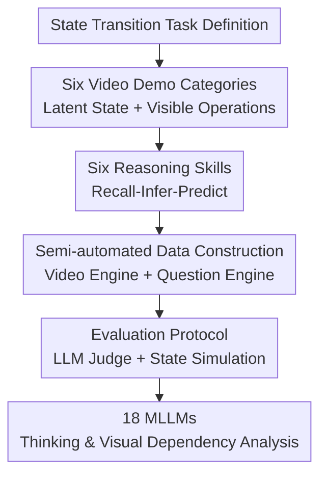

# VideoReasonBench: Can MLLMs Perform Vision-Centric Complex Video Reasoning?

**Conference**: ICLR 2026  
**OpenReview**: [https://openreview.net/forum?id=1Mblo6U8kp](https://openreview.net/forum?id=1Mblo6U8kp)  
**Code**: https://llyx97.github.io/video_reason_bench/  
**Area**: Multimodal VLM Reasoning / Video Understanding Evaluation  
**Keywords**: Video Reasoning, MLLM Evaluation, Long Chain-of-Thought, Fine-grained Temporal Perception, Vision-Centric Benchmark  

## TL;DR
VideoReasonBench constructs a vision-centric complex reasoning benchmark centered on "visible operations + partially visible latent states." The study demonstrates that most current MLLMs remain weak in fine-grained video perception and multi-step state reasoning, while longer test-time thinking significantly benefits such tasks.

## Background & Motivation
**Background**: Multimodal Large Language Models (MLLMs) have achieved impressive surface-level results in general VideoQA, long video understanding, and knowledge-intensive video answering. Simultaneously, long Chain-of-Thought (CoT) in LLMs has demonstrated test-time scaling gains in tasks like mathematics, coding, and scientific reasoning: providing the model with more reasoning tokens often allows it to decompose complex problems, check steps, and improve accuracy.

**Limitations of Prior Work**: The field of video understanding lacks tasks that truly test whether "long reasoning is useful." Many popular video benchmark questions can be answered via short-term action recognition, common-sense judgment, caption cues, or knowledge recall; models can often provide correct answers in a few tokens even without thinking mode. While some recent benchmarks emphasize CoT or process correctness, many remain knowledge-driven or cover shallow skills like action counting and short-range localization, failing to force models to perform long-chain state updates based on visual evidence.

**Key Challenge**: The true difficulty of complex video reasoning is not "knowing a concept," but accurately recording a sequence of operations within continuous visual changes and applying these operations to a state that is not always fully visible. Existing benchmarks often lack visual density or reasoning depth, making it difficult to distinguish whether a model truly "sees" the video or uses linguistic/knowledge shortcuts to guess the answer.

**Goal**: The authors aim to establish a vision-centric complex video reasoning evaluation. Videos must contain dense, sequentially dependent visual operations that cannot be skipped. Questions cover a progression of abilities from recalling operations to inferring hidden states and predicting future states. The evaluation also analyzes the impact of thinking budget, missing visual input, and video complexity on model performance.

**Key Insight**: The paper abstracts video as a sequence of state transitions. A latent state $S_t$ transforms into $S_{t+1}$ under the action of operation $o_t$. The entire sequence of operations is observable in the video, but the state is only partially revealed at the beginning or end. Consequently, the model cannot rely solely on a single frame or common sense; it must accurately perceive each operation and maintain/update the state internally.

**Core Idea**: By constructing videos with "partially visible latent states + fully visible operation sequences," the tasks naturally require fine-grained visual perception and multi-step state reasoning to evaluate whether MLLMs truly perform vision-centric complex video reasoning.

## Method

### Overall Architecture
VideoReasonBench is not a new model but a controllable framework for generating and evaluating video reasoning tasks. It defines vision-centric complex video reasoning, generates 6 categories of video demonstrations with 6 types of reasoning skills, and evaluates models using rule-based answers, LLM judges, and state simulators.

The workflow involves: given a state scale and number of operations, a video engine generates a state transition script and renders it into a video. A question engine creates questions and ground-truth answers based on video categories and skill templates. During evaluation, the model receives only the video and question, and the system judges if the answer aligns with the ground-truth state transitions.

### Key Designs
**1. State Transition Video Definition: Turning "Video Watching" into State Maintenance**

The key design formalizes each video as a sequence of state transitions: $\{S_t, o_t, S_{t+1}\}_{t=1}^{T-1}$. $S_t$ represents the current state (e.g., board, cup, file, card deck, or chips), and $o_t$ is a visible operation. The video fully displays the sequence $o_1, \ldots, o_{T-1}$, but the state is only explicitly shown at the start or end: either $\{S_1, o_1, \ldots, o_{T-1}\}$ or $\{o_1, \ldots, o_{T-1}, S_T\}$.

This setup tests two abilities simultaneously: models focusing only on the "final frame" cannot answer intermediate states, while models with faulty perception of operation sequences will fail as errors accumulate during state updates. For example, in a slider puzzle, numbers are initially visible before being covered, and only the movement of blue blocks is shown. Missing one move results in an entirely incorrect final board state.

**2. Three Levels and Six Skills: Decoupling Perception and Reasoning Errors**

VideoReasonBench categorizes reasoning into three levels, each with two skills. Level 1 includes Recall Order and Recall Count (direct questions on operation sequences or frequencies). Level 2 includes Infer State and Compare State (inferring hidden states at specific times based on observed operations). Level 3 includes Predict State and Predict Operation (predicting future states based on additional operations or reverse-engineering operations to reach a target state).

This hierarchy allows for diagnostic evaluation. If a model performs poorly at Level 1, its bottleneck is fine-grained temporal perception. If it succeeds at Level 1 but fails Level 2/3, it cannot stably maintain internal states. Results show that performance for both humans and models decreases from Level 1 to Level 3, indicating the benchmark's difficulty aligns with the required reasoning depth.

**3. Six Demo Categories Covering Synthetic and Real Scenes**

The dataset includes Number (slider puzzle), Circle (coloring grids), Cup (cup shuffling with coins), File (CLI file operations), Card (deck manipulation), and Chip (adding/removing chips in cups). 

These tasks share the "latent state + operation sequence" framework but vary in visual form, including Matplotlib animations, CLI screenshots, and hand-recorded real-world videos. State size and operation counts are adjustable (e.g., $3 \times 3$ to $4 \times 4$ boards, 5 to 14 steps), ensuring answers are rule-generated while avoiding model overfitting to a single visual pattern.

**4. Evaluation Protocols Distinguishing Unique Answers and Multi-solution Operations**

Most questions have standard answers. A text-based LLM judge (Qwen2.5-72B by default) receives the question, ground truth, and model answer to determine correctness. Robustness was verified by swapping judge models and rephrasing answers, with variance kept within 1%.

Predict Operation is unique because multiple sequences may reach the same target state. The system uses an LLM to extract operations from the model's response and feeds them into a state transition function to simulate whether the target state is successfully reached. This ensures that "functional correctness" is evaluated rather than just string matching.

### A Complete Example
In the Number slider puzzle, a $3 \times 3$ board is shown initially (with 0 as the empty space). Numbers are then covered by blue masks, and the video shows several moves of adjacent blocks into the empty space. For Recall Order, the model must list the coordinates and directions of the 10 moves. For Infer State, it must start from the initial board and apply each move sequentially to determine the final arrangement.

Level 3 Predict State goes further: given the final video state, a sequence of new hypothetical operations (e.g., leftward, upward) is provided, and the model must output the final board state. This requires accurately perceiving the initial state, tracking video movements to get the intermediate state, and then applying the additional moves. Any visual misreading or state update error results in an incorrect answer.

### Loss & Training
Ours does not involve training new models or proposing new loss functions. The emphasis is on offline evaluation of existing MLLMs while systematically varying thinking budget, visual input completeness, state scale, operation count, and state reveal timing to explore capability boundaries.

## Key Experimental Results

### Main Results
18 representative MLLMs were evaluated, including GPT-4o, o4-mini, Gemini 2.0/2.5, Seed1.5-VL, Qwen2.5-VL, InternVL3, and others. The primary conclusion is clear: except for Gemini-2.5-Pro, most models fail to reliably complete tasks in VideoReasonBench.

| Model | Thinking | Level 1 Performance | Level 2 Performance | Level 3 Performance | Overall |
|-------|----------|---------------------|---------------------|---------------------|---------|
| Human | Yes (223.2s avg) | Recall Order 87.5 / Count 90.0 | Infer 80.0 / Compare 75.0 | Predict State 67.5 / Operation 42.5 | 73.8 |
| GPT-4o | No | 14.2 / 15.8 | 4.2 / 6.2 | 0.8 / 0.0 | 6.9 |
| o4-mini | Yes | 14.2 / 20.4 | 7.1 / 11.7 | 6.2 / 4.6 | 10.7 |
| Seed1.5-VL | Yes | 24.2 / 27.1 | 3.8 / 7.9 | 3.8 / 2.1 | 11.5 |
| Gemini-2.5-Flash | Yes | 44.6 / 41.7 | 27.9 / 27.1 | 13.8 / 9.6 | 27.4 |
| Gemini-2.5-Pro-0506 | Yes | 69.2 / 70.4 | 63.3 / 56.7 | 42.1 / 34.6 | 56.0 |

A diagnostic "vid2txt" experiment showed that when key state transition information is provided as text, Seed1.5-VL improved from 11.5% to 69.4%, and Gemini-2.5-Flash increased from 27.4% to 72.2%. This indicates that models are capable of discrete state reasoning but are bottlenecked by "stably extracting operation sequences from video."

### Ablation Study
| Setting | Key Metric | Description |
|----------|----------|------|
| Thinking budget 0 to 8192 (Gemini-2.5-Flash) | ~9% gain in accuracy | Gain is <2.5% on TempCompass, MMVU, etc., showing this task better captures thinking benefits. |
| Clipping 50% of video | 27.4 down to 12.2 (55.5% drop) | High dependence on the full visual operation sequence. |
| Single frame input | 27.4 down to 0.5 (98.2% drop) | Proves tasks are not static image QA. |
| Text-only input | 27.4 down to 1.0 (96.4% drop) | Linguistic priors cannot bypass visual evidence. |
| Operations 5-9 to 10-14 | 58.2 down to 53.9 (Gemini-2.5-Pro) | More operations significantly increase tracking difficulty. |
| State revealed at end vs start | 35.3 down to 19.6 (Gemini-2.5-Flash) | Reverse inference of initial states is significantly harder. |

### Key Findings
- Fine-grained temporal perception is the primary bottleneck. Even large models often score below 30% in Level 1, indicating an inability to stably record dense video operations.
- Long chain-of-thought is effective, but only if visual evidence is correctly extracted. Gemini-2.5-Flash showed improvement with thinking, but the "vid2txt" leap demonstrates that "accurate seeing" is as vital as "effective reasoning."
- VideoReasonBench difficulty is controllable. State scale, operation count, and timing systematically influence accuracy, providing "knobs" for future difficulty scaling.
- Humans are not perfect, particularly in Level 3 Predict Operation (42.5%). This confirms the task has high cognitive load and is not an artificial trap with unverifiable solutions.

## Highlights & Insights
- The most significant insight is that video reasoning evaluation should verify results based on continuous visual evidence rather than just questions that "sound" like they require reasoning. By baking hidden states and visible operations into the task definition, VideoReasonBench is much harder to bypass via linguistic shortcuts.
- The hierarchical skill design is diagnostic. Instead of a single accuracy score, researchers can determine whether a model's failure stems from poor perception, memory, or reasoning logic.
- The vid2txt experiment decouples visual bottlenecks from symbolic reasoning bottlenecks. The fact that the same model improves drastically with text input highlights that the transition from video tokens to structured operations remains a critical weakness for MLLMs.
- The thinking budget analysis reveals that long CoT has value in the video domain; previous benchmarks simply lacked the reasoning depth required to trigger these benefits.

## Limitations & Future Work
- Scenarios are relatively clean. Most materials are synthetic animations or controlled recordings, lacking the occlusions, motion-blur, camera cuts, and multi-person interactions of open-world videos.
- State transition rules are discrete and explicit. While excellent for diagnosing operation tracking and state maintenance, they differ from causal reasoning or physical interaction inference in the real world.
- Current work is a benchmark and does not propose new training methods. Future work could use the generation engine to create training data for researching how to combine video event extraction, external memory, and verifiable reasoning.
- While robust, the LLM judge might still misinterpret complex formatted answers. Moving toward executable state verification for all questions would reduce uncertainty.

## Related Work & Insights
- **vs Video-MME / TempCompass**: These cover general video and temporal understanding, but many questions are solvable with short answers, limiting the utility of increased thinking tokens. VideoReasonBench forces long reasoning chains via continuous state tracking.
- **vs MMVU / Video-MMMU**: These focus on knowledge-intensive understanding. VideoReasonBench minimizes external knowledge reliance, placing the difficulty on visual operation perception and state logic.
- **Implications for Model Training**: Future MLLMs may require explicit "video event extractors + updatable state memory + reasoning controllers." Merely feeding more frames into the context might not solve operation misreading and state drift.
- **Implications for Benchmark Design**: A robust reasoning benchmark should validate its properties by intervening (e.g., removing vision, shortening thinking). The intervention analyses in this paper are more persuasive than the main result table alone.

## Rating
- Novelty: ⭐⭐⭐⭐ Uses latent state transitions to define complex video reasoning, addressing a key gap in current video evaluation.
- Experimental Thoroughness: ⭐⭐⭐⭐⭐ Evaluates 18 models and provides comprehensive evidence through thinking budget, visual dependency, complexity, and stability analyses.
- Writing Quality: ⭐⭐⭐⭐ Clear structure and easy-to-follow conclusions; some data construction details require the appendix for full replication.
- Value: ⭐⭐⭐⭐⭐ Highly valuable for assessing vision-centric complex reasoning and provides a clear target for future training data and verifiable reasoning research.

<!-- RELATED:START -->

## Related Papers

- [\[ICLR 2026\] SpatiaLab: Can Vision-Language Models Perform Spatial Reasoning in the Wild?](spatialab_can_vision-language_models_perform_spatial_reasoning_in_the_wild.md)
- [\[ICLR 2026\] ReWatch-R1: Boosting Complex Video Reasoning in Large Vision-Language Models through Agentic Data Synthesis](rewatch-r1_boosting_complex_video_reasoning_in_large_vision-language_models_thro.md)
- [\[ACL 2026\] Can MLLMs Reason Beyond Language? VisReason: A Comprehensive Benchmark for Vision-Centric Reasoning](../../ACL2026/vlm_reasoning/can_mllms_reason_beyond_language_visreason_a_comprehensive_benchmark_for_vision-.md)
- [\[ICLR 2026\] OCR-Reasoning Benchmark: Unveiling the True Capabilities of MLLMs in Complex Text-Rich Image Reasoning](ocr-reasoning_benchmark_unveiling_the_true_capabilities_of_mllms_in_complex_text.md)
- [\[ICLR 2026\] Spatial Reasoning with Vision-Language Models in Ego-Centric Multi-View Scenes](spatial_reasoning_with_vision-language_models_in_ego-centric_multi-view_scenes.md)

<!-- RELATED:END -->
