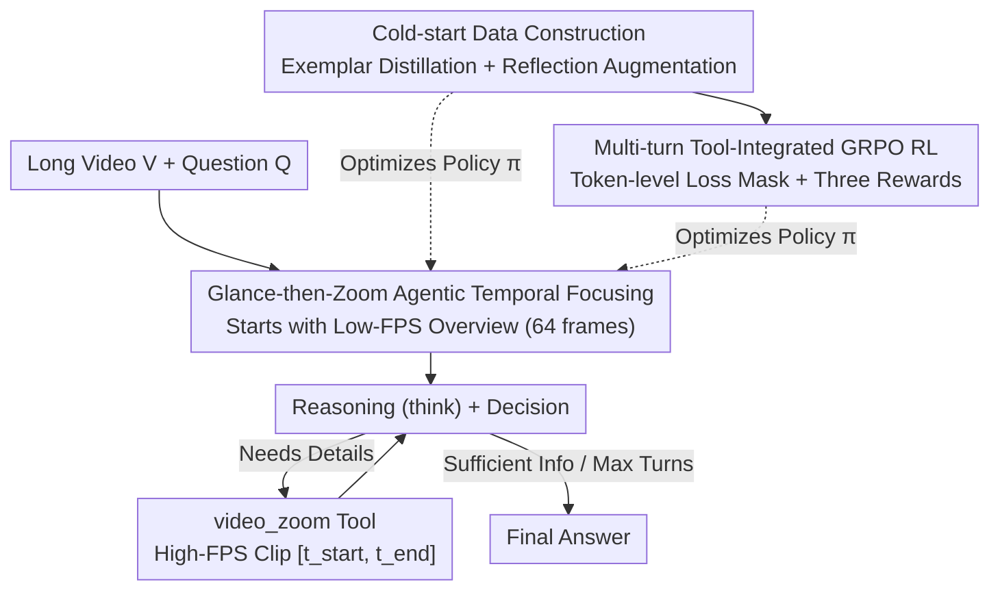

# VideoZoomer: Reinforcement-Learned Temporal Focusing for Long Video Reasoning

**Conference**: ICLR 2026  
**OpenReview**: [https://openreview.net/forum?id=ARHCFvgx6G](https://openreview.net/forum?id=ARHCFvgx6G)  
**Code**: https://github.com/zsgvivo/VideoZoomer (Available)  
**Area**: Multimodal VLM / Long Video Reasoning / Reinforcement Learning  
**Keywords**: Long Video Understanding, Agentic Reasoning, Temporal Zooming, Multi-turn Tool Calling, GRPO

## TL;DR
VideoZoomer reformulates long video reasoning as a multi-turn tool-calling task of "glance then zoom." A 7B MLLM autonomously decides **when and where** to invoke the `<video_zoom>` tool to capture high-frame-rate clips. Using a two-stage training process of "cold-start SFT + GRPO reinforcement learning," it outperforms open-source models on multiple long video benchmarks with a smaller frame budget and even matches closed-source systems on specific tasks.

## Background & Motivation

**Background**: Multimodal Large Language Models (MLLMs) are proficient in image and short video tasks but struggle with long videos due to context window constraints. The standard approach is **uniform sampling** (e.g., 2 FPS), compressing the video into a subset. Advanced methods use **adaptive frame selection** via a lightweight selector to pick "salient frames" before inference.

**Limitations of Prior Work**: Uniform sampling assumes "all timestamps are equally important," potentially missing brief but critical events while wasting budget on redundant segments. Frame selectors, though better, have two flaws: (i) they are designed to **select a fixed number of frames** regardless of question complexity, and (ii) the selection and reasoning processes are **decoupled, static, and non-interactive**. If the initial selection is wrong, the model cannot correct it.

**Key Challenge**: Long video reasoning inherently requires **iterative evidence collection**. Existing methods freeze the "where to look" decision before inference, fundamentally limiting performance on complex tasks.

**Goal**: Enable the model to **dynamically allocate attention** like a human—glancing globally first, then precisely "zooming in" on specific moments when details are needed.

**Key Insight**: Transforming the model from a "passive receiver of pre-selected frames" into an "active exploration agent" provides two benefits: (i) **Efficiency**: The agent starts with a low-FPS overview and only consumes context budget when it calls `<video_zoom>`. (ii) **Robustness**: By learning strategies for "when and where to request details," the agent can correct initial oversights and collect fine-grained evidence, avoiding information loss inherent in static methods.

**Core Idea**: Reformulate long video understanding as a **sequential tool-interaction task** using a multi-turn "first glance, then zoom" paradigm. A two-stage "cold-start SFT + RL" training pipeline evolves the MLLM from a simple imitator into a generalizing adaptive agent.

## Method

### Overall Architecture

VideoZoomer addresses efficient long video understanding under a fixed frame budget. It follows a "glance-then-zoom" logic: the model initially receives the question $Q$ and a video $V_{low}$ uniformly sampled at a low frame rate $f_{low}$ (64 frames) as a cheap overview. To answer precisely, it calls the `<video_zoom>` tool for a specific segment $[t_{start}, t_{end}]$ at high frame rate $f_{high}$. The environment returns the clip $V_{clip}=T(V, t_{start}, t_{end}, f_{high})$. The model reasons in `<think>`, decides the next zoom or provides an answer, participating in multi-turn interactions until reaching a conclusion or the maximum turn limit. Tool calls are constrained by a frame budget $f_{high}\times(t_{end}-t_{start})\le B$.

The training follows two stages: cold-start data construction (Design 2) to teach tool syntax and reasoning patterns, and multi-turn tool-integrated RL (Design 3) to optimize the agent's efficiency and effectiveness.

### Key Designs

**1. Glance-then-Zoom Agentic Temporal Focusing: Dynamic Decision-making**

This design addresses the inability of static frame selection to correct errors. VideoZoomer turns the model into an active agent that requests high-FPS clips as needed. Crucially, it is **multi-turn**: the model can discover a segment is irrelevant in turn 1 and zoom elsewhere in turn 2. The paper identifies three reasoning modes: **Direct-hit** (locking evidence in one zoom), **Progressive** (aggregating evidence across clips), and **Self-refine** (correcting an incorrectly selected interval).

**2. Cold-start Data Construction: Exemplar Distillation + Reflection Augmentation**

Training RL on a high-dimensional action space for structured tool calling is inefficient. SFT cold-starts the model to learn tool formats and diverse reasoning patterns. 

First, **Exemplar Trajectory Distillation** uses strong closed-source models (GPT-4o, Gemini-1.5-Pro) as expert demonstrators to collect "gold" trajectories. However, simply performing SFT on exemplars causes the model to **overfit to the expert's dominant mode**, often resulting in "shallow strategies" that call the tool only once before guessing.

To mitigate this, **Reflection Data Augmentation** is introduced. The SFT-initialized model rollouts trajectories and identifies failures. These failed trajectories are fed to the expert model to "reflect"—identify errors and generate a corrected, more robust reasoning path. This teaches the model to recover from errors and critically evaluate tool outputs.

**3. Multi-turn Tool-Integrated GRPO RL: Token-level Loss Mask + Three Rewards**

After cold-starting, GRPO RL optimizes the agent. The framework is extended to multi-turn tool usage by introducing a **token-level loss mask** that calculates gradients only on model-generated tokens, ignoring text and image tokens returned by the environment.

The reward $R$ consists of three components:
$$R(x, y) = R_{acc}(x, y) + R_{format}(y) + R_{tool}(y)$$
Where $R_{acc}$ is the primary accuracy reward, and $R_{format}$ ensures output structure (encapsulating reasoning in `<think>` and actions in `<video_zoom>` or `<answer>`). Significantly, **$R_{tool}$ provides a bonus for tool usage only if the final answer is correct**. This encourages exploration early in training while preventing redundant calling.

### Loss & Training
The base model is Qwen-2.5-VL-7B-Instruct. Cold-starting uses LLaMA-Factory (LR $5\times10^{-6}$, 1 epoch). RL uses verl (LR $1\times10^{-6}$, rollout 16, batch size 128). Inference involves an initial 64-frame glance, up to 4 zooms of 16 frames each (max 128 frames). Training data comprises LongVideoReason (52K pairs).

## Key Experimental Results

### Main Results

Evaluated on 7 benchmarks across understanding and reasoning tasks.

| Benchmark | Metric | VideoZoomer-7B | Qwen2.5-VL-7B (Base) | Gain |
|------|------|------|------|------|
| MLVU | dev | 68.8 | 58.3 | +10.5 |
| MLVU | test | 55.8 | 45.5 | +10.3 |
| LongVideoBench | val | 57.7 | 51.0 | +6.7 |
| LVBench | - | 41.5 | 36.9 | +4.6 |
| VideoMMLU | quiz | 67.9 | 61.0 | +6.9 |
| VideoMMMU | - | 52.2 | 48.1 | +4.1 |
| LongVideoReason | eval | 80.3 | 70.8 | +9.5 |

On LongVideoReason-eval, the model reaches 80.3, **surpassing closed-source GPT-4o (60.7) and Gemini-1.5-Pro (67.3)**. Improvements in MLVU are concentrated in fine-grained perception; Action Counting rose from 13.6 to 50.5.

### Ablation Study

| Config | MLVU-dev | LongVideoReason | Note |
|------|----------|------------------|------|
| VideoZoomer (Full) | 68.8 | 80.3 | Full model |
| w/o RL (SFT only) | 56.4 | 63.3 | Catastrophic drop across benchmarks |
| w/o cold-start | 57.0 | 59.6 | Failed to converge to meaningful strategy |
| w/o reflection | 67.0 | 75.1 | Degraded to shallow strategy (avg calls ≈ 1.0) |
| w/o $R_{tool}$ | 67.5 | 79.9 | "Policy collapse"; tool usage dropped to zero |

### Key Findings
- **RL and Cold-start are Essential**: SFT alone fails cross-benchmark generalization, and RL alone cannot converge without strong initialization.
- **Reflection Drives Reasoning Depth**: Without reflection data, the model defaults to a single tool call. The full model averages nearly 2 calls, enabling deeper exploration.
- **Conditional Tool Reward Prevents Collapse**: The "reward only if correct" design for $R_{tool}$ is critical to prevent the model from ignoring the tool or spamming it.
- **Efficiency Gains**: On MLVU, VideoZoomer uses an average of 48 frames to beat the 128-frame baseline. On LVBench, 77 frames outperform 256 frames.

## Highlights & Insights
- **"Where to Look" as a Learnable Policy**: Shifting from static selection to a multi-turn agentic action allows for error correction and dynamic budget allocation.
- **Conditional Reward Logic**: The reward trick elegantly balances exploration with efficiency.
- **Reflection for Robustness**: Using the model's own failures combined with expert correction creates high-quality on-policy data that teaches the model when to persist in exploration.
- **Efficiency is Performance**: Proving that "knowing where to look" is more valuable than "looking at more," benefitial for hardware-constrained deployment.

## Limitations & Future Work
- **Closed-source Dependency**: Cold-start data generation relies on GPT-4o/Gemini, limiting reproduction and data diversity.
- **Fixed Hyperparameters**: Initial frames and zoom limits are manually set; adaptive budget control for different video lengths is unexplored.
- **Noise Sensitivity**: Complex reasoning does not always benefit from more frames, suggesting a need for better noise suppression during zooming.
- **Single Tool Scope**: Currently limited to `<video_zoom>`; multi-tool collaboration (e.g., cropping, audio) is a future direction.

## Related Work & Insights
- **vs. Uniform/Static Selection**: Those methods are decoupled and rigid. VideoZoomer integrates selection into a dynamic closed loop.
- **vs. LongVILA-R1**: While LongVILA uses larger frame budgets via context expansion, VideoZoomer achieves higher performance with fewer frames.
- **vs. Prompt-based Agents**: Prompt-driven systems (e.g., VideoDeepResearch) depend on closed-source APIs; VideoZoomer explicitly trains an open-source model for efficient agentic behavior.

## Rating
- Novelty: ⭐⭐⭐⭐⭐ 
- Experimental Thoroughness: ⭐⭐⭐⭐⭐ 
- Writing Quality: ⭐⭐⭐⭐ 
- Value: ⭐⭐⭐⭐⭐ 

<!-- RELATED:START -->

## Related Papers

- [\[ICLR 2026\] TimeSearch-R: Adaptive Temporal Search for Long-Form Video Understanding via Self-Verification Reinforcement Learning](timesearch-r_adaptive_temporal_search_for_long-form_video_understanding_via_self.md)
- [\[ACL 2026\] TemporalVLM: Video LLMs for Temporal Reasoning in Long Videos](../../ACL2026/vlm_reasoning/temporalvlm_video_llms_for_temporal_reasoning_in_long_videos.md)
- [\[CVPR 2026\] Thinking with Drafts: Speculative Temporal Reasoning for Efficient Long Video Understanding](../../CVPR2026/vlm_reasoning/thinking_with_drafts_speculative_temporal_reasoning_for_efficient_long_video_und.md)
- [\[CVPR 2026\] Thinking With Videos: Multimodal Tool-Augmented Reinforcement Learning for Long Video Reasoning](../../CVPR2026/vlm_reasoning/thinking_with_videos_multimodal_tool-augmented_reinforcement_learning_for_long_v.md)
- [\[ICLR 2026\] VisionReasoner: Unified Reasoning-Integrated Visual Perception via Reinforcement Learning](visionreasoner_unified_reasoning-integrated_visual_perception_via_reinforcement_.md)

<!-- RELATED:END -->
