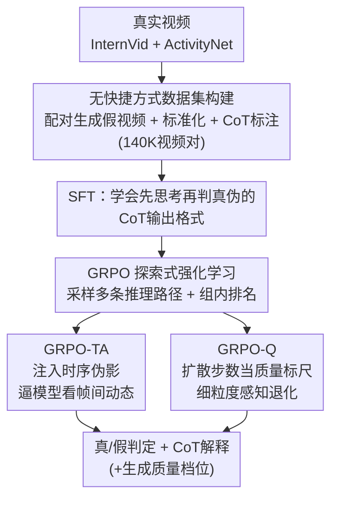

# VidGuard-R1: AI-Generated Video Detection and Explanation via Reasoning MLLMs and RL

**Conference**: ICLR 2026  
**arXiv**: [2510.02282](https://arxiv.org/abs/2510.02282)  
**Code**: [Project Page](https://vidguard-r1.github.io/)  
**Area**: Multimodal VLM  
**Keywords**: AI-generated video detection, MLLM reasoning, GRPO, temporal artifacts, explainable forensics

## TL;DR

VidGuard-R1 is the first video authenticity detector to utilize Group Relative Policy Optimization (GRPO) reinforcement learning for fine-tuning MLLMs. By constructing a shortcut-free dataset of 140,000 real/fake video pairs and designing two specialized reward mechanisms—temporal artifact rewards and diffusion step quality rewards—it achieves 86.17% accuracy on its internal dataset and reaches 95%+ SOTA zero-shot detection performance on the GenVidBench and GenVideo benchmarks, while generating explainable Chain-of-Thought reasoning.

## Background & Motivation

**Background**: The visual quality of AI video generation models (such as Sora, HunyuanVideo, and Wan) has surged, blurring the boundaries between synthetic and real videos. This poses significant social risks, including the spread of misinformation, privacy violations, and fraud, creating an urgent need for accurate and explainable detection tools.

**Limitations of Prior Work**:

1. **Severe limitations of traditional detectors**: Early DeepFake detectors focused exclusively on facial forgery and fail to generalize to open-domain, multi-scene videos; spatio-temporal consistency methods are easily bypassed by post-processing.
2. **Poor performance of direct MLLM application**: Powerful MLLMs like GPT-4o achieve only approximately 57% accuracy when directly prompted for video authenticity, lingering near random chance.
3. **Weak reasoning in SFT-tuned models**: While SFT improves detection accuracy, models fail to generate meaningful explanations for "why a video is fake" due to insufficient reasoning capabilities.
4. **Shortcuts in existing datasets**: Benchmarks like GenVideo and GenVidBench contain systematic differences in resolution, frame rate, bitrate, and duration between real and fake videos. Models exploit these metadata shortcuts rather than assessing visual authenticity.

**Key Challenge**: The model must perform both accurate detection and deep reasoning regarding "where the flaws are," yet SFT only teaches output formats without stimulating exploratory reasoning.

**Ours**: This work introduces the GRPO reinforcement learning framework to encourage the autonomous discovery of physical inconsistencies through multi-path reasoning sampling and intra-group ranking. Two specialized reward signals are designed to guide temporal reasoning and quality perception.

## Method

### Overall Architecture

VidGuard-R1 addresses the dual challenge of accurately judging video authenticity and clearly explaining the flaws. Since directly applying powerful MLLMs (GPT-4o accuracy is ~57%) or relying solely on supervised fine-tuning is insufficient, the authors utilize Qwen2.5-VL-7B as a backbone. The pipeline consists of two stages: first, Supervised Fine-Tuning (SFT) on 30K videos with Chain-of-Thought (CoT) annotations to teach the model a "think-before-judging" format; second, Reinforcement Learning (RL) on 100K videos using Group Relative Policy Optimization (GRPO) to stimulate autonomous exploration of reasoning paths. The core detection capability originates from the RL phase—specifically, through two specialized rewards designed for synthetic video defects: GRPO-TA (temporal artifacts) and GRPO-Q (quality). The former forces the model to observe inter-frame dynamics, while the latter enables perception of quality degradation. The model eventually outputs a real/fake judgment, an explainable CoT, and an estimated generation quality level.

### Key Designs

**1. Shortcut-free Training Data: Learning Visual Authenticity Over Metadata**

A critical issue in existing benchmarks (GenVideo, GenVidBench) is that real and fake videos are systematically separable by low-level features—real videos often exceed 10 seconds while generated ones are under 4 seconds, with varying resolutions and bitrates. Models can "cheat" by reading metadata without analyzing the visual content. This work constructs 140K video pairs (70K real + 70K fake) to eliminate these shortcuts. Real videos are sourced from InternVid (55K) and ActivityNet (15K). Fake videos are generated using HunyuanVideo-I2V (50K) and CogVideoX-5B (20K) conditioned on the first frame and text description of the real videos, ensuring content alignment and erasing bias. All videos are standardized to 49 frames, 8 FPS, 720×480, and YUV420p. Finally, Qwen2.5-VL-72B is used to automatically label CoT reasoning (across dimensions like object interaction, background detail, and lighting) given the ground truth labels for SFT. This forces the model to find flaws within the imagery itself.

**2. GRPO Exploratory RL: From Passive Imitation to Active Reasoning**

Data alone is insufficient—SFT only teaches the model to mimic reasoning formats without necessarily improving discriminative power (SFT accuracy is only 66%). While DPO relies on static preference pairs, it struggles to capture evolving temporal inconsistencies. GRPO samples a group of $G$ reasoning outputs for the same video and updates the policy via intra-group relative ranking. The advantage term $A_i$ normalizes the reward $r_i$ within the group, encouraging the model to explore and compare multiple reasoning paths rather than memorizing one. Since accuracy serves as the reward signal (1 for correct, 0 for incorrect), the model learns that physical consistency is the key to correct judgments.

**3. GRPO-TA: Forcing Temporal Reasoning via Artifacts**

Standard GRPO tends to rely on single-frame cues (pixel distortion, lighting anomalies). GRPO-TA (GRPO with Temporal Artifacts) actively injects temporal disruptions during training to correct this bias. Selected regions of a video are subjected to segment repetition or frame reversal based on a Gaussian distribution, creating temporal anomalies. These tampered videos must be identified as fake. The reward design is asymmetric: correctly identifying tampered versions of real videos (which are more subtle) yields a higher reward $\alpha_1 = 0.5$, while tampered generated videos (which already have instability) yield $\alpha_2 = 0.3$. To ensure stability, the additional reward $w_i$ is only activated if the original video was predicted correctly and the intra-group accuracy $\tilde{p}$ exceeds $\mu = 0.8$:

$$r_i^{\text{GRPO-TA}} = \begin{cases} r_i^{\text{GRPO}} + w_i, & \text{若 } o_i \text{ 正确且 } \tilde{p} > \mu \\ r_i^{\text{GRPO}}, & \text{否则} \end{cases}$$

This shifts the model's attention from static pixels to inter-frame dynamics.

**4. GRPO-Q: Using Diffusion Steps as a "Quality Ruler" for Fine-grained Perception**

Diffusion models naturally produce lower quality videos with more artifacts as the number of reverse denoising steps decreases. GRPO-Q (GRPO with Quality evolutionary videos) converts this continuous attribute into a supervised signal. For 12K real videos, five quality levels are generated using diffusion steps ranging from 10 to 50 (corresponding to 20%, 40%, 60%, 80%, and 95%). The label space is expanded to $\mathcal{Y} = \{\text{real}\} \cup \{\text{fake-}s\}$, where $s$ is the diffusion step. Rewards are given based on the proximity of the predicted level to the ground truth. If the real/fake judgment is wrong, the reward is 0. A perfect match yields $\delta = 1$, while correct real/fake judgments with step deviations are calculated via $g(o_i, y_i) = \delta \cdot (1 - |s(o_i) - s(y_i)|)$, where $s(\cdot)$ maps outputs to a normalized $[0,1]$ scale. This regression-like task significantly enhances the model's understanding of "fakeness."

## Key Experimental Results

### Main Results: Detection Performance on Internal Dataset

| Method | Type | CogVideoX Accuracy(%) | HunyuanVideo Accuracy(%) |
|------|------|:---:|:---:|
| I3D | CNN | 64.78 | 62.13 |
| SlowFast | CNN | 77.87 | 77.03 |
| TimeSformer | Transformer | 78.53 | 74.55 |
| VideoSwin | Transformer | 76.81 | 79.71 |
| GPT-4o | MLLM | 56.81 | 57.42 |
| Qwen2.5-VL-7B | MLLM | 50.95 | 52.83 |
| VidGuard-R1 (CoT/SFT) | MLLM | 66.18 | 63.19 |
| VidGuard-R1 (DPO) | MLLM | 79.13 | 80.88 |
| VidGuard-R1 (GRPO) | MLLM | 81.30 | 81.90 |
| VidGuard-R1 (GRPO-TA) | MLLM | 82.17 | 83.72 |
| VidGuard-R1 (GRPO-Q) | MLLM | **84.32** | **86.17** |

Key Observations: (1) Direct application of Qwen2.5-VL-7B/GPT-4o is near random (~50-57%); (2) SFT improves accuracy to 66% but remains inferior to traditional video models; (3) GRPO improves by ~2% over DPO; (4) GRPO-TA and GRPO-Q improve by ~2% and ~5% respectively, validating the specialized rewards.

### Zero-Shot Generalization Across Benchmarks

| Method | GenVidBench Mean(%) | GenVideo Best Metric |
|------|:---:|:---:|
| MViT V2 | 79.90 | - |
| GPT-4.1 mini | 59.62 | - |
| VidGuard-R1 (GRPO, Zero-shot) | 96.37 | F1: 0.97 |
| VidGuard-R1 (GRPO, Fine-tuned) | **97.53** | F1: **0.98** |

VidGuard-R1 achieves 96.37% zero-shot on GenVidBench, exceeding the previous SOTA (MViT V2, 79.90%) by approximately 17 percentage points. It also leads significantly in F1 score on GenVideo.

### Ablation Study: Contribution of Training Stages

| Training Configuration | CogVideoX | HunyuanVideo | Gain Source |
|----------|:---:|:---:|----------|
| SFT (CoT) | 66.18 | 63.19 | Base reasoning format |
| + DPO | 79.13 | 80.88 | Preference alignment +15% |
| + GRPO | 81.30 | 81.90 | Group rank exploration +2% |
| + GRPO-TA | 82.17 | 83.72 | Temporal reasoning +1.8% |
| + GRPO-Q | 84.32 | 86.17 | Quality perception +2.5% |

Each stage provides consistent improvements. The jump from SFT to DPO is the largest (~15%), indicating preference learning is vital, whereas GRPO-Q provides the strongest incremental gain among the RL variants.

## Highlights & Insights

### Novelty & Value

1. **Foundational Contribution**: This is the first work to apply GRPO reinforcement learning to AI-generated video detection, establishing a "Detection + Explanation" paradigm.
2. **Ingenious Reward Design**: The asymmetric temporal artifact reward in GRPO-TA and the diffusion step reward in GRPO-Q leverage the inherent characteristics of generative models.
3. **Dataset Rigor**: The use of standardized data eliminated metadata shortcuts, ensuring the model learns visual authenticity.
4. **Outstanding Generalization**: Reaching 95%+ zero-shot performance on established benchmarks far exceeds prior methods.

### Limitations & Future Work

1. The backbone is fixed to Qwen2.5-VL-7B; generalizability across other MLLMs remains unverified.
2. GRPO-Q requires generating videos at multiple diffusion steps, which entails high data construction costs.
3. As generative models iterate rapidly, the long-term effectiveness of specific detection cues is uncertain.

### Rating

⭐⭐⭐⭐ — A pioneering work introducing reasoning-based RL to video forensics. The methodology is sophisticated and well-validated, providing a powerful paradigm for explainable AI security detection.

<!-- RELATED:START -->

## Related Papers

- [\[ICLR 2026\] SophiaVL-R1: Reinforcing MLLMs Reasoning with Thinking Reward](sophiavl-r1_reinforcing_mllms_reasoning_with_thinking_reward.md)
- [\[ICLR 2026\] Perception-R1: Advancing Multimodal Reasoning Capabilities of MLLMs via Visual Perception Reward](perception-r1_advancing_multimodal_reasoning_capabilities_of_mllms_via_visual_pe.md)
- [\[NeurIPS 2025\] Video-R1: Reinforcing Video Reasoning in MLLMs](../../NeurIPS2025/vlm_reasoning/video-r1_reinforcing_video_reasoning_in_mllms.md)
- [\[ICLR 2026\] Game-RL: Synthesizing Multimodal Verifiable Game Data to Boost VLMs' General Reasoning](game-rl_synthesizing_multimodal_verifiable_game_data_to_boost_vlms_general_reaso.md)
- [\[ICLR 2026\] ReVisual-R1: Advancing Multimodal Reasoning from Optimized Cold Start to Staged Reinforcement Learning](revisual-r1_advancing_multimodal_reasoning_from_optimized_cold_start_to_staged_r.md)

<!-- RELATED:END -->
