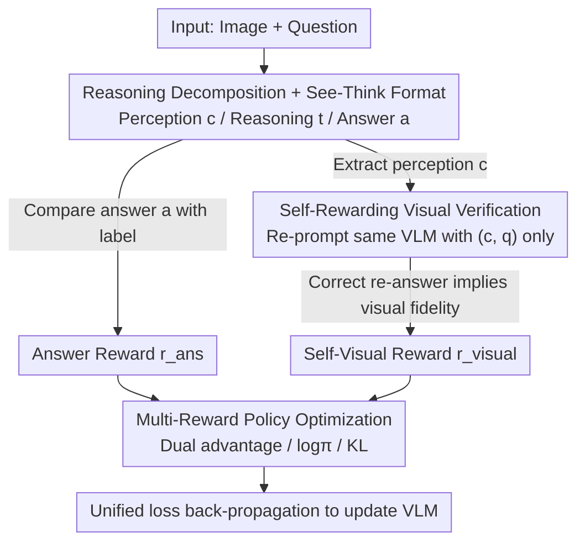

# Vision-SR1: Self-Rewarding Vision-Language Model via Reasoning Decomposition and Multi-Reward Policy Optimization

**Conference**: ICLR 2026  
**OpenReview**: [https://openreview.net/forum?id=C1M4ETatgM](https://openreview.net/forum?id=C1M4ETatgM)  
**Code**: https://github.com/zli12321/Vision-SR1  
**Area**: Multimodal VLM / LLM Reasoning / Reinforcement Learning  
**Keywords**: Visual Hallucination, Language Shortcuts, Self-Rewarding Reinforcement Learning, Reasoning Decomposition, Multi-Reward Policy Optimization

## TL;DR
Vision-SR1 decomposes VLM reasoning into two stages: "visual perception" and "linguistic reasoning." It requires the model to first generate a **self-consistent visual description** that allows answering the question even if the original image is removed. The same VLM then provides a visual reward by re-answering based solely on this description. Through decoupled multi-reward policy optimization, these two signals are back-propagated separately, mitigating visual hallucinations and suppressing "language shortcut" behaviors (guessing based on linguistic priors without looking at the image) without requiring external visual supervision or additional GPUs.

## Background & Motivation

**Background**: Current mainstream VLM post-training (especially R1-style Reinforcement Learning) almost exclusively follows the "verifiable answer matching" path—rewarding only the correctness of the final answer without providing explicit supervision for the intermediate visual reasoning process.

**Limitations of Prior Work**: This "outcome-only supervision" paradigm renders visual signals extremely sparse, causing models to learn shortcuts: either generating **visual hallucinations** (describing content non-existent in the image) or taking **language shortcuts** (bypassing the image to guess the answer via text priors). Worse, post-RL metric improvements often represent "reward hacking"—shifting the output distribution to match the test data style rather than truly learning to perceive the image.

**Key Challenge**: To supervise intermediate visual reasoning, existing methods rely on either **manual annotation** (expensive and hard to scale) or **distilling labels** from external large models (which inherits source model biases/latency and causes distribution shifts between fixed labels and evolving policies). Both paths are constrained by "dependency on external supervision."

**Goal**: Provide an explicit, self-verifiable reward signal for intermediate visual reasoning in VLMs without introducing external visual supervision or increasing GPU requirements.

**Key Insight**: The authors observe that if a visual description truly "understands the image," it should be **self-consistent**: removing the original image and relying solely on that text description plus the question should suffice to derive the correct answer. This transforms the difficult task of "evaluating visual reasoning quality" into a self-verifiable proxy task.

**Core Idea**: Decompose VLM reasoning into "self-consistent visual perception + linguistic reasoning," using the same model to self-generate a visual reward via "re-answering from description," and then back-propagate visual and answer rewards separately via decoupled multi-reward policy optimization.

## Method

### Overall Architecture
Vision-SR1 is built upon GRPO and constitutes a three-stage self-rewarding reinforcement learning framework. One training step involves two rollouts of the **same VLM** and one target optimization. The first is a standard rollout: the model receives (Image, Question) and produces a structured output consisting of three segments: `<visual reasoning>` (perception), `<think>` (linguistic reasoning), and `<answer>` (final output). The answer is compared against the ground truth to provide an **answer reward**. The second is a self-rewarding rollout: the image is removed, and the same (frozen) model is re-prompted with only the generated perception `c` and question `q`. If it still answers correctly, the perception is deemed "self-consistent/visually faithful," and a **self-visual reward** is granted. Finally, both rewards are used to calculate separate advantages, log probabilities, and KL penalties, combined into a unified multi-reward loss. This process requires no external reward models, adds only 10–20% overhead over standard GRPO, and occupies no extra GPUs.

### Key Designs

**1. Reasoning Decomposition + See-Think Structured Format: Separating "Seeing" from "Thinking"**

The root problem is that the standard paradigm entangles visual and linguistic reasoning within a single CoT, where stronger LLM backbones dominate and crowd out the perception step. Vision-SR1 mandates a See-Think format for every response: $\langle\text{visual reasoning}\rangle\,c\,\|\,\langle\text{think}\rangle\,t\,\|\,\langle\text{answer}\rangle\,a$. Here, `c` must be a **self-consistent visual perception** capturing all necessary information so that subsequent reasoning `t` no longer needs to access the image. This "self-consistency" constraint is the pivot of the method: it transforms abstract reasoning quality into an operational, verifiable standard.

**2. Self-Rewarding Visual Verification: The Model as Its Own Judge**

To judge if `c` is self-consistent, the authors treat the perception as a **pure-text proxy** for the image. The same VLM verifies this by taking $(c, q)$ to produce $\hat{a}=f_\theta(c, q)$, then comparing it to the ground truth $a^*$:

$$r_{\text{visual}}(Q, c) = \mathbb{I}\left(\hat{a} = a^*\right)$$

If the model answers correctly from the description alone, `c` is rewarded. This step uses the policy model's own reasoning for self-evaluation, eliminating the need for external reward models and avoiding the overhead of hosting judges on separate GPUs or the reward hacking associated with distilling static labels.

**3. Multi-Reward Policy Optimization: Decoupling Advantage and KL**

Simply summing visual and answer rewards creates an entangled, sparse signal where the policy cannot distinguish which rollout was successful. Vision-SR1 keeps the two rollouts (answer generation and visual reasoning) **entirely separate** during the update. It caches token-level log probabilities for each, calculates separate advantages $A_{\text{ans}}^{(i)} = (r_{\text{ans}}^{(i)} - \mu_{\text{ans}})/(\sigma_{\text{ans}}+\varepsilon)$ and $A_{\text{visual}}^{(i)}$ based on GRPO's group-wise z-score, and masks them to the relevant tokens. The actor loss is a weighted sum ($\lambda_{\text{ans}}=\lambda_{\text{visual}}=0.5$):

$$\mathcal{L}_{\text{actor}} = -\frac{1}{2B}\sum_{i,t}\left[A_{\text{ans},t}^{(i)}\log\pi_\theta(a_{\text{ans},t}^{(i)}) + A_{\text{visual},t}^{(i)}\log\pi_\theta(a_{\text{visual},t}^{(i)})\right]$$

KL regularization is also applied separately with coefficients $\beta_{\text{ans}}$ and $\beta_{\text{visual}}$. This decoupling decomposes a complex multi-reward problem into two single-reward sub-problems sharing parameters, establishing clear gradient paths that allow independent optimization of perception and reasoning.

### Loss & Training
The framework utilizes Qwen2.5-VL-3B/7B and Mimo-VL-7B as base models, trained with GRPO for 200 steps. The dataset, Vision-SR1-47K (~47K sequences), spans mathematical reasoning (30.5%), scientific knowledge (30%), and general visual understanding (39.5%). During the two rollouts, the policy model is frozen, and parameters are updated only at the end using the combined loss.

## Key Experimental Results

### Main Results
Across 7 benchmarks in three categories (general understanding, math, and hallucination), Vision-SR1 consistently outperforms Vision-R1 (reproduced with identical 47K data) across all base models.

| Base Model | Method | MMMU-Pro | MMMU | MathVerse | HallusionBench | Avg. |
|------|------|----------|------|-----------|----------------|------|
| Qwen2.5-VL-3B | Zero-shot | 30.5 | 25.5 | 44.3 | 27.1 | 35.5 |
| Qwen2.5-VL-3B | Vision-R1 (47K) | 40.3 | 49.5 | 42.8 | 67.4 | 47.1 |
| Qwen2.5-VL-3B | **Vision-SR1** | 40.8 | 49.6 | 45.8 | 68.3 | **48.8** |
| Qwen2.5-VL-7B | Vision-R1 (47K) | 39.8 | 51.8 | 53.2 | 66.6 | 50.7 |
| Qwen2.5-VL-7B | **Vision-SR1** | 40.7 | 52.2 | 54.5 | 68.9 | **52.2** |
| Mimo-VL-7B | Vision-R1 (47K) | 38.7 | 47.3 | 35.3 | 74.3 | 46.0 |
| Mimo-VL-7B | **Vision-SR1** | 39.3 | 49.5 | 40.0 | 75.6 | **49.5** |

Vision-SR1 also improves spatial reasoning (OmniSpatial: 27.3 → 44.2) and robustness to language shortcuts (ViLP(LS): 45.1 → 52.6) on Qwen2.5-VL-7B.

### Ablation Study
Removing the self-visual reward (w/o self-reward) leads to an increase in the Language Shortcut Rate (LSR), confirming that visual rewards effectively suppress shortcut behavior.

| Configuration | Avg. LSR (7B) | Description |
|------|----------------|------|
| Vision-SR1 (7B) | 9.8 | Full model |
| ⊢ w/o self-reward | 10.1 | Shortcut rate increases without visual reward |
| Vision-SR1 (3B) | 9.4 | Full model |
| ⊢ w/o self-reward | 10.4 | Shortcut rate increases by ~1 point |

> LSR (Language Shortcut Rate) is defined using Gemini-2.5-flash as a judge to re-answer the question based only on the model-generated visual perception $\hat{C}$. LSR = #{Perception is inconsistent **BUT** final answer is correct} / #{Total samples}.

### Key Findings
- **Self-visual reward is key to reducing shortcuts**: Its removal consistently increases LSR, proving that explicit visual descriptions force the model to rely on visual content.
- **Redistribution of visual attention**: Post-training enhances attention on visual tokens in early layers (0–7, +10.2% at L6) and late layers (14–27, +9.2% at L20), suggesting a pattern of early feature extraction and late reintegration rather than uniform increase.
- **Efficiency is almost "free"**: Two rollouts increase time by only 10–20% compared to standard GRPO and require no additional GPUs.

## Highlights & Insights
- **Clever proxy task**: Converting unmeasurable "visual reasoning quality" into "answerability without the image" is the most insightful contribution, bypassing the need for external supervision.
- **Decoupled Advantage/KL**: Treating the problem as two single-reward sub-problems with clear gradient paths is a transferable pattern for any multi-segment output RL task (e.g., tool-use or RAG).
- **LSR as a diagnostic tool**: It quantifies whether RL is truly learning to "see" or just awakening linguistic priors, serving as a valuable probe for future VLM RL research.

## Limitations & Future Work
- **Explicit discrete tokens are costly**: Generative perception adds token overhead; future work could explore "latent thinking" to reduce token counts while maintaining attribution.
- **Self-reward ceiling**: The quality of the validation signal is bounded by the model's own capability.
- **Math gains may include "spurious effects"**: Some math improvements might stem from recalibrating the LLM backbone's output distribution rather than genuine visual grounding.

## Related Work & Insights
- **vs Vision-R1**: While Vision-R1 pioneered VLM RL with answer rewards, Vision-SR1 introduces explicit intermediate visual supervision, leading to consistently higher average scores.
- **vs Perception-R1 / Visionary-R1**: These rely on external signals (proprietary model annotations or external LLM judges). Vision-SR1 is self-contained and GPU-efficient.
- **vs Calibrated Self-Rewarding**: Unlike methods using DPO or attention-derived rewards, Vision-SR1 integrates rewards end-to-end via an integrated policy optimization design.

## Rating
- Novelty: ⭐⭐⭐⭐⭐ "Self-consistent description as a verifiable proxy" + Decoupled multi-reward optimization.
- Experimental Thoroughness: ⭐⭐⭐⭐ Extensive cross-backbone testing and shortcut analysis.
- Writing Quality: ⭐⭐⭐⭐ Strong logic from motivation to analysis.
- Value: ⭐⭐⭐⭐⭐ High practical utility due to zero external dependencies and GPU efficiency.

<!-- RELATED:START -->

## Related Papers

- [\[ICLR 2026\] Perception-Aware Policy Optimization for Multimodal Reasoning](perception-aware_policy_optimization_for_multimodal_reasoning.md)
- [\[ICML 2026\] Vision-aligned Latent Reasoning for Multi-modal Large Language Model](../../ICML2026/vlm_reasoning/vision-aligned_latent_reasoning_for_multi-modal_large_language_model.md)
- [\[ICLR 2026\] Unlocking the Essence of Beauty: Advanced Aesthetic Reasoning with Relative-Absolute Policy Optimization](unlocking_the_essence_of_beauty_advanced_aesthetic_reasoning_with_relative-absol.md)
- [\[CVPR 2026\] Unified Generation and Self-Verification for Vision-Language Models via Advantage Decoupled Preference Optimization](../../CVPR2026/vlm_reasoning/unified_generation_and_self-verification_for_vision-language_models_via_advantag.md)
- [\[ICLR 2026\] Spatial Reasoning with Vision-Language Models in Ego-Centric Multi-View Scenes](spatial_reasoning_with_vision-language_models_in_ego-centric_multi-view_scenes.md)

<!-- RELATED:END -->
