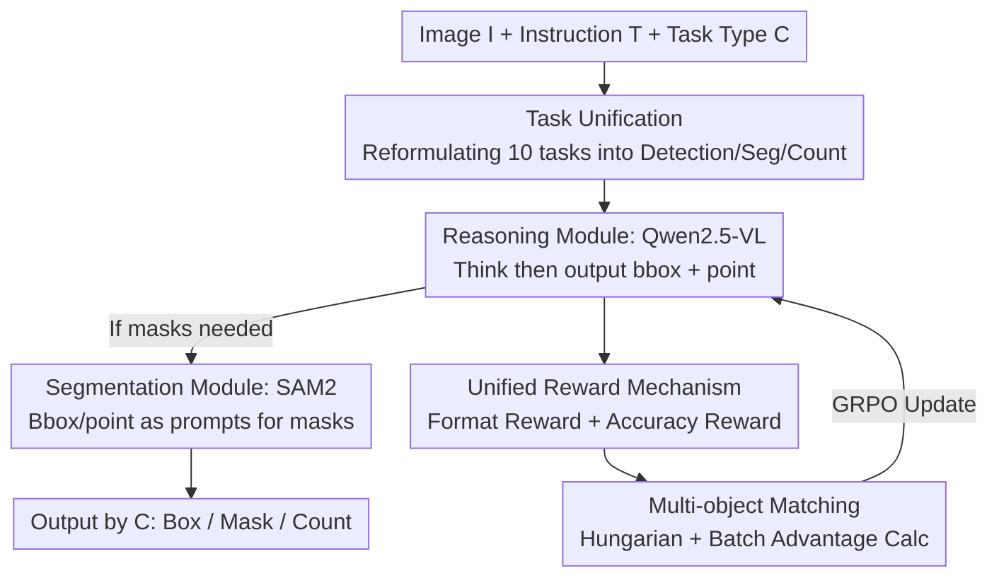

# VisionReasoner: Unified Reasoning-Integrated Visual Perception via Reinforcement Learning

**Conference**: ICLR 2026  
**OpenReview**: [https://openreview.net/forum?id=QoDOwjsbAq](https://openreview.net/forum?id=QoDOwjsbAq)  
**Code**: Yes (Paper marked Code, link available on OpenReview)  
**Area**: Multimodal VLM / LLM Reasoning  
**Keywords**: Visual Perception, Reinforcement Learning, GRPO, Multi-object Cognition, Unified Framework

## TL;DR
VisionReasoner unifies ten categories of visual perception tasks—including detection, segmentation, and counting—into a "multi-object cognition" problem. By employing a unified reward mechanism and GRPO reinforcement learning, a single Qwen2.5-VL model is trained to generate structured reasoning before outputting results. This approach achieves relative improvements of 29.1%, 22.1%, and 13.2% over baselines on COCO detection, ReasonSeg, and CountBench, respectively.

## Background & Motivation

**Background**: Large Vision-Language Models (LVLMs) have demonstrated capabilities across diverse visual tasks. Researchers have increasingly applied them to perception tasks such as visual grounding and reasoning segmentation. However, the prevailing strategy involves equipping each task with specific modules or training on separate datasets—treating detection, segmentation, and counting as isolated domains.

**Limitations of Prior Work**: On one hand, traditional visual models (e.g., YOLO-World, Grounding-DINO, DINO-X) only handle simple category queries and fail on complex, reasoning-heavy instructions (e.g., "What should I avoid if I am allergic to seafood?"). On the other hand, recent efforts to introduce reinforcement learning into LVLMs (e.g., VisualRFT, Seg-Zero) enhance reasoning but remain task-specific, training on separate datasets for different tasks, which limits scalability and generalization.

**Key Challenge**: While perception tasks appear distinct on the surface (outputting boxes, masks, or numbers), the authors observe that they share a common underlying structure: identifying multiple target objects within an image. Given this commonality, it is inefficient to rely on fragmented, specialized models.

**Goal**: To solve ten categories of tasks (including detection, segmentation, and counting) using a **single shared model** while enabling the model to produce interpretable reasoning before providing answers, without relying on human-annotated reasoning data.

**Key Insight**: Task reformulation is the starting point. The ten tasks are first rewritten into three basic types: detection, segmentation, and counting. It is then observed that all three can be transformed into a multi-object cognition problem of "predicting a set of bboxes + center points," allowing for a unified reward system and RL pipeline.

**Core Idea**: Utilize GRPO and a unified reward mechanism to train an LVLM that "reasons before localizing." This converges multi-task visual perception into multi-object bbox/point prediction and employs Hungarian matching to solve the prediction-to-ground-truth alignment difficulty in RL.

## Method

### Overall Architecture

VisionReasoner receives an image $I$, a text instruction $T$, and a task type $C \in \{\text{detection}, \text{segmentation}, \text{counting}\}$. The model consists of two sequential modules: a **Reasoning Module** (initialized with Qwen2.5-VL), which understands the image and text to generate a `<think>...</think>` process and outputs target bounding boxes $\{B_i\}_{i=1}^N$ and center points $\{P_i\}_{i=1}^N$ within `<answer>` tags; and a **Segmentation Module** (initialized with SAM2), which uses the bboxes/points as prompts to generate binary masks $\{M_i\}_{i=1}^N$ when required. The overall process is defined as $(\{B_i, M_i\})_{i=1}^N = F(I, T)$, with outputs selected based on the task type $C$.

The innovation lies in the training phase. The model is trained using GRPO: for each input, a set of rollouts is sampled and scored based on a **unified reward mechanism** (format rewards + accuracy rewards). The policy is updated using the relative advantage $A_i = \frac{r_i - \text{mean}(\{r\})}{\text{std}(\{r\})}$ within the group. Since RL calculates rewards based on boxes and points, and the model predicts multiple targets compared against multiple ground truths, a **Hungarian algorithm** with batch processing is used to find the optimal one-to-one matching for scoring.

### Key Designs

**1. Task Unification: Reducing ten perception tasks to a single multi-object cognition problem**

This design addresses the fragmentation of modeling each perception task independently. By analyzing ten tasks—including visual grounding, referring expression segmentation, reasoning segmentation, and object counting—the authors categorized them into three basic types: detection (outputting localization boxes), segmentation (detect-then-segment), and counting (detect-then-count). All share the core requirement of "identifying $N$ target objects matching the instruction." By reducing them to predicting a set of bboxes + center points, the system can leverage a single reward and RL process, enabling zero-shot expansion to new perception tasks.

**2. Unified Reward Mechanism: Balancing "correct reasoning" and "accurate localization"**

The core of RL lies in reward design. Multi-task perception requires both structured output and precise localization. The authors split rewards into two groups, both based on bboxes and points (rather than masks, as boxes/points are more computationally efficient). **Format Rewards** include: Thinking Format Reward (+1.0 for `<think>` and `<answer>` tags), Answer Format Reward (+1.0 for a strict list format), and Non-repetition Reward (+1.0 for avoiding redundant reasoning sentences). **Accuracy Rewards** include: Bbox IoU Reward (normalized by $\frac{1}{\max\{N,K\}}$ for matched boxes with IoU > 0.5), Bbox L1 Reward (for L1 distance < 10 pixels), and Points L1 Reward (for L1 distance < 30 pixels). Normalizing by $\max\{N,K\}$ rewards recall while penalizing over-prediction. Notably, the model spontaneously learns faithful reasoning without any annotated reasoning data.

**3. Multi-object Matching: Solving prediction-GT alignment via Hungarian Algorithm**

Unlike Supervised Fine-Tuning (SFT) which uses sequence-based cross-entropy, RL requires resolving the unordered multi-to-multi relationship between $K$ predicted targets and $N$ ground truths to calculate accuracy. The authors derived boxes and points from existing segmentation datasets (RefCOCOg, LISA++, etc.) and concatenated multiple object descriptions using "and." For matching, a cost matrix $C = (3 - (R_{\text{IoU}} + R_{\text{BL1}} + R_{\text{PL1}})) \in \mathbb{R}^{K \times N}$ is constructed. The Hungarian algorithm finds the optimal assignment, with total reward $r = (3|r| - \sum_t C_{r_t,c_t})/L_{\max}$. Utilizing batch calculations achieved a **4x speedup** (from $2\times10^{-3}$s to $5\times10^{-4}$s for 30 objects), making RL training feasible.

### Loss & Training
The objective function is the clipped objective of GRPO with KL regularization $\beta D_{\text{KL}}(\pi_\theta \| \pi_{\text{ref}})$. Models are initialized with Qwen2.5-VL and SAM2, using a batch size of 16 and a learning rate of 1e-6. Training utilized approximately 7k samples derived from LVIS, RefCOCOg, gRefCOCO, and LISA++.

## Key Experimental Results

### Main Results

Detection Tasks (AP / Acc, selected):

| Dataset | Metric | Qwen2.5-VL-7B | VisionReasoner-7B |
|--------|------|---------------|-------------------|
| COCO | val AP | 29.2 | **37.7** |
| RefCOCO+ | val | 82.3 | **83.6** |
| RefCOCOg | test | 85.7 | **87.5** |
| Detection Avg. | Avg. | 78.6 | **80.3** |

Segmentation and Counting Tasks (selected):

| Task | Dataset | Qwen2.5-VL-7B | VisionReasoner-7B |
|------|--------|---------------|-------------------|
| Segmentation | ReasonSeg val | 56.9 | **66.3** |
| Segmentation | ReasonSeg test | 52.1 | **63.6** |
| Segmentation | Mean | 67.7 | **71.0** |
| Counting | CountBench test | 78.8 | **89.2** |
| Counting | Mean | 63.6 | **76.7** |

The single unified model outperforms the Qwen2.5-VL baseline across the board and even exceeds specialized models like Seg-Zero-7B on segmentation (57.5 vs 63.6 on test).

### Ablation Study

| Configuration | ReasonSeg-val | RefCOCOg-val / Det | Description |
|------|---------------|---------------------|------|
| Full (4 datasets) | 66.3 | 86.1 | Full model |
| RefCOCOg only | 61.9 | 84.1 | Single dataset |
| w/o reasoning | 60.1 (test) | - | Outperforms baseline but drops on reasoning-heavy tasks |
| w/o non-repeat reward | 61.4 (RefCOCOg) | - | Performance drop and verbose reasoning |
| Baseline (no RL) | 52.1 (test) | - | Starting point |

### Key Findings
- **Reasoning is Utility-driven and Adaptive**: The model gains the most on complex tasks like ReasonSeg. Reasoning length adjusts dynamically based on query complexity (62 words for simple categories vs. 71 words for reasoning-dense tasks).
- **Non-repetition Reward Gains**: This reward improves both accuracy and efficiency by removing redundant patterns.
- **Over-sampling Risk**: Performance increases then decreases as the sampling number grows, suggesting excessive sampling lead to overfitting the training distribution.
- **VQA Performance Retention**: Even without VQA training, VisionReasoner slightly outperforms baselines on ChartQA/MMMU, indicating that unified perception training does not damage general conversational abilities.
- **RL Robustness**: Both GRPO and DAPO provide stable gains, showing that the framework is agnostic to the specific RL algorithm.

## Highlights & Insights
- **Elegance of Task Reformulation**: Reducing ten heterogeneous tasks to "multi-object bbox+point prediction" serves as the foundation for using a single model and reward mechanism.
- **Emergent Reasoning via Outcome Supervision**: The model generates faithful reasoning processes solely through format and non-repetition rewards, confirming the "outcome-supervised reasoning induction" paradigm for visual perception.
- **Efficient Multi-target Alignment**: Integrating Hungarian matching into RL reward calculations with batch processing addresses the multi-object alignment bottleneck in RL.
- **Highly Sample Efficient**: Achieving strong multi-task generalization with only 7k samples highlights the efficiency of RL in perception tasks.

## Limitations & Future Work
- **Detection Metric Limitations**: Since LVLMs lack confidence scores, box area is used as a proxy, resulting in lower COCO AP compared to specialized models (e.g., DQ-DETR's 50.2).
- **SAM2 Dependency**: Segmentation quality is capped by the detect-then-segment paradigm; if the box prediction is inaccurate, the mask cannot be recovered.
- **Manual Task Specification**: Inference still requires the user to specify the task type $C$.
- **Sampling-Generalization Trade-off**: An adaptive solution for selecting the optimal sampling number is yet to be proposed.

## Related Work & Insights
- **Vs. Seg-Zero**: Seg-Zero is limited to segmentation; VisionReasoner unifies ten tasks and surpasses Seg-Zero in segmentation metrics.
- **Vs. VisualRFT**: VisualRFT is task-specific, whereas VisionReasoner emphasizes a single shared model for all tasks.
- **Vs. Kosmos**: While Kosmos uses autoregressive cross-entropy for alignment, VisionReasoner uses Hungarian matching within an RL framework to avoid sequence-order assumptions.

## Rating
- Novelty: ⭐⭐⭐⭐ The combination of task reformulation, unified rewards, and Hungarian matching in RL makes a clear contribution to visual perception unification.
- Experimental Thoroughness: ⭐⭐⭐⭐⭐ Comprehensive coverage across ten tasks, detailed ablations, VQA benchmarks, and human evaluation.
- Writing Quality: ⭐⭐⭐⭐ Clear structure and logical motivation; minor inconsistencies in naming (ReasonPerceiver vs VisionReasoner) in some charts.
- Value: ⭐⭐⭐⭐ Provides a reproducible, sample-efficient RL approach for unifying visual perception in a single model.

<!-- RELATED:START -->

## Related Papers

- [\[ICLR 2026\] MedVR: Annotation-Free Medical Visual Reasoning via Agentic Reinforcement Learning](medvr_annotation-free_medical_visual_reasoning_via_agentic_reinforcement_learnin.md)
- [\[ICLR 2026\] ReVisual-R1: Advancing Multimodal Reasoning from Optimized Cold Start to Staged Reinforcement Learning](revisual-r1_advancing_multimodal_reasoning_from_optimized_cold_start_to_staged_r.md)
- [\[ICLR 2026\] DeepEyes: Incentivizing "Thinking with Images" via Reinforcement Learning](deepeyes_incentivizing_thinking_with_images_via_reinforcement_learning.md)
- [\[ICLR 2026\] Perception-R1: Advancing Multimodal Reasoning Capabilities of MLLMs via Visual Perception Reward](perception-r1_advancing_multimodal_reasoning_capabilities_of_mllms_via_visual_pe.md)
- [\[ICML 2026\] iVGR: Internalizing Visually Grounded Reasoning for MLLMs with Reinforcement Learning](../../ICML2026/vlm_reasoning/ivgr_internalizing_visually_grounded_reasoning_for_mllms_with_reinforcement_lear.md)

<!-- RELATED:END -->
