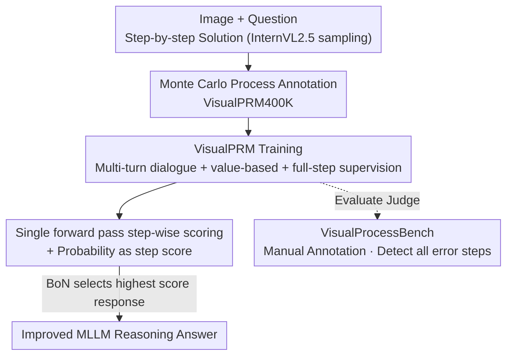

# VisualPRM400K: An Effective Dataset for Training Multimodal Process Reward Models

**Conference**: ICLR 2026  
**OpenReview**: [https://openreview.net/forum?id=IHyY6vdYZw](https://openreview.net/forum?id=IHyY6vdYZw)  
**Code**: Models, data, and benchmarks are promised to be open-source (declared as "will be released" in the paper)  
**Area**: Multimodal VLM / LLM Reasoning  
**Keywords**: Multimodal Process Reward Model, Test-Time Scaling, Best-of-N, Monte Carlo Annotation, Process Supervision Benchmark

## TL;DR
The authors constructed VisualPRM400K, the first multimodal process supervision dataset with approximately 400,000 samples, using a Monte Carlo automatic annotation pipeline. An 8B multimodal process reward model (PRM), named VisualPRM, was trained as a "judge" for Best-of-N evaluation. This model consistently improves the reasoning capabilities of various MLLM families and scales (e.g., a +5.9 point gain for a 78B model across seven reasoning benchmarks). Additionally, a manually annotated process evaluation benchmark, VisualProcessBench, was released.

## Background & Motivation
**Background**: Test-Time Scaling (TTS) is a crucial method for enhancing large model reasoning—allowing a policy model to sample $N$ candidate answers and using a "critic model" to select the best one (Best-of-N, BoN). While this approach is proven effective for text-only LLMs, it remains largely unexplored for Multimodal Large Language Models (MLLMs).

**Limitations of Prior Work**: Adapting TTS to MLLMs faces two primary bottlenecks. First is the **lack of effective judge models**: existing open-source MLLMs perform poorly as critics in BoN setups because their training corpora contain almost no critic data, leading them to judge nearly all steps as "correct." Second is the **lack of benchmarks for judging the judge**: using BoN to evaluate a critic is both computationally expensive (requiring $N$ full reasoning paths from a policy model) and unfair (BoN results are heavily influenced by the policy model, preventing horizontal comparisons of critics).

**Key Challenge**: The process-level judging capability of MLLMs has not been specifically trained—there is a lack of both step-by-step supervision data for training and clean benchmarks for quantifying a critic's ability to detect process errors.

**Goal**: (1) Generate multimodal process supervision data to train a functional multimodal PRM; (2) Create a benchmark that independently measures a critic's ability to detect process errors.

**Key Insight**: Existing works in the text domain like MathShepherd or OmegaPRM use Monte Carlo sampling to automatically estimate the "expected accuracy" of each step, avoiding the prohibitive costs of purely manual annotation seen in PRM800K. The authors migrated this automated pipeline to the multimodal domain and supplemented it with a high-quality, manually annotated evaluation benchmark.

**Core Idea**: Build VisualPRM400K by automatically assigning "expected accuracy" labels via Monte Carlo sampling. Model process judging as step-by-step correctness prediction in a multi-turn dialogue to train VisualPRM, which serves as a BoN judge for selecting optimal MLLM reasoning.

## Method

### Overall Architecture
The work revolves around a "Data → Model → Benchmark" triad: an automated pipeline first annotates image-question-solution sets with step-by-step correctness to create the VisualPRM400K training set. Process judging is then modeled as a multi-turn dialogue, training the 8B VisualPRM to predict correctness at each step. During inference, VisualPRM scores candidate responses in a single forward pass to select the best answer in a Best-of-N setup. Finally, VisualProcessBench, which is manually annotated, independently evaluates the process-level error detection capabilities of various judges (including VisualPRM and off-the-shelf MLLMs).

### Key Designs

**1. VisualPRM400K: Automatic Estimation of Expected Accuracy via Monte Carlo Sampling**

The primary obstacle for PRM training is the cost of process annotation. The authors adopted the approach from MathShepherd, converting the question of "Is this step correct?" into "What is the probability of reaching a correct final answer by sampling from this step onwards?" Specifically, given an image $I$, a question $q$, and a prefix $s_{\le i}$, the model samples multiple completions $\tilde{s}_{>i} \sim M(\tilde{s}_{>i} \mid I, q, s_{\le i})$. The expected accuracy of step $i$ is defined as the ratio of correct completions:

$$mc_i = \frac{\text{num(correct completions)}}{\text{num(sampled completions)}}$$

A step is considered correct if $mc_i > 0$. In the pipeline, 4 solutions were sampled per image-question pair, each truncated to at most 12 steps, with 16 completions sampled per step to calculate $mc_i$. This resulted in ~400k samples and 2 million steps with process supervision. Roughly 10% of the steps are incorrect. This allows for large-scale production of multimodal process supervision data without manual per-step labeling.

**2. VisualPRM Modeling: Multi-turn Dialogue + Value-based + Full-step Supervision**

The authors modeled process judging as a **multi-turn dialogue** task to reuse the generative capabilities of MLLMs. The first turn includes the image, question, and the first step $s_0$, with subsequent turns appending new steps. The model predicts the quality $y_i \sim M(y_i \mid I, q, s_{\le i})$ at each turn. Two specific choices were made:
- **Value-based modeling**: The model outputs discrete tokens $\{+, -\}$ (where $+$ denotes $mc_i > 0$), similar to a value function in reinforcement learning. Ablations showed this outperformed advantage-based modeling (predicting $\{+, =, -\}$ for $mc_i - mc_{i-1}$), likely because judging absolute correctness is more robust to noise in automatic labels than judging incremental improvements.
- **Full-step supervision**: Unlike prior works that stop supervision at the first error, VisualPRM supervises all steps. This proved more effective, aligning with the "self-correction" behavior of modern models.

**3. Single Forward Pass Scoring: Aggregating Step Quality into Response Scores**

To make candidate responses comparable, VisualPRM defines each step's score as the **weighted sum of discrete token generation probabilities**. For value-based modeling, weights for $\{+, -\}$ are $\{1, 0\}$, making the step score approximately the probability of the "+" token. The response score is the **average** of its step scores. This is engineering-efficient: VisualPRM uses a "+" as a placeholder, allowing it to extract all step probabilities in one forward pass, whereas standard MLLM judges must autoregressively generate judgments for every step, which is slow and prone to positive bias.

**4. VisualProcessBench: A Manual Benchmark for Detecting "All" Error Steps**

To independently measure process judging capability, the authors built VisualProcessBench. Questions were collected from MMMU, MathVision, etc., and solutions were generated by multiple leading MLLMs (GPT-4o, InternVL2.5, etc.). Human experts assigned positive/negative/neutral labels to each step. It contains 2,866 samples and 26,950 step labels. Unlike benchmarks that only require finding the *first* error, this requires models to **identify all error steps** in a solution. Evaluation is based on **macro F1** to account for the imbalance between correct and incorrect steps.

### Loss & Training
Training utilizes standard language modeling supervision on the predicted discrete tokens within the multi-turn dialogue framework. Supervision covers all steps without early stopping or threshold filtering.

## Key Experimental Results

### Main Results
Using VisualPRM as a BoN judge (N=8, temperature 0.7) consistently improved various MLLMs across seven benchmarks:

| Policy Model | Pass@1 (Overall) | +VisualPRM | Gain |
|--------|------|------|------|
| MiniCPM-V2.6-8B | 29.5 | 37.5 | +8.0 |
| Qwen2.5-VL-7B | 41.4 | 45.1 | +3.7 |
| InternVL2.5-8B | 32.8 | 41.2 | +8.4 |
| InternVL2.5-26B | 36.9 | 45.8 | +8.9 |
| InternVL2.5-38B | 44.4 | 50.7 | +6.3 |
| InternVL2.5-78B | 46.0 | 51.9 | +5.9 |

On VisualProcessBench, the 8B VisualPRM outperformed several proprietary models:

| Model | Overall macro F1 | Notes |
|------|------|------|
| InternVL2.5-8B | 48.0 | Off-the-shelf MLLM is near random |
| GPT-4o | 60.3 | Proprietary |
| Gemini-2.0-Flash | 62.3 | Proprietary |
| **VisualPRM-8B (ours)** | **62.0** | Surpasses GPT-4o, matches Gemini-2.0-Flash |

### Ablation Study

| Configuration | BoN (InternVL2.5-8B) | VL-ProcessBench | Notes |
|------|------|------|------|
| Pass@1 | 32.8 | - | Baseline |
| Advantage-based (+Average) | 37.4 | 55.0 | Advantage modeling |
| Value w. early stop (+Average) | 40.6 | 61.6 | Supervision only to first error |
| Value w/o early stop (+Average) | **41.1** | **62.0** | Full-step supervision (Best) |

### Key Findings
- **PRM > ORM > SC**: PRM consistently outperforms Outcome Reward Models and Self-Consistency, with the gap widening as $N$ increases (reaching 3.1-4.3 points at $N=128$).
- **Value-based > Advantage-based**: Direct correctness judging is more stable than incremental judging when using noisy automatic labels.
- **Aggregation Strategy**: Average or Minimum pooling significantly outperforms Maximum pooling. Errors often occur in the middle of a solution, while the start often has a high-score step that misleads "Max" pooling.
- **Text Generality**: VisualPRM also improves text-only reasoning for the Qwen2.5 series (e.g., +6.1/2.1 on MATH-500).

## Highlights & Insights
- **Turning "Process Judging" into Multi-turn Dialogue with Placeholders**: This design reuses MLLM capabilities for training while enabling single-forward-pass inference, bypassing the speed and bias issues of autoregressive judging.
- **Strategic Resource Allocation**: By using cheap Monte Carlo sampling for the massive training set and expensive human experts for the evaluation benchmark, the authors maximized the impact of their labeling budget.
- **Improved Benchmark Design**: Transitioning from "find the first error" to "detect all errors" and using macro F1 provides a more robust measure of process judging in the era of self-correcting models.
- **Counter-intuitive Value vs. Advantage finding**: Despite advantage modeling providing finer information, value-based modeling is superior under noisy labels—a useful insight for future process supervision research.

## Limitations & Future Work
- **Significant Data Imbalance**: Only 10% of steps are negative; future work could focus on active sampling of difficult/incorrect steps.
- **Reliance on MC Label Quality**: The noise in $mc_i$ inherently caps the PRM's potential.
- **Sampling Cost**: While cheaper than humans, sampling 16 completions per step for 400k samples still requires significant compute.

## Related Work & Insights
- **Compared to MathShepherd / OmegaPRM**: Extends automated process supervision to the multimodal domain.
- **Compared to PRM800K**: Offers a scalable alternative to extremely high-cost manual process annotation.
- **Compared to ProcessBench**: Introduces a multimodal benchmark that requires identifying all errors rather than just the first one.

## Rating
- Novelty: ⭐⭐⭐⭐ 
- Experimental Thoroughness: ⭐⭐⭐⭐⭐ 
- Writing Quality: ⭐⭐⭐⭐ 
- Value: ⭐⭐⭐⭐⭐ 

<!-- RELATED:START -->

## Related Papers

- [\[CVPR 2026\] Improving Vision-language Models with Perception-centric Process Reward Models](../../CVPR2026/vlm_reasoning/improving_vision-language_models_with_perception-centric_process_reward_models.md)
- [\[CVPR 2026\] Hierarchical Process Reward Models are Symbolic Vision Learners](../../CVPR2026/vlm_reasoning/hierarchical_process_reward_models_are_symbolic_vision_learners.md)
- [\[ICLR 2026\] Perception-R1: Advancing Multimodal Reasoning Capabilities of MLLMs via Visual Perception Reward](perception-r1_advancing_multimodal_reasoning_capabilities_of_mllms_via_visual_pe.md)
- [\[ICLR 2026\] No Labels, No Problem: Training Visual Reasoners with Multimodal Verifiers](no_labels_no_problem_training_visual_reasoners_with_multimodal_verifiers.md)
- [\[ICLR 2026\] SophiaVL-R1: Reinforcing MLLMs Reasoning with Thinking Reward](sophiavl-r1_reinforcing_mllms_reasoning_with_thinking_reward.md)

<!-- RELATED:END -->
