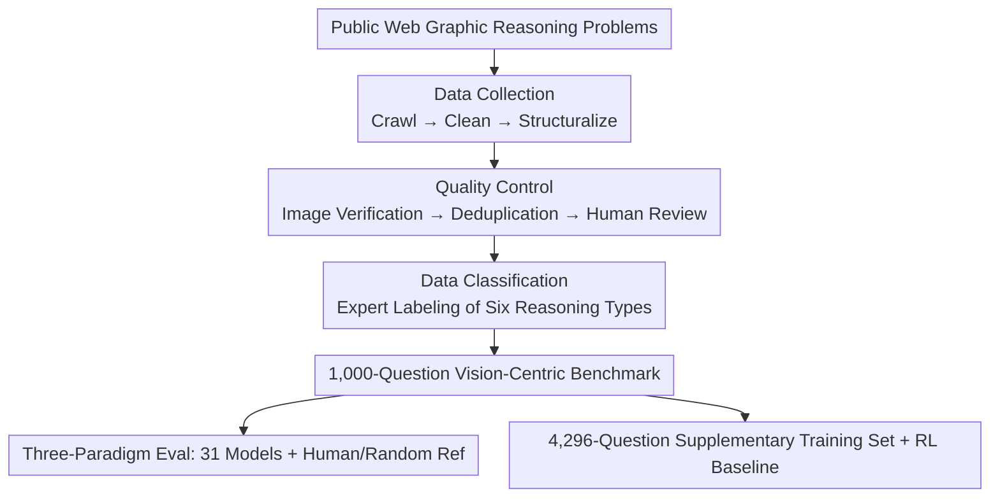

# VisuLogic: A Benchmark for Evaluating Visual Reasoning Capabilities of Multimodal Large Models

**Conference**: ICLR 2026  
**OpenReview**: [https://openreview.net/forum?id=mXuzDDVXxi](https://openreview.net/forum?id=mXuzDDVXxi)  
**Code**: https://visulogic-benchmark.github.io/VisuLogic  
**Area**: Multimodal VLM / LLM Reasoning  
**Keywords**: Visual Reasoning, Evaluation Benchmark, Multimodal Large Model, Language Shortcut, Reinforcement Learning

## TL;DR
VisuLogic constructs a 1,000-question, human-verified, pure visual logic reasoning benchmark across six categories. It deliberately blocks "language shortcuts" where images are converted to text for reasoning. Results show most top Multimodal Large Models (MLLMs) achieve an accuracy under 30% (barely above the 25% random baseline and far below the human 51.4%). A supplementary training set and a reinforcement learning baseline are also provided.

## Background & Motivation

**Background**: As the reasoning capabilities of LLMs in mathematics, code, and logic rapidly improve (via CoT prompting and test-time scaling like o1/DeepSeek-R1), transferring these techniques to MLLMs to enhance multimodal reasoning via reinforcement learning has become a hot topic. Early works like R1-Onevision, MM-EUREKA, and VLM-R1 have emerged.

**Limitations of Prior Work**: These works generally rely on existing multimodal benchmarks to measure "visual reasoning," but these benchmarks often fail to truly test vision-centric reasoning. For instance, VLM-R1 uses referring expression comprehension, which primarily tests basic perception like object localization. In benchmarks like MathVista, MathVerse, and MathVision, models often translate visual cues into text descriptions, causing visual reasoning to degenerate into pure language reasoning.

**Key Challenge**: The fundamental issue is that existing benchmarks do not decouple "visual reasoning" from "textual reasoning." If a SOTA MLLM can solve a problem by simply describing the image and passing it to a text-only LLM, the task does not test visual reasoning. An intuitive comparison illustrates this: on MMMU, once GPT-4o describes a geometric figure, a text-only LLM can calculate the area (as the description preserves key information). However, on VisuLogic, even SOTA MLLMs fail to describe key visual cues like symmetry or rotation accurately, losing information critical for the answer.

**Goal**: To construct a benchmark that explicitly focuses on vision-centric reasoning and blocks language shortcuts, and to systematically analyze where current models fail and the extent of their performance gap.

**Key Insight**: Starting from the "core of human visual intelligence," the authors collect graphical reasoning problems (similar to figure-based logic problems in civil service exams). These problems naturally require logical deduction on images and are difficult to describe fully in text.

**Core Idea**: Construct a rigorous evaluation benchmark with 1,000 human-verified, pure visual logic problems covering six major categories: Quantity, Spatiality, Position, Attribute, Style, and Other. This benchmark aims to expose the visual reasoning weaknesses of MLLMs where language shortcuts are ineffective.

## Method

### Overall Architecture

VisuLogic is a comprehensive benchmark engineering suite comprising "construction + evaluation + boosting." It uses a three-stage automated pipeline to collect problems from public web resources, followed by strict quality control and expert classification to yield 1,000 multiple-choice visual logic problems (with nearly uniform distribution across labels A-D). It evaluates 31 models (8 LLMs + 23 MLLMs) using three prompting paradigms (Non-CoT / CoT / Hint). Human performance (100 graduate students) and a random baseline are used for reference. Additionally, it providing a 4,296-question supplementary training set and an RLOO-based reinforcement learning baseline for future research.

The data construction stage follows a serial pipeline, illustrated below:

### Key Designs

**1. Vision-Centric Reasoning Categories: Blocking Language Shortcuts via "Information Loss in Description"**

This design targets the pain point where models "convert images to text to solve problems." Every problem requires logical deduction at the image level rather than recognizing text or objects. All problems were expert-labeled into six categories: **Quantity** (changes and arithmetic relationships in elements like points/lines/angles, 35.3%), **Spatiality** (3D reconstruction from 2D, folding/unfolding, 23.1%), **Position** (element-preserving transformations like translation/rotation/flipping, 13.6%), **Attribute** (intrinsic properties like symmetry, curvature, open/closed, 8.2%), **Style** (addition/subtraction of shapes, similarities/differences, 9.0%), and **Other** (including letters/numbers/symbols, 10.8%).

These shortcuts are blocked because visual cues like axes of symmetry or rotation angles are **difficult to describe losslessly in text**. The authors demonstrate that GPT-4o's descriptions of the same VisuLogic problem are contradictory and omit critical symmetry information. Empirically, feeding detailed text descriptions to text-only LLMs (Doubao-1.5-Pro, Claude-3.7-Sonnet, Qwen2.5-72B) results in accuracies (26.6% / 25.9% / 28.0%) barely above the 24.9% random baseline.

**2. Three-Stage Data Construction Pipeline: Ensuring Scale, Purity, and Consistency**

The pipeline includes **Collection**, using Playwright to crawl web content and custom scripts to extract question-answer pairs while removing HTML noise. **Quality Control** involves three gates: Image Verification (ensuring format and existence), Deduplication (text overlap detection and image pHash similarity), and Human Review (manual verification of each remaining entry). **Classification** involves expert labeling and redundant manual auditing. The final 1,000-question set has a nearly uniform answer distribution: A (23.1%), B (26.7%), C (25.2%), and D (25.0%).

**3. Three Prompting Protocols and Hint Probe: Distinguishing Capability from Activation**

To distinguish whether a model lacks the capability or simply hasn't been activated, the benchmark uses: **Non-CoT** (direct `\boxed{$LETTER}`), **CoT** (step-by-step reasoning), and **Hint** (GPT-4o-generated solution hints that do not reveal the answer). The Hint probe is significant: human accuracy jumps from 51.4% to 83.6% with hints, showing the problems are manageable for "guided" solvers. However, MLLMs still fail to surpass 50% with hints, identifying the bottleneck as the **capability to construct reliable reasoning chains**, rather than a lack of direction.

**4. Supplementary Training Set + RLOO RL Baseline: Providing a Reproducible Path for Improvement**

The authors provide a 4,296-question supplementary training set with a similar distribution to the benchmark. They offer a reinforcement learning baseline using **RLOO (REINFORCE Leave-One-Out)**, chosen for its low computational overhead and robustness. The reward function follows a rule-based approach: **Format Reward** (reasoning in `<think></think>` and answer in `<answer></answer>`) and **Accuracy Reward** (matching the correct option). Experiments on Qwen2.5-VL-7B and InternVL2.5-38B use SFT as a control to isolate RL gains.

## Key Experimental Results

### Main Results

31 models (8 LLMs + 23 MLLMs) were evaluated, primarily using CoT prompts. Nearly all models struggled near the random baseline, showing a massive gap compared to humans.

| Category | Representative Model | Overall Accuracy | Comparison |
| :--- | :--- | :--- | :--- |
| Human Ref | 100 Graduate Students | 51.4% | — |
| Random Baseline | Uniform Guessing | 24.9% | — |
| Best LLM (Desc → LLM) | Qwen2.5-72B-Instruct | 28.0% | +3.1 vs random |
| Best Closed-Source MLLM | OpenAI-o3 | 29.5% | -21.9 vs human |
| Mainstream Closed MLLM | GPT-4o | 26.3% | Near random |
| Best Open-Source MLLM | InternVL3-78B | 27.7% | Behind o3 |
| Highest in Table | Doubao-1.6-Vision | 34.9% | -16.5 vs human |

Even the strongest MLLM (o3) reached only 29.5%. GPT-4o and Gemini-2.0-Pro scored 26.3% and 28.0% respectively, exposing severe weaknesses in visual reasoning.

### Ablation Study

**CoT is Largely Ineffective**: Contrary to the expectation that CoT improves reasoning, gains were minimal. GPT-4o-mini improved by only 1.2 points, and most other models saw gains under 1.0 point. This suggests text-based CoT training may not transfer effectively to multimodal visual reasoning.

| Model | Non-CoT | CoT | Change |
| :--- | :--- | :--- | :--- |
| GPT-4o | 26.0% | 26.3% | ≈ Flat |
| GPT-4o-mini | 23.1% | 24.3% | +1.2 |
| Qwen2.5-VL-7B | 25.9% | 26.0% | ≈ Flat |

**Hint Gains are Limited**: While models like Claude-3.7-Sonnet and Doubao-1.5-Vision-Pro improved by over 8 points with hints, no MLLM crossed the 50.0% mark (Humans: 83.6%). This indicates that scaling data alone won't suffice; the focus must shift to the reliability of the reasoning process.

**Scale and Open-Source Performance**: Larger models in the same series performed slightly better (InternVL2.5-78B at 27.3% vs. 38B at 25.5%), but gains were small. The best open-source model (InternVL3-78B, 27.7%) still lagged behind the best closed-source model (o3, 29.5%).

**RL Baseline Effect**: After rule-based RLOO training, Qwen2.5-VL-7B-RL reached 28.0% (+2.0 points) and InternVL2.5-38B-RL reached 31.1% (+5.6 points, setting a new benchmark record). These gains outperformed SFT on the same dataset, validating the potential of RL in multimodal visual reasoning.

## Key Findings
Failure analysis shows that while MLLMs can describe static visual content, they fail to infer relationships across sequences. They often rely on superficial cues like counting shapes but fail to model how elements evolve. Once the reasoning process diverges from the correct path, models suffer from hallucinations or irrelevant outputs. Hint analysis showed that gains were concentrated in Attribute, Quantity, and Other, while Position and Style occasionally regressed.

## Highlights & Insights
The primary value of this work lies in decoupling "visual reasoning" from "image-to-text reasoning." It uses a sharp counter-example (can a text-only LLM solve the description?) as a criterion for benchmark design. This exposes the boundaries of current MLLMs, which drop to random baseline levels when language shortcuts are blocked. Limitations include the focus on graphical logic problems (resembling civil service exams) rather than open-world visual reasoning, and the potential risk of data contamination as problems were sourced from public web repositories.

<!-- RELATED:START -->

## Related Papers

- [\[ICLR 2026\] Play to Generalize: Learning to Reason Through Game Play](play_to_generalize_learning_to_reason_through_game_play.md)
- [\[ICLR 2026\] LENS: Multi-level Evaluation of Multimodal Reasoning with Large Language Models](lens_multi-level_evaluation_of_multimodal_reasoning_with_large_language_models.md)
- [\[ICLR 2026\] Mixture-of-Visual-Thoughts: Exploring Context-Adaptive Reasoning Mode Selection for General Visual Reasoning](mixture-of-visual-thoughts_exploring_context-adaptive_reasoning_mode_selection_f.md)
- [\[ICLR 2026\] MedVR: Annotation-Free Medical Visual Reasoning via Agentic Reinforcement Learning](medvr_annotation-free_medical_visual_reasoning_via_agentic_reinforcement_learnin.md)
- [\[ICLR 2026\] Reasoning-Driven Multimodal LLM for Domain Generalization](reasoning-driven_multimodal_llm_for_domain_generalization.md)

<!-- RELATED:END -->
