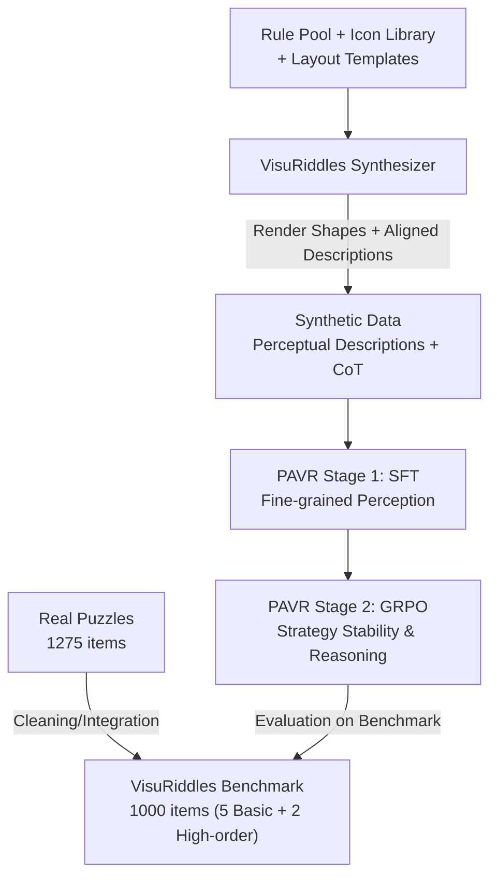

# VisuRiddles: Fine-Grained Perception is a Primary Bottleneck for Multimodal Large Language Models in Abstract Visual Reasoning

**Conference**: ICLR 2026  
**OpenReview**: [https://openreview.net/forum?id=fGRwRnDVMX](https://openreview.net/forum?id=fGRwRnDVMX)  
**Code**: https://github.com/yh-hust/VisuRiddles (Available)  
**Area**: Multimodal VLM / LLM Reasoning  
**Keywords**: Abstract Visual Reasoning, Fine-grained Perception, Visual Riddle Benchmark, Data Synthesis, Reinforcement Learning

## TL;DR
Using a real-world riddle benchmark (VisuRiddles) and a synthesizer with structured perceptual descriptions, this paper systematically proves that the root cause of Multimodal Large Language Models (MLLMs) failing in Abstract Visual Reasoning (AVR) is **lack of fine-grained perception** rather than weak reasoning ability. Based on this, it proposes the "SFT for perception, then GRPO for reasoning" two-stage training paradigm (PAVR), enabling a 7B model to outperform commercial models like GPT-5 and Gemini-2.5-Pro in AVR tasks.

## Background & Motivation
**Background**: MLLMs have made rapid progress in general visual understanding and mathematical reasoning over the past two years. The mainstream improvement path involves scaling parameters, adding CoT prompting, and implementing inference-time scaling ("think" mode), which have proven effective on many benchmarks.

**Limitations of Prior Work**: When it comes to Abstract Visual Reasoning (AVR)—intellectual puzzles where humans find patterns in abstract shapes to select the next item—even the strongest models fail. Even Gemini-2.5-Pro often achieves accuracy close to random guessing, significantly below the human level of ~62%. Surprisingly, these puzzles are not inherently difficult for humans.

**Key Challenge**: The paper decomposes the difficulty of AVR into two parts—fine-grained perception and logical reasoning. Current academic efforts are almost entirely focused on "reasoning enhancement," while severely neglecting the ability to "perceive subtle visual structures like positions, styles, and attributes in abstract shapes." A key observation confirms this: when abstract shapes are **manually rewritten into structured perceptual descriptions** (e.g., "3×3 grid, 8 triangular sectors per grid, sectors 2/3/6/8 filled black") and fed to the model, previously failed problems are solved immediately. This suggests the bottleneck is not "failing to reason" but "failing to see."

**Goal**: (1) Create a benchmark that objectively evaluates AVR capabilities without relying on external knowledge; (2) Address the lack of intermediate perceptual annotations in existing datasets to provide explicit supervision; (3) Design a training scheme to improve both perception and reasoning.

**Key Insight**: Since perception is the neglected bottleneck, it should be improved first as a foundation for optimizing reasoning—"see clearly before thinking correctly."

**Core Idea**: Use a synthesizer to automatically generate "abstract shapes + aligned structured perceptual descriptions + CoT reasoning chains." Fine-grained perception is injected into the model via SFT, followed by GRPO reinforcement learning to stabilize perceptual strategy selection and enhance reasoning, resulting in the Perception-Augmented Visual Reasoner (PAVR).

## Method

### Overall Architecture
The work consists of two main components: a resource called **VisuRiddles** (Benchmark for evaluation + Synthesizer for training) and a two-stage training paradigm, **PAVR**, built upon it. The Benchmark objectively measures AVR shortcomings, the Synthesizer generates training problems with perceptual labels, and PAVR applies this synthetic data to SFT and RL for evaluation on the benchmark.

The data flow is unidirectional: real puzzles are cleaned into the Benchmark; the Synthesizer renders abstract shapes from a "rule pool + icon library + layout templates" and outputs aligned perceptual descriptions, followed by CoT chains via API labeling. This synthetic data is used for SFT to inject perception (PAVR-SFT) and then for GRPO to optimize perception anchoring and reasoning (PAVR). SFT and RL are complementary—SFT helps the model "see," while RL helps it "reason stably."

### Key Designs

**1. VisuRiddles Benchmark: Isolating "Pure Visual Logic" from Knowledge**

Existing logical reasoning benchmarks (RAVEN, MARVEL, VisuLogic, etc.) often rely on external knowledge or have limited structural complexity. VisuRiddles is derived from real-world intelligence puzzles, with 1,000 items cleaned from 1,275 expert-curated problems. It covers five basic perceptual dimensions—Numerosity, Attribute, Style, Position, Spatiality—and two high-order reasoning tasks: RAVEN (8-choice analogy) and Sudoku (open-ended symbolic output with a huge solution space). An "Other" subset includes geometric combinations and character patterns. 800 basic problems are multiple-choice with balanced options to avoid position bias, while 200 high-order problems require **exact symbolic solutions** to prevent guessing. This unified scale allows for quantitative localization of model failures.

**2. VisuRiddles Synthesizer: Providing "Aligned Perceptual Descriptions" for Supervision**

To train perception, "image → perceptual description" signals are required. Existing datasets only provide Q&A pairs, leading to black-box reasoning and weak generalization. Synthesizer circumvents this using a two-stage pipeline: **Riddles Construction** selects rules (e.g., Rotation for Position, OR/XNOR for Style), icons, and layouts to render shapes. Since the rules are known during rendering, the system **naturally generates structured perceptual descriptions** strictly aligned with the shapes. The **API Labeling** stage then calls LLMs to generate CoT chains based on these descriptions, filtered by ground truth answers. The synthesizer produces 7 categories of training samples. Reasoning difficulty in synthetic data is **intentionally kept lower** than real puzzles to focus on learning perception without interference.

**3. PAVR Two-stage Training: SFT for Perception, GRPO for Reasoning**

PAVR uses Qwen2.5-VL-7B as a base. **Stage 1 (SFT)** uses 20,000 synthetic samples for 20 epochs to teach the model to capture fine-grained visual cues. However, pure SFT suffers from unstable perceptual strategies and insufficient reasoning on hard problems. **Stage 2 (RL)** uses GRPO (Group Relative Policy Optimization) with simple rewards: Accuracy (1/0) and Format (matching the `<think>...</think><answer>...</answer>` template). GRPO uses 4,000 synthetic samples. While SFT builds the "perception foundation," GRPO stabilizes "perceptual strategy + reasoning." A "rethink" phenomenon is observed where the model corrects its own perceptual errors during the reasoning process.

### Loss & Training
SFT stage: 20K synthetic samples, 20 epochs, AdamW, batch size 16, learning rate $5 \times 10^{-7}$. GRPO stage: 4K samples, 40 epochs, learning rate $1 \times 10^{-6}$, rollout 5, KL loss coefficient 0.01, CLIP Ratio 1.0. Reward $R = R_{\text{answer}} + R_{\text{format}}$, where answer reward is 0/1 and format reward constrains the template. Training conducted on 8×A800 80G.

## Key Experimental Results

### Main Results
On VisuRiddles, the 7B PAVR outperforms much larger open-source and commercial models (superscripts indicate number of options; Sudo is open solution space):

| Model | Params | Num | Styl | Attr | Posit | Spat | Sudo | Rav | Other | Avg |
|------|------|-----|------|------|-------|------|------|-----|-------|-----|
| Human | - | 61.3 | 60.9 | 67.5 | 67.9 | 58.8 | - | - | 61.9 | - |
| Qwen2.5VL-72B | 72B | 23.6 | 23.1 | 19.6 | 30.2 | 26.9 | 0.0 | 62.0 | 23.9 | 25.9 |
| Gemini2.5-pro | - | 31.6 | 31.6 | 48.5 | 26.1 | 30.1 | 39.0 | 30.0 | 44.9 | 33.9 |
| GPT-5 | - | 30.8 | 30.8 | 38.1 | 32.4 | 30.8 | 2.0 | 29.0 | 31.9 | 28.7 |
| Qwen3-VL-235B-Thinking | 235B | 31.2 | 29.9 | 44.3 | 33.3 | 30.1 | 33.0 | 49.0 | 39.1 | 34.9 |
| Baseline (Qwen2.5VL-7B) | 7B | 24.4 | 28.2 | 23.7 | 22.5 | 25.0 | 0.0 | 48.0 | 24.6 | 24.6 |
| PAVR-SFT | 7B | 31.2 | 31.6 | 44.3 | 31.5 | 45.5 | 43.0 | 61.0 | 39.1 | 39.5 |
| **PAVR** | 7B | **39.6** | **39.3** | **50.5** | **39.6** | **51.9** | **46.0** | **65.0** | **55.1** | **46.8** |

PAVR reaches 46.8%, nearly double the 7B base (24.6%) and significantly higher than Gemini2.5-Pro (33.9) and GPT-5 (28.7). Scaling parameters, CoT prompting, and "thinking" modes **fail** to solve AVR effectively, proving the bottleneck is not reasoning compute.

### Ablation Study

**Bottleneck Attribution (Perception vs. Reasoning, Tab. 3)**: Comparing accuracy when same problems are fed as "Original Image (V)" vs. "Structured Perceptual Description (P)" to a frozen model.

| Model | Num | Styl | Attr | Posit | Spat | Sudo | Rav | Avg |
|------|-----|------|------|-------|------|------|-----|-----|
| GPT-4o (V) | 35.0 | 32.0 | 38.0 | 36.0 | 32.0 | 0.0 | 20.0 | 27.6 |
| GPT-4o (P) | 62.0 | 53.0 | 80.0 | 68.0 | 100.0 | 15.0 | 25.0 | **60.1** (+32.5) |
| Qwen2.5VL (V) | 41.0 | 43.0 | 50.0 | 32.0 | 40.0 | 0.0 | 10.0 | 30.9 |
| Qwen2.5VL (P) | 73.0 | 83.0 | 80.0 | 79.0 | 100.0 | 65.0 | 35.0 | **73.6** (+42.7) |

Changing only the input format leads to a 32~43 point jump, the strongest evidence that perception is the bottleneck.

**Training Component Ablation (Tab. 4)**:

| Configuration | Avg | Description |
|------|-----|------|
| Baseline (Qwen2.5-VL) | 24.6 | Base model |
| Baseline + Caption | 33.3 (+8.7) | SFT on perceptual descriptions only |
| Baseline + GRPO | 29.4 (+4.8) | RL for reasoning only |
| Baseline + CoT (PAVR-SFT) | 39.5 (+14.9) | Descriptions + CoT labels |
| Baseline + CoT + GRPO (PAVR) | 46.8 (+22.2) | Complete model |

### Key Findings
- **Perception is the foundation; reasoning enhancement is secondary**: GRPO alone adds 4.8 points, whereas perception SFT adds 14.9, with RL adding more on top.
- **Pure caption SFT has weak generalization**: Using only Caption supervision improves results by 8.7 but has poor generalization; adding CoT labels provides both perception and reasoning.
- **Scaling and CoT are largely ineffective for AVR**: Larger models are not necessarily better, and CoT adds little value without perceptual grounding.
- **PAVR exhibits "rethinking"**: The model can self-correct when perception fails, whereas "think" modes in models like QVQ-72B often spiral into contradictory loops.

## Highlights & Insights
- **Attribution through input format swapping**: A clean experimental design that separates the "perception bottleneck" from the "reasoning bottleneck."
- **"Free" perceptual supervision via Synthesizer**: Since descriptions are generated before rendering, they are naturally aligned, avoiding the cost of manual labeling.
- **Deliberately low reasoning difficulty for synthetic data**: A counter-intuitive but correct choice—the data's mission is to train perception, so reasoning complexity shouldn't interfere.
- **7B model outperforming GPT-5/Gemini**: Suggests that addressing specific bottlenecks is more cost-effective than scaling for AVR-like tasks.

## Limitations & Future Work
- The current rule design and icon library for synthesis are limited, affecting data diversity.
- While PAVR leads, absolute scores on high-order tasks (RAVEN/Sudoku) still trail human performance.
- GRPO rewards only cover answers and format; process rewards for perceptual descriptions could be introduced for better strategy stability.
- Plans include expanding the rule pool and increasing structural complexity in synthesis.

## Related Work & Insights
- **vs Logical Reasoning Benchmarks**: Unlike RAVEN or MARVEL, VisuRiddles removes external knowledge dependencies and requires exact symbolic output for high-order tasks.
- **vs Inference-time Scaling/CoT**: These methods suffer from perceptual gaps; without grounding, "thinking" becomes a self-contradictory cycle. PAVR prioritizes perception.
- **vs Visual RL Methods (VLM-R1, etc.)**: While they use GRPO, this paper emphasizes that RL is only effective once the perception foundation is established via SFT.

## Rating
- Novelty: ⭐⭐⭐⭐⭐ Decoupling perception/reasoning via "input swap" is a highly convincing attribution method.
- Experimental Thoroughness: ⭐⭐⭐⭐⭐ Covers 20+ models and cross-benchmark validation.
- Writing Quality: ⭐⭐⭐⭐ Clear arguments and structured methodology.
- Value: ⭐⭐⭐⭐⭐ Provides both a benchmark for AVR and a reproducible "perception-first" training paradigm.

<!-- RELATED:START -->

## Related Papers

- [\[CVPR 2026\] Breaking the Regional Perception Bottleneck of Multimodal Large Language Models via External Reasoning Framework](../../CVPR2026/vlm_reasoning/breaking_the_regional_perception_bottleneck_of_multimodal_large_language_models_.md)
- [\[CVPR 2026\] Chart-FR1: Visual Focus-Driven Fine-Grained Reasoning on Dense Charts](../../CVPR2026/vlm_reasoning/chart-fr1_visual_focus-driven_fine-grained_reasoning_on_dense_charts.md)
- [\[ICLR 2026\] VisionReasoner: Unified Reasoning-Integrated Visual Perception via Reinforcement Learning](visionreasoner_unified_reasoning-integrated_visual_perception_via_reinforcement_.md)
- [\[CVPR 2026\] ReasonMap: Towards Fine-Grained Visual Reasoning from Transit Maps](../../CVPR2026/vlm_reasoning/reasonmap_towards_fine-grained_visual_reasoning_from_transit_maps.md)
- [\[ICLR 2026\] Perception-R1: Advancing Multimodal Reasoning Capabilities of MLLMs via Visual Perception Reward](perception-r1_advancing_multimodal_reasoning_capabilities_of_mllms_via_visual_pe.md)

<!-- RELATED:END -->
