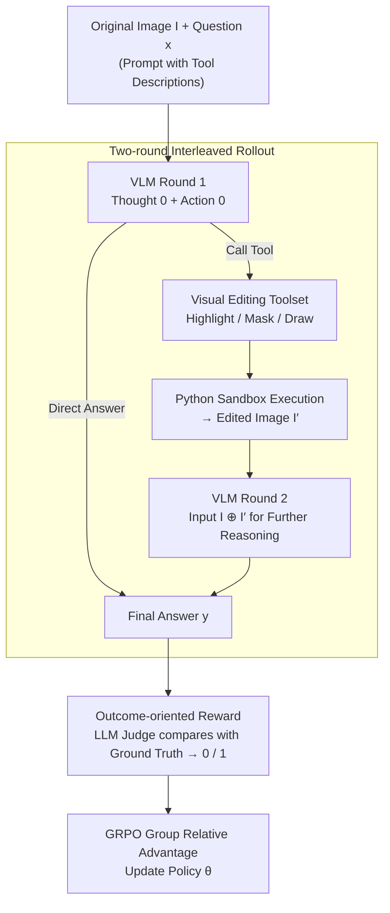

# VTool-R1: VLMs Learn to Think with Images via Reinforcement Learning on Multimodal Tool Use

## Paper Information
- **Conference**: ICLR 2026
- **arXiv**: [2505.19255](https://arxiv.org/abs/2505.19255)
- **Code**: [https://github.com/VTOOL-R1/vtool-r1](https://github.com/VTOOL-R1/vtool-r1)
- **Area**: Visual Language Models / RL Fine-tuning / Tool Use / Multimodal Reasoning
- **Keywords**: RFT, VLM, Visual Reasoning, Tool Use, GRPO, Multimodal Chain-of-Thought

## TL;DR
The study proposes VTool-R1, the first framework that trains VLMs via Reinforcement Learning Fine-tuning (RFT) to generate interleaved textual and visual intermediate reasoning steps, enabling models to "think with images."

## Background & Motivation

### Core Problem
While RFT has significantly enhanced the reasoning capabilities of LLMs, attempts to replicate this in the VLM domain remain confined to **text-only reasoning**: models process images only during the initial encoding phase, and the reasoning chain is generated entirely in text, lacking intermediate visual reasoning steps.

### Why is text-only reasoning insufficient?
Even state-of-the-art VLMs may rely on linguistic shortcuts. For example, when shown an image of a hand with six fingers and asked "how many fingers," a model might answer "five" based on a linguistic reasoning path of "a hand has five fingers," ignoring the visual evidence.

### Limitations of Prior Work
- **Visual Sketchpad**: Introduces visual steps during inference but lacks a training mechanism, proving effective only on powerful models like GPT-4o.
- **Refocus**: Generates visual edits but relies on commercial models for pre-generation, performing poorly on weaker open-source models.
- **R1-VL, etc.**: Only trains pure text CoT, excluding visual reasoning steps.

## Method

### Overall Architecture

VTool-R1 integrates a set of Python visual editing tools into the RFT rollout process, allowing the VLM to execute in two rounds within a single Q&A session. In the first round, the model examines the original image and question to decide whether to answer directly or call a tool to highlight, mask, or box key regions. If a tool is selected, the code is executed in a Python sandbox to produce an edited image. In the second round, the edited image is sent back to the model along with the original image to generate the final answer. During training, only the correctness of the final answer serves as the reward signal, backpropagated via GRPO. Consequently, the model autonomously learns when to "edit and look again" versus when an immediate answer is more efficient.

### Key Designs

**1. Two-round interleaved rollout: Transforming visual editing into a real input-altering step in the reasoning chain**

The problem with pure text CoT is that once the model enters reasoning, it relies solely on language and cannot re-examine image details, potentially leading to linguistic shortcuts like "a hand has five fingers" while ignoring pixel evidence. VTool-R1 allows the first round to produce Thought 0 (analyzing where to look) and Action 0 (a snippet of pseudo-code to call a visual tool, or "no action" to provide an answer directly). If a tool is called, the code produces an edited image $I'$ after execution in a Python sandbox. In the second round, the model receives both the original image and $I'$ as concatenated inputs. The entire chain can be formalized as $y \sim \pi_\theta(\cdot | I, x; \texttt{T}) = \pi_\theta(\cdot | I \oplus I', x) = \pi_\theta(\cdot | I \oplus \texttt{T}(y', I), x)$, where $\oplus$ denotes image concatenation and $\texttt{T}$ is the editing operator applying the tool call $y'$ to image $I$. If the model opts out of tool use, the first round directly outputs $y \sim \pi_\theta(\cdot | I, x)$. Crucially, the edited image is fed back into the same VLM as a second image input rather than being inserted as text (as in Search-R1). Thus, visual operations become intermediate steps that actually change the model's input. This study focuses on single-round tool calls, leaving multi-round iteration for future work.

**2. Visual editing toolset: Deterministic operators for selective attention**

The tools follow the design of Refocus, aiming not for complexity but for "directing attention to where it belongs," simulating human visual processing where one focuses before judging. For tabular tasks, three operations are provided: Highlight Column/Row (overlaying a semi-transparent red layer), Mask Column/Row (covering irrelevant areas with a white mask), and Draw Column/Row (circling targets with a red bounding box). For chart tasks, similar operations are applied to individual bars. These operators are deterministic and reproducible, allowing the model to consistently "edit then look." Because the tools are simple and reliable, performance gains can be cleanly attributed to the decision-making of "when and how to use" them.

**3. Outcome-oriented reward: Avoiding reward hacking by rewarding only final correctness**

While providing process rewards for tool calls seems logical, the authors found it susceptible to exploitation—rewarding "successful calls" led to fake tool use, while punishing "failed calls" caused the model to avoid tools entirely. Thus, VTool-R1 employs a lightweight LLM judge to compare the predicted answer with the ground truth, assigning a reward of 1 for a match and 0 otherwise. Tool efficacy is reflected indirectly through its contribution to the final answer. Training optimizes only the final response $y$ without direct supervision of the tool call $y'$; gradients related to tools are backpropagated indirectly based on whether they improved accuracy. This returns the decision-making power to the model to explore through trial and error, leading to adaptive tool-use behavior.

### Loss & Training

Training optimizes only the final reasoning response $y$ without direct supervision of intermediate tool calls $y'$. The objective is reward maximization with a KL constraint: $\max_{\pi_\theta} \mathbb{E}_{[I,x] \sim \mathcal{D},\, y \sim \pi_\theta(\cdot|I,x;\texttt{T})} [r_\phi(I,x,y)] - \beta \mathbb{D}_{KL}[\pi_\theta(\cdot|I,x;\texttt{T}) \| \pi_{\text{ref}}(\cdot|I,x;\texttt{T})]$. This is implemented using GRPO, where for each sample, $G$ rollouts are sampled and normalized using the group relative advantage $\hat{A}_{i,t}$:

$$\mathcal{J}_{GRPO}(\theta) = \mathbb{E}\left[\frac{1}{G}\sum_{i=1}^{G}\frac{1}{|y_i|}\sum_{t=1}^{|y_i|}\min\left(r_{i,t}(\theta)\hat{A}_{i,t}, \text{clip}(r_{i,t}(\theta), 1-\epsilon, 1+\epsilon)\hat{A}_{i,t}\right) - \beta\mathbb{D}_{KL}[\pi_\theta||\pi_{\text{ref}}]\right]$$

Since rewards are based only on the final answer, gradients for tool calls are backpropagated entirely via "whether it improved accuracy," which is the root cause of why outcome-based rewards avoid hacking.

## Key Experimental Results

### Main Results

| Model | Configuration | Chart Split | Table Split |
|------|------|-------------|-------------|
| Qwen2.5-VL 3B | Pure Run | 51.8 | 41.3 |
| Qwen2.5-VL 3B | Tool Use (No Training) | 24.6 | 24.3 |
| **Qwen2.5-VL 3B** | **VTool-R1** | **64.0** | **57.9** |
| Qwen2.5-VL 7B | Pure Run | 76.2 | 64.7 |
| **Qwen2.5-VL 7B** | **VTool-R1** | **80.7** | **71.7** |
| GPT-4o | Pure Run | 82.9 | 75.7 |
| GPT-4o | Tool Use | 80.5 | 77.0 |

### Comparison with Prior Work

| Method | Chart Split | Table Split |
|------|-------------|-------------|
| Deepeyes (7B) | 60.0 | - |
| R1-VL (7B) | 63.8 | 45.4 |
| **VTool-R1 (7B)** | **80.7** | **71.7** |

### Key Findings

1. **RFT enables better tool use**: After training, 3B/7B models learn to use tools effectively.
2. **Tool use is non-monotonic**: Tool call frequency and success rates fluctuate during training; the model learns selective usage.
3. **Outcome-based rewards are most reliable**: Process rewards lead to reward hacking.
4. **VTool-R1 significantly outperforms Deepeyes**: 80.7 vs 60.0 (Chart Split).
5. **Convergence within approximately 50 training steps**.

### Analysis of Failure Cases
- Correct visual step generation followed by incorrect second-round reasoning.
- Slight flaws in visual enhancement (e.g., numbers being obscured by bounding boxes).
- Misjudging that a tool is not needed, leading to a direct incorrect answer.
- Tool code execution failure.

## Highlights & Insights

1. **First framework to use RFT for training VLMs to generate multimodal CoT.**
2. **Elegant Design**: Optimizing only the final response allows the model to autonomously decide whether to use tools.
3. **Practical Effectiveness**: Trained 3B models rival or exceed the tool-use capabilities of GPT-4o.
4. **In-depth Training Dynamics**: Evolution of tool frequency and success rates reveals adaptive behavior.

## Limitations & Future Work

1. Currently supports only single-round tool calls; multi-round visual reasoning is left for the future.
2. Toolset is limited to selective attention operations and has not expanded to more complex visual tools.
3. Requires VLM support for multi-image input.
4. Lack of a precise oracle validator for tool call correctness.
5. Training requires significant GPU resources (32B model requires 8×H200).

## Related Work & Insights

- **Visual CoT**: ViperGPT (via Python programs), Visual Sketchpad (inference-time canvas).
- **LLM/VLM Tool Use**: Search-R1, ReTool — RFT for text tools.
- **VLM RFT**: R1-V, Vision-R1 — text-only reasoning chains.
- **Concurrent Work**: Deepeyes, OpenThink-IMG — differing tool and task designs.

## Rating
- **Novelty**: ⭐⭐⭐⭐⭐ — First successful use of RFT for multimodal reasoning chains.
- **Experimental Thoroughness**: ⭐⭐⭐⭐ — Comprehensive comparison across model scales and analysis of training dynamics.
- **Writing Quality**: ⭐⭐⭐⭐ — Clear structure and well-defined concepts.
- **Value**: ⭐⭐⭐⭐ — Open-source framework with practical operability.

<!-- RELATED:START -->

## Related Papers

- [\[ICLR 2026\] VLM-SubtleBench: How Far Are VLMs from Human-Level Subtle Comparative Reasoning?](vlm-subtlebench_how_far_are_vlms_from_human-level_subtle_comparative_reasoning.md)
- [\[ICLR 2026\] DeepEyes: Incentivizing "Thinking with Images" via Reinforcement Learning](deepeyes_incentivizing_thinking_with_images_via_reinforcement_learning.md)
- [\[ICLR 2026\] ReVisual-R1: Advancing Multimodal Reasoning from Optimized Cold Start to Staged Reinforcement Learning](revisual-r1_advancing_multimodal_reasoning_from_optimized_cold_start_to_staged_r.md)
- [\[ICLR 2026\] Thyme: Think Beyond Images](thyme_think_beyond_images.md)
- [\[CVPR 2026\] Thinking With Videos: Multimodal Tool-Augmented Reinforcement Learning for Long Video Reasoning](../../CVPR2026/vlm_reasoning/thinking_with_videos_multimodal_tool-augmented_reinforcement_learning_for_long_v.md)

<!-- RELATED:END -->
