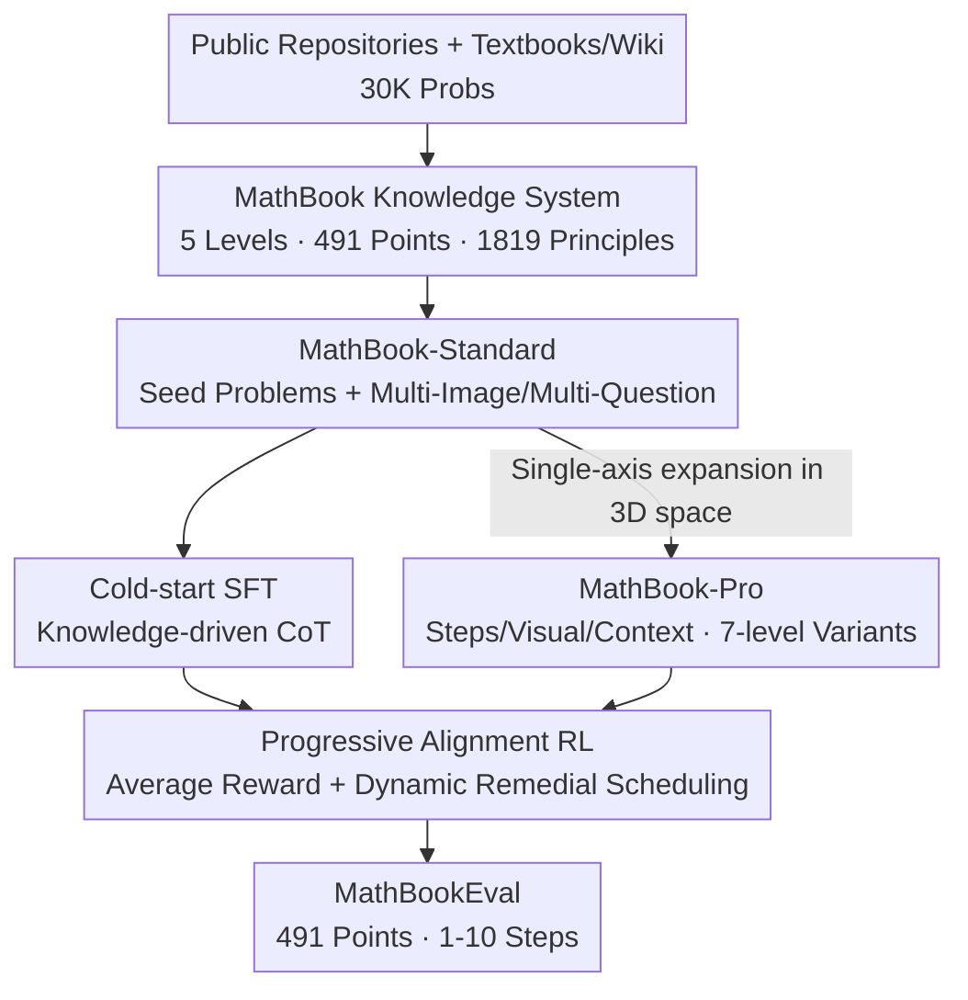

# We-Math 2.0: A Versatile MathBook System for Incentivizing Visual Mathematical Reasoning

**Conference**: ICLR 2026  
**OpenReview**: [https://openreview.net/forum?id=I7fTPLT8A9](https://openreview.net/forum?id=I7fTPLT8A9)  
**Code**: https://we-math2.github.io/ (Project Homepage)  
**Area**: Multimodal VLM / LLM Reasoning  
**Keywords**: Visual Mathematical Reasoning, Knowledge System, Difficulty Modeling, Curriculum Reinforcement Learning, GRPO

## TL;DR
We-Math 2.0 integrates a five-level "Mathematical Knowledge System" (491 knowledge points, 1,819 principles) with a model-centric three-dimensional difficulty data space (MathBook-Standard/Pro) and a two-stage reinforcement learning framework (cold-start SFT + progressive alignment RL). Using only ~9.8K training samples, it improves Qwen2.5-VL-7B by an average of 6.1 points across four major visual math benchmarks.

## Background & Motivation

**Background**: The prevailing strategies for enhancing the mathematical reasoning capabilities of Multimodal Large Language Models (MLLMs) involve data scaling, preference optimization, and reinforcement learning. Recently, RL combined with curriculum training has emerged as a focal point, demonstrating gains in complex reasoning tasks.

**Limitations of Prior Work**: The authors highlight two fundamental omissions in current research. First, a lack of a systematic knowledge system: existing datasets possess fragmented knowledge coverage and domain imbalances, leading to inconsistent performance across mathematical subfields (e.g., proficient in algebra but poor in geometry). Second, improper difficulty annotation: most datasets categorize difficulty based on "human grade levels," yet studies suggest MLLM learning patterns do not align with human grade levels, making human-centric curricula potentially ineffective for models.

**Key Challenge**: The training paradigm tends toward "item memorization" rather than "reasoning generalization"—models can solve complex problems but fail on corresponding sub-problems or similar task types. The root cause lies in disorganized knowledge supervision and non-model-centric difficulty modeling, causing the model to memorize specific problems instead of mastering transferable knowledge.

**Goal**: This work decomposes the challenge into three sub-problems: (1) Constructing a comprehensive, hierarchically clear mathematical knowledge system as a supervisory backbone; (2) Redefining problem difficulty in a model-centric manner and synthesizing data accordingly; (3) Designing a training paradigm that progressively aligns with difficulty while emphasizing generalization.

**Key Insight**: Difficulty should be characterized by where the model actually fails, rather than what humans perceive as difficult. Consequently, difficulty is decomposed into three orthogonal dimensions: "Number of Reasoning Steps," "Visual Complexity," and "Contextual Complexity." Each seed problem is expanded into 7 progressive variants along a single dimension, allowing the RL agent to traverse this difficulty trajectory and receive targeted instruction upon failure.

**Core Idea**: By employing a "structured knowledge system + model-centric 3D difficulty data + progressive alignment RL over difficulty," the system steers visual mathematical reasoning from "problem memorization" toward "knowledge-driven generalization."

## Method

### Overall Architecture

We-Math 2.0 is an end-to-end system consisting of four stages: Backbone Construction → Data Synthesis → Model Training → Evaluation. First, a human-AI collaborative process builds the five-level MathBook knowledge system (491 points, 1,819 principles) as a unified coordinate system. Seed problems are synthesized around these points with bidirectional expansion (multi-image/multi-question) to create MathBook-Standard, followed by a 3D difficulty expansion into MathBook-Pro with 7-level variants. Finally, MathBook-RL employs two-stage training: cold-start SFT to instill "knowledge-driven CoT" patterns, followed by progressive alignment RL (pre-alignment on Standard using average rewards for analogical reasoning, followed by dynamic remedial scheduling on Pro). Evaluation is conducted via the MathBookEval system covering all 491 knowledge points.

### Key Designs

**1. MathBook Knowledge System: A Unified Supervisory Coordinate System**

To address the fragmentation of knowledge in existing datasets, the authors established a five-level hierarchy organized by the "Definition-Theorem-Application" paradigm. The core consists of a knowledge set $K=\{k_1,\dots,k_N\}$ ($N=491$, spanning elementary to university mathematics), where each point $k_i$ is linked to basic principles $P_i=\{p_{i1},\dots,p_{im_i}\}$ ($m_i\in[1,7]$), totaling $|P|=1819$ principles. Construction involved human-AI collaboration: experts built an initial structure $K_{human}$ based on curriculum standards, while 30K problems sampled from existing datasets were tagged by GPT-4o and hierarchically clustered into $K_{auto}$. These were integrated into the final $K$. Principles were annotated by having GPT-4o map reasoning steps to points ($M_1: q_j\mapsto(k_{i1},k_{i2},\dots)$) and aggregating used principles for each point ($M_2: k_i\mapsto\{p_{i1},\dots\}$), followed by expert cross-validation. This system ensures that all subsequent generation, difficulty scaling, CoT design, and evaluation are anchored to the same structured, traceable knowledge nodes.

**2. MathBook-Standard & Pro: Model-Centric 3D Difficulty Data Space**

Addressing the mismatch between human grade levels and model learning, the authors split data synthesis into "Breadth" and "Depth." The breadth layer, MathBook-Standard, uses a "model-drafted, expert-led" process for seed questions: given knowledge points, an LLM drafts questions and GeoGebra XML scripts. Refined images are rendered via expert adjustments (only 1.2% of LLM drafts were used directly to avoid reliance on surface visual cues). Orthogonal expansions include "Multi-Image-Single-Question" (changing parameters to get different geometric instances) and "Multi-Question-Single-Image" (reusing high-quality images for different points). The depth layer, MathBook-Pro, defines a 3D difficulty space: Step Complexity $\phi_s$ (measured by the number of knowledge points, $K_{i+1}=K_i+1$), Visual Complexity $\phi_v$ (adding auxiliary lines/modifying configuration while preserving the core structure), and Contextual Complexity $\phi_c$ (moving from concise descriptions to real-world or abstract scenarios). Each seed problem serves as an origin $(q_0,a_0,I_0)$, with variants generated along single axes toward the most complex variant $(q^*,a^*,I^*)=\phi_s\circ\phi_v\circ\phi_c(q_0,a_0,I_0)$, creating 7 progressive levels per seed.

**3. MathBook-RL: Two-Stage "Cold-Start + Progressive Alignment" Training**

To counter rote memorization, a two-stage framework is designed. Stage 1 (Cold-start SFT): An initial set $D_{init}$ covering all 491 points is sampled from Standard. GPT-4o rewrites these into natural language explanations that explicitly cite relevant knowledge. Standard SFT is applied with the objective $L_{SFT}(\theta)=\mathbb{E}_{(x,y)\sim D_{init}}[-\log P_\theta(y\mid x)]$ to instill the knowledge-driven CoT paradigm. Stage 2 (Progressive Alignment RL): (1) Pre-alignment RL on the "Multi-Image" subset of Standard using Average Reward—for a group of variants sharing the same principle, rollout rewards are sorted and averaged across the group to compute the advantage $A_i$ (rewards $r^{(t)}$ are 0.9/0.1/0 for correct/format-only/wrong). This forces the critic to evaluate consistent performance across variations rather than isolated instances. (2) Curriculum training on Pro along the difficulty trajectory $x_0\to\phi_s(x_0)\to\dots\to\phi_s\circ\phi_v\circ\phi_c(x_0)$. Optimization uses GRPO to estimate baselines from group scores, avoiding an independent critic.

**4. Dynamic Remedial Scheduling: Targeted Intervention at Difficulty Frontiers**

During the curriculum traversal $x\to\phi(x)$, the model may master $x$ but fail at $\phi(x)$. The authors introduce incremental learning via incremental sets $\Delta(x,\phi)$, which isolate the specific knowledge or modality difficulty introduced by $\phi$. If the model fails at $\phi(x)$, it is first trained on $\Delta(x,\phi)$ before retrying. Specifically: for failures at $x_0\to\phi_s(x_0)$, auxiliary problems targeting the new knowledge points are constructed ($\Delta(x_0,\phi_s)$); for failures at $\phi_s(x_0)\to\phi_s\circ\phi_v(x_0)$, samples isolating the new visual/contextual complexity are used. This ensures the model receives remedial instruction specifically for the dimension where it failed, rather than following a static, one-size-fits-all curriculum.

### Loss & Training
Cold-start SFT uses standard cross-entropy $L_{SFT}(\theta)=\mathbb{E}_{(x,y)\sim D_{init}}[-\log P_\theta(y\mid x)]$. The RL phase utilizes GRPO with clipping and KL regularization:

$$J(\theta)=\mathbb{E}\Big[\frac{1}{G}\sum_{i=1}^{G}\frac{1}{|o_i|}\sum_{t}\min\big(\rho_{i,t}\hat A_{i,t},\ \mathrm{clip}(\rho_{i,t},1-\epsilon,1+\epsilon)\hat A_{i,t}\big)-\beta D_{KL}[\pi_\theta\|\pi_{ref}]\Big]$$

where $\rho_{i,t}$ is the policy ratio and $\hat A_{i,t}$ is the normalized group advantage. Data volumes: SFT (1K), Pre-alignment RL (5.8K), Dynamic RL (4K), totaling ~9.8K samples (base models: Qwen2.5-VL-7B / 3B).

## Key Experimental Results

### Main Results
On four major benchmarks, MathBook-7B outperforms the Qwen2.5-VL-7B base model using only 9.8K training samples:

| Model | #Data | Avg. | MathVista | MathVision | We-Math | MathVerse |
|------|-------|------|-----------|------------|---------|-----------|
| GPT-4o-latest | - | 54.0 | 71.6 | 43.8 | 50.6 | 49.9 |
| Qwen2.5-VL-7B (Base) | - | 42.6 | 68.2 | 25.1 | 36.0 | 41.1 |
| WeThink-7B | 120K+20K | 47.5 | 71.6 | 26.0 | 48.0 | 44.2 |
| MM-Eureka-7B | 15K | 45.2 | 73.0 | 26.9 | 34.5 | 46.2 |
| **MathBook-7B (Ours)** | **1K+9.8K** | **48.7** | **73.0** | **28.0** | **48.4** | **45.2** |
| Δ (vs Base) | - | +6.1 | +4.8 | +2.9 | **+12.4** | +4.1 |

The +12.4 gain on We-Math is significant, as this benchmark requires solving both complex problems and their sub-problems, proving that the RL alignment effectively promotes knowledge generalization.

### Ablation Study
Ablation across training stages (MVt=MathVista, MVs=MathVision, WM=We-Math):

| Config | SFT | RL-Pre | RL-Dyn | MVt | MVs | WM |
|------|-----|--------|--------|-----|-----|-----|
| M0 Full | ✓ | ✓ | ✓ | 73.0 | 28.0 | 48.4 |
| M1 w/o Dynamic | ✓ | ✓ | - | 72.4 | 27.0 | 47.2 |
| M2 w/o Pre-alignment | ✓ | - | ✓ | 72.0 | 26.3 | 43.3 |
| M3 w/o SFT | - | ✓ | ✓ | 71.5 | 26.3 | 46.7 |
| M4 SFT Only | ✓ | - | - | 65.8 | 25.7 | 38.3 |

### Key Findings
- **Both RL stages contribute significantly**: M1-M3 outperform M4 (SFT only). Pre-alignment RL is particularly crucial (removing it dropped We-Math score from 48.4 to 43.3), validating the importance of cross-variant knowledge consistency.
- **SFT provides limited gains alone but acts as a key to RL**: M4 yields minimal improvement over the base, but it is necessary to switch the model's reasoning paradigm to CoT before applying RL.
- **Less is More**: Expanding SFT data from 1K to 15K does not yield gains; high-quality, concise data is superior. Natural language CoT also outperforms structured step-by-step CoT in encouraging flexible reasoning.
- **MathBookEval Trends**: Accuracy decreases as the number of required knowledge points increases (dropping below 50% for 7-10 step problems). Algebra remains stronger than geometry, suggesting spatial reasoning is still a bottleneck.

## Highlights & Insights
- **Model-Centric Difficulty Redefinition**: Breaking difficulty into three orthogonal axes (steps/visual/context) and scaling them controllable is more aligned with the model's actual failure distribution than human grades. This is a highly transferable concept for curriculum training.
- **Failure-Driven Dynamic Remediation**: The use of incremental sets $\Delta(x,\phi)$ to isolate new difficulty components transforms the curriculum from a static sequence into a dynamic process responsive to real-time model failure, making the training more efficient.
- **Average Reward for Analogical Reasoning**: Averaging advantages across "Multi-Image" variants forces the model to be robust across different visual instances of the same principle, directly serving the goal of generalization over memorization.
- **Instructional Efficiency**: Achieving gains that rival closed-source models using only 9.8K samples proves that structured knowledge supervision is more valuable than raw data volume.

## Limitations & Future Work
- **System Weight and Manual Dependency**: Constructing the knowledge system, creating GeoGebra images, and annotating principles require heavy expert involvement (only 1.2% of drafts were directly usable), making scaling expensive.
- **Geometry remains a weakness**: Despite the knowledge system, geometry performance lags behind algebra, indicating that spatial-visual reasoning bottlenecks are not fully resolved by this methodology.
- **Evaluation Consistency**: While dominant in generalization-heavy benchmarks like We-Math, it does not lead across all benchmarks, as different protocols and difficulty distributions affect relative rankings.
- **GPT-4o Dependency**: The quality of knowledge annotation and CoT rewriting depends on GPT-4o, which may introduce its own biases or limitations.

## Related Work & Insights
- **vs Human-centric Difficulty (e.g., MathV360K)**: Previous works use human education levels; this work uses a 3D model-centric space. The advantage is better alignment with model failure points at the cost of more complex data synthesis.
- **vs Pure/Curriculum RL (e.g., MM-Eureka, R1-VL)**: Others use direct RL or fixed curricula; this work precedes RL with cold-start SFT for paradigm switching and employs failure-driven remedial scheduling.
- **vs Knowledge-Annotated Benchmarks (e.g., We-Math, GeoSense)**: Prior works focused on evaluation; this work closes the loop by using the knowledge system for training, principle-level supervision, and 8-level difficulty scaling.

## Rating
- Novelty: ⭐⭐⭐⭐⭐ Systematic integration of knowledge systems, model-centric difficulty, and progressive RL; the 3D space + failure-driven remediation is original.
- Experimental Thoroughness: ⭐⭐⭐⭐ Comprehensive testing across four benchmarks plus MathBookEval, though geometry remains a weak point.
- Writing Quality: ⭐⭐⭐⭐ Clear structure despite being a complex system.
- Value: ⭐⭐⭐⭐⭐ High data efficiency (9.8K for a +6 gain) and transferable concepts for difficulty modeling and curriculum RL.

<!-- RELATED:START -->

## Related Papers

- [\[CVPR 2026\] Incentivizing Versatile Video Reasoning in MLLMs via Data-Efficient Reinforcement Learning](../../CVPR2026/vlm_reasoning/incentivizing_versatile_video_reasoning_in_mllms_via_data-efficient_reinforcemen.md)
- [\[ICLR 2026\] GIR-Bench: Versatile Benchmark for Generating Images with Reasoning](gir-bench_versatile_benchmark_for_generating_images_with_reasoning.md)
- [\[ICLR 2026\] DeepEyes: Incentivizing "Thinking with Images" via Reinforcement Learning](deepeyes_incentivizing_thinking_with_images_via_reinforcement_learning.md)
- [\[ICLR 2026\] Math Blind: Failures in Diagram Understanding Undermine Reasoning in MLLMs](math_blind_failures_in_diagram_understanding_undermine_reasoning_in_mllms.md)
- [\[ICLR 2026\] MathNet: A Global Multimodal Benchmark for Mathematical Reasoning and Retrieval](mathnet_a_global_multimodal_benchmark_for_mathematical_reasoning_and_retrieval.md)

<!-- RELATED:END -->
