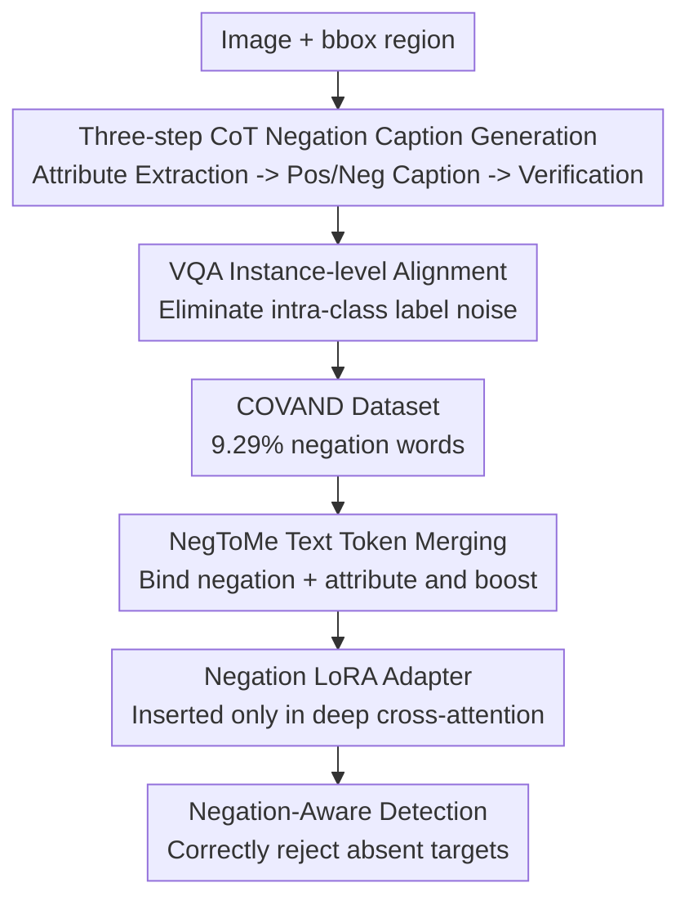

# What "Not" to Detect: Negation-Aware VLMs via Structured Reasoning and Token Merging

**Conference**: ICLR 2026  
**Paper**: Published as a conference paper at ICLR 2026  
**Code**: Not yet available  
**Area**: Multimodal VLM / Described Object Detection / Negation Understanding  
**Keywords**: Negation awareness, affirmative bias, token merging, Described Object Detection (DOD), LoRA

## TL;DR
Addressing the "affirmative bias" in Vision-Language Models (VLMs) for Described Object Detection—where models fail to distinguish "person with a hat" from "person without a hat"—this paper constructs a negation-dense COVAND dataset via a CoT+VQA pipeline. It introduces NegToMe, a module that merges "not + attribute" into a single semantic unit and amplifies negation signals at the tokenization level, combined with deep cross-attention LoRA. Modifying <0.1% of parameters, the method achieves up to a +10.8 mAP improvement in NMS-AP on OVDEval.

## Background & Motivation

**Background**: SOTA VLMs (e.g., Grounding-DINO, APE, Qwen-2.5-VL) can localize objects based on natural language descriptions in Described Object Detection (DOD). DOD, a superset of Open-Vocabulary Detection (OVD) and Referring Expression Comprehension (REC), requires detecting "present attributes" while rejecting "absent attributes," necessitating fine-grained compositional reasoning.

**Limitations of Prior Work**: These models suffer from **affirmative bias**, tending to focus on nouns and ignore negation cues. Consequently, "person with skateboard" and "person without skateboard" are treated as semantically equivalent, leading to incorrect detections. Models often fail completely on double negations like "not un-" (e.g., "banana that is not unpeeled"). This poses significant risks in safety-critical scenarios, such as misidentifying "non-malignant tumors" in medical imaging.

**Key Challenge**: The authors attribute negation blindness to two root causes. At the **data level**, negation is extremely scarce in pre-training corpora (only ~0.08% in LAION-400M and 0.04% in Flickr30k), whereas real-world language has much higher ratios (13.76% in papers, 22.23% in fiction). At the **architectural level**, standard tokenizers split phrases, separating negation cues ("not") from the attributes they modify ("lying"). These isolated negation tokens receive negligible attention weights, causing the model to treat "not lying" as "lying."

**Goal**: To address both causes simultaneously by supplementing negation data and structurally preserving negation polarity.

**Key Insight**: The authors observe that fine-tuning on negation data alone only partially alleviates the issue because it does not fix the underlying tokenization flaw. Negation and its attribute must be bound into an indivisible semantic unit at the input representation level, with the negation signal explicitly amplified.

**Core Idea**: A structured CoT+VQA pipeline is used to generate high-quality, instance-level grounded negation data (COVAND). A negation-aware text token merging module (NegToMe) merges and boosts the "negation + attribute" unit after tokenization. This is paired with Negation LoRA Adapters inserted only in the deep cross-attention layers to teach the model "what not to detect."

## Method

### Overall Architecture
The approach consists of two complementary components: **Data Side**, constructing the negation-dense COVAND dataset offline; and **Model Side**, where text undergoes NegToMe merging/enhancement before passing through Negation LoRA Adapters in the deep cross-modal fusion layers of a frozen detector. The input consists of an image and a negation query (e.g., "cat not lying on the skateboard"), and the output is the detection box correctly filtered by the negation condition—crucially **rejecting** instances that do not meet the criteria.

COVAND is built via a multi-stage pipeline: Visual Prompting (drawing bboxes) → Three-step CoT for paired pos/neg captions → VQA Alignment to eliminate instance-level label noise.

### Key Designs

**1. Three-step CoT Negation Caption Generation: Shifting negation to the attribute level**

Existing negation data often use coarse object-level templates ("There is no dog"). This work uses GPT-4o with an explicit three-step CoT to decompose negation generation. **Step 1: Attribute Extraction**: For each visually prompted area, two types of attributes are extracted: present attributes $A_{pres}$ (color, action, etc.) and plausible but absent attributes $A_{abs}$. This is the key novelty for **attribute-level negation**. **Step 2: Paired Caption Generation**: Negative samples $C_{neg}$ incorrectly describe a present attribute as absent (e.g., "a man without a hat" when a hat $\in A_{pres}$), while positive samples $C_{pos}$ correctly describe an absent attribute as missing ("a woman without a red hoodie" where red hoodie $\in A_{abs}$). **Step 3: Verification**: GPT-4o verifies that $C_{pos}$ fits the region while $C_{neg}$ contradicts it, ensuring the presence of negation words.

**2. VQA-based Instance-level Alignment: Anchoring captions to specific boxes**

Since multiple objects of the same class (e.g., several "persons") might satisfy a caption, causing label noise, the authors add a regional VQA alignment step. All boxes of the target class are labeled with letters (A, B, C...) except for the target box itself. A VQA model is then asked "Which labeled box corresponds to $C_{pos}$/$C_{neg}$?". This ensures the caption matches a specific, visualized bbox, providing true instance-level ground truth. COVAND contains 23,876 images and 91,110 captions, with a negation word frequency of ~9.29% (approx. 100x that of Flickr30k).

**3. NegToMe Negation-Aware Token Merging: Binding "not + attribute" as a semantic unit**

This module addresses the architectural root cause. Standard tokenizers split captions into sub-tokens $T=\{t_1,\dots,t_n\}$, diluting negation cues. NegToMe uses a parser (spaCy) to group tokens into phrases $P=\{P_1,\dots,P_m\}$. For each phrase $P_i$, a normalized weighted average of embeddings is used. The **negation-aware boost** amplifies the weight of the negation cue to $\beta>1$:

$$\bar{t}_{neg}=\frac{\sum_{j\in I_{neg}}\gamma_j t_j}{\sum_{j\in I_{neg}}\gamma_j},\quad \gamma_j=\begin{cases}\beta & \text{if } t_j \text{ is negation cue}\\ 1 & \text{otherwise}\end{cases}$$

Theoretical analysis shows that under vanilla mean pooling, the contribution of a negation cue $h_c$ is $s_{single}=\langle v,h_c\rangle/n$. With NegToMe, the merged representation $h_{neg}=\frac{\beta h_c+h_p}{\beta+1}$ amplifies the contribution by a factor of at least $\frac{\beta}{\beta+1}\cdot\frac{n}{m}$, without increasing sequence length.

**4. Deep Cross-Attention LoRA: Adapting where decisions occur**

Layer-wise attention analysis reveals that negation signals dissipate before reaching the final decision blocks. The authors insert LoRA only into the **deep cross-modal fusion layers**. Specifically, for frozen $W_q, W_v \in \mathbb{R}^{d \times d}$, parallel low-rank adapters ($r=4$) with ReLU activation $\sigma(\cdot)$ are added: $q=W_qx+\alpha B_q\sigma(A_qx)$, $v=W_vx+\alpha B_v\sigma(A_vx)$. Deep placement (blocks 3–5) consistently outperforms shallow placement, as it maintains high attention on negation tokens during the final stages of decision-making. The scheme modifies <0.1% of parameters.

### Loss & Training
Models are trained exclusively on the COVAND dataset. All backbones are frozen, and only LoRA layers are trained. Optimized using AdamW. Grounding-DINO: 5000 iters, lr $5\times10^{-4}$. APE-Ti: 6000 iters. Qwen-2.5-VL: 1 epoch, lr $5\times10^{-5}$. NegToMe uses spaCy for parsing with $\beta=2.0$.

## Key Experimental Results

### Main Results
D3 Benchmark (Results categorized by description length and absent subset):

| Model | Full | Pres | Abs | XL |
|------|------|------|-----|----|
| G-DINO-B Baseline | 20.7 | 20.1 | 22.5 | 16.5 |
| G-DINO-B + Ours | **27.3** (+6.6) | 26.4 (+6.3) | **29.7** (+7.2) | 21.3 (+4.8) |
| APE-Ti Baseline | 29.1 | 29.9 | 26.9 | 21.4 |
| APE-Ti + Ours | **32.5** (+3.4) | 32.9 | 31.5 (+4.6) | 25.4 |
| Qwen-2.5-VL-3B Baseline | 18.6 | 18.5 | 19.2 | 16.0 |
| Qwen-2.5-VL-3B + Ours | 22.2 (+3.6) | 22.8 | 20.6 | 17.8 |

OVDEval-Negation (NMS-AP strictly penalizes affirmative bias):

| Model | AP | NMS-AP |
|------|----|--------|
| G-DINO-B† | 54.0 | 36.8 |
| G-DINO-B + Ours | 57.2 (+3.2) | **47.6 (+10.8)** |
| Qwen-2.5-VL-3B | 34.6 | 31.3 |
| Qwen-2.5-VL-3B + Ours | 41.9 (+7.3) | 35.1 (+3.8) |

### Ablation Study
(OVDEval-Negation results):

| Training Data | LoRA Pos. | NegToMe | β | NMS-AP | ↓FPR |
|---------|----------|---------|---|--------|------|
| Pretrained | — | — | — | 36.8 | 63.2 |
| Flickr30k | deep | ✘ | – | 31.8 | 59.9 |
| COVAND-S | shallow | ✘ | – | 31.5 | 56.0 |
| COVAND-S | deep | ✘ | – | 41.8 | 48.6 |
| COVAND-S | deep | ✔ | 1.0 | 43.8 | 50.8 |
| COVAND-S | deep | ✔ | 2.0 | **44.5** | 48.5 |

### Key Findings
- **Data and NegToMe contribute equally**: On D3, COVAND alone adds +2.2 mAP, and adding NegToMe adds another +2.0 mAP, proving the strategy is as vital as the data.
- **LoRA placement is critical**: Deep placement (blocks 3–5) is essential as negation signals disappear early. Training on Flickr30k actually hurts NMS-AP, showing that data quality is more important than quantity.
- **Boost effectiveness**: Increasing $\beta$ to 2.0 improves NMS-AP and reduces FPR, validating the amplification of negation cues.
- **Large models do not solve negation**: Qwen-2.5-VL-7B (NMS-AP 35.9) performs worse than the small Grounding-DINO baseline, highlighting that simply scaling model size does not resolve negation issues.

## Highlights & Insights
- **Dual-root cause diagnosis**: Unlike works that only supplement data, this paper correctly identifies tokenization as a structural flaw and intervenes via NegToMe.
- **Theoretical Grounding**: NegToMe provides a theoretical amplification bound of $\frac{\beta}{\beta+1}\cdot\frac{n}{m}$ for negation signals without increasing sequence length.
- **Instance-level Alignment**: Using alphabet tagging on same-class boxes for VQA verification effectively upgrades image-level verification to instance-level grounding.
- **Efficiency and Generalization**: With <0.1% parameters and training only on COVAND, the method generalizes across architectures (G-DINO, APE, Qwen).

## Limitations & Future Work
- **GPT-4o Dependency**: COVAND quality is limited by GPT-4o's reasoning and visual prompting accuracy; multiple API calls are costly.
- **Missed Detections**: The model still occasionally fails to detect all instances satisfying complex negations (e.g., "pizza that is not complete").
- **Parser Dependency**: NegToMe relies on spaCy; parsing errors in complex nested negations or cross-language scenarios may reduce effectiveness.
- **Preliminary MLLM results**: The gains on Qwen-2.5-VL are lower than on dedicated detectors, suggesting more work is needed for large multimodal models.

## Related Work & Insights
- **vs. Data-only methods**: Most prior works stop at caption-level negation. Ours performs attribute-level negation and architecture-level merging.
- **vs. Standard LoRA**: While standard LoRA involves all layers, Ours focuses on deep cross-attention based on signal dissipation analysis.
- **vs. Heavy retraining**: This work achieves comparable gains with <0.1% parameters, emphasizing lightweight portability.

## Rating
- Novelty: ⭐⭐⭐⭐⭐ First to use boosted token merging to preserve polarity at the tokenization level.
- Experimental Thoroughness: ⭐⭐⭐⭐ Validated across 3 architectures and 2 benchmarks, though MLLM results are relatively preliminary.
- Writing Quality: ⭐⭐⭐⭐ Clear root cause analysis and strong theoretical motivation.
- Value: ⭐⭐⭐⭐⭐ Directly addresses a major pain point in safety-critical object detection with a plug-and-play solution.

<!-- RELATED:START -->

## Related Papers

- [\[ICLR 2026\] ARES: Multimodal Adaptive Reasoning via Difficulty-Aware Token-Level Entropy Shaping](ares_multimodal_adaptive_reasoning_via_difficulty-aware_token-level_entropy_shap.md)
- [\[ICLR 2026\] MMR-V: What's Left Unsaid? A Benchmark for Multimodal Deep Reasoning in Videos](mmr-v_whats_left_unsaid_a_benchmark_for_multimodal_deep_reasoning_in_videos.md)
- [\[ICLR 2026\] Perception-Aware Policy Optimization for Multimodal Reasoning](perception-aware_policy_optimization_for_multimodal_reasoning.md)
- [\[ICLR 2026\] Not Search, But Scan: Benchmarking MLLMs on Scan-Oriented Academic Paper Reasoning](not_search_but_scan_benchmarking_mllms_on_scan-oriented_academic_paper_reasoning.md)
- [\[ICLR 2026\] SpinBench: Perspective and Rotation as a Lens on Spatial Reasoning in VLMs](spinbench_perspective_and_rotation_as_a_lens_on_spatial_reasoning_in_vlms.md)

<!-- RELATED:END -->
