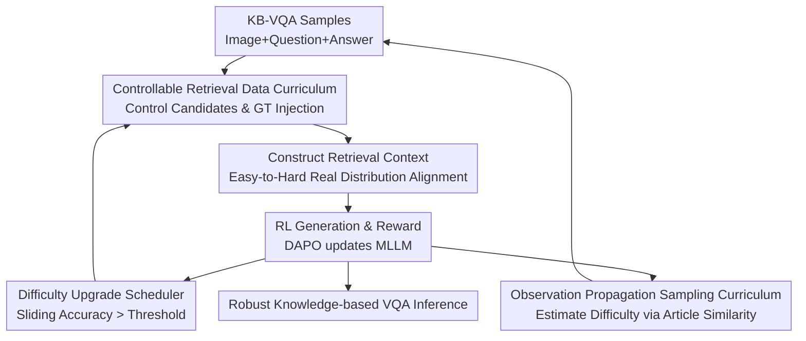

# Wiki-R1: Incentivizing Multimodal Reasoning for Knowledge-based VQA via Data and Sampling Curriculum

**Conference**: ICLR2026  
**OpenReview**: [https://openreview.net/forum?id=TH1Tgbjkm7](https://openreview.net/forum?id=TH1Tgbjkm7)  
**Code**: To be confirmed  
**Area**: VLM Reasoning  
**Keywords**: Knowledge-based VQA, Multimodal Reasoning, Curriculum Reinforcement Learning, Retrieval-Augmented Generation, Observation Propagation

## TL;DR
Wiki-R1 addresses the issues of "high retrieval noise, sparse rewards, and RL failing to learn reasoning" in knowledge-based VQA. It generates a data curriculum from easy to difficult via controllable retrieval difficulty and utilizes observation propagation to select samples with the strongest training signals. This allows Qwen2.5-VL to achieve new SOTA results for retrieval-augmented KB-VQA on Encyclopedic VQA and InfoSeek.

## Background & Motivation
**Background**: Knowledge-based Visual Question Answering (KB-VQA) requires models to not only interpret images but also connect image entities and textual questions with encyclopedic information from external knowledge bases. The predominant paradigm recently is Retrieval-Augmented Generation (RAG): first retrieving relevant image-text entries from knowledge bases like Wikipedia, then feeding the results alongside the image and question to a Multimodal Large Language Model (MLLM) to generate an answer.

**Limitations of Prior Work**: The challenge of this paradigm lies not in "connecting a retriever" but in the often noisy retrieval results. Image entities may retrieve similar but incorrect pages, text retrieval may extract passages irrelevant to the question, and the knowledge base itself contains encyclopedic, structured, and long-tail content. Direct SFT allows the model to memorize evidence formats on training instances, but when facing incorrect retrieval or unseen questions, the model tends to treat noise as evidence or provide unstable answers without complete evidence.

**Key Challenge**: Reinforcement Learning is inherently suitable for converting task rewards (1 for correct, 0 for incorrect) into reasoning capabilities, but the initial distribution of KB-VQA is too difficult. The authors found that when DAPO is applied directly to KB-VQA, over 80% of samples are "zero-advantage" during training, with training accuracy stagnating at approximately 10%. Essentially, the model does not just lack optimization; rather, a massive number of samples are either completely wrong or provide no gradient, leaving the RL update without discriminative learning signals.

**Goal**: Wiki-R1 aims to solve three sub-problems: first, how to decompose the difficult distribution of real KB-VQA into a training distribution that the model can gradually overcome; second, how to dynamically judge when the model should encounter harder retrieval noise during RL; and third, how to estimate sample difficulty when rewards are extremely sparse to prevent the sampler from merely repeating seen samples or relying on random chance.

**Key Insight**: The authors observe that retrieval noise is a major source of the distribution gap and sparse rewards. If ground-truth Wikipedia entries are explicitly placed in the retrieval results, both the zero-gradient issue and low accuracy of DAPO are mitigated. Therefore, instead of performing curriculum selection on fixed data, it is better to directly manipulate the retriever, allowing the difficulty of training samples to gradually transition from "guaranteed correct evidence" to the "uncertain evidence in real reasoning."

**Core Idea**: Wiki-R1 shapes the RL distribution through a combination of "Data Curriculum + Sampling Curriculum": the former generates varying difficulties by controlling the number of retrieval candidates and the mandatory inclusion of ground-truth entries, while the latter estimates the difficulty of unobserved samples through observed rewards and knowledge article similarity propagation, thereby continuously sampling instances most likely to yield non-zero advantages.

## Method

### Overall Architecture
The input to Wiki-R1 is a batch of KB-VQA training samples, each containing a question $q$, image $I_q$, and answer $y$, while the external knowledge base $B$ consists of Wikipedia articles and corresponding visual content. The framework first modifies retrieval results according to the current gap level to construct a retrieval context of a specific difficulty. The MLLM then samples answers, calculates binary rewards, and updates the policy using RL algorithms like DAPO. Concurrently, the system decides whether to upgrade the retrieval difficulty based on sliding window accuracy and uses observation propagation to diffuse sparse observed rewards to unobserved samples to guide the next round of sampling.

The core of this process is not replacing the retriever with a stronger one, but treating "retrieval difficulty" as a control knob for the training distribution. The easiest distribution only provides ground-truth snippets, allowing the model to first learn to read correct encyclopedic evidence; intermediate distributions gradually introduce noise candidates; and the most difficult distribution removes ground-truth injection to align the training conditions with noisy real-world inference. The sampling curriculum ensures the model primarily trains on samples that are "challenging but still possible to answer correctly," rather than being overwhelmed by entirely incorrect samples.

### Key Designs
**1. Controllable Retrieval Data Curriculum: Decomposing the real difficulty of KB-VQA into climbable steps**

When performing RL directly on real retrieval results, the model often initially fails to understand encyclopedic evidence or distinguish relevant information from noise, resulting in a large area of zero binary rewards. Wiki-R1 transforms this into a retrieval distribution control problem: defining discrete gap levels $g \in \{0, 1, \ldots, G\}$, where each level corresponds to a retrieval modification function $\phi_g(k, \gamma)$. Here, $k$ is the number of return candidates, and $\gamma$ indicates whether to force the ground-truth snippet into the retrieval results.

The easiest level $g=0$ is set to $k=1, \gamma=1$, where the model only sees correct evidence, making the training objective similar to "reading encyclopedic passages and answering." Intermediate levels maintain $\gamma=1$ while increasing $k$ to the current gap level, causing more distractors to appear alongside correct evidence. The hardest level $g=G$ is set to $\gamma=0, k=G-1$, where the retriever no longer guarantees the appearance of the ground-truth entry, aligning the training distribution with noisy retrieval during inference. This design specifically maps to the main difficulty of KB-VQA: it is not about moving from simple to hard questions abstractly, but gradually increasing difficulty along the axis of "evidence visibility and noise candidate count."

**2. Accuracy-based Gap Scheduling: Adding noise only after the model masters current retrieval conditions**

If the curriculum difficulty is fixed, a setting that is too easy results in teacher-forcing style evidence reading, while one that is too hard returns to the zero-advantage problem. Wiki-R1 therefore maintains a sliding window reward for the most recent $w$ samples, using the average training accuracy as a signal for whether the model has mastered the current distribution. When the window mean exceeds a threshold $\tau$, the system sets $g \leftarrow g+1$, clears historical observations, and begins accumulating signals on a harder retrieval distribution.

The paper uses $w=300, \tau=0.55,$ and a maximum gap $G=6$ by default. The threshold's meaning is intuitive: the model does not need to reach a near-perfect score at the current level to upgrade (which would cause overfitting to easy distributions), but it should not upgrade the moment it makes slight progress (which would cause training to drop back into sparse rewards). Sensitivity analysis shows that final performance is similar across a range of effective $\tau$ values, indicating that curriculum scheduling does not rely on fragile hyperparameter searches.

**3. Sampling Curriculum around 0.5 Accuracy: Prioritizing samples that generate gradients**

While the data curriculum generates different difficulties, the resulting samples may not actually match expectations. Some samples remain difficult even at low gap levels, while others remain easy even at high gaps. Wiki-R1's sampling curriculum measures "sample training value" from an RL update perspective: existing research and the experiments in this paper suggest that samples with a training accuracy near 0.5 are most likely to provide effective advantages, as the model is neither completely incapable of solving them nor already consistently correct.

Consequently, the sampling distribution $\mu$ is no longer a uniform sampling from the training set, but instead selects samples centered around an estimated historical accuracy of 0.5 using a Gaussian distribution. Intuitively, the system avoids two types of inefficient samples: those the current model almost certainly misses (generating all-zero rewards), and those the model has already mastered (producing consistent correct rollouts). The goal is not the average difficulty of the training set but the maximization of effective RL signals in each batch.

**4. Observation Propagation: Diffusing sparse rewards to unseen samples via article similarity**

The difficulty of the sampling curriculum lies in the fact that sample-level accuracy itself is sparse. RL observes rollout rewards for only a few samples per round; trusting only observed samples would cause the sampler to repeatedly pull from a small subset, while treating unobserved samples as unknown would default to random sampling. Wiki-R1 solves this info-scarcity via label propagation: treating each VQA sample as a node in a graph where edge weights are derived from textual similarity between associated Wikipedia articles, using TF-IDF for graph construction and keeping top-100 neighbors per node.

Given an observed reward vector $A$ and a propagation graph $K$, the algorithm first performs row normalization on $K$, then iteratively updates $A_{new} = \alpha K A_{pred} + (1-\alpha)A$ until convergence or a maximum iteration count. This formula implies that the difficulty of an unseen sample can "borrow" signals from seen samples with semantically similar encyclopedic articles, while preserving the actual observed rewards from being washed out. The paper defaults to $\alpha=0.8$, $T=10$ iterations, and a convergence threshold $\epsilon=10^{-4}$. This step allows the sampling curriculum to truly cover the large training set rather than circulating within small sets with known rewards.

### Mechanism Example
Suppose there is a KB-VQA sample about a bird image in the training set, asking "In which region is this bird primarily distributed?", with the answer found in the corresponding Wikipedia article. Standard RAG training might return 6 visually similar bird pages where the correct page isn't necessarily top-ranked; the model would likely answer incorrectly after reading this noise, and RL would receive a 0 reward.

In the early stages of Wiki-R1 ($g=0$), the retrieval context contains only the ground-truth snippet. The model first learns to align the image entity and the "distribution region" in the question with the "geographic range" in the encyclopedic passage. Once sliding window accuracy exceeds the threshold, the system enters an intermediate gap (e.g., $k=3, \gamma=1$), where the context contains the correct page plus two similar bird pages; the model must learn to filter out passages that do not match the entity. At the highest gap, the retriever no longer forces the inclusion of the correct page, and the model faces the real noise it would encounter during inference.

Meanwhile, if another sample is also linked to similar birds or the same biological encyclopedia article, even if it hasn't been observed by an RL rollout, observation propagation will provide an estimated accuracy based on article similarity. If this estimate is near 0.5, it is prioritized for the next batch; if the estimate is too low, the system waits for the model's capability to improve before introducing it. Thus, data difficulty and sampling difficulty forms a closed loop.

### Loss & Training
Wiki-R1 follows post-training RL settings for its training objective. For a sample $(q, I_q, y)$, the retrieval modification function $\phi$ produces context $S_\phi$, the policy model $\pi_\theta$ samples an answer $\hat{y}$, and the reward function $r(\hat{y}, y)$ is a rule-based binary signal: 1 for an exact match with the ground truth, 0 otherwise. The gradient is expressed as:

$$
\nabla_\theta J(\pi_\theta, \mu, \phi) = \mathbb{E}_{(q, I_q, y) \sim \mu} \mathbb{E}_{\hat{y} \sim \pi_\theta(\cdot|q, I_q, S_\phi)} [\nabla_\theta \log \pi_\theta(\hat{y}|q, I_q, S_\phi) r(\hat{y}, y)].
$$

The true addition here is the curriculum control of $\mu$ and $\phi$: $\phi$ determines the retrieval context difficulty, and $\mu$ determines which difficulty regions the next batch of training samples are drawn from. Implementation-wise, the authors train Qwen2.5-VL 3B/7B based on the VERL framework and DAPO algorithm; rollouts per sample are 4, with a learning rate of $1 \times 10^{-6}$. The training set comprises 40k entity-balanced samples from Encyclopedic VQA and InfoSeek (20k each). Training takes approximately 9 hours for 3B and 12 hours for 7B on 4 A100 GPUs.

The retrieval system consists of dual visual and textual paths: the visual side uses EVA-CLIP 8B to calculate similarity between the query image and KB images, while the textual side uses ColBERT V2 to extract passages relevant to the question from article chunks. The final retrieval score is $s_r = \lambda V + (1-\lambda)T$, where $V$ is visual similarity and $T$ is textual relevance; due to different scales, $\lambda$ is set to 0.985 for EVQA and 0.997 for InfoSeek.

## Key Experimental Results

### Main Results
The paper primarily evaluates KB-VQA performance on Encyclopedic VQA and InfoSeek, with additional zero-shot transfer on ViQuAE. The most important comparison in the main results is that Wiki-R1, using the same vision+text retrieval system, outperforms previous RAG methods that relied on different retrieval modes across both benchmarks.

| Dataset / Split | Metric | Wiki-R1 7B | Best Previous | Gain |
| :--- | :--- | :--- | :--- | :--- |
| Encyclopedic VQA Overall | Accuracy / BEM | 37.1 | ReflectiVA 35.5 | +1.6 |
| Encyclopedic VQA Single-hop | Accuracy / BEM | 41.0 | ReflectiVA 35.5 | +5.5 |
| InfoSeek Overall | Accuracy | 44.1 | ReflectiVA 40.1 | +4.0 |
| InfoSeek Unseen-Q | Accuracy | 47.8 | ReflectiVA 40.4 | +7.4 |
| InfoSeek Unseen-E | Accuracy | 42.3 | ReflectiVA 39.8 | +2.5 |
| Avg. of Two Datasets | Accuracy | 40.6 | ReflectiVA 34.7 | +5.9 |

On ViQuAE zero-shot transfer, Wiki-R1 shows even more significant improvements. Despite not being trained on ViQuAE, it outperforms established MLLM baselines and even exceeds the Reading Comprehension (RC) semi-oracle configuration, indicating that the curriculum RL learns more than just a specific benchmark's retrieval format.

| Method | F1 | Exact Match | Note |
| :--- | :--- | :--- | :--- |
| RC Few-shot semi-oracle | 44.10 | 40.32 | Strong semi-oracle conditions |
| LLaVA-v1.5 | 15.1 | 26.6 | General MLLM baseline |
| Wiki-LLaVA (InfoSeek) | 12.7 | 21.8 | KB-VQA SFT/RAG baseline |
| ReflectiVA | 23.2 | 38.1 | Self-reflective token method |
| Wiki-R1 3B | 53.8 | 48.6 | Ours 3B |
| Wiki-R1 7B | 55.6 | 50.3 | Ours 7B |

### Ablation Study
Ablations were conducted on Qwen2.5-VL 3B by incrementally adding components. Plain SFT offers limited gains, while DAPO alone outperforms SFT. Data curriculum provides further improvements, particularly on EVQA, but adding the sampling curriculum in isolation leads to a regression, which is only recovered and exceeded by adding observation propagation.

| Config | Data Cur. | Samp. Cur. | Obs. Prop. | EVQA Overall | InfoSeek Overall | Note |
| :--- | :--- | :--- | :--- | :--- | :--- | :--- |
| Zero-shot | - | - | - | 18.8 | 19.6 | No task adaptation |
| SFT | - | - | - | 25.1 | 29.5 | Limited gain from SFT |
| DAPO | × | × | × | 31.4 | 41.5 | Direct RL beats SFT |
| DAPO + Data Cur. | ✓ | × | × | 34.5 | 43.0 | Gain from controllable retrieval |
| Data Cur. + Samp. Cur. | ✓ | ✓ | × | 32.1 | 40.0 | Sparse observation causes instability |
| Wiki-R1 Full | ✓ | ✓ | ✓ | 35.9 | 42.2 | Obs. Prop. makes sampling effective |

The paper also reports oracle Wikipedia entity settings: when the ground-truth entity page is given directly and only passages within that page are retrieved, Wiki-R1 7B reaches 69.2 on EVQA Single-hop and 68.2 on InfoSeek Overall. This experiment proves the model can effectively utilize correct knowledge; the primary bottleneck in real settings is indeed entity-level retrieval noise.

| Method | LLM | EVQA Single-hop | InfoSeek Unseen-Q | InfoSeek Unseen-E | InfoSeek Overall |
| :--- | :--- | :--- | :--- | :--- | :--- |
| Wiki-LLaVA | LLaMA-3.1-8B | 46.8 | 51.2 | 50.6 | 50.9 |
| ReflectiVA | LLaMA-3.1-8B | 75.2 | 57.8 | 57.4 | 57.6 |
| Wiki-R1 3B | Qwen2.5-VL-3B | 68.5 | 64.0 | 65.9 | 65.3 |
| Wiki-R1 7B | Qwen2.5-VL-7B | 69.2 | 65.5 | 69.5 | 68.2 |

### Key Findings
- Data curriculum is the first threshold for stable RL. Direct DAPO training yields gains, but performance eventually degrades on sets with noisier retrieval like EVQA; after gradually increasing retrieval noise, Wiki-R1's best performance occurs when the curriculum reaches the maximum difficulty, consistent with real inference conditions.
- Sampling curriculum cannot be used in isolation. Sampling based solely on observed accuracy leads to insufficient information, with performance dropping from EVQA 34.5 / InfoSeek 43.0 to 32.1 / 40.0; adding observation propagation provides the sampler with sufficient difficulty estimates for unseen samples, returning results to 35.9 / 42.2.
- Wiki-R1 exhibits high data efficiency. Compared to Wiki-LLaVA's ~900k training samples and ReflectiVA's millions, Wiki-R1 samples only 20k per benchmark, with a total training cost of 36 A100 GPU hours (3B) or 48 A100 GPU hours (7B), while achieving higher results.
- Retrieval recall remains a limiting factor. The appendix shows Wiki-R1's vision+text retrieval R@1 is 16.7 and R@20 is 47.5 on EVQA, and R@1 is 46.9 and R@20 is 77.2 on InfoSeek; EVQA entity recall is significantly harder, explaining why overall accuracy is lower than the oracle entity setting.

## Highlights & Insights
- The most ingenious aspect of Wiki-R1 is applying "curriculum learning" directly to the core source of noise in KB-VQA. Instead of ordering by question length or manual difficulty labels, it directly manipulates the presence of ground truth and the count of noise candidates in the context, aligning the curriculum axis with real error sources.
- Observation propagation is a highly practical RL engineering design. In binary reward scenarios, sample difficulty estimation is often insufficient; using Wikipedia article similarity to diffuse rewards leverages the natural structure of KB-VQA samples being bound to knowledge entities.
- The paper separately models "generating curriculum data" and "selecting curriculum samples," which is transferable. Many RAG+RL tasks share this issue: difficulty can be generated by controlling retrieval depth, noise ratios, or tool quality, and the most informative samples can then be selected via reward history.
- The counter-example in the experiments — that curriculum sampling alone makes things worse — is valuable. It serves as a reminder that when designing RL data selection, one must not only design a beautiful difficulty distribution but also ask "where do difficulty estimates come from and how are unseen samples estimated."
- For KB-VQA, this work proves that improving generator reasoning and retriever performance are not mutually exclusive. Even without fine-tuning the retrieval system, making the model systematically experience noisy retrieval during training allows it to learn robust utilization of imperfect evidence.

## Limitations & Future Work
- The authors admit that manipulating the retriever is only an indirect method of data generation control. It changes candidate counts and ground-truth injection but cannot fully control the semantic difficulty, evidence conflict, or noise types of each question, so "gap level" is only an approximation of difficulty.
- The reward function uses an exact match binary signal, which is simple and stable but intolerant of aliases, synonymous expressions, or multi-hop explanation quality. Answers in KB-VQA often involve entity aliases or descriptive phrases; future work could introduce finer-grained answer equivalence judgments or citation consistency rewards.
- The curriculum focuses on retrieval noise, with less control over visual recognition errors. If image entity recognition is wrong, even the correct Wikipedia article may not compensate; future work could incorporate visual entity confidence or candidate entity confusion into the curriculum.
- Observation propagation relies on knowledge article similarity, which is suitable for entity-dense Wikipedia tasks but may be complex to transfer to open web, non-entity knowledge, or dynamic graphs. The paper verified TF-IDF and Sentence Transformer similarities but lacks a systematic discussion on robustness when graph quality is poor.
- Experiments focused on KB-VQA and ViQuAE transfer; it remains unclear if Wiki-R1 is equally effective for longer multi-hop retrieval, multi-image VQA, or multimodal agent tasks with tool calls. However, it provides a clear direction: define controllable distribution gaps and allow RL to climb the gap levels step-by-step.

## Related Work & Insights
- **vs Wiki-LLaVA**: Wiki-LLaVA integrates external multimodal knowledge via hierarchical retrieval and supervised training, focusing on teaching the model to use retrieved knowledge. Wiki-R1 focuses more on the post-training RL stage to build robust reasoning under noisy retrieval, using smaller training scales and achieving higher overall performance on EVQA/InfoSeek.
- **vs ReflectiVA**: ReflectiVA uses self-reflective tokens to judge retrieval reliability, adding a reliability mechanism inside the model. Wiki-R1 does not explicitly add reflection tokens but instead makes the model experience the transition from correct evidence to noisy retrieval via curriculum RL; the advantage is a training objective directly aligned with final answer rewards, while the disadvantage is reliance on massive rollouts and curriculum scheduling.
- **vs EchoSight / retriever-centric methods**: EchoSight and similar methods focus on retrieval quality, often requiring different retrieval modes for different benchmarks. Wiki-R1 uses a fused vision+text retrieval as a foundation but contributes primarily to the generator side's training curriculum, showing that downstream robustness can be improved via training distribution design even with imperfect retrieval.
- **vs ADARFT / DUMP / other RL curricula**: These methods typically adjust sample or distribution weights based on reward history on a fixed data distribution. Wiki-R1 goes further by incorporating the data generation process into the curriculum via retrieval modification functions to produce different gap levels, using observation propagation to supplement difficulty estimation under sparse rewards.
- **Inspiration for future research**: In any RAG task, if direct RL results in massive zero-advantages, one shouldn't just tune PPO/GRPO/DAPO hyperparameters. First, check if the training distribution is too far from pre-trained capabilities. Making retrieval quality, evidence completeness, and context noise ratios part of a curriculum is often more effective than blindly increasing training data.

## Rating
- Novelty: ⭐⭐⭐⭐☆ Combining controllable retrieval generation with observation propagation for KB-VQA RL is a precise pinpointing of the problem; components are simple but the combination is innovative.
- Experimental Thoroughness: ⭐⭐⭐⭐☆ Covers EVQA, InfoSeek, ViQuAE, oracle entities, ablations, training dynamics, and sensitivity; could be supplemented with more complex multi-hop or open-domain scenarios.
- Writing Quality: ⭐⭐⭐⭐☆ Main themes are clear, and motivational experiments are persuasive; some algorithmic details like the precise definition of the Gaussian sampling and difficulty score updates could be more formalized.
- Value: ⭐⭐⭐⭐⭐ Direct reference value for RAG+RL and multimodal knowledge reasoning, especially for post-training scenarios with sparse rewards and high retrieval noise.

<!-- RELATED:START -->

## Related Papers

- [\[ICLR 2026\] STVG-R1: Incentivizing Instance-Level Reasoning and Grounding in Videos via Reinforcement Learning](stvg-r1_incentivizing_instance-level_reasoning_and_grounding_in_videos_via_reinf.md)
- [\[CVPR 2026\] Incentivizing Versatile Video Reasoning in MLLMs via Data-Efficient Reinforcement Learning](../../CVPR2026/vlm_reasoning/incentivizing_versatile_video_reasoning_in_mllms_via_data-efficient_reinforcemen.md)
- [\[ICLR 2026\] SketchThinker-R1: Towards Efficient Sketch-Style Reasoning in Large Multimodal Models](sketchthinker-r1_towards_efficient_sketch-style_reasoning_in_large_multimodal_mo.md)
- [\[ICLR 2026\] ReWatch-R1: Boosting Complex Video Reasoning in Large Vision-Language Models through Agentic Data Synthesis](rewatch-r1_boosting_complex_video_reasoning_in_large_vision-language_models_thro.md)
- [\[ICLR 2026\] Perception-R1: Advancing Multimodal Reasoning Capabilities of MLLMs via Visual Perception Reward](perception-r1_advancing_multimodal_reasoning_capabilities_of_mllms_via_visual_pe.md)

<!-- RELATED:END -->
