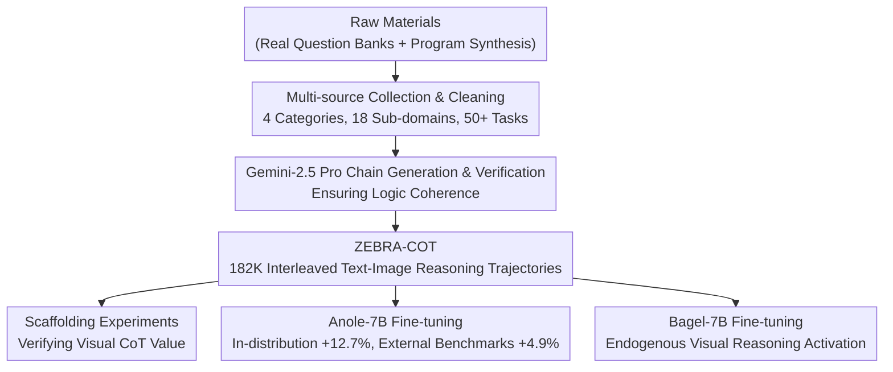

# Zebra-CoT: A Dataset for Interleaved Vision-Language Reasoning

**Conference**: ICLR 2026  
**OpenReview**: [https://openreview.net/forum?id=c6XIVI3TiQ](https://openreview.net/forum?id=c6XIVI3TiQ)  
**Code**: https://github.com/multimodal-reasoning-lab/Bagel-Zebra-CoT  
**Area**: Multimodal VLM  
**Keywords**: Visual Chain of Thought, Interleaved Text-Image Reasoning, Multimodal Dataset, Visual CoT, VLM Reasoning

## TL;DR
Constructed ZEBRA-COT, the first large-scale diverse interleaved text-image reasoning dataset (182K reasoning trajectories across 18 domains). Scaffolding experiments demonstrate that visual CoT has a potential improvement of up to +43% for frontier models, and fine-tuning enables Anole-7B and Bagel-7B to acquire endogenous visual reasoning capabilities.

## Background & Motivation

**Background**: When solving complex problems in geometry or physics, humans naturally employ visual aids such as diagrams or hand-drawn sketches. Visual Chain of Thought (Visual CoT) aims to allow multimodal models to generate and utilize visual intermediate steps during reasoning, rather than merely outputting text-only reasoning chains. Recent frontier VLMs (GPT-5, Gemini, Claude) can process multimodal inputs, yet their reasoning trajectories remain almost entirely textual.

**Limitations of Prior Work**: Existing methods follow two paths: first, "visual programming," where models call external Python tools to generate sketches; second, "endogenous visual reasoning," where models directly output visual tokens during the thinking process. The former relies on external toolchains and is difficult to train end-to-end; the latter, due to a lack of high-quality training data, has been restricted to specialized small models for single tasks like synthetic mazes. Existing interleaved datasets (OmniCorpus, MINT-1T) are large-scale web-crawled image-text corpora with weak semantic alignment and no reasoning structure, making them unsuitable for training visual reasoning. The only open-source interleaved reasoning dataset, Visual-CoT, is limited to the single task of "visual search."

**Key Challenge**: To enable models to learn endogenous visual reasoning, there is a need for "logically coherent, highly aligned, and task-diverse" interleaved reasoning training data—exactly what current datasets lack. Without such data, reinforcement learning paths are blocked: off-the-shelf visual CoT quality is too poor to provide a reliable initialization for RL.

**Core Idea**: A meticulously curated data pipeline that balances real-world scene collection with synthetic generation is proposed. Using Gemini-2.5 Pro as the "reasoning chain generation and quality inspection" engine, raw materials across multiple domains—including scientific reasoning, 2D/3D visual reasoning, and visual logic games—are unified into structured text-image interleaved reasoning trajectories, forming the first general-purpose visual CoT training dataset.

## Method

### Overall Architecture

ZEBRA-COT is a project for dataset construction and validation. The core output consists of 182,384 structured interleaved reasoning trajectories, following a unified format:

$$\text{<question>} \to \text{<text}_1\text{>} \to \text{<image}_1\text{>} \to \text{<text}_2\text{>} \to \text{<image}_2\text{>} \to \cdots \to \text{<answer>}$$

In each trajectory, textual steps explain the reasoning logic, while visual steps generate auxiliary images (e.g., geometric auxiliary lines, chessboard states, robot action frames), which are interleaved and highly complementary. The project is built on three pillars: a multi-source data construction pipeline, scaffolding validation of visual CoT value, and fine-tuning experiments on two models.

### Key Designs

**1. Multi-domain Construction Strategy: Combining Real-world Collection and Synthetic Generation**

The data covers four major categories, each utilizing a tailored construction strategy. **Scientific Reasoning** (Geometry, Physics, Chemistry, Graph Algorithms, Competitive Programming): Raw questions are extracted from open-licensed textbooks and datasets, parsed into structured visual CoT by Gemini-2.5 Pro; for competitive programming, a GPT-4.1-based agent was built to produce complete solving trajectories with visualization steps. **2D Visual Reasoning** (Visual Search, Puzzles): The Visual-CoT dataset was adapted by introducing two forms of visual assistance: "bounding boxes" and "region zooming"; puzzle tasks are generated from ImageNet crops, with visual CoT presented via step-by-step filling or overall restoration. **3D Visual Reasoning** (Embodied Planning, Robot Planning, Multi-hop Object Counting): ALFRED and RoboMIND benchmarks are reformatted as image-goal conditioned planning tasks where the model generates high-level plans based on initial and goal state images; multi-hop counting is designed in a CLEVR-style where scenes undergo multi-step object additions/removals, requiring the model to visualize each transformation. **Visual Logic and Strategy Games** (Chess, Checkers, Connect Four, Mazes, Tetris, ARC-AGI): Search processes and counterfactual reasoning are rendered as image sequences, teaching the model to perform long-range planning directly in visual space rather than losing spatial structure by converting the board into text.

The core value of this "Real + Synthetic" hybrid strategy lies in real questions ensuring task difficulty and distributional authenticity, while synthetic data (program rendering + Gemini filling) ensures coverage and the completeness of the visual CoT logic chain. Gemini-2.5 Pro simultaneously serves three roles: denoising, formatting, and logic coherence verification, making it the core engine ensuring final data quality.

**2. Scaffolding Experiments: Quantifying the Independent Contribution of Visual CoT**

To prove the actual value of visual CoT (rather than just the gain from "more data"), the paper designs a scaffolding experiment: asking frontier models (GPT-5, Claude Sonnet 4, Gemini 2.5 Pro) in three modes—Question only (Q), Question + first round of text-image reasoning (1MT), and Question + first two rounds (2MT). Even when provided with the first two steps as context, the model must still autonomously complete a large amount of remaining reasoning (some tasks have up to 20 intermediate images), thus providing "guidance" rather than "answer leakage."

A critical ablation was also performed: removing the visual steps in the reasoning chain while keeping only the text. It was found that the improvement from text CoT is significantly smaller than that from the full visual CoT, and performance even dropped in some tasks—as the text chains in these tasks heavily reference visual intermediate steps, making the logic incomplete when images are removed. This directly indicates that the performance gains primarily come from visual reasoning itself, not the accompanying text CoT.

**3. Activating Endogenous Visual Reasoning in Bagel-7B**

Beyond Anole-7B (which natively supports interleaved generation), the paper conducts a more challenging validation on Bagel-7B (a stronger image understanding base but natively lacks interleaved output). The original Bagel implementation does not support interleaved text-image output. The training loop was modified by introducing an additional loss term at the `<|vision start|>` token, allowing the model to learn to autonomously switch to image generation mode during reasoning. During inference, whenever `<im end>` is encountered, the next token is sampled—if predicted as `<|vision start|>`, it seamlessly enters the image generation pipeline, continuing the interleaved generation until the `<answer>` token.

With only 1000 steps of training on 8×H200, Bagel-Zebra-CoT can spontaneously generate meaningful visual auxiliary steps on out-of-distribution tasks, demonstrating that ZEBRA-COT effectively activates the model's endogenous visual reasoning capability—exactly the high-quality initialization needed for subsequent RL fine-tuning.

### Training Strategy

Anole-7B underwent full-parameter fine-tuning for 10k steps on 8×H200, with a learning rate of $1\times10^{-5}$, cosine decay, batch size of 8, maximum sequence length of 12,288 tokens, and a generation limit of 16,384. Bagel-7B was trained for only 1000 steps with a learning rate of $2\times10^{-5}$ using packed sequences (approximately 60,000 tokens per pack), with the shortest side of images compressed to 512 pixels (approx. 1024+ visual tokens/image). Both models wrap reasoning text in `<think>...</think>` and the final answer in `<answer>...</answer>`.

## Key Experimental Results

**Dataset Scale**: 182,384 interleaved reasoning trajectories across 4 categories, 18 sub-domains, and 50+ task types. Mazes (11.0%), Visual Puzzles (12.0%), and Embodied CoT (12.4%) represent the largest sub-domains.

**Frontier Model Scaffolding Experiments** (Q → 1MT → 2MT Mean):
- GPT-5: 41.98% → 52.06% → 65.10% (+23.12%)
- Claude Sonnet 4: 27.61% → 42.82% → 51.89% (+24.28%)
- Gemini 2.5 Pro: 24.93% → 42.47% → 52.31% (+27.38%)
- Mean across three models: 31.51% → 47.99% (+16.48%) → 56.70% (**+25.19%**)
- Max gain in Maze tasks: Average 52.59% → 96.36% (**+43.77%**)

**Anole-7B Fine-tuning**:
- In-distribution test set: 4.2% → 16.9% (+12.7%, 4× relative improvement)
- Mean across 7 external visual reasoning benchmarks: +4.9%, with VisuLogic increasing from 8.50% → 21.80% (**+13.3%**)

**Core Gaps with Existing Datasets**: Visual-CoT is the only open-source dataset covering interleaved reasoning but is limited to the single task of visual search. LLaVA-CoT, MAmmoTH-VL, and R1-OneVision all use text-only reasoning chains, unsuitable for visual CoT training. ZEBRA-COT is the first to excel across three dimensions: breadth (18 sub-domains), depth (up to 20 intermediate images per chain), and quality (logic verification via Gemini-2.5 Pro).

**Text CoT Ablation**: Removing all images and keeping only text in the visual CoT reasoning chain resulted in significantly lower performance gains compared to the full visual CoT, and performance even decreased in some tasks, proving that image steps are the primary source of gain rather than byproducts of text chains.

## Related Work & Insights

| Dataset | Reasoning Chain Modality | Suitable for Visual CoT Training |
|--------|-----------|-------------------|
| LLaVA-CoT | Text-only | No |
| MAmmoTH-VL | Text-only | No |
| R1-OneVision | Text-only | No |
| Visual-CoT | Image + Text | Limited (Visual Search only) |
| OmniCorpus | No Reasoning Structure | No (Web-noise pre-training data) |
| **ZEBRA-COT** | **Image + Text** | **Yes (Diverse Interleaved Visual CoT)** |

Visual-CoT is the only comparable open-source dataset in the paper, but it only covers the single task of visual search with fixed visual aids (boxes/zooming); ZEBRA-COT achieves a qualitative leap in task diversity, reasoning depth (up to 20 images), and domain coverage. MM-PhyQA introduced visual CoT for physics reasoning but is not open-sourced. CoT-VLA focuses on robot manipulation (action sequences) without text reasoning chains, differing in positioning from this work.

## Limitations & Future Work

Dataset construction depends on Gemini-2.5 Pro as a reasoning chain generator, meaning the quality ceiling is constrained by a single proprietary model, and the correctness of visual reasoning chains in some synthetic data (graph algorithms, competitive programming) is difficult to verify automatically. The paper acknowledges that Bagel-Zebra-CoT has not yet undergone RL fine-tuning and only provides a strong initialization; realizing the full potential of visual CoT in reinforcement learning remains for future work. Additionally, 182K samples is still moderate compared to text reasoning datasets; exploring scaling laws is a natural next step. The most direct follow-up research envisioned by the authors is to use the strong initialization from Bagel-Zebra-CoT and further enhance consistency and accuracy in visual reasoning via RL with verifiable rewards (such as RLVR), enabling AI to "draw as it thinks" as naturally as humans do with sketches.

<!-- RELATED:START -->

## Related Papers

- [\[ICLR 2026\] InternSpatial: A Comprehensive Dataset for Spatial Reasoning in Vision-Language Models](internspatial_a_comprehensive_dataset_for_spatial_reasoning_in_vision-language_m.md)
- [\[CVPR 2026\] ViRC: Enhancing Visual Interleaved Mathematical CoT with Reason Chunking](../../CVPR2026/vlm_reasoning/virc_enhancing_visual_interleaved_mathematical_cot_with_reason_chunking.md)
- [\[ICLR 2026\] Synergizing Understanding and Generation with Interleaved Analyzing-Drafting Thinking](synergizing_understanding_and_generation_with_interleaved_analyzing-drafting_thi.md)
- [\[ICLR 2026\] ThinkMorph: Emergent Properties in Multimodal Interleaved Chain-of-Thought Reasoning](thinkmorph_emergent_properties_in_multimodal_interleaved_chain-of-thought_reason.md)
- [\[ICLR 2026\] VisualPRM400K: An Effective Dataset for Training Multimodal Process Reward Models](visualprm400k_an_effective_dataset_for_training_multimodal_process_reward_models.md)

<!-- RELATED:END -->
