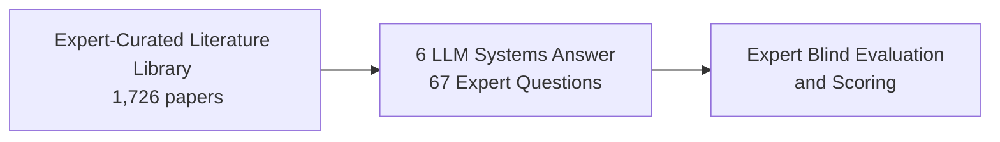

# Expert Evaluation of LLM World Models: A High-Tc Superconductivity Case Study

**Conference**: ICML 2025  
**arXiv**: [2511.03782](https://arxiv.org/abs/2511.03782)  
**Code**: None  
**Area**: LLM Evaluation / Scientific Reasoning  
**Keywords**: LLM World Model Evaluation, Retrieval-Augmented Generation (RAG), High-Tc Superconductivity, Expert Evaluation, Scientific Literature QA

## TL;DR

Using the field of high-temperature superconductivity (HTS) as a case study, an expert-level dataset (1,726 papers + 67 expert questions) is constructed to systematically evaluate the scientific literature understanding capabilities of six LLM systems. The evaluation reveals that RAG systems based on curated literature significantly outperform general closed-source models in terms of factual completeness and evidentiary support.

## Background & Motivation

Since the discovery of high-temperature superconductivity (HTS) in 1986, a massive volume of experimental literature has accumulated, covering dozens of experimental techniques such as ARPES, STM, neutron scattering, NMR, and optical conductivity. The core challenges in this field are:

**Huge Literature Volume**: Thousands of papers span four decades of experimental data, making it virtually impossible for new researchers to digest them comprehensively.

**Diverse and Conflicting Views**: Different theoretical frameworks provide contradictory explanations for the same experimental phenomena.

**Multi-probe Synthesis**: Valuable scientific answers require the integration of results from multiple experimental probes.

**Complex Temporal Dimension**: The significance of early experimental findings may be revised or even overturned by subsequent discoveries.

Ideally, early-career researchers would benefit from an "on-demand panel of expert advisors" that can reliably and comprehensively answer complex scientific questions. This work evaluates **how far current LLM systems are from realizing this ideal**.

## Method

### Overall Architecture

The methodology of this work consists of three core modules:

The overall workflow is as follows: first, domain experts curate the superconductivity literature, followed by the construction of an expert-level question set. Then, different LLM systems are employed to answer these questions. Finally, 12 top physicists perform a multi-dimensional blind evaluation of the generated answers.

### Key Designs

#### 1. Literature Database Construction

- **Sources**: Starting from the reference lists of 15 review papers, an initial collection of 3,279 papers was compiled.
- **Review Coverage**: Covers classic reviews such as Varma (2020), Proust (2019), and Lee (2006).
- **Temporal Supplementation**: Since the latest review was published in 2020, 28 recent experimental papers were added.
- **Theory/Experiment Classification**: LLMs were used to classify the title and abstract of each paper, computing confidence levels via the L3Score method. Ultimately, **1,726 experimental papers** were filtered from the 3,279 papers as the primary data source.
- **Metadata Management**: Zotero was utilized for literature metadata storage.

#### 2. Expert Question Set Design (67 Questions)

Questions were designed by 12 domain experts, covering almost all core physical concepts in high-temperature superconductivity:

| Physical Concept Category | Representative Experimental Techniques | Question Characteristics |
|---|---|---|
| Quantum Critical Point (QCP) | Specific heat, magnetic susceptibility, transport | Requires synthesis of multiple experimental evidences |
| Carrier Density and Doping Dependence | Hall effect, ARPES | Requires understanding of differences among material families |
| Pairing Symmetry | Phase-sensitive experiments, SQUID | Requires distinguishing between d-wave and s-wave evidence |
| Normal State Symmetry Breaking | STM, neutron scattering | Requires presentation of multiple theoretical perspectives |
| Stripe Order (spin vs charge) | Neutron scattering, X-ray | Requires weighing debates on the driving force |
| Vortex Properties | STM, $\mu$SR | Requires incorporating material-specific characteristics |
| Spin Fluctuation Incommensurability | Neutron scattering, NMR | Requires comparison across material families |
| Fermi Surface Reconstruction | ARPES, quantum oscillations | Requires merging multi-probe results |

Design principles for each question:
- Involves comprehensive reasoning across **multiple theoretical concepts** and **various experimental probes**.
- Requires the presentation of diverse perspectives for academic disagreements.
- Evaluates not only the accuracy of the answer, but also the inclusion of correct citations to **experimental evidence**.

#### 3. Six Evaluated LLM Systems

This study tests six systems across two categories:

**General Closed-Source Models (4) — Based on Training Data + Web Search**:

| System ID | System Name | Knowledge Source | Image Retrieval Capability |
|---|---|---|---|
| System-1 | ChatGPT-4o | Training data + Web search | None |
| System-2 | Perplexity | Training data + Web search | Yes (Web images) |
| System-3 | Claude 3.5 | Training data + Web search | None |
| System-4 | Gemini Advanced Pro 1.5 | Training data + Web search | None |

**Curated Literature-Based RAG Systems (2) — Based on 1,726 Curated Papers**:

| System ID | System Name | Knowledge Source | Image Retrieval Capability |
|---|---|---|---|
| System-5 | NotebookLM | Curated literature library | None (Unstable) |
| System-6 | Custom RAG System | Curated literature library | Yes (Paper figures and tables) |

#### 4. Custom RAG System Design (System-6)

This is the core technical contribution of the paper. The system architecture includes three key components:

**Index Construction**:
- PDFFigures is used to parse PDFs, separating text from figures/tables (including their captions).
- Text segments are chunked and indexed using the Gecko text embedding model.
- Images are encoded with a multimodal embedding model (ALIGN), taking the average of the image embedding and the caption text embedding as the feature vector.
- Text and image indexes are constructed separately.

**Retrieval and Generation**:
- Given a query, relevant passages are first retrieved from the text index.
- Gemini 1.5 Flash generates a coherent answer based on the retrieved text passages.
- The generation process is prompted to include source citations.

**Image Retrieval**:
- Simultaneously, relevant figures and tables are retrieved from the image index.
- The most relevant scientific visualization charts are appended to the answer.
- This ensures the answers are backed not only by text but also by **visualized experimental evidence**.

#### 5. NotebookLM Prompt Engineering (System-5)

Since NotebookLM is designed for general users by default, the authors adapted the prompts as follows:
- Required the model to use "language suitable for a technical audience," assuming the reader "has a PhD in physics."
- Prioritized the citation of "literature with experimental results" over theoretical ones.
- Provided "summaries of major differing viewpoints."
- Prioritized the use of "numerical results as evidence for each viewpoint."
- Included a reference table of common abbreviations for superconducting materials (e.g., LSCO: $\text{La}_{2-x}\text{Sr}_x\text{CuO}_4$).

### Evaluation Strategy

The evaluation corresponds to five dimensions of expert scoring:

1. **Balanced Perspective**: Presentation of diverse viewpoints when academic disagreements exist.
2. **Factually Comprehensive**: Coverage of all known experimental facts.
3. **Succinctness**: Conciseness and lack of redundancy in the answers.
4. **Supported by Evidence**: Grounding in reliable experimental evidence with correct literature citations.
5. **Relevance of Images**: Whether the retrieved figures/tables support the argument (only applicable to System-2 and System-6).

Evaluation was conducted in a **blind evaluation** manner: each expert scored the answers independently without knowing which system generated them.

## Key Experimental Results

### Main Results

| Evaluation Dimension | General Closed-source Model (Best) | RAG System (Best) | Winner |
|---|---|---|---|
| Balanced Perspective | ChatGPT/Claude (Moderate) | NotebookLM/Custom (Superior) | RAG |
| Factually Comprehensive | Moderate | Significantly Higher | RAG (Substantial lead) |
| Succinctness | Good | Slightly Worse (longer answers) | Closed-source (Slightly better) |
| Supported by Evidence | Weak (often unreliable citations) | Strong (precise citations) | RAG (Significant lead) |
| Relevance of Images | Perplexity (Limited) | Custom (Excellent) | RAG (Leading) |

Core Conclusion: **The two RAG systems utilizing curated literature (System-5 and System-6) comprehensively outperform the four general closed-source models across key metrics**, showing a distinct advantage particularly in factual completeness and evidentiary support.

### Ablation Study

| Configuration | Key Performance Difference | Explanation |
|---|---|---|
| General Models vs RAG | RAG is significantly superior in completeness | Curated literature limits knowledge boundaries and reduces hallucination. |
| Text-Only RAG vs Multimodal RAG | System-6 shows unique advantages in image evidence | Experimental science heavily relies on data visualization. |
| With Web Search vs Without Web Search | Web search does not guarantee accuracy | Web source reliability is inferior to peer-reviewed papers. |
| With Prompt Engineering vs Default Prompts | Tailored prompts significantly improve quality | This is particularly pronounced for NotebookLM. |

### Key Findings

1. **Value of Curated Literature**: Restricting the LLM knowledge base to expert-curated papers performs better than allowing free web searches, reducing interference from unreliable sources.
2. **Necessity of Multimodal Retrieval**: Answers in experimental science require visual data support; pure text answers lack persuasiveness even when correct. The ability of System-6 to retrieve original figures from papers is a critical advantage.
3. **Common Limitation of All Systems**: Even the best systems struggle to comprehensively cover all aspects of complex questions—covering only a small fraction for questions involving up to 10 aspects.
4. **Discrepancy in Citation Reliability**: General closed-source models frequently hallucinate non-existent citations or link mismatched literature, whereas RAG systems yield significantly higher citation accuracy.
5. **Trade-off in Succinctness**: Due to retrieving more relevant information, RAG systems generate longer answers and rank lower in succinctness than general models.

## Highlights & Insights

1. **Uniqueness of Evaluation Methodology**: The greatest contribution of this paper is not technical innovation, but its methodology—using **real domain experts** (from Cornell, Harvard, Stanford, MIT, etc.) to perform blind evaluations of LLMs, which is far more rigorous than automated benchmarks.
2. **Design Philosophy of the Question Set**: The 67 questions are not simple factual queries, but deep reasoning problems requiring integration of multiple experimental techniques and balancing of different theoretical frameworks, representing the true way to evaluate a "world model."
3. **RAG is Not a Silver Bullet**: Even with RAG on curated literature, systems still fail to exhibit expert-level "judgment"—such as determining which early experiments remain valuable or which conclusions have been corrected by subsequent work.
4. **Implications for AI for Science**: To make AI a competent "scientific assistant," what is needed is not just better models, but also **knowledge bases meticulously curated by domain experts** and the **ability to present multimodal evidence**.

## Limitations & Future Work

1. **Single-Domain Validation**: Tested only in high-temperature superconductivity; whether the conclusions generalize to other scientific domains remains uncertain.
2. **High Evaluation Cost**: Demands significant time from top-tier experts for blind evaluation, making it difficult to scale.
3. **Static Literature Base**: The 1,726 papers stop at recent years, unable to dynamically track the latest developments.
4. **Lack of Interactive Evaluation**: Only single-turn QA was tested, without evaluating interactive scenarios such as multi-turn follow-up questions.
5. **Exclusion of Theoretical Papers**: Operating solely on experimental papers may miss the contribution of theoretical frameworks to synthesized understanding.
6. **Rapid Model Version Decontainment**: The models tested have since been updated, and results may evolve with model updates.

## Related Work & Insights

- **Scientific RAG**: Validates the necessity of RAG in highly specialized scientific domains, inspiring future efforts to construct expert-curated knowledge bases for other domains.
- **LLM Evaluation**: Unlike automated benchmarks like MMLU or SciQ, it highlights the irreplaceable nature of expert manual evaluation in scientific domains.
- **Multimodal AI for Science**: Image retrieval capability is vital for experimental science; future work can explore more advanced scientific chart understanding models.
- **Knowledge Curation**: Curated literature > web search, which offers key guidance for constructing domain-specific AI systems.

## Rating

- **Novelty**: ⭐⭐⭐⭐ — Unique evaluation framework, though technical contribution is limited.
- **Experimental Thoroughness**: ⭐⭐⭐⭐⭐ — Extremely thorough, involving blind evaluations by 12 top experts and comparisons across 6 systems.
- **Writing Quality**: ⭐⭐⭐⭐ — Well-structured with detailed background context.
- **Value**: ⭐⭐⭐⭐ — Highly inspiring for the future of AI for Science; the dataset and evaluation framework are reusable.

<!-- RELATED:START -->

## Related Papers

- [\[ACL 2025\] How LLMs Comprehend Temporal Meaning in Narratives: A Case Study in Cognitive Evaluation of LLMs](../../ACL2025/llm_nlp/how_llms_comprehend_temporal_meaning_in_narratives_a_case_study_in_cognitive_eva.md)
- [\[ACL 2025\] A Large-Scale Real-World Evaluation of an LLM-Based Virtual Teaching Assistant](../../ACL2025/llm_nlp/a_large-scale_real-world_evaluation_of_llm-based_virtual_teaching_assistant.md)
- [\[ACL 2025\] If Eleanor Rigby Had Met ChatGPT: A Study on Loneliness in a Post-LLM World](../../ACL2025/llm_nlp/if_eleanor_rigby_had_met_chatgpt_a_study_on_loneliness_in_a_post-llm_world.md)
- [\[ACL 2025\] Transforming Podcast Preview Generation: From Expert Models to LLM-Based Systems](../../ACL2025/llm_nlp/transforming_podcast_preview_generation_from_expert_models_to_llm-based_systems.md)
- [\[ACL 2025\] Can LLMs Interpret and Leverage Structured Linguistic Representations? A Case Study with AMRs](../../ACL2025/llm_nlp/can_llms_interpret_and_leverage_structured_linguistic_representations_a_case_stu.md)

<!-- RELATED:END -->
