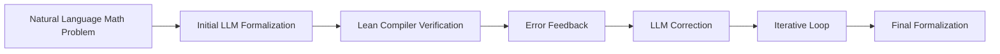

# FMC: Formalization of Natural Language Mathematical Competition Problems

**Conference**: ICML 2025 (AI4MATH Workshop)  
**arXiv**: [2507.11275](https://arxiv.org/abs/2507.11275)  
**Code**: —  
**Area**: LLM Reasoning / Mathematical Formalization / Automated Theorem Proving  
**Keywords**: Autoformalization, Lean, Error Feedback, Olympiad Math, Formal Reasoning, Theorem Proving  

## TL;DR

This paper proposes a fully automated formalization pipeline based on LLM error feedback that translates natural language mathematical competition problems into Lean formal representations, constructing FMC, an Olympiad-level dataset containing 3,922 natural language problems aligned with 9,787 Lean formalizations, and validating its value as an automated theorem proving benchmark.

## Background & Motivation

Formal mathematical reasoning requires translating natural language mathematical problems precisely into formal languages (such as Lean, Isabelle) to enable automated theorem provers to perform machine verification. This process (autoformalization) faces several challenges:

**Extremely high manual annotation cost**: The formalization of math competition problems requires formal verification experts, making human annotation extremely slow.

**Limited scale of existing datasets**: miniF2F contains only 488 problems, and ProofNet contains only 371 problems, which are insufficient to support large-scale training and evaluation.

**Under-explored formalization capability of LLMs**: Can LLMs achieve fully automated and reliable formalization of mathematical problems?

Goal: Design a training-free, fully automated pipeline utilizing LLMs to translate a large number of natural language mathematical competition problems into high-quality Lean formalizations, establishing a large-scale benchmark.

## Method

### Overall Architecture

### 1. Data Collection and Preprocessing

Olympiad-level math competition problems were collected from multiple sources:
- AMC/AIME (American Mathematics Competitions / American Invitational Mathematics Examination)
- IMO Shortlist (International Mathematical Olympiad Shortlist)
- National-level mathematical competition problems from various countries

A total of 3,922 natural language mathematics problems were collected, covering four major domains: algebra, combinatorics, geometry, and number theory.

### 2. Key Designs

Use LLMs (such as GPT-4, DeepSeek) to translate natural language problems into Lean 4 formal representations. Key designs include:

**Few-shot Prompting**: Providing 3-5 high-quality aligned "natural language - Lean" examples to help the LLM comprehend formalization patterns:

$$P_{\text{prompt}} = \{(x_1, f_1), (x_2, f_2), \ldots, (x_k, f_k)\} \cup \{x_{\text{target}}\}$$

**Multi-candidate Sampling**: Generating multiple formalization candidates for each problem to increase the hit probability:

$$\{f_1, f_2, \ldots, f_n\} = \text{LLM}(x, P_{\text{prompt}}, T, n)$$

### 3. Loss & Training

The Lean compiler provides precise syntax and type error messages. When formalization fails, the error messages are fed back to the LLM for correction:

$$f_{t+1} = \text{LLM}(x, f_t, e_t)$$

where $e_t$ is the compilation error message at the $t$-th round. Each problem undergoes up to $T$ iterations of feedback correction.

### 4. Quality Evaluation

A multi-dimensional evaluation mechanism is adopted:
- **Compilation Pass Rate**: Whether the formalization can be accepted by the Lean compiler.
- **Semantic Consistency**: Whether the formalization faithfully conveys the original problem's meaning (assessed by humans or LLMs).
- **Quality Categorization**: Classifying formalizations into "high quality", "medium quality", and "low quality" levels.

## Experiments

### Dataset Statistics

| Metric | Value |
|------|------|
| Natural Language Math Problems | 3,922 |
| Lean Formalizations | 9,787 (including multiple candidates) |
| Compilation Pass Rate | ~70% (post error feedback) |
| Above-Average Quality Proportion | 64.46% |
| Covered Domains | Algebra / Combinatorics / Geometry / Number Theory |

### Formalization Capability Comparison

| Model | Initial Compilation Pass Rate | Pass Rate Post Error Feedback | Gain |
|------|--------------|----------------|------|
| GPT-4 | 45.2% | 68.7% | +23.5% |
| DeepSeek-V2 | 38.6% | 61.3% | +22.7% |
| Claude-3 | 41.8% | 64.2% | +22.4% |
| LLaMA-3-70B | 28.3% | 48.9% | +20.6% |

### Error Feedback Iteration Analysis

| Feedback Iteration | Cumulative Compilation Pass Rate |
|----------|--------------|
| 0 (Initial) | ~40% |
| 1 | ~55% |
| 2 | ~63% |
| 3 | ~67% |
| 5 (Saturation) | ~70% |

### Automated Theorem Prover Evaluation

| Prover | FMC Pass Rate | miniF2F Pass Rate |
|--------|-----------|---------------|
| Lean Tactic | 12.3% | 35.2% |
| DSP-v1.5 | 18.7% | 54.9% |
| ReProver | 15.1% | 42.8% |

The pass rate on FMC is significantly lower than that on miniF2F, indicating that FMC is much more challenging.

### Key Findings

- **Error feedback significantly improves formalization quality**: Achieving an average gain of over 20 percentage points.
- **Few-shot > Zero-shot**: Providing formalization examples increases the compilation pass rate by approximately 15%.
- **Benefits of increased sampling**: Raising the sample size from 1 to 16 samples increases the pass rate by around 25%.
- **FMC is more challenging than miniF2F**: The strongest prover achieves a pass rate of less than 20% on FMC.

## Highlights & Insights

- **Fully automated & training-free**: The pipeline does not require supplementary training and accomplishes formalization purely using existing LLMs.
- **Error feedback is crucial**: The precise error messages from the Lean compiler serve as the core engine for enhancing formalization quality.
- **Large-scale Olympiad-level formalization dataset**: The scale of FMC significantly exceeds that of miniF2F (3,922 vs 488), filling the blank of large-scale formalization benchmarks.
- **Revealing the limitations of LLM formalization capability**: Even with the strongest models combined with error feedback, the pass rate remains far below 100%.

## Limitations & Future Work

- Compilation pass under Lean does not equate to semantic correctness; some formalizations might clear type checking but deviate from the original problem meaning.
- An "above-average" quality rate of 64.46% implies that approximately one-third of the data still suffers from quality deficiencies.
- It currently only supports Lean 4 and has not been expanded to other formal languages such as Isabelle or Coq.
- The formalization quality of geometry problems is significantly lower than that of algebra and number theory problems.

## Related Work & Insights

- **miniF2F (Zheng et al., 2022)**: A classic, small-scale formal mathematical benchmark.
- **ProofNet (Azerbayev et al., 2023)**: An undergraduate-level mathematical formalization dataset.
- **DeepSeek-Prover (Xin et al., 2024)**: LLM-driven formal theorem proving.
- The contribution of this work lies on the data side: rather than improving the prover, it constructs a larger and more challenging formalization benchmark.

## Rating

⭐⭐⭐⭐ — A highly practical, large-scale formalization dataset with a simple and effective pipeline design, establishing an important infrastructure for mathematical formal reasoning research.

<!-- RELATED:START -->

## Related Papers

- [\[ICLR 2026\] ProofBridge: Auto-Formalization of Natural Language Proofs in Lean via Joint Embeddings](../../ICLR2026/llm_reasoning/proofbridge_auto-formalization_of_natural_language_proofs_in_lean_via_joint_embe.md)
- [\[ACL 2025\] Complex Reasoning with Natural Language Contexts and Background Knowledge](../../ACL2025/llm_reasoning/complex_reasoning_with_natural_language_contexts_and_background_knowledge.md)
- [\[ACL 2025\] Chain-of-Reasoning: Towards Unified Mathematical Reasoning in Large Language Models via a Multi-Paradigm Perspective](../../ACL2025/llm_reasoning/chain_of_reasoning_unified_math.md)
- [\[NeurIPS 2025\] SQL-R1: Training Natural Language to SQL Reasoning Model By Reinforcement Learning](../../NeurIPS2025/llm_reasoning/sql-r1_training_natural_language_to_sql_reasoning_model_by_reinforcement_learnin.md)
- [\[ICML 2026\] Reward Modeling from Natural Language Human Feedback](../../ICML2026/llm_reasoning/reward_modeling_from_natural_language_human_feedback.md)

<!-- RELATED:END -->
