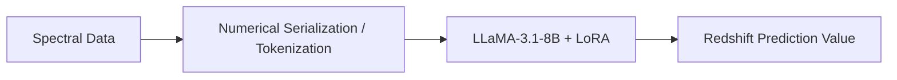

# Teaching LLMs to Speak Spectroscopy

**Conference**: ICML 2025 (ML4Astro Workshop)

**arXiv**: [2508.10075](https://arxiv.org/abs/2508.10075)

**Authors**: Nesar Ramachandra, Yuan-Sen Ting, Zechang Sun, Azton Wells, Salman Habib

**Area**: Physics / Astrophysics / LLM Cross-Modal Adaptation

**Keywords**: LLM Fine-tuning, LoRA, Spectral Analysis, Redshift Prediction, Galaxy, LLaMA, Cross-modal Learning, Parameter-Efficient Fine-Tuning

## TL;DR

Using only 16 GPU hours and 0.04% parameter adaptation via LoRA, **LLaMA-3.1-8B** is adapted to predict planetary/galaxy redshifts from spectral data while retaining over 85% of its natural language capabilities, demonstrating that general LLMs can be efficiently adapted to non-textual scientific modalities.

## Background & Motivation

Applying Transformer models to astronomical spectral analysis typically requires training specialized models from scratch, which faces three practical challenges:

**High computational resources**: Extensive GPU resources and domain expertise are required to design custom tokenizers, positional encodings, etc.

**Fragmented ecosystem**: Domain-specific models cannot leverage optimized inference frameworks in the broader LLM ecosystem (such as vLLM, TensorRT-LLM, etc.).

**Integration difficulties**: Constructing complex interfaces between LLMs and specialized models is necessary within Agent workflows.

**Core Problem**: Can pre-trained LLMs be directly adapted to handle non-textual scientific data through efficient fine-tuning?

While this approach has been explored in fields such as chemistry (Jablonka et al., 2024), materials design (Gruver et al., 2024), and protein design (Lv et al., 2024), it is the first of its kind in astronomy.

## Method

### Overall Architecture



The model simultaneously retains its original language capabilities, achieving "one model handling both spectral analysis and natural language reasoning."

### Data Preparation

- **Data Source**: SDSS DR16, selecting galaxies with $0 < z < 0.5$ and dereddening $i < 18$.
- **Data Volume**: 10,000 galaxy spectra, with 3,000 used for training and 1,000 for validation.
- **Sampling Strategy**: Equal-frequency binning to ensure uniform coverage across the redshift range.
- **Preprocessing**: Logarithmic wavelength to linear wavelength conversion, normalized flux.

### Key Designs: Tokenization

Instead of training a dedicated tokenizer, the text tokenizer of the LLM is directly utilized:

The flux value $4.56$ is serialized as `"4|5|6"` (base=10, prec=2), and the full spectrum is concatenated as:

```text
"4|5|6 , 7|5|4 , 1|1|2|0 ,"
```

Input prompt prefix: `"Galaxy spectrum is rescaled and encoded to an input series:"`

Target format: `"Redshift: [value]"`

This method does not require any architectural modifications, establishing a lower bound on performance under "minimum effort."

### LoRA Fine-tuning

Weight updates are decomposed into low-rank matrices:

$$W + \Delta W = W + BA, \quad B \in \mathbb{R}^{d \times r}, A \in \mathbb{R}^{r \times k}, \quad r \ll \min(d, k)$$

**Key Configurations**:
- Model: LLaMA-3.1-8B-Instruct
- LoRA rank: 8
- Trainable parameters: 3.4M (0.04% of total parameters)
- Training: 2 epochs
- Computational resources: 16 A100 GPU hours
- Each training sample occupies less than 7% of the 8K context window

## Key Experimental Results

### Hyperparameter Ablation Study

| Learning Rate | LoRA Rank | Training Data Size | Epochs | Redshift MAE↓ | Science QA Retention↑ | General QA Retention↑ |
|:---|:---|:---|:---|:---|:---|:---|
| $10^{-5}$ | 8 | 3,000 | 2 | 0.104 | 96.5% | 95.1% |
| **$10^{-4}$** | **8** | **3,000** | **2** | **0.043** | **85.2%** | **89.4%** |
| $10^{-3}$ | 8 | 3,000 | 2 | 0.065 | 76.2% | 79.8% |

### LoRA Rank Ablation Study

| LoRA Rank | Redshift MAE↓ | Science QA Retention↑ | General QA Retention↑ |
|:---|:---|:---|:---|
| 4 | 0.078 | 87.8% | 91.2% |
| **8** | **0.043** | **85.2%** | **89.4%** |
| 16 | 0.057 | 82.1% | 86.7% |

### Epochs Ablation Study

| Epochs | Redshift MAE↓ | Science QA Retention↑ | General QA Retention↑ |
|:---|:---|:---|:---|
| 1 | 0.099 | 87.9% | 91.5% |
| **2** | **0.043** | **85.2%** | **89.4%** |
| 3 | 0.074 | 83.7% | 88.1% |

### Key Findings

1. **Learning rate of $10^{-4}$ is the optimal balance point**: achieving an MAE of 0.043 while limiting language degradation to <15%.
2. **Rank 8 is optimal**: lower ranks suffer from capacity bottlenecks, while higher ranks yield diminishing returns and exacerbate language degradation.
3. **2 epochs are optimal**: 1 epoch leads to under-adaptation, while 3 epochs cause overfitting and worsen catastrophic forgetting of pre-existing knowledge.
4. **Model retains multimodal reasoning capabilities**: after fine-tuning, the model remains capable of answering domain-specific queries about galaxy classifications at redshift $z=0.315$.

### Comparison with Dedicated Methods

- Dedicated spectral redshift methods can achieve an MAE < 0.01 (Bolton et al., 2012).
- The proposed method reaches a MAE of 0.043, which is competitive but not SOTA.
- **The core value lies not in absolute precision**, but in the ability of a single model to simultaneously handle raw data processing and natural language reasoning.

## Highlights & Insights

- **Extremely low adaptation costs**: 0.04% of parameters + 16 GPU hours $\rightarrow$ competitive spectral analysis performance.
- **Philosophy of "augmentation rather than replacement"**: expanding to scientific modalities while maintaining language capabilities, supporting end-to-end Agent workflows.
- **Reveals the universality of Transformer representations**: models pre-trained on text capture general computational strategies applicable to sequence signal processing.
- **Lowers the barrier to entry**: domain scientists do not need to design specialized architectures; they can simply utilize standard fine-tuning APIs.
- **Practical demonstration of Agent integration**: the same model first predicts the redshift, and then discusses the galaxy type and observation strategies using natural language in a unified session.

## Limitations & Future Work

1. **Only a single task is validated** (redshift prediction); other spectral tasks such as stellar parameters and elemental abundances remain untested.
2. **Suboptimal Tokenization**: text tokenizers process numerical data far less efficiently than learned tokenizers.
3. **Short paper (6 pages)**: although systematic, the ablation studies are limited in depth.
4. **A gap of MAE=0.04 compared to SOTA**: this might be insufficient for scenarios requiring high precision.
5. **Larger models are untested**: do larger models like 70B retain more language capabilities while achieving better precision?
6. **Workshop paper**: not a main conference paper, thus peer review depth is limited.

## Related Work & Insights

- **TransformerPayne (Różański et al., 2025)**: Dedicated astronomical Transformer, trained from scratch.
- **AstroConformer (Pan et al., 2024)**: Dedicated model for astronomical time-series.
- **Jablonka et al. (2024)**: LLMs for chemical prediction (pioneering similar ideas in chemistry).
- **Gruver et al. (2024)**: Fine-tuning LLMs to generate inorganic materials (similar work in materials science).
- **ProLLaMA (Lv et al., 2024)**: LLM adaptation for protein sequences.

**Insight**: This work proposes an important practical paradigm—rather than training domain-specific models from scratch, lightweight adaptation on general LLMs is highly viable. As the foundational capabilities of LLMs continue to improve, the cost-performance ratio of this "ride-along" strategy will become increasingly attractive. It is particularly friendly to domain scientists with limited computational resources.

## Rating

- **Novelty**: ⭐⭐⭐ — The concept has precedents in other fields, but this is a first in astronomy.
- **Technical Depth**: ⭐⭐⭐ — The approach is straightforward; ablation studies are systematic but the paper is short.
- **Value**: ⭐⭐⭐⭐⭐ — Extremely low cost + standard API = highly reproducible and extensible.
- **Writing Quality**: ⭐⭐⭐⭐ — Clear and concise, fits the workshop format.
- **Overall Rating**: 7/10 — High practical value, but limited technical contribution.

<!-- RELATED:START -->

<div class="related-papers" markdown="1">

## Related Papers

- [\[ICML 2026\] Teaching Molecular Dynamics to a Non-Autoregressive Ionic Transport Predictor](../../ICML2026/physics/teaching_molecular_dynamics_to_a_non-autoregressive_ionic_transport_predictor.md)
- [\[ICML 2025\] Finetuning Stellar Spectra Foundation Models with LoRA](finetuning_stellar_spectra_foundation_models_with_lora.md)
- [\[ICML 2025\] Liger: Linearizing Large Language Models to Gated Recurrent Structures](liger_linearizing_large_language_models_to_gated_recurrent_structures.md)
- [\[ICML 2025\] L2D: Large Language Models to Diffusion Finetuning](large_language_models_to_diffusion_finetuning.md)
- [\[NeurIPS 2025\] The Primacy of Magnitude in Low-Rank Adaptation](../../NeurIPS2025/physics/the_primacy_of_magnitude_in_low-rank_adaptation.md)

</div>

<!-- RELATED:END -->
