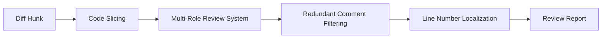

# Towards Practical Defect-Focused Automated Code Review

**Conference**: ICML 2025 Spotlight  
**arXiv**: [2505.17928](https://arxiv.org/abs/2505.17928)  
**Code**: None  
**Area**: Software Engineering / Automated Code Review  
**Keywords**: Code Review Automation, Defect Detection, Code Slicing, Multi-Role LLM Framework, False Positive Filtering

## TL;DR

An end-to-end automated code review framework focused on **real defect detection** is proposed. By utilizing four modules—code slicing for context extraction, multi-role LLM collaborative review, redundant comment filtering, and line number localization—it achieves a **2× improvement** over standard LLM methods and a **10× improvement** over prior baselines on an industrial-grade C++ codebase.

## Background & Motivation

### Key Challenge

**Key Challenge**: **Background**: Modern Code Review (MCR) is a critical phase for ensuring code quality and detecting defects, but it is extremely time-consuming and labor-intensive. Existing automated review methods suffer from three core limitations:

**Over-simplified task modeling**: They model reviews as chunk-level code-to-text generation tasks, neglecting repository-level context.

**Evaluation metrics detached from reality**: They rely on text similarity metrics such as BLEU and ROUGE, failing to measure actual defect detection capabilities.

**Lack of real-world deployment validation**: They lack end-to-end evaluation on actual Merge Request levels in industrial-grade codebases.

The industrial background of this work originates from the online recommendation service of a company with nearly **400 million daily active users (DAUs)**. Company statistics reveal that in 2022, 30% of P1+ severe incidents (asset losses exceeding $350,000) stemmed from poorly reviewed, low-level defects. In 2024, core disruptions related to code changes still accounted for 67% of incidents. This background highlights the urgent demand for practical automated review tools.

## Core Problem

The authors identify four key challenges in real-world deployment:

| Challenge | Description |
|------|------|
| **❶ Code Context Capture** | Effective review requires analyzing dependencies beyond the diff (variable declarations, method calls, etc.), but excessively long inputs degrade LLM performance |
| **❷ Key Bug Inclusion (KBI)** | Existing metrics fail to measure whether actual key defects are detected |
| **❸ False Alarm Rate (FAR)** | Generative models produce a vast amount of irrelevant comments (nitpicks, hallucinations), increasing developer cognitive load |
| **❹ Human-AI Workflow Integration** | Comments must be precisely pinned to specific code lines to seamlessly integrate into developer workflows |

## Method

### Overall Architecture

The framework consists of four decoupled modules that process the input sequentially:



### 3.1 Code Slicing

Based on AST-based static analysis, four optional slicing strategies are proposed:

1. **Original Diff**: The baseline code change difference without extra context.
2. **Parent Function**: Identifies the minimal parent function containing the changes, providing function-level context.
3. **Left Flow**: Tracks all Left-values (L-values) in control structures within the function, focusing on variable lifespans.
4. **Full Flow**: Tracks Right-values (R-values) and collects invoked function signatures in addition to the Left Flow, offering the most comprehensive coverage of variable usage and modifications.

A cache mechanism is used to avoid duplicate slicing and improve efficiency. Empirical results demonstrate that **Left Flow is the most effective**—while Full Flow provides more context, excessively long inputs tend to distract the LLM.

### 3.2 Multi-Role Code Review System

Four collaborative roles are designed to perform specific tasks:

| Role | Function |
|------|------|
| **Reviewer** | Reviews each code slice and outputs potential issues according to a predefined template |
| **Meta-Reviewer** | Aggregates comments from multiple Reviewers, filters and ranks them based on thresholds, and merges duplicate issues |
| **Validator** | Re-evaluates the original code chunk to verify comments, re-scores them, and retains only those exceeding a threshold |
| **Translator** | Translates the final comments into the target language to ensure format compatibility with development environments |

Each role incorporates **Chain-of-Thought (CoT)** reasoning strategies.

### 3.3 Redundant Comment Filtering Mechanism

To tackle the large volume of nitpicks and hallucinations generated by LLMs, a three-tier question-based filtering system is designed:

- **Q1**: Is this comment a nitpick? (e.g., asking for unnecessary comments, over-complex error handling)
- **Q2**: Does this comment point out a pseudo-issue? (e.g., null checks on well-known, reliable internal libraries)
- **Q3**: What is the severity of this issue? (missing comments vs. potential core dumps or infinite loops)

Each question is scored on a scale of 1-7 (1 = nitpick/pseudo-issue/minor, 7 = severe and real). The filtering flow operates as follows:

1. **Coarse-grained Filtering (Reviewer Phase)**: Comments with Q1 or Q2 $\le 4$ are discarded immediately; the remaining are sorted by Q3, keeping the Top-N.
2. **Fine-grained Filtering (Meta-Reviewer Phase)**: Merges comments flagged by multiple Reviewers and discards those mentioned by only one Reviewer.
3. **Validation and Re-scoring (Validator Phase)**: Re-evaluates the original code using the Q1-Q3 criteria for a secondary filter.

### 3.4 Line Number Localization

Inspired by Aider's code formatting scheme, operation tags and line numbers are added to each line of code:

```text
 linenumber||||{kept code line}       # Kept line
-linenumber||||{deleted code line}    # Deleted line
+linenumber||||{added code line}      # Added line
 …||||…                              # Omitted non-critical lines
```

With an average of 94.54 lines of code per changed function, the lack of line number localization would lead to significant delay when developers attempt to locate issues.

## Evaluation Metrics

This work proposes four practically oriented evaluation metrics to replace traditional text similarity measures:

| Metric | Definition |
|------|------|
| **KBI (Key Bug Inclusion)** | Recall of key bugs—whether the model flags key bugs that caused real-world losses |
| **FAR₁ / FAR₂** | False Alarm Rate—FAR₁ spans all MRs; FAR₂ only covers MRs where key bugs were successfully recalled |
| **CPI₁ / CPI₂** | Comprehensive Performance Index—similar to F1-score, balancing KBI and (100−FAR) |
| **LSR** | Line Success Rate—whether the comments correctly point to the exact target line |

## Key Experimental Results

### Experimental Settings

- **Data Source**: Historical failure reports from the company's core recommendation service framework team, involving 4 repositories and 4,090 developers. Each case corresponds to an online incident leading to real financial losses, tracking back to the fault-introducing MR and the fixing MR.
- **Programming Language**: C++.
- **Test Models (all open-source and locally deployable)**:
    - LLaMA-3.1 (70B)
    - Qwen2 (72B)
    - Command R+ (104B)
    - Mistral-large-2407 (123B)
    - LLaMA-3.1 (405B, AWQ-Int4 quantized)
- **Baseline Methods**: CodeReviewer, CCT5, LLaMA-Reviewer, DISCOREV (all fine-tuned T5 or LLaMA models).

### Main Results

- **Outperformance over baselines**: The framework **outperforms baselines by approximately 10×** on KBI and CPI. While baseline methods (CodeReviewer, CCT5, etc.) achieve near 0-2.22% on KBI, this framework reaches up to **42.22%** (Qwen2 + Full Flow).
- LLaMA-3.1-405B exhibits the overall best performance (consistent with scaling laws), but smaller models (e.g., Qwen2-72B) remain highly competitive in specific configurations.

### Ablation Study

- **Effectiveness of Code Slicing**: **Left Flow and Full Flow significantly outperform Original Diff and Parent Function**. Left Flow generally yields better results than Full Flow—shorter context helps LLMs maintain focus. Different slicing designs yield unique success stories, suggesting that combining them could further enhance defect coverage.
- **Effectiveness of the Multi-Role System**: Increasing the number of Reviewers ($1 \to 3$) improves KBI but also increases FAR; introducing the Validator significantly improves CPI. The Validator's self-correction capability effectively reduces FAR, but may mistakenly filter out some correct key bug comments, indicating a trade-off between precision and recall. CoT strategies show a distinct advantage in complex slicing tasks (Left Flow / Full Flow), whereas free-form reasoning is highly competitive in simpler tasks.
- **Effectiveness of the Filtering Mechanism**: Multi-stage filtering successfully reduces the proportion of nitpicks and hallucinatory comments. However, threshold configurations still rely on heuristics. Future work could explore adaptive or machine learning-driven thresholds.
- **Line Number Localization**: Line number formatting significantly improves the Line Success Rate (LSR) of comments in the code, rendering it an indispensable component for practical deployment.

## Limitations & Future Work

1. **Language Limitation**: Currently verified only on C++ codebases. Although the framework is built upon language-agnostic AST analysis, it has not yet been validated on Python, Java, or other languages.
2. **Heuristic-Based Thresholds**: The filtering thresholds for Q1-Q3 and Top-N truncation values are heuristically determined by human engineering, which may lack generalization.
3. **Validator Precision-Recall Trade-off**: The Validator drops some valid comments while reducing false alarms; an adaptive adjustment mechanism is still missing.
4. **Dataset Scale and Diversity**: The evaluation dataset is collected from a specific business scenario of a single company; its generalizability remains unverified.
5. **Computational Cost**: The pipeline of multi-roles and multiple reviewers requires several LLM calls, and the computational overhead of 405B models is immense.

## Reproducibility Notes

- All LLM backends are **open-source models** (LLaMA, Qwen2, Command R+, Mistral) and can be deployed locally.
- The 405B model utilizes **AWQ-Int4 quantization**.
- Code slicing is based on standard AST static analysis tools.
- The evaluation dataset is retrieved from internal enterprise incident reports and is **not publicly available**, which constitutes the principal barrier to replication.
- The paper appendix details the slicing pseudo-code (Section G), CoT prompt details (Section H), and comprehensive experimental configurations (Section N).

## Highlights & Insights

**Strengths**:
- This work is one of the few that **brings automated code review into industrial-grade practical deployment**, directly confronting real MRs and historical failures. The evaluation metrics (KBI/FAR/CPI) are far more meaningful than BLEU.
- The multi-role design is well-structured—the hierarchical filtering logic of Reviewer $\to$ Meta-Reviewer $\to$ Validator is clear, and the Q1-Q3 three-dimensional scoring mechanism is both simple and practical.
- The comparative experiments on the four slicing strategies are solid. The findings of Left Flow vs. Full Flow (shorter context is occasionally better) offer highly practical implications for LLM engineering.

**Weaknesses**:
- The main drawback is that the dataset is private and solely covers C++, complicating replication and comparative evaluations.
- The LLM pipeline with multiple roles calls models frequently (3 Reviewers + Meta-Reviewer + Validator + Translator), yet actual deployment costs and latency are not fully addressed.
- The filtering relies heavily on heuristics. Although the authors acknowledge this limitation, no sensitivity analysis is provided to quantify the impact of threshold selections.
- Classifying this paper under the "recommender" domain is questionable—it is fundamentally a software engineering and code review work, which merely happens to be validated in a recommendation service scenario.
