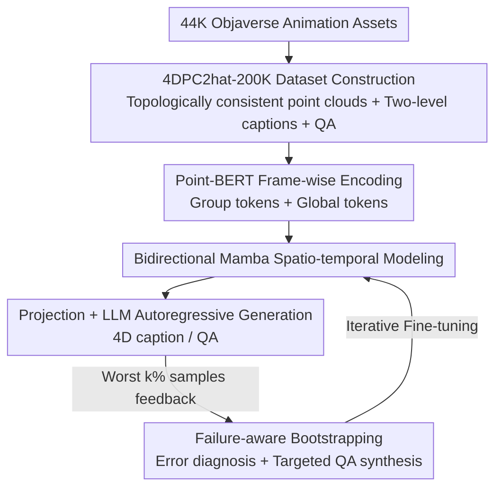

# 4DPC$^2$hat: Towards Dynamic Point Cloud Understanding with Failure-Aware Bootstrapping

**Conference**: ICML 2026  
**arXiv**: [2602.03890](https://arxiv.org/abs/2602.03890)  
**Code**: To be confirmed  
**Area**: 3D Vision / Multimodal VLM  
**Keywords**: Dynamic point cloud, 4D understanding, Multimodal Large Language Model, Bidirectional Mamba, Failure-aware bootstrapping

## TL;DR
4DPC$^2$hat is the first Multimodal Large Language Model (MLLM) designed for "dynamic point cloud sequence" (4D point cloud) understanding. The authors first use a topologically consistent construction pipeline to transform 44,000 animation assets into a dataset of 200,000 cross-modal QA pairs. Then, they employ a spatio-temporal architecture using "preserved group tokens + global tokens + bidirectional Mamba" to avoid compressing a frame into a single vector. Finally, "failure-aware bootstrapping" is used to iteratively identify incorrect model responses and synthesize targeted QA for supplementary training, enabling action understanding and temporal reasoning that significantly outperform approaches that feed video frames to static 3D models.

## Background & Motivation
**Background**: Point clouds are native, sparse, and efficient representations of 3D geometry. Recently, they have been integrated into Multimodal Large Language Models (MLLMs), achieving progress in 3D recognition, cross-modal alignment, and interactive understanding (e.g., PointLLM, ShapeLLM, MiniGPT-3D).

**Limitations of Prior Work**: Almost all of these works focus on **static single-frame point clouds**—both training data and architectures are designed for single frames. However, real-world perception requires understanding point sets that evolve over time (dynamic point clouds) to characterize actions, state transitions, and complex spatio-temporal interactions. Without explicit temporal modeling, existing 3D MLLMs lack this capability.

**Key Challenge**: Advancing 4D point cloud understanding is hindered by two factors. First, **data scarcity**—large-scale cross-modal datasets pairing text with 4D objects are extremely rare because 4D acquisition requires frame-by-frame temporal alignment, stable tracking, and inter-frame correspondences, making it far more complex than static acquisition. Existing 4D datasets (e.g., Diffusion4D, DeformingThings4D) only serve unimodal tasks like pose estimation or action classification, lacking linguistic supervision. Second, **spatio-temporal modeling difficulty**—each frame is an irregular 3D structure, and reasoning about continuously changing geometry, topology, and local spatial relationships across frames requires capturing long-range temporal dependencies.

**Goal**: To build the first dynamic point cloud MLLM from scratch, simultaneously solving the sub-problems of "data scarcity" and "modeling difficulty," while achieving balanced improvements across five QA categories (counting, temporal relations, actions, spatial relations, and appearance).

**Key Insight**: Dynamic semantics are essentially **localized** (e.g., a specific limb moving or a part changing). Therefore, one cannot aggregate an entire frame into a single global token as in current temporal adaptation methods—that would lose local motion cues and blur action phases. The authors refer to this bottleneck as "spatial over-compression."

**Core Idea**: Replace "frame-wise compression into a single vector + post-aggregation" with "per-frame preservation of multiple group tokens + one global token + bidirectional Mamba linear temporal modeling," overlaid with a data bootstrapping loop driven by the model's own failures to address weaknesses round by round.

## Method

### Overall Architecture
4DPC$^2$hat connects "animation assets $\rightarrow$ topologically consistent point cloud sequences $\rightarrow$ frame-wise Point-BERT encoding $\rightarrow$ bidirectional Mamba spatio-temporal modeling $\rightarrow$ projection into LLM $\rightarrow$ autoregressive caption/QA generation" into a backbone. Outside this backbone, a "failure-aware bootstrapping" feedback loop is attached: after the model answers a set of questions, the worst-performing samples are selected based on semantic similarity and given to a teacher model for diagnosis and synthesis of targeted QA for supplementary training. The overall system is both a "data generation + model building" project and an iterative system of "training while patching."

### Key Designs

**1. 4DPC$^2$hat-200K: Data pipeline with topologically consistent construction, two-level descriptions, and multi-category QA**

This step addresses the "data scarcity" issue. The authors aggregated over 44,000 animation assets from Objaverse / Objaverse-XL, resulting in 700,000 temporally ordered point cloud frames and 200,000 high-quality QA pairs, making it the first asset-level dataset to **simultaneously support 4D captioning and 4D QA**. The challenge lies in "topological consistency": vertices move in animations; if point clouds are resampled independently for each frame, there is no point-to-point correspondence, and temporal order is lost. The authors' approach is to **sample only in the first frame**—using Poisson Sampling to place $N$ points proportional to the surface area, recording which triangular face (vertex indices) each point falls on and its barycentric coordinates. Subsequent frames are not resampled; instead, the same barycentric coordinates are used to "evaluate" the updated vertex positions to reconstruct the points. This keeps the identity of each point constant throughout the sequence, resulting in a unified $(T, N, 6)$ representation (coordinates + color, where colors remain consistent). This is combined with cleaning processes such as "discarding animations with fewer than 16 frames, truncating those over 200, uniformly sampling $T=16$ frames, and filtering static/abnormal assets based on inter-frame geometric differences," while excluding sequences with topological changes. On the language side, Qwen2.5-VL is used to generate **two-level descriptions**: short descriptions for coarse alignment between geometry and language (used for encoder-LLM latent space alignment), and detailed descriptions detailing motion patterns, temporal evolution, and dynamic states (used for fine-grained instruction tuning), with manual correction for errors like occlusions. Finally, detailed descriptions are fed back into an LLM to generate QA covering five categories: action, counting, appearance, temporal relations, and spatial relations.

**2. Spatio-temporal Architecture against "Spatial Over-compression": Group + Global tokens $\times$ Bidirectional Mamba**

This is the core of the model. The authors explicitly point out that the bottleneck of current temporal adaptation is aggregating a frame into a single global token, losing local motion. The solution is to **preserve multiple spatial group tokens plus one global token per frame**. Each frame $P_t\in\mathbb{R}^{N\times d}$ is processed by a shared Point-BERT encoder $\mathcal{E}$ and cut into $G$ local groups via standard tokenization, with one learnable group token per group plus one global token aggregating the total context of the frame, yielding $F_t=\{f_{t,1},\dots,f_{t,G},f_{t,\text{global}}\}$. After concatenating tokens from all frames into a sequence, **bidirectional Mamba** is used for spatio-temporal modeling. Compared to unidirectional Mamba, the bidirectional version processes both forward $F_f$ and backward $F_b$ contexts with linear complexity:

$$F_f=\text{SSM}_f(\sigma(\text{MLP}_f(\text{LN}_f(F)))),\quad F_b=\text{flip}[\text{SSM}_b(\sigma(\text{MLP}_b(\text{flip}[\text{LN}_b(F)])))]$$

A gated branch $F_g=\text{MLP}_1(\text{LN}_1(F))$ merges the forward and backward paths with a residual connection: $\tilde F=F+\text{MLP}_2(F_f\odot F_g+F_b\odot F_g)$. Stacking $K$ such blocks allows the model to see both "how an action starts" and "how an action concludes"—crucial for determining action phases. The enhanced $\tilde F$ is mapped to the LLM latent space dimension $c'$ via a projection module $f_{\text{proj}}$, yielding point tokens $F_{\text{proj}}\in\mathbb{R}^{T\times(G+1)\times c'}$, which are concatenated with text tokens for autoregressive generation by the decoder-only LLM. Mamba is used instead of self-attention to maintain linear complexity over long sequences ($T\times(G+1)$ tokens).

**3. Failure-Aware Bootstrapping: Using the model's own errors as training signals**

The authors observed that SFT with uniformly weighted data does not lead to balanced improvements in various spatio-temporal reasoning capabilities—certain question types always lag behind. Thus, "model failures" are treated as diagnostic signals in a three-step cycle. **Failure Identification and Selection**: The SFT-tuned model $\mathcal{M}$ performs large-scale inference on a reference set $\mathcal{D}$ to produce $\hat y=\mathcal{M}(P,q)$. A pre-trained semantic encoder $\phi$ calculates the cosine similarity between the prediction and the ground truth: $S(y,\hat y)=\frac{\phi(y)\cdot\phi(\hat y)}{|\phi(y)||\phi(\hat y)|}$. The worst $k\%$ are selected as the failure set $\mathcal{D}_{\text{fail}}$ (where the model has obvious spatio-temporal misunderstandings). **Targeted Correction Synthesis**: For each failure sample, a high-capability teacher model (Qwen-3) categorizes the error into one of **12 predefined error categories** via a diagnostic prompt and generates a new QA pair $(q', a')$ that **directly targets that weakness**. **Iterative Refinement**: These corrective samples are fed back for further fine-tuning. The key is that it "patches where it's weak" rather than performing indiscriminate data augmentation—the paper claims that under a comparable supervision budget, this directional training yields much higher gains than naive augmentation.

### Loss & Training
The training follows a three-stage curriculum, moving from "alignment" to "patching":

- **Temporal-Language Feature Alignment**: Freeze the point cloud encoder and LLM, training only the bidirectional Mamba module and projector with 11K short dynamic instructions for distribution-level coarse alignment to establish basic temporal awareness.
- **Comprehensive Instruction Tuning**: Jointly fine-tune the projector, bidirectional Mamba, and LLM backbone using 44K dynamic sequences + 145K QA + 44K detailed descriptions, grounding language responses in evolving geometric contexts. The point cloud encoder remains frozen to maintain stable geometric priors.
- **Failure-Aware Refinement**: Apply the bootstrapping strategy. To prevent overfitting and catastrophic forgetting, freeze the encoder and LLM, refining only Mamba and the projector on 12K targeted samples. This process is **iterated twice**.

## Key Experimental Results

Evaluation uses a mix of traditional language metrics (BLEU-1 / ROUGE-L / METEOR), embedding semantic similarity (Sentence-BERT / SimCSE), and GPT-4 judgment. A test set of 4,000 object IDs is used, with GPT-4 evaluation performed on a random 200 due to cost.

### Main Results
In 4D object captioning, 4DPC$^2$hat comprehensively outperforms 3D-aware baselines that treat each frame as a static input and use Qwen3 for temporal summarization:

| Model | Input | GPT-4 | S-BERT | SimCSE | BLEU-1 | ROUGE-L | METEOR |
|------|------|------|--------|--------|--------|---------|--------|
| PointLLM-13B | 3D+Temporal Agg. | 49.53 | 51.35 | 49.07 | 16.35 | 15.21 | 12.58 |
| ShapeLLM-13B | 3D+Temporal Agg. | 53.34 | 57.44 | 62.80 | 20.83 | 20.77 | 15.44 |
| MiniGPT-3D | 3D+Temporal Agg. | 54.70 | 58.60 | 58.58 | 20.47 | 20.41 | 15.46 |
| **Ours** | **3D Point Sequence** | **73.27** | **79.08** | **82.03** | **38.40** | **43.31** | **36.29** |

GPT-4 scores are 18.57 points higher than the strongest baseline MiniGPT-3D, indicating that "frame-wise processing + post-aggregation" cannot generate coherent and temporally grounded descriptions.

In 4D object QA (GPT-4 for total score, sub-items using SimCSE), Ours leads across all five categories:

| Model | GPT-4 | Counting | Temp. Rel. | Action | Spat. Rel. | Appearance |
|------|------|------|----------|------|----------|------|
| ShapeLLM-13B | 56.17 | 56.95 | 60.48 | 52.32 | 61.64 | 52.38 |
| MiniGPT-3D | 59.08 | 57.29 | 60.61 | 64.83 | 61.19 | 51.35 |
| **Ours** | **78.01** | **77.03** | **76.52** | **76.98** | **76.46** | **76.11** |

### Comparison with 2D Video MLLMs
On 4D-Bench, where 2D video MLLMs are compared directly using point cloud sequences of the same objects as input, explicit 4D geometry shows the most significant advantage in action and counting:

| Task | Prev. (2D Video) | Ours |
|------|--------------|-------------|
| 4D Caption GPT-eval (/5) | 3.258 | 3.662 |
| Action Accuracy | 60.75% | 74.30% |
| Object Counting | 54.33% | 66.14% |

### Key Findings
- **Direct 4D modeling vastly outperforms frame-wise aggregation**: Even with temporal aggregators, static 3D models lag by nearly 20 GPT-4 points in captioning—fragmented inter-frame cues cannot reconstruct action-level semantics.
- **Preserving local tokens is critical**: The authors identify "spatial over-compression" as the bottleneck. Group tokens + Bidirectional Mamba address this directly, with action QA reaching 76.98 (baselines are mostly 50–65).
- **Targeted bootstrapping > Naive augmentation**: Under the same supervision budget, targeted QA synthesized via 12-category error diagnosis yields much greater gains than indiscriminate data addition and balances capabilities (all five sub-categories around 76).

## Highlights & Insights
- **"Sampling only in the first frame + barycentric reconstruction"** is a clean topological consistency trick. One-time sampling defines point identities, and subsequent frames follow mesh deformation via barycentric coordinates, naturally ensuring point-to-point correspondence and avoiding temporal chaos from frame-wise resampling. This is transferable to any mesh animation processing requiring stable 4D correspondence.
- **Explicitly naming and treating "spatial over-compression" as a bottleneck** is more instructive than generically saying "temporal modeling." Preserving $G$ group tokens ensures local motion is not smoothed out, which is the root cause of the significant gains in action tasks.
- **Closing the loop with the model's own errors**: Ranking by semantic similarity to pick the worst $k\%$ + teacher attribution of 12 error types to synthesize targeted QA is a highly reusable "patch where weak" data flywheel. This approach can be transferred to any instruction tuning plagued by imbalanced capabilities.

## Limitations & Future Work
- **Data sources are limited to synthetic animation assets** (Objaverse series). There is a domain gap with real-world sensor-captured dynamic point clouds (which include noise, missing data, and non-rigid deformation), and generalization to real scenes remains to be verified.
- **Strong dependence on the invariant topology assumption**: Explicitly excludes sequences with topological changes (e.g., tearing, merging), leaving the model incapable of handling such real-world dynamics.
- **Bootstrapping depends on teacher models and semantic encoders**: The quality of the 12 error categories and the Qwen-3 teacher directly determines the direction of refinement; biased error attribution could mislead the model. Sensitivity to the $k\%$ threshold and the number of iterations (fixed at two here) was not fully explored.

## Related Work & Insights
- **vs PointLLM / ShapeLLM / MiniGPT-3D**: These are static 3D MLLMs. This paper uses their frame-wise processing + temporal aggregation as baselines; the performance gap shows static architectures cannot recover temporal information. Ours has the advantage of native sequence modeling but requires heavier engineering and 4D datasets.
- **vs 2D Video MLLMs**: Video MLLMs rely on temporal 2D tokens and suffer from geometric ambiguity, occlusion, and cross-view inconsistency. Ours uses explicit 4D geometry, significantly leading in action and counting, though it foregoes the rich priors of 2D textures and appearance.
- **vs Unidirectional Mamba**: Ours uses Bidirectional Mamba to capture both the start and end of actions simultaneously, making it better suited for judging action phases while maintaining linear complexity.

## Rating
- Novelty: ⭐⭐⭐⭐⭐ First dynamic point cloud MLLM + first joint 4D captioning/QA dataset; strongly pioneering.
- Experimental Thoroughness: ⭐⭐⭐⭐ Comparison with both static 3D and 2D video lines, with complete 5-category QA breakdowns, though lacking component-level ablation tables.
- Writing Quality: ⭐⭐⭐⭐ Clear problem positioning (e.g., "spatial over-compression") and well-explained pipeline.
- Value: ⭐⭐⭐⭐⭐ The dataset + architecture + bootstrapping trio lays the foundation for 4D point cloud understanding; highly reusable for the community.

<!-- RELATED:START -->

## Related Papers

- [\[CVPR 2026\] Deformation-based In-Context Learning for Point Cloud Understanding](../../CVPR2026/3d_vision/deformation-based_in-context_learning_for_point_cloud_understanding.md)
- [\[CVPR 2026\] Mamba Learns in Context: Structure-Aware Domain Generalization for Multi-Task Point Cloud Understanding](../../CVPR2026/3d_vision/mamba_learns_in_context_structure-aware_domain_generalization_for_multi-task_poi.md)
- [\[AAAI 2026\] Point Cloud Quantization through Multimodal Prompting for 3D Understanding](../../AAAI2026/3d_vision/point_cloud_quantization_through_multimodal_prompting_for_3d_understanding.md)
- [\[ICML 2026\] SIMPC: Learning Self-Induced Mirror-Point Consistency for Unsupervised Point Cloud Denoising](simpc_learning_self-induced_mirror-point_consistency_for_unsupervised_point_clou.md)
- [\[CVPR 2025\] PMA: Towards Parameter-Efficient Point Cloud Understanding via Point Mamba Adapter](../../CVPR2025/3d_vision/pma_towards_parameter-efficient_point_cloud_understanding_via_point_mamba_adapte.md)

<!-- RELATED:END -->
