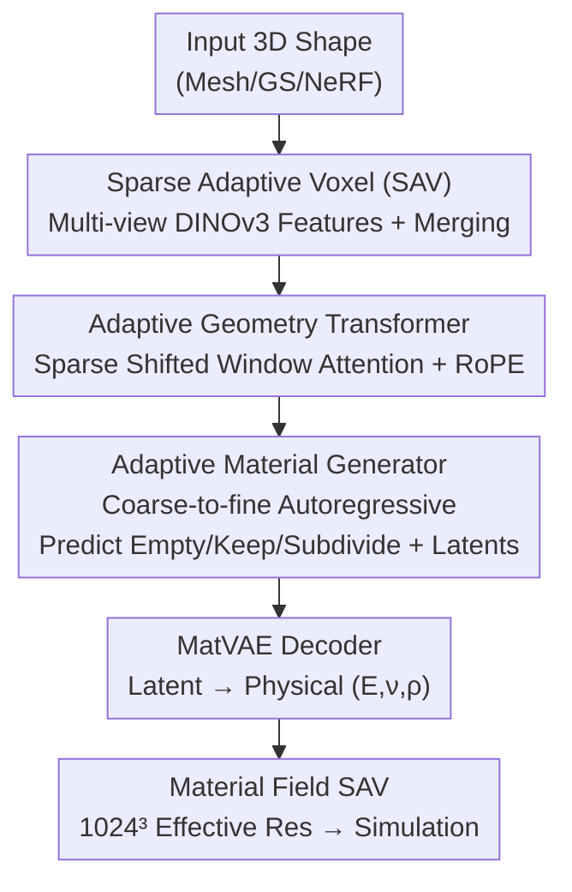

# Adaptive Volumetric Mechanical Property Fields Invariant to Resolution

**Conference**: ICML 2026  
**arXiv**: [2606.18231](https://arxiv.org/abs/2606.18231)  
**Code**: [Project Page](https://research.nvidia.com/labs/sil/projects/adavomp/)  
**Area**: 3D Vision  
**Keywords**: Volumetric Material Fields, Sparse Adaptive Voxels, Autoregressive Generation, Physics Simulation, Sparse Transformer  

## TL;DR
AdaVoMP utilizes a "Sparse Adaptive Voxel Tree (SAV)" to simultaneously represent the input shape and output material field. A sparse Transformer encoder-decoder then autoregressively generates Young's modulus, Poisson's ratio, and density for each 3D object layer-by-layer. This approach scales the effective resolution of simulatable material fields from $64^3$ to $1024^3$ (a $16^3$ increase) while outperforming previous SOTA models with lower test-time compute.

## Background & Motivation
**Background**: Applications such as robotics and digital twins require "simulation-ready" 3D scenes. Deformation simulation depends on point-wise mechanical parameters within the volume of each object: Young's modulus $E$, Poisson's ratio $\nu$, and density $\rho$. However, the vast majority of 3D assets (from modeling, generation, or photo-reconstruction) lack these parameters. Manual annotation is nearly impossible, and per-object physical measurements cannot be scaled.

**Limitations of Prior Work**: Recent feed-forward methods (e.g., VoMP, Pixie) learn to predict volumetric materials directly from shape and appearance but operate on **fixed-resolution dense voxel grids** (e.g., $64^3$). To increase resolution, all active voxels must be processed at the finest level, causing memory and computation to explode cubically. This limits them to low resolutions where material boundaries and small components (e.g., internal GPU parts, furniture joints) become blurred.

**Key Challenge**: The material distribution of everyday objects consists of **large homogeneous regions + sparse sharp boundaries** (e.g., a metal bed frame is a single block of uniform metal, while the interior of a sofa armrest is constant). Fixed grids treat homogeneous areas and boundaries equally, wasting computation on regions with little information while lacking sufficient resolution for boundaries that need refinement.

**Goal**: (1) Develop an adaptive structure to allocate computation according to material heterogeneity; (2) make this structure end-to-end learnable, differentiable, and capable of autoregressive generation; (3) maintain or reduce inference overhead at resolutions significantly higher than $64^3$.

**Key Insight**: The authors observe that adaptive voxel structures (similar to octrees) are naturally suited for "mostly homogeneous + locally heterogeneous" material distributions—recursively subdividing only where materials change, while representing homogeneous regions with a single coarse voxel.

**Core Idea**: Use a **Sparse Adaptive Voxel Tree (SAV)** that learns to subdivide based on material prediction (rather than geometric thresholds), paired with an **autoregressive, coarse-to-fine** sparse Transformer generator that decides layer-by-layer "where to refine + what material to fill."

## Method

### Overall Architecture
The input to AdaVoMP is any 3D shape (Mesh, Gaussian Splatting, or NeRF) that can be voxelized and rendered from multiple views. The output is a $(E, \nu, \rho)$ field covering the entire object volume, expressed as an SAV material tree $\mathcal{T}^{\mathcal{M}'}$ with an effective resolution of $G^3=1024^3$, **without ever instantiating a dense grid**.

The pipeline consists of four steps: First, the input shape is discretized to a base grid of $G=2^{10}$, multi-view DINOv3 features are aggregated, and similar voxels are merged to form the input SAV $\mathcal{T}^{\mathrm{in}}$. Second, an **Adaptive Geometry Transformer** $\mathbf{E}$ encodes this into context latents. These latents condition an **Adaptive Material Generator** $\mathbf{G}$, which proceeds autoregressively from the coarsest level $\ell=L_{\max}$ to the finest level $\ell=0$. At each level, it predicts structural actions (Empty/Keep/Subdivide) and 2D material latents only for candidate voxels on the "refinement front." Finally, a frozen MatVAE decodes the material latents into physically plausible $(E, \nu, \rho)$.

### Key Designs

**1. SAV (Sparse Adaptive Voxels): Representing Shape and Material with a Multi-resolution Voxel Tree**

To address the inefficiency of fixed grids in homogeneous regions, standard leaf voxels in SAV **exist across different resolution levels**: homogeneous regions are covered by single coarse voxels, while heterogeneous regions and boundaries are recursively subdivided. For a bounded domain $\Omega$, each voxel records a level $\ell\in\{0,\dots,L_{\max}\}$ (0 being finest, $L_{\max}=\log_2 G$) and an integer index $\mathbf{i}$. These are mapped to unified coordinates $\mathbf{u}_{\ell,\mathbf{i}}:=2^{\ell}\mathbf{i}$ to align voxels across levels for Transformer attention. An octant ID $o(\mathbf{i})$ encodes the relative position within a parent. Each leaf stores a constant feature vector inducing a piecewise-constant field $\mathcal{T}(\mathbf{x}):=\mathbf{e}_{\ell',\mathbf{i}'}$. Unlike octrees conditioned on geometry, SAV's subdivision is **learned for material prediction**—a ground truth tree is constructed by subdividing only when material variance exceeds a tolerance $\bm{\tau}$.

**2. Adaptive Geometry Transformer: Encoding Cross-resolution Context**

Input shapes are voxelized at $G=2^{10}$ with multi-view DINOv3 patch-token features. The authors use **depth-decay weighted averaging** for projection to preserve detail over distance. Feature-similar voxels are merged into the adaptive $\mathcal{T}^{\mathrm{in}}$. The encoder $\mathbf{E}$ treats leaves as sparse tokens, using unified coordinates $\mathbf{u}_{\ell,\mathbf{i}}$ with RoPE for position injection, followed by **Sparse 3D Shifted-Window Self-Attention** and FFN. The resulting context $\mathbf{E}(\mathcal{T}^{\mathrm{in}})$ conditions the generator across all levels.

**3. Adaptive Material Generator: Coarse-to-Fine with Explicit Actions**

The generator $\mathbf{G}$ shares parameters across levels and generates the material tree autoregressively from $\ell=L_{\max}$ to $\ell=0$. Instead of enumerating the full $G^3$ grid, it operates only on a candidate set $\mathcal{C}_\ell$ (the refinement front). For each candidate, $\mathbf{G}$ outputs: (i) structural logits—**Empty / Keep / Subdivide**, and (ii) 2D material latents $\mathbf{z}_{\ell,\mathbf{i}}\in\mathbb{R}^2$. The explicit "Empty" action allows active prediction of void spaces. Each candidate carries its parent's hidden state $\mathbf{h}_{\ell+1,\lfloor\mathbf{i}/2\rfloor}$ to maintain spatial continuity. Subdivided voxels pass their 8 children to $\mathcal{C}_{\ell-1}$. This supports **test-time compute scaling**: stopping at coarser levels yields well-defined low-resolution outputs.

**4. Loss & Training: Teacher Forcing and Explicit Negatives**

$\mathbf{E}$ and $\mathbf{G}$ are trained jointly using **teacher forcing**. During training, predicted subdivision decisions are replaced by ground truth $s^\star_{\ell,\mathbf{i}}$. Crucially, **all 8 children of a subdivided voxel are expanded**, treating empty children as explicit negative samples to force the model to learn the "Empty" action. The total loss $\mathcal{L}=\lambda_{\mathrm{struct}}\mathcal{L}_{\mathrm{struct}}+\lambda_{\mathrm{mat}}\mathcal{L}_{\mathrm{mat}}$ uses level-weighting $\omega_\ell:=\gamma^\ell\,(\gamma>1)$ to prioritize coarse structures. The material loss $\mathcal{L}_{\mathrm{mat}}$ calculates the Mahalanobis L2 distance between predicted/GT physics parameters normalized by MatVAE.

## Key Experimental Results

### Main Results
Evaluated on Young's modulus $E$ (using ALDE/ALRE), Poisson's ratio $\nu$, and density $\rho$ (using ADE/ARE).

| Resolution | Method | $E$ ALDE↓ | $\nu$ ADE↓ | $\rho$ ADE↓ |
|--------|------|-----------|------------|-------------|
| $64^3$ | Pixie | 0.3986 | 0.0259 | 141.78 |
| $64^3$ | VoMP (Prev. SOTA) | 0.3793 | 0.0241 | 142.69 |
| $64^3$ | **Ours-H** | **0.3278** | **0.0205** | **127.31** |
| $1024^3$ | Pixie | 1.2264 | 0.0413 | 248.67 |
| $1024^3$ | VoMP | 1.1371 | 0.0289 | 191.63 |
| $1024^3$ | **Ours-H** | **0.8841** | **0.0215** | **158.46** |

Ours-H outperforms baselines at both low $64^3$ and high $1024^3$ resolutions. At $1024^3$, the advantage is more pronounced ($E$ ALDE is ~22% lower than VoMP).

### Ablation Study
Evaluation on the GVT-Hard subset (challenging heterogeneous materials):

| Configuration | $E$ ALDE↓ @ $1024^3$ | Description |
|------|----------------------|------|
| VoMP (Fixed $64^3$) | 1.6680 | Fixed-grid baseline |
| Pixie | 1.8950 | Alternative fixed-grid |
| **Ours-H** | **1.2440** | Significant gain on heterogeneous cases |

### Key Findings
- **Adaptive structure is the primary source of gain**: Replacing fixed grids with SAV significantly improves boundaries and small parts while scaling resolution $16^3$ times.
- **Test-time compute scaling**: Autoregressive coarse-to-fine generation allows users to trade resolution for speed, a feature impossible with fixed grids.
- **Higher difficulty, higher gain**: On GVT-Hard, AdaVoMP's lead over VoMP is wider than on the general set, proving its effectiveness in allocating compute where materials are heterogeneous.

## Highlights & Insights
- **Transferring "Adaptive Meshes" from geometry to material prediction**: Using the "homogeneous + boundaries" distribution characteristic as a leverage point is a powerful observation.
- **Joint Structural and Material Generation**: By predicting Empty/Keep/Subdivide, the model learns the optimal resolution distribution alongside physical properties.
- **Explicit Empty Negatives**: Forcing the expansion of empty children during training solves the common "stopping criteria" failure in adaptive generation.
- **Computational scalability** is a byproduct, allowing for both fast previews and high-fidelity simulations from the same model.

## Limitations & Future Work
- **Reliance on auto-labeled data**: The accuracy is capped by the VLM-based labeling pipeline used in VoMP.
- **Potential Bias**: Evaluation is primarily against NVIDIA-led baselines; independent validation is desirable.
- **Input sensitivity**: Feature aggregation might still struggle with transparent, reflective, or extremely thin structures.
- **Inference Latency**: Autoregressive generation introduces serial dependencies at the finest layers; future work could explore parallel branch refinement.

## Related Work & Insights
- **vs VoMP / Pixie**: These use fixed $64^3$ dense grids where all voxels are processed at maximum depth. Ours uses sparse SAV to reach $1024^3$ more efficiently.
- **vs Octrees / OpenVDB**: Standard structures subdivide based on geometric thresholds; SAV **learns** to subdivide based on material heterogeneity.
- **vs Sequential Octree Generation**: Unlike methods that serialize trees into 1D token sequences, AdaVoMP maintains 3D spatial structure for cross-resolution attention.

## Rating
- Novelty: ⭐⭐⭐⭐⭐ 
- Experimental Thoroughness: ⭐⭐⭐⭐☆ 
- Writing Quality: ⭐⭐⭐⭐☆ 
- Value: ⭐⭐⭐⭐⭐ 

<!-- RELATED:START -->

## Related Papers

- [\[CVPR 2025\] Event Fields: Capturing Light Fields at High Speed, Resolution, and Dynamic Range](../../CVPR2025/3d_vision/event_fields_capturing_light_fields_at_high_speed_resolution_and_dynamic_range.md)
- [\[CVPR 2026\] Turbo-GS: Accelerating 3D Gaussian Fitting for High-Resolution Radiance Fields](../../CVPR2026/3d_vision/turbo-gs_accelerating_3d_gaussian_fitting_for_high-quality_radiance_fields.md)
- [\[CVPR 2026\] InfiniDepth: Arbitrary-Resolution and Fine-Grained Depth Estimation with Neural Implicit Fields](../../CVPR2026/3d_vision/infinidepth_arbitrary-resolution_and_fine-grained_depth_estimation_with_neural_i.md)
- [\[ECCV 2024\] MeshFeat: Multi-Resolution Features for Neural Fields on Meshes](../../ECCV2024/3d_vision/meshfeat_multi-resolution_features_for_neural_fields_on_meshes.md)
- [\[AAAI 2026\] Pb4U-GNet: Resolution-Adaptive Garment Simulation via Propagation-before-Update Graph Network](../../AAAI2026/3d_vision/pb4u-gnet_resolution-adaptive_garment_simulation_via_propagation-before-update_g.md)

<!-- RELATED:END -->
