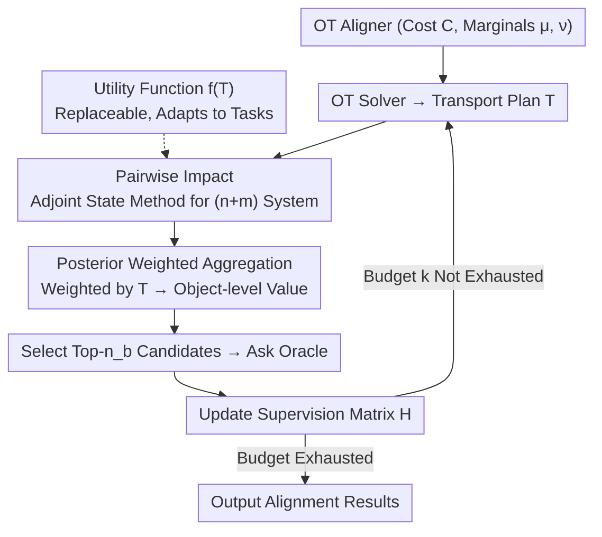

# AvAtar: Learning to Align via Active Optimal Transport

**Conference**: ICML 2026  
**arXiv**: [2605.24395](https://arxiv.org/abs/2605.24395)  
**Code**: None  
**Area**: Machine Learning Theory  
**Keywords**: Optimal Transport, Active Learning, Alignment, Gradient Propagation, Conjugate Gradient Method  

## TL;DR

This paper proposes AvAtar, an active alignment framework based on Optimal Transport (OT). It quantifies the influence of candidate queries on global alignment results through gradient propagation. By utilizing the adjoint state method and conjugate gradient method, it achieves efficient solutions with linear complexity. AvAtar consistently outperforms existing active learning strategies in network alignment and cross-domain alignment tasks.

## Background & Motivation

**Background**: Alignment is a backbone step in many machine learning tasks, such as multi-network analysis, multimodal learning, and point cloud registration. Recently, Optimal Transport (OT) has been widely used for alignment due to its ability to infer soft correspondences between distributions from a global perspective. By associating two sets of objects with discrete probability distributions and solving for a transport plan $\mathbf{T}$, OT methods have demonstrated superior performance across various alignment tasks.

**Limitations of Prior Work**: OT methods are highly sensitive to the quantity and quality of supervision signals. Experiments show that increasing supervision can lead to performance gains of up to 15%, while different query strategies can exhibit performance gaps of up to 7% under the same budget. However, high-quality supervised labels are expensive in practice (e.g., manual labeling of correspondences between nodes in different networks). Currently, almost no work investigates how to actively acquire high-quality supervision within the OT framework.

**Key Challenge**: Existing active alignment methods face three critical limitations: (1) they are not designed specifically for OT and cannot leverage core OT components like cost functions and marginal constraints; (2) they lack a principled method to quantify how new supervision propagates through the OT formulation to affect alignment; (3) strategies are often designed for specific tasks (e.g., network alignment) and do not generalize easily to other tasks like cross-domain alignment.

**Goal**: Design a general active learning framework that maximizes the alignment performance of OT methods under a fixed query budget, applicable to various tasks including network alignment, image-text retrieval, and image-text grounding.

**Key Insight**: The authors observe that the global alignment quality can be measured by encoding the transport plan into a scalar using a utility function $f(\mathbf{T})$. The influence of each candidate query on this utility function can then be calculated via gradient propagation; a larger gradient indicates that the query is more valuable for improving global alignment.

**Core Idea**: By using the adjoint state method, the challenging problem of "differentiating through the OT solver" is transformed into a $(n+m)$-dimensional linear system. This system is solved using the conjugate gradient method with linear complexity and guaranteed convergence, efficiently quantifying the informativeness of each candidate query.

## Method

### Overall Architecture

AvAtar addresses the problem of selecting the most valuable objects for manual labeling under a fixed query budget to maximize the global result of an OT aligner. It treats a standard OT alignment method (with cost function $\mathbf{C}$ and marginals $\boldsymbol{\mu}, \boldsymbol{\nu}$) as a differentiable black box within an active learning loop. Each round consists of four steps: calculating impact scores for each candidate object to determine how much its query would improve global alignment, selecting the $n_b$ objects with the highest scores to query the oracle for true correspondences, updating the supervision matrix $\mathbf{H}$, and re-running the OT solver to obtain an updated transport plan $\mathbf{T}$. This loop continues until the budget $k$ is exhausted. The core innovation lies in the first step—principled quantification of the marginal value of querying an object without knowing its true label.

### Key Designs

**1. Transforming OT Differentiation into a Solvable Linear System via the Adjoint State Method**

The valuation of a query begins with a utility function $f(\mathbf{T})$, which compresses the transport plan into a scalar characterizing global alignment quality. The value of a query is naturally its influence on $f$—specifically, the gradient of the utility function with respect to the supervision signal $\mathbf{H}_{i,j}$. Using the chain rule, this gradient is decomposed into two parts: $\nabla_{\mathbf{H}_{i,j}} f = \langle \nabla_{\tilde{\mathbf{C}}} f,\ \nabla_{\mathbf{H}_{i,j}} \tilde{\mathbf{C}} \rangle$. The second part describes how the supervision signal modifies the cost matrix and can be written directly as $-\beta \mathbf{C}_{i,j} \mathbf{E}$. The primary obstacle is the first part $\nabla_{\tilde{\mathbf{C}}} f$, because the transport plan $\mathbf{T}$ is an implicit function of the cost matrix. Differentiating through it naively would require explicitly constructing and inverting a Jacobian matrix of size $(nm)^2$, which is computationally infeasible.

The authors circumvent this step by adopting the adjoint state method from PDE-constrained optimization. Instead of explicitly calculating the massive Jacobian, the problem is equivalently transformed into solving an adjoint linear system $\mathbf{A}\mathbf{y} = \mathbf{b}$ of only $(n+m)$ dimensions, where the coefficient matrix $\mathbf{A}$ is constructed from marginal distributions and the transport plan. Although this system is singular ($\mathbf{A}$ is non-invertible), $\mathbf{A}$ is positive semi-definite and $\mathbf{b}$ lies within the column space of $\mathbf{A}$. Thus, the Conjugate Gradient (CG) method guarantees convergence to the global optimum. Combined with the sparse structure of $\mathbf{T}$, the overall solution has a linear time complexity of $\mathcal{O}(K(n+m))$. This is the fundamental difference between AvAtar and existing methods: while others cannot systematically characterize how new supervision propagates through OT, AvAtar turns it into a standard, provably convergent, and linearly solvable problem.

**2. Aggregating Pairwise Impact into Object-level Value via Transport Plan Weighting**

The previous step computes the pairwise impact $\mathcal{I}(p_{ij})$—the value of querying the correspondence between $x_i$ and $y_j$. However, during the actual query process, one can only select a source object $x_i$ without knowing its true correspondence. AvAtar calculates the weighted sum of pairwise impacts between $x_i$ and all target objects using the transport plan:

$$\mathcal{I}(p_i) = \sum_{j=1}^{m} \mathbf{T}_{i,j}\, \mathcal{I}(p_{ij})$$

The elegance here lies in the fact that $\mathbf{T}_{i,j}$ itself represents the posterior alignment probability between $x_i$ and $y_j$. Therefore, using it as a weight mathematically equates to calculating the expected impact of querying $x_i$. By using the posterior output by OT as a prior when the true label is unknown, the method remains self-consistent and fully reuses the solver's results. In contrast, using uniform weights for blind averaging drops the MRR by 16.8% (Douban), demonstrating that posterior weighting captures essential signals.

**3. Replaceable Utility Functions for Task Generalization**

The utility function is the only component in AvAtar that needs to be adapted for different tasks; the rest of the framework remains unchanged. The authors propose three types: universal $f_{L_2} = \|\mathbf{T}\|_2^2$ and $f_{\text{entropy}} = \|\mathbf{T} \odot \log(\mathbf{T})\|_1$, both of which encourage the transport plan toward a deterministic permutation matrix (suitable for most retrieval/grounding tasks); and $f_{\text{consist}}$ specifically for network alignment, which measures neighbor consistency after alignment using the Graph Laplacian. To switch tasks, one only needs to swap the utility function while reusing the gradient calculation and aggregation pipeline. This is key to its success across network alignment, image-text retrieval, and image-text grounding.

### Loss & Training

AvAtar utilizes iterative batch queries: in each round, $n_b$ candidates are selected to query the oracle, $\mathbf{H}$ is updated, and the OT solver is rerun until the budget $k$ is met. The convergence rate of the conjugate gradient method is $\frac{\sqrt{\lambda_1/\lambda_r} - 1}{\sqrt{\lambda_1/\lambda_r} + 1}$ (where $\lambda_1, \lambda_r$ are the maximum and minimum non-zero eigenvalues of the coefficient matrix). Experiments show that CG converges faster than Sinkhorn and is more robust to the regularization weight $\epsilon$.

## Key Experimental Results

### Main Results — Network Alignment (MRR)

| Dataset | Method | Query=5 | Query=10 | Gain vs Random |
|--------|------|---------|----------|------------------|
| Phone-Email | Random (JOENA) | 0.582 | 0.648 | — |
| Phone-Email | AvAtar-$L_2$ (JOENA) | 0.682 | 0.800 | +15.2% |
| Phone-Email | AvAtar-consist (JOENA) | **0.691** | **0.806** | +15.8% |
| ACM-DBLP-A | Random (JOENA) | 0.821 | 0.837 | — |
| ACM-DBLP-A | AvAtar-$L_2$ (JOENA) | **0.924** | **0.981** | +14.4% |
| Douban | Random (PARROT) | 0.730 | 0.751 | — |
| Douban | AvAtar-$L_2$ (PARROT) | **0.782** | **0.837** | +8.6% |

### Main Results — Cross-domain Alignment (Recall@1)

| Task | Dataset | Method | Query=5 | Query=10 |
|------|--------|------|---------|----------|
| Image-Text Retrieval | ImageNet-C (GOT-W) | Random | 0.374 | 0.454 |
| Image-Text Retrieval | ImageNet-C (GOT-W) | AvAtar-entropy | **0.402** | **0.509** |
| Image-Text Grounding | Flickr30K (GOT-FGW) | Random | 0.550 | 0.628 |
| Image-Text Grounding | Flickr30K (GOT-FGW) | AvAtar-$L_2$ | **0.575** | **0.671** |
| Image-Text Grounding | COCO (GOT-FGW) | Random | 0.545 | 0.607 |
| Image-Text Grounding | COCO (GOT-FGW) | AvAtar-$L_2$ | **0.582** | **0.678** |

### Ablation Study

| Ablation Dimension | Configuration | MRR (Douban) | Note |
|----------|------|-------------|------|
| Sparse vs Dense | AvAtar-$L_2$ (Sparse) | 0.837 | 5.1s, 8.6× Speedup |
| Sparse vs Dense | AvAtar-$L_2$ (Dense) | 0.839 | 19s, Comparable |
| Aggregation | AvAtar-$L_2$ (Posterior) | 0.837 | Weighted by Plan |
| Aggregation | AvAtar-$L_2$ (Uniform) | 0.669 | MRR drops 16.8% |
| Utility Function | AvAtar-consist (PARROT) | 0.835 | Better for unattributed |
| Utility Function | AvAtar-$L_2$ (PARROT) | 0.837 | Better for attributed |

## Highlights & Insights

- Elegantly transforms the technical bottleneck of "differentiating through OT" into an adjoint linear system solution, avoiding $(nm)^2$ Jacobian inversion. This approach is generalizable to other constrained optimization differentiation scenarios.
- The posterior weighted aggregation design is clever—the transport plan $\mathbf{T}$ naturally encodes alignment posterior probabilities, and using it to weight pairwise impacts calculates the conditional expectation.
- High framework versatility: only the utility function needs to be changed for different tasks, while the core gradient calculation remains identical.
- Extensive experiments covering 8 datasets, 4 OT methods, and 9 baseline strategies consistently achieve SOTA across three major alignment tasks.

## Limitations & Future Work

- Cross-domain alignment tasks (image-text retrieval/grounding) were conducted on relatively small datasets and have not yet been validated on large-scale multimodal benchmarks.
- Utility function selection still requires domain knowledge; automated selection or learning of utility functions remains a future direction.
- The framework depends on the differentiability of entropy-regularized OT; extensions to non-regularized or unbalanced OT have not yet been discussed.
- The batch selection strategy uses a greedy top-$n_b$ approach, which does not account for diversity or redundancy among candidates.

## Related Work & Insights

- **PARROT / JOENA**: Representative OT-based network alignment methods upon which this paper directly builds an active learning layer.
- **GOT**: A cross-domain alignment framework based on Wasserstein and Gromov-Wasserstein distances, used here to validate active cross-domain alignment.
- **Adjoint State Method**: An efficient differentiation technique from PDE-constrained optimization and Neural ODEs, applied here for the first time to gradient propagation in OT alignment.
- Provides direct inspiration for researchers handling sparse labels in alignment: rather than random labeling, use gradients to guide the selection of the most valuable objects to label.

## Rating

- Novelty: ⭐⭐⭐⭐ — First to formalize the active OT alignment problem with a principled solution.
- Experimental Thoroughness: ⭐⭐⭐⭐⭐ — Extensive coverage across 8 datasets, 4 OT methods, and 9 baselines across three major tasks.
- Writing Quality: ⭐⭐⭐⭐ — Clear theoretical derivations, consistent notation, and complete structure.
- Value: ⭐⭐⭐⭐ — A general framework ready for deployment in various OT alignment scenarios.

<!-- RELATED:START -->

## Related Papers

- [\[ICML 2026\] Streaming Sliced Optimal Transport](streaming_sliced_optimal_transport.md)
- [\[ICML 2026\] Convex Distance Operator Transport: A Convex and Geometry-Preserving Formulation](convex_distance_operator_transport_a_convex_and_geometry-preserving_formulation.md)
- [\[ICLR 2026\] SceneTransporter: Optimal Transport-Guided Compositional Latent Diffusion for Single-Image Structured 3D Scene Generation](../../ICLR2026/3d_vision/scenetransporter_optimal_transport-guided_compositional_latent_diffusion_for_sin.md)
- [\[CVPR 2025\] NoPain: No-box Point Cloud Attack via Optimal Transport Singular Boundary](../../CVPR2025/3d_vision/nopain_no-box_point_cloud_attack_via_optimal_transport_singular_boundary.md)
- [\[ICML 2026\] PLAID: A Unified Data Model for Machine Learning on Heterogeneous Physics Simulations](plaid_a_unified_data_model_for_machine_learning_on_heterogeneous_physics_simulat.md)

<!-- RELATED:END -->
