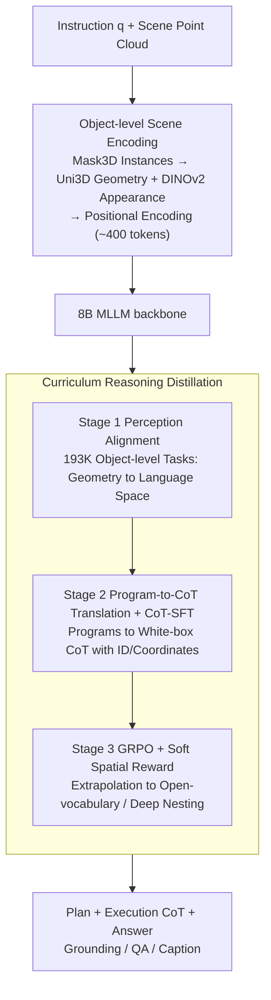

# APEIRIA: Distilling Neuro-Symbolic Programs into 3D Multi-modal LLMs

**Conference**: ICML 2026  
**arXiv**: [2606.01215](https://arxiv.org/abs/2606.01215)  
**Code**: https://github.com/oceanflowlab/APEIRIA  
**Area**: 3D Vision / Multi-modal VLM  
**Keywords**: Neuro-symbolic, 3D Spatial Reasoning, Chain-of-Thought, GRPO, Curriculum Learning

## TL;DR
This paper proposes APEIRIA, which distills the execution traces of neuro-symbolic 3D concept learners into natural language chain-of-thought (CoC) for 3D MLLMs. By employing GRPO reinforcement learning, it generalizes these reasoning patterns to open-vocabulary and deeply nested instructions. APEIRIA simultaneously outperforms traditional NS3D methods and current state-of-the-art 3D MLLMs on ScanRefer, Multi3DRefer, SQA3D, and Scan2Cap, while retaining the interpretability and modularity of symbolic systems.

## Background & Motivation
**Background**: 3D spatial reasoning (grounding, QA, captioning) is currently dominated by two approaches. One is Neuro-Symbolic 3D (NS3D) concept learners (NS3D, LARC, etc.), which parse instructions into programs composed of primitives like `scene/filter/relate` for step-by-step execution. The other is end-to-end 3D MLLMs (Chat-Scene, Inst3D-LMM, Video-3D LLM, LLaVA-3D, etc.), which directly feed scene tokens and language into an LLM for black-box instruction-to-answer mapping.

**Limitations of Prior Work**: NS3D is interpretable and compositional but faces two rigid constraints: (i) primitives like `filter(chair)` rely on fixed concept networks and cannot handle open-vocabulary terms like "cozy chair" or "messy desk"; (ii) training each primitive requires dense intermediate supervision, limiting use to synthetic datasets like Sr3D with template generation and shallow nesting. Conversely, 3D MLLMs handle free-form language, but reasoning is a black box—failures cannot be localized to object recognition, spatial relations, or compositional logic errors.

**Key Challenge**: Interpretability versus semantic flexibility appears to be a trade-off. The authors identify a decoupling opportunity: **Symbolic programs encode the "syntax of reasoning" (how to decompose and verify), whereas MLLMs possess "open-world semantic knowledge"**—these two aspects can be learned separately.

**Goal**: (1) Distill the reasoning patterns of NS programs (decomposition + step-by-step spatial verification) into 3D MLLMs; (2) Enable reasoning capabilities to transcend closed-vocabulary and shallow-nesting constraints of synthetic data, generalizing to real-world instructions like ScanRefer/Multi3DRefer; (3) Retain interpretable NS traces and modularity.

**Key Insight**: Synthetic datasets like Sr3D provide **full intermediate supervision**—the inputs and outputs of every `filter` and intermediate sets for `relate` can be derived from ground-truth annotations. This "white-box supervision" can inject reasoning templates into MLLMs, followed by reinforcement learning with outcome supervision to extrapolate these templates to open concepts.

**Core Idea**: Serialize the execution traces of symbolic programs into natural language CoT for SFT (teaching "how to think"), then use GRPO with soft spatial rewards for RL (generalizing templates to open-vocabulary and deep nesting). This grants an end-to-end MLLM both the systematicity of NS3D and the flexibility of LLMs.

## Method

### Overall Architecture
APEIRIA aims to enable an end-to-end 3D MLLM to systematically decompose and verify spatial relations like a symbolic program while handling open-vocabulary and deeply nested instructions. The approach involves translating neuro-symbolic program execution traces into natural language CoT to teach the model "how to think," followed by reinforcement learning to project this template onto real instructions.

The system is built on an 8B MLLM backbone. The input consists of a natural language instruction $q$ and a set of **object-level** scene representations $\mathcal{O}$, while the output is a CoT sequence containing "plan + execution" tags along with the final answer $A$ (grounding box / QA answer / caption). For the scene representation, object-centric features compress the entire scene to approximately 400 tokens: Mask3D segments the scene into instances, each instance uses Uni3D for geometry and DINOv2 for appearance, and coordinates/dimensions are injected via learnable positional encodings.

Training is structured into a three-stage curriculum: Stage 1 performs perception alignment to map 3D geometric features into the LLM's language space; Stage 2 translates symbolic programs into CoT for supervised fine-tuning (CoT-SFT) to instill systematic decomposition; Stage 3 uses GRPO reinforcement learning (CoT-RL) to generalize this pattern to open-set complex instructions. The plan and perception modules are decoupled, allowing the replacement of plans with GPT-4 outputs or primitives with stronger segmentors like SegDINO3D without retraining.

### Key Designs

**1. Curriculum Reasoning Distillation: Decoupling perception, reasoning, and generalization into three non-overlapping objectives.**

3D reasoning requires parallel capabilities in object recognition, instruction decomposition, and deep nesting. APEIRIA segments this into three stages. Stage 1 utilizes ~193K object-level tasks for vision-language pre-training to align 3D geometry with the LLM's embedding space. Stage 2 performs CoT-SFT on Level-1 (78K single-step `filter`) and Level-2 (66K two-step `relate`) programs, optimizing the joint likelihood $\mathcal{L}_{\text{CoT-SFT}} = -\mathbb{E}\,[\log p_\theta(\text{CoT}, A \mid q, \mathcal{O})]$ to inject the reasoning template. Stage 3 applies GRPO on real-world instructions. Ablations show that skipping Stage 2 makes the RL exploration space too large (ScanRefer Acc@0.25 drops from 58.4% to 48.2%), while excluding Stage 3 limits the model to synthetic data's closed vocabulary (resulting in a 6.9% drop).

**2. Program-to-CoT Translation: Reversing symbolic programs into white-box CoT for Stage 2 supervision.**

Stage 2 supervision is derived by translating NS3D programs (`scene/filter/relate`) into natural language. For each program, the AST is parsed into an execution sequence $\mathcal{S} = \{s_1, \ldots, s_n\}$. Each step $s_i$ is serialized into a plan (sub-goal description) and execution (explicit **ID + coordinates + dimensions**). For example, `relate(filter(desk), filter(wall), left)` is expanded by listing the IDs of all desks and walls, followed by the desk IDs satisfying the "left" relation. This **spatially grounded** trace uses unique IDs for each object to avoid ambiguity. This breaks the vocabulary bottleneck by allowing the LLM to execute primitives in natural language and suppresses hallucinations through verifiable ground-truth traces.

**3. GRPO + Soft Spatial Rewards: Extrapolating to open concepts and deep nesting via outcome signals.**

Real-world instructions in ScanRefer/Multi3DRefer lack intermediate supervision. Stage 3 employs GRPO to optimize policy $\pi_\theta$ by sampling $N$ responses and normalizing advantages $A_i$. The reward consists of two components: a **Soft Grounding Reward** using exponential decay similarity for position and scale:

$$R_{\text{grounding}} = e^{-\alpha \|\bm{x}_{\text{pred}} - \bm{x}_{\text{gt}}\|_2} + e^{-\alpha \|(\bm{s}_{\text{pred}} - \bm{s}_{\text{gt}})/\bm{s}_{\text{gt}}\|_1},\quad \alpha = 2$$

This provides dense gradients even with zero IoU overlap. The second is a **Format Reward**, checking for valid plan/thinking tags. Ablations indicate that replacing the soft reward with sparse IoU drops accuracy by 0.5–0.7%, while removing the Format Reward leads to "structure collapse" where the model skips reasoning.

### Loss & Training
Stages 1 and 2 use standard next-token language modeling loss. Stage 3 uses the GRPO clipped surrogate loss. The 8B backbone is fine-tuned using LoRA. The total CoT supervision includes 144K verified samples in Stage 2, with Stage 3 running RL on downstream instruction-answer pairs with group-based comparisons.

## Key Experimental Results

### Main Results

ScanRefer & Multi3DRefer (3D spatial grounding) results:

| Method | Type | ScanRefer Acc@0.25 | ScanRefer Acc@0.5 | M3DRef F1@0.25 | M3DRef F1@0.5 |
|------|------|--------------------|-------------------|----------------|---------------|
| NS3D (Hsu 2023) | NS3D | 22.4 | – | – | – |
| LARC (Feng 2024) | NS3D | 32.9 | – | – | – |
| LaSP (Mi 2025) | NS3D | 49.2 | – | – | – |
| Chat-Scene | 3D MLLM | 55.5 | 50.2 | 57.1 | 52.4 |
| Inst3D-LMM | 3D MLLM | 57.8 | 51.6 | 58.3 | 53.5 |
| Video-3D LLM | 3D MLLM | 58.1 | 51.7 | 58.0 | 52.7 |
| **APEIRIA** | 3D MLLM | **58.4** | 51.2 | **59.2** | **53.8** |
| **APEIRIA†** (with SegDINO3D) | 3D MLLM | **60.5** | **53.2** | **60.9** | **55.2** |

Cross-task generalization: Scan2Cap C@0.25 = 90.6 (Prev. SOTA LEGO 84.7), SQA3D EM = 58.6 (matching Prev. SOTA Video-3D LLM). Zero-shot open-vocabulary transfer to Nr3D: APEIRIA (36.5%) outperforms **fully supervised** NS3D (33.9%).

### Ablation Study

| Setting | ScanRefer Acc@0.25 | M3DRef F1@0.25 | Notes |
|------|--------------------|----------------|------|
| APEIRIA full | 58.4 | 59.2 | Full three stages |
| w/o Stage 3 (CoT-RL -> Direct SFT) | 51.5 | 55.3 | Drop 6.9 / 3.9; RL is necessary for real-world extrapolation |
| w/o Stage 2 (Directly to CoT-RL) | 48.2 | 36.7 | Drop 10.2 / 22.5; RL fails without warm start |
| w/o Format Reward | 55.7 | 57.1 | Structure collapse occurs |
| w/o Soft Grounding (Sparse IoU) | 57.7 | 58.7 | Sparse reward reduces exploration efficiency |
| w/o Thinking (Direct answer) | 56.8 | 58.2 | Explicit CoT contributes ~1-2% |

### Key Findings
- **Indispensable Stages**: Stage 2 is the "foundation"; without it, RL exploration fails (−22.5 F1). Stage 3 is the "roof"; without it, synthetic templates do not support real instructions (−6.9 Acc).
- **RL Gain and Reasoning Depth**: RL provides a Gain of +2.7% for chains ≥6 steps, whereas it may introduce noise for simple ≤4 step tasks, confirming its role in completing long-chain reasoning.
- **Perception Bottleneck**: Replacing the plan with Claude 4.5 Opus only yields +0.2%, but upgrading `scene()` to SegDINO3D provides a +2.0% Gain, approaching the oracle limit (61.3).
- **Emergent Primitives**: Post CoT-RL, the model spontaneously invents `intersection` and `union` primitives not present in Stage 2, operating consistently on open-vocabulary filters.

## Highlights & Insights
- **Decoupling Reasoning Syntax from Semantics**: Standard distillation transfers knowledge; here, only the reasoning "syntax" is transferred, while "semantics" is handled by the pre-trained LLM, making NS and MLLM strengths complementary.
- **White-box CoT from Synthetic Programs**: Programs from synthetic sets (Sr3D, CLEVR) provide hallucination-free CoT superior to LLM-annotated data. This is applicable to any domain with program-generated supervision.
- **Soft Grounding Reward**: Addressing the sparsity of grounding-RL by using coordinate/size similarity ensures gradients even when predictions don't overlap with GT.
- **Modular Plug-and-Play**: The explicit decoupling of plan and perception allows the system to utilize future 3D perception advancements without retraining the core logic.

## Limitations & Future Work
- **Perception Bottleneck**: Performance is reaching an Oracle ceiling determined by 3D segmentation quality.
- **Synthetic Program Dependency**: Generalizing to domains without program-parsed synthetic data (e.g., ego-centric video) remains a challenge.
- **Step-level Verification**: Current format rewards check structure but not step-wise correctness; future work may require process reward models (PRM).
- **Setting Constraints**: Current evaluation is limited to indoor static scenes; dynamic or outdoor environments are not yet addressed.

## Related Work & Insights
- **vs NS3D / LARC**: While they rely on fixed concept networks, APEIRIA uses the LLM to execute primitives in natural language, breaking vocabulary limits.
- **vs 3D-R1 / Scene-R1**: 3D-R1 uses pure prompting which risks hallucination; Scene-R1 lacks trace supervision making RL training unstable. APEIRIA uses verified traces for a stable SFT warm-start.
- **Insight**: This paradigm can extend to mathematical reasoning (Wolfram-like solvers), robot task planning (PDDL), and video temporal reasoning (event-graphs), provided "program-enumerable" synthetic data exists for bootstrapping.

## Rating
- Novelty: ⭐⭐⭐⭐ Distilling programs into CoT for 3D is a clean synthesis; RL extrapolation is a significant increment.
- Experimental Thoroughness: ⭐⭐⭐⭐⭐ Comprehensive coverage across 4 benchmarks and various tasks with deep ablation.
- Writing Quality: ⭐⭐⭐⭐ Clear motivation and methodology; some implementation details are relegated to the appendix.
- Value: ⭐⭐⭐⭐⭐ Resolves two major historical issues (vocabulary and interpretability) with a modular design that ensures future scalability.

<!-- RELATED:START -->

## Related Papers

- [\[CVPR 2026\] Foundry: Distilling 3D Foundation Models for the Edge](../../CVPR2026/3d_vision/foundry_distilling_3d_foundation_models_for_the_edge.md)
- [\[AAAI 2026\] STMI: Segmentation-Guided Token Modulation with Cross-Modal Hypergraph Interaction for Multi-Modal Object Re-Identification](../../AAAI2026/3d_vision/stmi_segmentation-guided_token_modulation_with_cross-modal_hypergraph_interactio.md)
- [\[CVPR 2026\] Multi-modal Frequency Decomposition Network for Semantic Scene Completion](../../CVPR2026/3d_vision/multi-modal_frequency_decomposition_network_for_semantic_scene_completion.md)
- [\[CVPR 2025\] Neuro-3D: Towards 3D Visual Decoding from EEG Signals](../../CVPR2025/3d_vision/neuro-3d_towards_3d_visual_decoding_from_eeg_signals.md)
- [\[AAAI 2026\] Multi-Modal Assistance for Unsupervised Domain Adaptation on Point Cloud 3D Object Detection](../../AAAI2026/3d_vision/multi-modal_assistance_for_unsupervised_domain_adaptation_on_point_cloud_3d_obje.md)

<!-- RELATED:END -->
