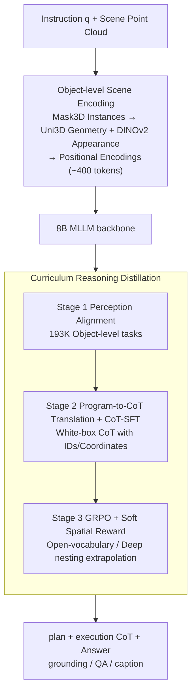

# APEIRIA: Distilling Neuro-Symbolic Programs into 3D Multi-modal LLMs

**Conference**: ICML 2026  
**arXiv**: [2606.01215](https://arxiv.org/abs/2606.01215)  
**Code**: https://github.com/oceanflowlab/APEIRIA  
**Area**: 3D Vision / Multimodal VLM  
**Keywords**: Neural-Symbolic, 3D Spatial Reasoning, Chain-of-Thought, GRPO, Curriculum Learning

## TL;DR
This paper proposes APEIRIA, which distills program execution traces from neuro-symbolic 3D concept learners into natural language chain-of-thought (CoT) for 3D MLLMs. By applying GRPO reinforcement learning, this reasoning pattern is generalized to open-vocabulary and deeply nested instructions. APEIRIA outperforms both traditional NS3D methods and state-of-the-art 3D MLLMs across ScanRefer, Multi3DRefer, SQA3D, and Scan2Cap, while retaining the interpretability and modular transparency of symbolic systems.

## Background & Motivation
**Background**: 3D spatial reasoning (grounding, QA, captioning) is currently dominated by two approaches. One is neuro-symbolic 3D (NS3D) concept learners (e.g., NS3D, LARC), which parse instructions into programs composed of primitives like `scene/filter/relate`. The other is end-to-end 3D MLLMs (e.g., Chat-Scene, Inst3D-LMM, Video-3D LLM, LLaVA-3D), which directly map scene tokens and language to answers in a black-box manner.

**Limitations of Prior Work**: NS3D is interpretable and compositional but faces two hard constraints: (i) primitives like `filter(chair)` depend on fixed concept networks and cannot handle open-vocabulary terms like "cozy chair" or "messy desk"; (ii) training each primitive requires dense intermediate supervision, limiting them to synthetic data like Sr3D with template-generated instructions and shallow nesting. Conversely, while 3D MLLMs handle free-form language, their reasoning is a black box—failures cannot be localized to object recognition, spatial relations, or compositional logic errors.

**Key Challenge**: Interpretability versus semantic flexibility appears to be a trade-off. The authors identify a decoupling opportunity: **symbolic programs encode the "syntax of reasoning" (how to decompose and verify), while MLLMs possess "open-world semantic knowledge"**—these two aspects can be learned separately.

**Goal**: (1) Distill the reasoning patterns of NS programs (decomposition + stepwise spatial verification) into 3D MLLMs; (2) Enable reasoning capabilities to break through the closed-vocabulary and shallow-nesting constraints of synthetic data, generalizing to real-world instructions like ScanRefer/Multi3DRefer; (3) Retain interpretable NS traces and modular swappability.

**Key Insight**: Synthetic datasets like Sr3D naturally provide **complete intermediate supervision**—the inputs and outputs of every `filter` and the intermediate sets of every `relate` can be derived from ground-truth annotations. This "white-box supervision" is first used to inject reasoning templates into the MLLM, followed by RL with outcome supervision to extrapolate these templates to open concepts.

**Core Idea**: Serialize the execution traces of symbolic programs into natural language CoTs for SFT (teaching "how to think"), then use GRPO with soft spatial rewards for RL (generalizing templates to open-vocabulary and deep nesting), thereby achieving an end-to-end MLLM with both the systematicity of NS3D and the flexibility of LLMs.

## Method

### Overall Architecture
APEIRIA aims to enable an end-to-end 3D MLLM to systematically decompose and verify spatial relations like symbolic programs while handling open-vocabulary and deeply nested instructions. The approach involves translating neuro-symbolic program execution traces into natural language CoT to teach the model "how to think," followed by reinforcement learning to extrapolate this reasoning template to real-world instructions.

The system is built on an 8B MLLM backbone. Input consists of a natural language instruction $q$ and a set of **object-level** scene representations $\mathcal{O}$. The output is a CoT containing "plan + execution" tags followed by the final answer $A$ (grounding box / QA answer / caption). Instead of video tokens, the scene is compressed into approximately 400 object-centric tokens: Mask3D segments the scene into instances, each represented by Uni3D for geometric features and DINOv2 for 2D appearance, with learnable positional encodings for coordinates and sizes. Visual and spatial features of each object are treated as tokens and interleaved with instruction tokens for the LLM.

Training is structured as a three-stage curriculum—"Perceive → Think → Adapt"—stacking capabilities from simple to complex: Stage 1 performs perception alignment to map 3D geometric features into the LLM's language space; Stage 2 applies Program-to-CoT translation for Supervised Fine-Tuning (CoT-SFT) to instill systematic decomposition; Stage 3 uses GRPO reinforcement learning (CoT-RL) to generalize the pattern to open-set complex instructions. Since planning and perception are decoupled by design, the plan can be replaced with GPT-4/Claude outputs, or the `scene()` primitive can be swapped for stronger segmenters like SegDINO3D without retraining.

### Key Designs

**1. Curriculum Reasoning Distillation: Decoupling perception, reasoning, and generalization into non-overlapping training objectives.**

3D reasoning requires "seeing objects," "decomposing instructions," and "decomposing deeply." Cramming these into a single training stage often leads to non-convergence or neglect of certain aspects. APEIRIA splits this into a three-stage curriculum. Stage 1 utilizes ~193K object-level perception tasks (identification, localization, captioning) for vision-language pre-training to align 3D geometric features with LLM embedding space. Stage 2 performs CoT-SFT on two levels of programs: Level-1 (78K single-step `filter` from ScanNet/MMScan) and Level-2 (66K two-step `relate`/`relate_triple` from Sr3D). The objective is the joint likelihood of CoT and answer $\mathcal{L}_{\text{CoT-SFT}} = -\mathbb{E}\,[\log p_\theta(\text{CoT}, A \mid q, \mathcal{O})]$, instilling the "decomposition + stepwise verification" template. Stage 3 applies GRPO on real instructions from ScanRefer/Multi3DRefer. Ablations show Stage 3 without Stage 2 results in a drop in ScanRefer Acc@0.25 from 58.4% to 48.2% due to an excessive search space, while Stage 2 alone is limited by closed vocabularies.

**2. Program-to-CoT Translation: Reversing symbolic programs into white-box CoT with ground-truth as a supervision source for Stage 2.**

In Stage 2, CoT is not generated by the LLM from scratch but translated from NS3D `scene/filter/relate` programs. Each program's AST is parsed into an execution sequence $\mathcal{S} = \{s_1, \ldots, s_n\}$. Each step $s_i$ is serialized into two parts: a *plan* describing the sub-goal (e.g., "Find all objects of category 'vase'") and an *execution* that explicitly lists input/output objects using **ID + coordinates + size**. For instance, `relate(filter(desk), filter(wall), left)` expands into a list of desk IDs, wall IDs, and the resulting desk IDs satisfying the "left" relation. The final CoT concatenates all plans followed by all executions, creating a transparent trace from query to answer. This trace is **spatially grounded**, using unique IDs to avoid ambiguity between identical object classes. This avoids the "vocabulary bottleneck" of traditional NS3D systems and suppresses hallucinations by providing verifiable ground-truth for every step.

**3. GRPO + Soft Grounding Reward: Extrapolating the reasoning template to open concepts and deep nesting on real data without step-level supervision.**

Real instructions like those in ScanRefer lack parsable programs for intermediate supervision. Stage 3 uses Outcome-based RL to push Stage 2 templates toward open-vocabulary ("comfortable", "cozy") and deep nesting ("on the kitchen counter AND besides the white fridge"). GRPO optimizes policy $\pi_\theta$ by sampling $N$ responses per instruction and calculating group-normalized advantage $A_i$. The reward consists of: (1) **Soft Grounding Reward**, using exponentially decaying similarity for center and size:
$$R_{\text{grounding}} = e^{-\alpha \|\bm{x}_{\text{pred}} - \bm{x}_{\text{gt}}\|_2} + e^{-\alpha \|(\bm{s}_{\text{pred}} - \bm{s}_{\text{gt}})/\bm{s}_{\text{gt}}\|_1},\quad \alpha = 2$$
This provides dense gradients even when predicted boxes do not overlap with GT, bypassing the sparsity of IoU. (2) **Format Reward**: Ensuring the response contains valid plan/thinking tags. Ablations show swapping Soft Grounding with sparse IoU drops performance by 0.5–0.7%, while removing the Format Reward leads to "structure collapse" where the model skips reasoning.

### Loss & Training
Stages 1 and 2 utilize standard next-token language modeling loss. Stage 3 uses the GRPO clipped surrogate loss (group-normalized advantage + clipping + KL penalty). The 8B backbone is fine-tuned using LoRA along with AdamW/Muon optimizers. CoT supervision includes 144K verified samples in Stage 2, while Stage 3 utilizes RL on downstream instruction-answer pairs with group-wise comparisons.

## Key Experimental Results

### Main Results

ScanRefer & Multi3DRefer (3D Spatial Grounding) results:

| Method | Type | ScanRefer Acc@0.25 | ScanRefer Acc@0.5 | M3DRef F1@0.25 | M3DRef F1@0.5 |
|------|------|--------------------|-------------------|----------------|---------------|
| NS3D (Hsu 2023) | NS3D | 22.4 | – | – | – |
| LARC (Feng 2024) | NS3D | 32.9 | – | – | – |
| LaSP (Mi 2025) | NS3D | 49.2 | – | – | – |
| Chat-Scene | 3D MLLM | 55.5 | 50.2 | 57.1 | 52.4 |
| Inst3D-LMM | 3D MLLM | 57.8 | 51.6 | 58.3 | 53.5 |
| Video-3D LLM | 3D MLLM | 58.1 | 51.7 | 58.0 | 52.7 |
| **APEIRIA** | 3D MLLM | **58.4** | 51.2 | **59.2** | **53.8** |
| **APEIRIA†** (+ SegDINO3D) | 3D MLLM | **60.5** | **53.2** | **60.9** | **55.2** |

Cross-task generalization: Scan2Cap C@0.25 = 90.6 (Prev. SOTA LEGO 84.7), SQA3D EM = 58.6 (matching Video-3D LLM).

Zero-shot open concept (Stage 2 on Sr3D, transferred to Nr3D): APEIRIA achieves 36.5%, outperforming **fully supervised** NS3D (33.9%), validating the breakthrough in vocabulary bottlenecks.

### Ablation Study

| Configuration | ScanRefer Acc@0.25 | M3DRef F1@0.25 | Description |
|------|--------------------|----------------|------|
| APEIRIA full | 58.4 | 59.2 | Full three stages |
| w/o Stage 3 (CoT-RL -> Direct SFT) | 51.5 | 55.3 | Drop of 6.9/3.9; RL necessary for real instructions |
| w/o Stage 2 (Skip to CoT-RL) | 48.2 | 36.7 | Drop of 10.2/22.5; RL fails without warm start |
| w/o Format Reward | 55.7 | 57.1 | Structure collapse observed |
| w/o Soft Grounding (Sparse IoU) | 57.7 | 58.7 | Lower exploration efficiency |
| w/o Thinking (Direct answer) | 56.8 | 58.2 | Explicit CoT contributes ~1–2% |

RL gain by reasoning complexity (ScanRefer Acc@0.5): At steps $\le 4$, SFT-only (47.2) > CoT-RL (45.4). At steps $\ge 6$, RL +2.7.

### Key Findings
- **Three stages are indispensable**: Stage 2 serves as the "foundation" (without it, RL exploration fails); Stage 3 serves as the "roof" (without it, synthetic templates do not match real instructions).
- **RL gain correlates with depth**: RL introduces noise for simple tasks ($\le 4$ steps) but provides significant gains (+2.7%) for long-chain reasoning, fulfilling the goal of completing paths where symbolic supervision is unavailable.
- **Bottleneck lies in perception, not planning**: Replacing the planner with Claude 4.5 Opus yielded only +0.2%, but swapping the `scene()` primitive for SegDINO3D yielded +2.0%, nearing the oracle GT upper bound (61.3).
- **Emergent Primitives**: Post-RL, the model spontaneously utilizes primitives like `intersection` and `union` not seen in Stage 2, proving it learns reasoning syntax rather than just templates.

## Highlights & Insights
- **Decoupling reasoning syntax from semantic knowledge**: Instead of distilling "what the teacher knows," APEIRIA distills "how the teacher thinks." This allows neuro-symbolic systematicity and MLLM flexibility to coexist.
- **Reverse-translating white-box CoT from programs**: This "synthetic-to-verifiable-trace" trick yields CoT with much lower hallucination risk than LLM-as-annotator approaches. It is applicable to any domain with program generators (CLEVR, robotics task planning).
- **Soft Grounding Reward for sparse feedback**: Converting binary IoU into an exponential similarity for coordinates/size provides dense gradients, which is highly effective for RL in detection/segmentation tasks.
- **Hot-swappability through modularity**: Improvements in 3D perception (like SegDINO3D) can be directly integrated to boost performance without retraining the entire reasoning system.

## Limitations & Future Work
- **Perception is the current bottleneck**: Nearing the Oracle upper bound with stronger segmenters suggests LLM reasoning is saturated, but 3D segmentation itself remains limited.
- **Curriculum dependency**: Training relies on "program-parsable" synthetic data; extending this to domains without symbolic ecosystems (e.g., ego-centric video) remains an open question.
- **Format Reward simplicity**: While necessary, it only enforces structure, not step-level correctness. Future work might require process reward models (PRM).
- **Static indoors focus**: Evaluations are limited to ScanNet-based static scenes; dynamic scenes, outdoor environments, and multi-view integration are yet to be explored.

## Related Work & Insights
- **vs NS3D / LARC**: These utilize concept networks ($f_{\text{chair}}$) locked to closed vocabularies. APEIRIA replaces these with LLM-driven natural language execution, breaking the vocabulary bottleneck.
- **vs 3D-R1 / Scene-R1**: 3D-R1 uses raw LLM prompting for CoT, risking hallucinations. APEIRIA’s SFT warm start with verifiable traces provides a much more stable foundation for RL.
- **vs Standard 3D MLLMs**: While others are black-box maps, APEIRIA provides "plan + execution" traces that are interpretable, debuggable, and consistently lead in performance.

## Rating
- Novelty: ⭐⭐⭐⭐ Using symbolic programs as CoT supervision is a clean combination; RL extrapolation is a significant increment.
- Experimental Thoroughness: ⭐⭐⭐⭐⭐ Comprehensive coverage across multiple benchmarks, tasks, and detailed ablations including oracle upper-bound analysis.
- Writing Quality: ⭐⭐⭐⭐ Clear motivation and figures; however, some method details and data volumes are relegated to the appendix.
- Value: ⭐⭐⭐⭐⭐ Resolves two major pain points (closed vocabulary and black-box nature) in 3D reasoning. Modular design ensures long-term viability.

<!-- RELATED:START -->

## Related Papers

- [\[CVPR 2026\] Foundry: Distilling 3D Foundation Models for the Edge](../../CVPR2026/3d_vision/foundry_distilling_3d_foundation_models_for_the_edge.md)
- [\[CVPR 2025\] Neuro-3D: Towards 3D Visual Decoding from EEG Signals](../../CVPR2025/3d_vision/neuro-3d_towards_3d_visual_decoding_from_eeg_signals.md)
- [\[AAAI 2026\] STMI: Segmentation-Guided Token Modulation with Cross-Modal Hypergraph Interaction for Multi-Modal Object Re-Identification](../../AAAI2026/3d_vision/stmi_segmentation-guided_token_modulation_with_cross-modal_hypergraph_interactio.md)
- [\[AAAI 2026\] Multi-Modal Assistance for Unsupervised Domain Adaptation on Point Cloud 3D Object Detection](../../AAAI2026/3d_vision/multi-modal_assistance_for_unsupervised_domain_adaptation_on_point_cloud_3d_obje.md)
- [\[ICLR 2026\] pySpatial: Generating 3D Visual Programs for Zero-Shot Spatial Reasoning](../../ICLR2026/3d_vision/pyspatial_generating_3d_visual_programs_for_zero-shot_spatial_reasoning.md)

<!-- RELATED:END -->
