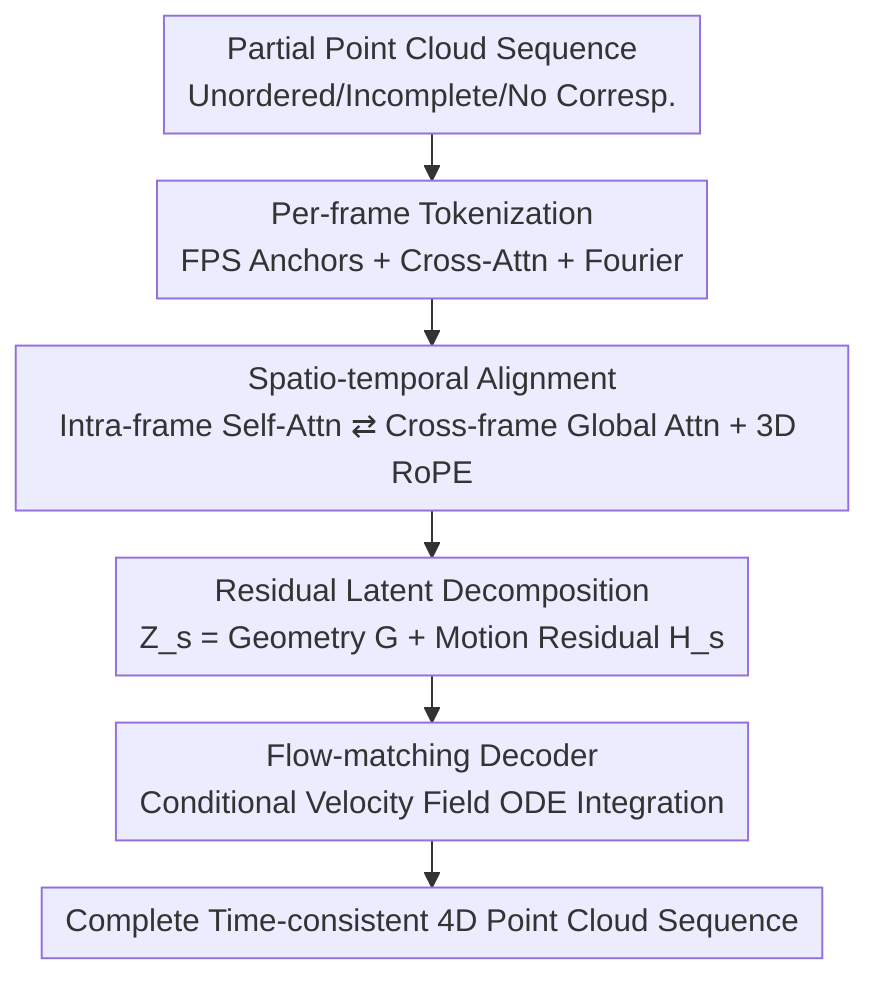

# DynaTok: Token-Based 4D Reconstruction from Partial Point Clouds

**Conference**: ICML2026  
**arXiv**: [2606.12189](https://arxiv.org/abs/2606.12189)  
**Code**: Project page https://wrchen530.github.io/dynatok/ (Code planned for open-source after acceptance)  
**Area**: 3D Vision / 4D Reconstruction  
**Keywords**: 4D reconstruction, partial point clouds, temporal aggregation, latent tokens, flow matching

## TL;DR
DynaTok encodes incomplete, unordered, and non-correspondence partial point clouds of each frame into a set of compact latent tokens. It aggregates complementary observations across frames using a spatio-temporal Transformer, decouples deformation using a unified latent space of "reference geometry + residual motion," and reconstructs time-consistent complete 4D point cloud sequences via a flow-matching decoder.

## Background & Motivation
**Background**: 4D reconstruction (dynamic 3D scene reconstruction over time) has recently been driven by image/video-based methods, relying on dense visual observations, rich textures, and appearance cues to recover dynamic geometry. Point clouds are the native output of depth sensors, which do not depend on texture and surface connectivity, making them more aligned with the perception modes of real robots/AR.

**Limitations of Prior Work**: Most existing point-cloud-based learning methods can only handle static scenes or single-object deformations, and usually assume relatively complete inputs, require explicit point-to-point correspondence, or even necessitate watertight mesh supervision. These assumptions rarely hold in real-world depth sensing scenarios.

**Key Challenge**: Real-world testing involves **partial point cloud sequences**—severely incomplete due to limited sensor coverage, occlusion, and viewpoint changes, with unordered points and no identity correspondence across frames. This presents three difficulties: (i) whole segments might be missing in a single frame (especially for dynamic objects), making frame-by-frame reconstruction insufficient; (ii) without appearance/tracking cues, it is impossible to distinguish whether missing points result from occlusion, motion, or viewpoint changes, and difficult to separate static background from dynamic objects; (iii) point identities are not preserved across frames, thus naive temporal fusion results in inconsistent geometry and motion.

**Goal**: To recover a time-consistent, complete 4D scene representation from "partial + unordered + non-correspondence" pure geometric input, even if certain regions/objects are completely invisible in a single frame.

**Key Insight**: The authors bet on **temporal aggregation**—since a single frame is incomplete, complementary observations from different frames should be allowed to complete each other within a shared latent space. The key observation is that rather than aligning at the raw point level (where no correspondence is available), it is better to compress each frame into a fixed number of latent tokens and perform cross-frame attention at the token level, where temporal consistency emerges implicitly.

**Core Idea**: Represent the entire sequence using a set of cross-frame shared, temporally aligned latent tokens, and explicitly decouple shape and motion using "reference geometry tokens + residual motion tokens" within the **same** unified model, then reconstruct complete geometry via a flow-matching decoder under only point cloud supervision.

## Method

### Overall Architecture
The input is a partial point cloud sequence $\mathcal{X}=\{\mathbf{X}_s\}_{s=1}^{S}$, where each frame $\mathbf{X}_s\in\mathbb{R}^{N_{\text{in}}\times 3}$ (default 8192 points). The output is a complete, time-consistent 4D sequence $\mathcal{Y}=\{\mathbf{Y}_s\}$. The pipeline consists of four steps: first, **tokenize** each frame of the point cloud into $M=512$ latent tokens; then, use a spatio-temporal Transformer for **cross-frame aggregation** and mutual completion of tokens; followed by **residual decomposition** $\mathbf{Z}_s=\mathbf{G}+\mathbf{H}_s$ to separate reference geometry and per-frame motion (without introducing a second network); finally, feed $\mathbf{Z}_s$ into a **flow-matching decoder** to sample complete point clouds step-by-step via ODE integration. All components are trained from scratch with only global point cloud supervision.

### Key Designs

**1. Per-frame point tokenization: Compressing unordered incomplete clouds into fixed representations**

The prerequisite for cross-frame aggregation is a stable, alignable carrier, but raw partial point clouds are unordered and varying in count. The authors use Farthest Point Sampling (FPS) to select $M$ point queries as anchors for each frame. These queries participate in cross-attention to attend to the full raw point cloud (positions serve as key/value); before attention, 3D coordinates are lifted using Fourier features to enhance spatial representation, followed by self-attention layers to refine local geometric context. The output is latent tokens $\mathbf{F}_s$ of size $M\times D_{\mathcal{Z}}$. This step compresses "volatile raw points" into "fixed-count, order-invariant" compact representations, reducing input fluctuations while preserving critical structure.

**2. Spatio-temporal alignment: Cross-frame complementation at the token level**

When a single frame lacks whole segments, it must rely on other frames. A Transformer jointly processes tokens from all frames, alternating between two types of attention: **intra-frame self-attention** maintains spatial consistency within a frame, and **cross-frame global attention** allows tokens to propagate information across time in the latent space. Geometric evidence observed in one frame can influence the latent representation of other frames, thereby completing missing regions. This aggregation occurs entirely at the token level **without assuming point correspondence**; consistency emerges implicitly through shared attention and exposure to complementary observations. For spatial relations, 3D Rotary Position Embedding (RoPE) is used to allow the model to reason about relative geometry.

**3. Residual latent decomposition: Explicit decoupling of geometry and motion in a single network**

Prior methods often use two separate networks for shape reconstruction and deformation modeling, which are redundant and hard to coordinate. DynaTok treats the tokens of the first frame ($s=1$) as the reference representation $\mathbf{G}$ (canonical anchor), while other frames are formulated as residuals:

$$\mathbf{Z}_s=\mathbf{G}+\mathbf{H}_s,\qquad \mathbf{H}_1=\mathbf{0}.$$

All frames share the same latent space without extra tokens or specialized motion spaces. $\mathbf{G}$ carries time-invariant structures, while $\mathbf{H}_s$ captures time-varying changes. Trained end-to-end with only per-frame supervision, the model automatically assigns persistent geometry to the reference component and temporal changes to the residual **without motion labels**.

**4. Conditional flow-matching decoder: Reconstructing complete clouds without correspondence**

Given the aggregated $\mathbf{Z}_s$, the decoder models the global reconstruction as a conditional distribution $p(\mathbf{Y}_s\mid\mathbf{Z}_s)$. It uses conditional flow matching to transform a simple prior into the target scene geometry. Given target points $\mathbf{x}_1$ and noise $\boldsymbol{\epsilon}$, it defines a linear interpolation path $\mathbf{x}_t=(1-t)\boldsymbol{\epsilon}+t\mathbf{x}_1$. The decoder learns a conditional velocity field $\Phi_{\text{dec}}(\mathbf{x}_t,t,\mathbf{Z}_s)$, where the target velocity is $\mathbf{v}_{\text{target}}=\mathbf{x}_1-\boldsymbol{\epsilon}$. The training loss is:

$$\mathcal{L}_{\mathrm{FM}}=\mathbb{E}_{t,\mathbf{x}_1,\boldsymbol{\epsilon},\mathbf{Z}_s}\big[\big\|\Phi_{\mathrm{dec}}(\mathbf{x}_t,t,\mathbf{Z}_s)-(\mathbf{x}_1-\boldsymbol{\epsilon})\big\|_2^2\big].$$

Flow matching is chosen because it naturally supports variable point counts and requires no explicit correspondence. At inference, it integrates the learned ODE from $t=0$ to $t=1$ starting from a uniform prior $\boldsymbol{\epsilon}\sim\mathcal{U}([-1,1]^3)$.

### Loss & Training
The entire model is trained from scratch using only the loss in $\mathcal{L}_{\mathrm{FM}}$. Implementation in PyTorch, 8×H100, AdamW, learning rate $10^{-3}$ with linear warm-up, 250k steps, batch size of 8 sequences per GPU. Training uses $S=8$ random frames per sequence, while 16 frames are used for evaluation. Inputs/targets are normalized using median-based scales. Default: 8192 input points, $M=512$ tokens.

## Key Experimental Results

### Main Results
Evaluated on object-level (DeformingThings4D-Animals, 1972 sequences) and scene-level (Kubric MOVi-F) benchmarks with partial point clouds from depth map back-projection. Metrics include Accuracy (Pred→GT) and Completeness (GT→Pred) via one-sided Chamfer distance, and Normal Consistency (NC).

Object-level DT4D (Two generalization settings):

| Method | Type | Acc↓ (Unseen Motion) | Comp↓ | NC↑ | Acc↓ (Unseen Indiv.) | Comp↓ | NC↑ |
|------|------|------|------|------|------|------|------|
| Shape2VecSet | 3D Per-frame | 0.022 | 0.174 | 0.703 | 0.030 | 0.167 | 0.696 |
| TripoSG | 3D Per-frame | 0.051 | 0.165 | 0.740 | 0.048 | 0.143 | 0.732 |
| TRELLIS | 3D Per-frame | 0.026 | 0.190 | 0.813 | 0.049 | 0.194 | 0.787 |
| Motion2VecSets | 4D | 0.055 | 0.060 | 0.856 | 0.061 | 0.065 | 0.824 |
| **Ours (DynaTok)** | 4D | **0.023** | **0.021** | **0.914** | **0.027** | **0.026** | **0.877** |

Scene-level Kubric:

| Method | Acc↓ (Foreground) | Comp↓ | NC↑ | Acc↓ (FG+BG) | Comp↓ | NC↑ |
|------|------|------|------|------|------|------|
| Shape2VecSet | 0.008 | 0.027 | 0.680 | 0.009 | 0.026 | 0.724 |
| TripoSG | 0.012 | 0.023 | 0.711 | 0.042 | 0.020 | 0.783 |
| TRELLIS | 0.009 | 0.029 | 0.829 | 0.011 | 0.025 | 0.874 |
| Motion2VecSets | 0.061 | 0.063 | 0.545 | – | – | – |
| **Ours (DynaTok)** | **0.008** | **0.010** | **0.835** | **0.010** | **0.014** | **0.888** |

Per-frame 3D baselines perform decently in Accuracy but fail significantly in Completeness (unable to recover missing areas). Motion2VecSets is limited by fixed 512 points and single-object assumptions. DynaTok leads significantly in Completeness and NC, validating the value of temporal aggregation.

### Ablation Study

| Configuration | Acc↓ | Comp↓ | NC↑ | Note |
|------|------|------|------|------|
| Per-frame Only | 0.276 | 0.301 | 0.531 | Geometry collapses without temporal aggregation |
| Geometry-Motion (Full) | 0.027 | 0.026 | 0.877 | Residual decoupled geometry-motion coding |
| $M=128$ tokens | 0.030 | 0.032 | 0.869 | Too few tokens leads to detail loss |
| $M=256$ tokens | 0.027 | 0.026 | 0.877 | Trade-off point |
| $M=512$ tokens | 0.026 | 0.030 | 0.881 | Highest NC with more tokens |

### Key Findings
- **Temporal aggregation is vital**: Removing cross-frame aggregation and degrading to per-frame encoding causes Acc to jump from 0.027 to 0.276 and Comp from 0.026 to 0.301—proving the core hypothesis that missing geometry can be recovered through cross-frame complementation.
- **Token count is a smooth capacity knob**: Performance improves steadily as $M$ increases from 128 to 512, but $M=256$ already approaches saturation, suggesting the representation is not overly sensitive to the exact token count.
- **Failure modes of per-frame baselines are clear**: They maintain Accuracy for observed points but have disastrous Completeness for unobserved regions, highlighting that "cross-frame completion" is a distinct capability from "single-frame generation."

## Highlights & Insights
- **Token-level alignment bypasses the "no-correspondence" deadlock**: Raw points lack identity for alignment, but compressing them into fixed tokens allows cross-attention to perform soft alignment naturally, forcing temporal consistency to emerge implicitly.
- **Residual parameterization $\mathbf{Z}_s=\mathbf{G}+\mathbf{H}_s$ eliminates the second network**: Where others use "shape + deformation" networks, this model uses a shared latent space and a zero-residual reference frame to achieve decoupling without motion labels.
- **Strategic fit for flow matching**: Flow matching's natural support for variable point counts and lack of correspondence requirement makes it the ideal candidate for point cloud generation.

## Limitations & Future Work
- **Dependency on the first frame as a canonical reference**: If the first frame is extremely incomplete, the anchor geometry may be unstable.
- **Purely geometric, no semantics/appearance**: While depth-aligned, it ignores texture cues, making it difficult to distinguish objects with identical shapes.
- **Evaluation on synthetic data**: Real-world sensor noise, motion blur, and calibration errors are not fully verified. Code is not yet open-sourced.
- **Future Work**: Replacing the "fixed first frame" with learnable canonical tokens or multi-reference fusion, and introducing lightweight semantic priors.

## Related Work & Insights
- **vs Motion2VecSets**: Both do 4D point clouds, but M2VS infers canonical shape only from the **first frame**, is limited to single objects, and uses fixed 512 points. DynaTok performs **joint** cross-frame aggregation, handles initial-frame incompleteness, and scales to full scenes.
- **vs Per-frame 3D VAEs**: They lack temporal integration; DynaTok’s recovery of missing regions via aggregation is its core advantage.
- **vs Image/Video 4D (e.g., GVFD)**: Image methods rely on dense appearance and often require explicit correspondence, which is not applicable to the pure geometric, partial point cloud setting.

## Rating
- Novelty: ⭐⭐⭐⭐⭐ First to define and solve 4D reconstruction from "partial + unordered + non-correspondence" clouds using a clean token-residual-flow pipeline.
- Experimental Thoroughness: ⭐⭐⭐⭐ Strong benchmarks and ablations, though lacks real-world sensor data and code for reproduction.
- Writing Quality: ⭐⭐⭐⭐⭐ Clear progression from motivation to steps, matching challenges with specific solutions.
- Value: ⭐⭐⭐⭐ Addresses real-world depth sensing pain points; the residual decoupling paradigm has transfer value for dynamic modeling.

<!-- RELATED:START -->

## Related Papers

- [\[CVPR 2026\] Vista4D: Video Reshooting with 4D Point Clouds](../../CVPR2026/3d_vision/vista4d_video_reshooting_with_4d_point_clouds.md)
- [\[AAAI 2026\] TOSC: Task-Oriented Shape Completion for Open-World Dexterous Grasp Generation from Partial Point Clouds](../../AAAI2026/3d_vision/tosc_task-oriented_shape_completion_for_open-world_dexterous_grasp_generation_fr.md)
- [\[CVPR 2026\] V-DPM: 4D Video Reconstruction with Dynamic Point Maps](../../CVPR2026/3d_vision/v-dpm_4d_video_reconstruction_with_dynamic_point_maps.md)
- [\[CVPR 2026\] Edges Compete for Trust: Group Relative Edge Optimization for Building Reconstruction from Point Clouds](../../CVPR2026/3d_vision/edges_compete_for_trust_group_relative_edge_optimization_for_building_reconstruc.md)
- [\[CVPR 2026\] Aligning Text, Images and 3D Structure Token-by-Token](../../CVPR2026/3d_vision/aligning_text_images_and_3d_structure_token-by-token.md)

<!-- RELATED:END -->
