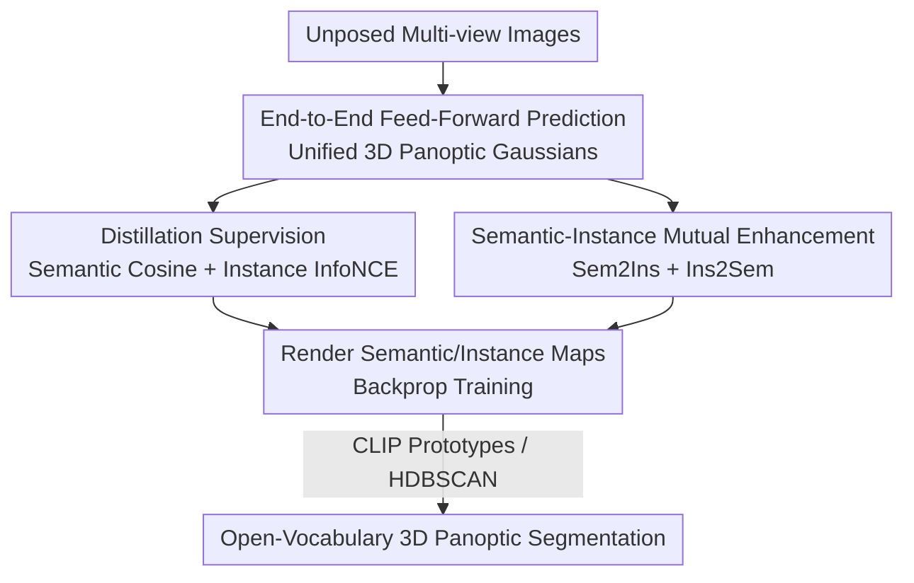

# EPS3D: End-to-End Feed-Forward 3D Panoptic Segmentation

**Conference**: ICML2026  
**arXiv**: [2606.08980](https://arxiv.org/abs/2606.08980)  
**Code**: https://github.com/Runsong123/EPS3D  
**Area**: 3D Vision (Open-vocabulary 3D Panoptic Segmentation · Feed-forward Gaussian)  
**Keywords**: Open-vocabulary, 3D Panoptic Segmentation, Feed-forward Reconstruction, 3D Gaussian, Semantic-Instance Mutual Enhancement

## TL;DR
EPS3D is the first end-to-end feed-forward open-vocabulary 3D panoptic segmentation framework. It directly predicts unified 3D panoptic Gaussians with semantic and instance attributes from unposed multi-view images in a single forward pass. By distilling 2D foundation models for supervision, it bypasses the need for 3D annotations. It introduces a semantic-instance mutual enhancement module for reciprocal calibration, achieving approximately 13% higher semantic mIoU than SOTA on Replica with an inference time of only 1 second per scene.

## Background & Motivation
**Background**: Open-vocabulary 3D panoptic segmentation (OV3DPS) aims to simultaneously provide unrestricted semantic categories and instance identities within a 3D scene while ensuring cross-view 3D consistency. This is a critical capability for robotics, embodied AI, and VR/AR. Due to the scarcity of 3D annotations, the mainstream approach involves "lifting" results from 2D foundation models (e.g., CLIP for semantics, SAM for instances) into 3D radiation fields like 3D Gaussian Splatting (3DGS).

**Limitations of Prior Work**: Existing dual routes are suboptimal. First, the **per-scene optimization** approach requires separate optimization for every scene to fuse 2D results into 3D representations (e.g., Feature-3DGS taking 18 minutes, Unified-Lift taking 5 minutes), which is slow and lacks scene-level robustness for real-time use. Second, the recent **feed-forward two-stage** approach (e.g., LSM, Uni3R) extracts semantic features per view using pre-trained 2D models before fusing them with a feed-forward 3D network. While efficient, the intermediate 2D features are **view-dependent and inconsistent**, causing error accumulation during multi-view fusion. Furthermore, most focus solely on semantics without object-level structural cues, resulting in blurry boundaries unsuitable for instance-level downstream applications like editing or robotic grasping.

**Key Challenge**: In the two-stage paradigm, extracting 2D features independently at the start injects cross-view inconsistency at the source, making subsequent fusion a mere remedial effort. Simultaneously, semantics and instances are treated as independent tasks, discarding their potential complementarity.

**Goal**: To develop an efficient and accurate end-to-end method that: (1) eliminates error accumulation from the two-stage process; (2) jointly outputs precise semantic and object-level instance predictions in 3D.

**Key Insight**: Rather than "extracting view-dependent features first and then fusing," the network should **directly predict a unified 3D representation from multi-view images in one step**. This encourages consistency during the feature extraction and decoding stages rather than attempting to fix it after the fact.

**Core Idea**: Use a feed-forward network to map unposed multi-view images directly to unified 3D panoptic Gaussians (incorporating geometry, appearance, semantics, and instances). 2D foundation models serve only as "teachers" for distillation supervision during training, and a semantic-instance mutual enhancement module is introduced to allow the two prediction paths to calibrate each other.

## Method

### Overall Architecture
EPS3D learns a mapping $f_\theta:\{C_i\}_{i=1}^N \mapsto \mathcal{G}$ that transforms $N$ unposed RGB images directly into a set of unified 3D panoptic Gaussians $\mathcal{G}=\{(I_g,S_g),(\boldsymbol\mu_g,\sigma_g,\boldsymbol r_g,\boldsymbol s_g,\boldsymbol c_g)\}_{g=1}^G$. Each Gaussian contains standard geometric/appearance parameters (center, opacity, rotation, scale, SH color) along with text-aligned semantic features $S_g\in\mathbb{R}^{512}$ and instance features $I_g\in\mathbb{R}^{32}$. The workflow involves a geometric transformer (based on VGGT) that patchifies multi-view images and aggregates them into 3D-aware tokens via cross-view self/cross-attention. Multiple DPT heads then decode these: one head for depth (back-projected to Gaussian centers), one for remaining geometry/appearance, and two for semantic and instance features. After rendering these panoptic Gaussians into semantic/instance maps, distillation supervision is applied using 2D teachers, supplemented by semantic-instance mutual enhancement (Sem2Ins + Ins2Sem). During inference, semantics are determined via argmax against CLIP text prototypes, and instances are obtained via HDBSCAN clustering. The entire pipeline is completed in a single forward pass without independent 2D feature extraction.

### Key Designs

**1. End-to-End Feed-Forward Unified Panoptic Gaussians: Eliminating Error Accumulation at the Source**

To address the cross-view inconsistency caused by the two-stage paradigm's "per-view feature extraction followed by fusion," EPS3D removes this intermediate step. A feed-forward network directly processes multi-view RGB to output a unified 3D representation. Specifically, the geometric transformer (VGGT architecture) patchifies images into tokens, which are aggregated into 3D-aware tokens $\hat t^i$ through $L$ layers of self-attention and cross-attention. Subsequently, a DPT-based dual-head regresses Gaussian geometry (one head for depth maps back-projected to centers $\{\boldsymbol\mu_g\}$, another for $\sigma,\boldsymbol r,\boldsymbol s,\boldsymbol c$). Two additional DPT heads, $F_I$ and $F_S$, predict instance and text-aligned semantic features directly from the same 3D-aware tokens: $\{I_g,S_g\}=F_I(\hat t^i),F_S(\hat t^i)$. Crucially, these features emerge from **tokens that have already been aggregated across views**, naturally encouraging multi-view consistency rather than forcing fusion after independent per-view predictions.

**2. Distillation Supervision: 2D Models as Teachers, Bypassing 3D Annotations**

Since 3D panoptic labels are scarce, EPS3D uses 2D foundation models as external teachers to provide distillation signals (they are not part of the model itself). For semantics, the rendered text-aligned semantic features $S^i$ are aligned with LSeg teacher features $\hat S^i$ using cosine similarity: $\mathcal{L}_{sem}=1-\frac{\hat S^i\cdot S^i}{\|\hat S^i\|\|S^i\|}$. For instances, SAM's 2D segmentation IDs are inconsistent across views, so supervision must be permute-invariant. A single-view contrastive learning approach is used, applying InfoNCE to rendered instance features:

$$\mathcal{L}_{\text{ins}}=-\frac{1}{|\Omega|}\sum_{\Omega_j\in\Omega}\sum_{u\in\Omega_j}\log\frac{\exp(\operatorname{sim}(I_u,\bar I_j))}{\sum_{\Omega_l\in\Omega}\exp(\operatorname{sim}(I_u,\bar I_l))},$$

This pulls pixel features of the same instance ID toward their centroid $\bar I_j$ and pushes different instances apart. This learns discriminative, view-consistent 3D instance features without 3D ground truth or cross-view ID consistency.

**3. Semantic-Instance Mutual Enhancement: Reciprocal Calibration**

In basic training, semantics and instances are optimized independently, ignoring their complementarity (semantics provide category context; instances provide object boundaries). The mutual enhancement module couples them in two directions. **Sem2Ins** (Semantic-to-Instance): Semantic features $S_g$ and initial instance features $I_g$ are projected, concatenated, and fused to produce semantic-refined instance features $\{I_g^{\text{sem}}\}=F_{\text{fusion}}(\operatorname{concat}(F_{\text{proj1}}(I_g),F_{\text{proj2}}(S_g)))$. These serve as final instance attributes for rendering and are supervised by $\mathcal{L}_{\text{ins}}$, allowing category context to stabilize instance grouping. **Ins2Sem** (Instance-to-Semantic): In each iteration, $M$ anchor Gaussians are randomly selected. For each anchor, top-$K$ neighbors are identified based on instance feature similarity (assuming they belong to the same 3D object). Their semantic consistency is enforced: $\mathcal{L}_{\text{Ins2Sem}}=\frac{1}{K}\frac{1}{M}\sum_{m=1}^{M}\sum_{k=1}^{K}(1-\frac{S_k^m\cdot S_m}{\|S_k^m\|\|S_m\|})$. This uses object boundaries/cues from instances to sharpen semantics and eliminate jitter within a single object. The total loss is $\mathcal{L}_{\text{total}}=w_1\mathcal{L}_{rgb}+w_2\mathcal{L}_{ins}+w_3\mathcal{L}_{sem}+w_4\mathcal{L}_{\text{Ins2Sem}}$. Ablations show this specialized coupling significantly outperforms standard cross-attention.

### Loss & Training
Trained on ScanNet and ScanNet++ using 8 A800 GPUs. Geometry and appearance use standard RGB rendering L1 loss plus regularizers. Loss weights: $w_1=10^{-1},\ w_2=10^{-3},\ w_3=10^{-1},\ w_4=10^{-4}$. Feature dimensions: $D_S=512$ (CLIP), $D_I=32$.

## Key Experimental Results

### Main Results
Evaluated on ScanNet and Replica for open-vocabulary semantic/instance segmentation. Outperforms 2D models, per-scene optimization methods, and two-stage feed-forward SOTA in both 2-view and 8-view settings. Inference takes ~0.7–1 second per scene (vs. minutes for optimization-based methods).

| Dataset · Setting | Metric | EPS3D | Prev. SOTA | Gain |
|-------------|------|-------|-----------|------|
| ScanNet · 8-view · Novel Sem. | mIoU | 0.6169 | 0.5215 (Uni3R) | +0.095 |
| Replica · 8-view · Novel Sem. | mIoU | 0.4833 | 0.3216 (Uni3R) | +~13% |
| ScanNet · 2-view · Context Sem. | mIoU | 0.6323 | 0.5233 (Uni3R) | +0.109 |
| ScanNet · 2-view · Context Ins. | F-score | 0.4552 | 0.1150 (SAM) | Large Lead |
| ScanNet · Recon. Time | Time | 0.73s | 18min (Feature-3DGS) | Order of Mag. |

**Full Panoptic Metrics (PQ/SQ/RQ, Novel-view)**: Since existing 3D methods only handle semantics or instances, the authors constructed ensemble baselines. EPS3D achieved PQ 0.5304 on ScanNet (vs. LSeg+SAM 0.3803 and Uni3R+Unified-Lift 0.4013), and PQ 0.3539 on Replica (vs. 0.2617/0.2716), demonstrating the advantage of unified panoptic prediction.

### Ablation Study (Replica · Novel-view)

| Configuration | Semantic mIoU | Instance mIoU | Description |
|------|-----------|-----------|------|
| EPS3D Full | 0.4833 | 0.3468 | Full model |
| w/o Splatting Supervision | 0.4533 | 0.2519 | Max drop in instance; splatting is key |
| w/o Ins2Sem | 0.4531 | 0.3388 | Sig. drop in semantics |
| w/o Sem2Ins | 0.4821 | 0.3210 | Drop in instance |
| Mutual Enh. $\rightarrow$ Cross-attention | 0.4677 | 0.3230 | Inferior to specialized coupling |

### Key Findings
- **Feature Splatting Supervision is Crucial**: Directly supervising semantic/instance head predictions without rendering (splatting) causes instance mIoU to crash from 0.3468 to 0.2519. "Rendering back to 2D for supervision" is the core mechanism for achieving view consistency in end-to-end frameworks.
- **Mutual Enhancement Functions as Intended**: Removing Ins2Sem primarily hurts semantics (0.4833 $\rightarrow$ 0.4531), while removing Sem2Ins hurts instances (0.3468 $\rightarrow$ 0.3210), aligning with the "sharpening boundaries via instances, stabilizing grouping via semantics" design motivation.
- **Specialized Coupling > General Cross-attention**: Replacing the enhancement module with standard cross-attention resulted in declines for both metrics, proving that explicit directional coupling is more effective than unconstrained attention.

## Highlights & Insights
- **"Source Consistency" over "Post-fusion"**: Directly decoding semantic/instance features from cross-view aggregated 3D tokens fundamentally circumvents error accumulation from two-stage pipelines.
- **Teachers are Training-only**: 2D foundation models act purely as distillation teachers and do not enter the inference pipeline, avoiding 3D labels while keeping inference lightweight (1s per scene) for downstream tasks like robotic grasping.
- **Transferable Bidirectional Coupling**: The Sem2Ins/Ins2Sem logic of using the strength of one path to compensate for the weakness of another can be applied to any task requiring joint prediction of complementary attributes (e.g., semantic+depth).

## Limitations & Future Work
- Dependency on specific geometric transformer (VGGT) and DPT decoders; generalization to extremely sparse views or large-scale outdoor scenes remains unverified.
- Distillation upper bounds are constrained by the 2D teachers (LSeg/SAM); systematic errors in categories or boundaries may be inherited.
- The top-$K$ neighbor assumption in Ins2Sem relies on instance feature similarity; this might introduce alignment errors early in training or at tight object boundaries.
- Inference for instance segmentation relies on HDBSCAN; sensitivity to clustering hyperparameters was not deeply analyzed.

## Related Work & Insights
- **vs. Per-scene Optimization (Feature-3DGS, Unified-Lift)**: These require 5-18 minutes per scene; Ours achieves higher metrics in 1 second with better robustness across scenes.
- **vs. Feed-Forward Two-Stage (LSM, Uni3R)**: These suffer from view-dependent feature inconsistency and typically only handle semantics; EPS3D eliminates error accumulation via unified representations and jointly outputs instances.
- **vs. Feed-Forward 3D Reconstruction (Dust3R/VGGT-based)**: Those works reconstruct geometry and appearance without high-level understanding; EPS3D embeds semantics and instances into the same efficient framework.

## Rating
- Novelty: ⭐⭐⭐⭐⭐ First end-to-end feed-forward OV3DPS; shifts paradigm from "post-fusion" to "source consistency."
- Experimental Thoroughness: ⭐⭐⭐⭐ Complete across two datasets, 2/8 views, and PQ/SQ/RQ metrics; needs outdoor/sparse view generalization.
- Writing Quality: ⭐⭐⭐⭐ Clear contrast of paradigms and methods; effective figures and formulas.
- Value: ⭐⭐⭐⭐⭐ 1s/scene efficiency directly supports robotics and 3D editing; highly practical.

<!-- RELATED:START -->

## Related Papers

- [\[CVPR 2025\] Rethinking End-to-End 2D to 3D Scene Segmentation in Gaussian Splatting](../../CVPR2025/3d_vision/rethinking_end-to-end_2d_to_3d_scene_segmentation_in_gaussian_splatting.md)
- [\[ICLR 2026\] Mesh Splatting for End-to-end Multiview Surface Reconstruction](../../ICLR2026/3d_vision/mesh_splatting_for_end-to-end_multiview_surface_reconstruction.md)
- [\[CVPR 2025\] End-to-End Implicit Neural Representations for Classification](../../CVPR2025/3d_vision/end-to-end_implicit_neural_representations_for_classification.md)
- [\[AAAI 2026\] FoundationSLAM: Unleashing the Power of Depth Foundation Models for End-to-End Dense Visual SLAM](../../AAAI2026/3d_vision/foundationslam_unleashing_the_power_of_depth_foundation_models_for.md)
- [\[CVPR 2025\] End-to-End HOI Reconstruction Transformer with Graph-based Encoding](../../CVPR2025/3d_vision/end-to-end_hoi_reconstruction_transformer_with_graph-based_encoding.md)

<!-- RELATED:END -->
