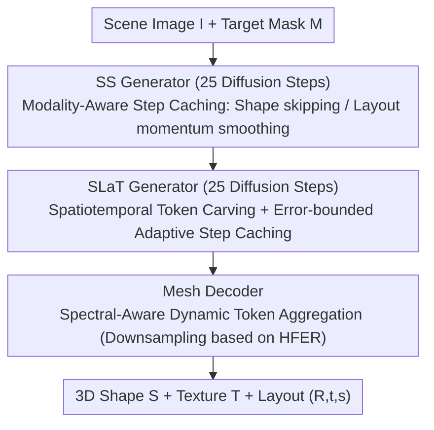

# Fast-SAM3D: 3Dfy Anything in Images but Faster

**Conference**: ICML 2026  
**arXiv**: [2602.05293](https://arxiv.org/abs/2602.05293)  
**Code**: https://github.com/wlfeng0509/Fast-SAM3D  
**Area**: 3D Vision  
**Keywords**: SAM3D Acceleration, Single-view 3D Reconstruction, Training-free Inference Optimization, Diffusion Step Caching, Token Pruning

## TL;DR
To address the slow inference speed of the SAM3D single-view 3D reconstruction model, this paper provides the first module-level latency analysis. It identifies performance bottlenecks caused by three types of heterogeneity (differences in shape/layout dynamics, texture sparsity, and geometric spectral variance). Based on this, the training-free Fast-SAM3D framework is proposed, utilizing Modality-Aware Step Caching, Spatiotemporal Token Carving, and Spectral-Aware Token Aggregation. This achieves up to 2.67× object-level speedup with almost no loss in quality, while the reconstruction F-Score slightly increases from 92.34 to 92.59.

## Background & Motivation

**Background**: Single-view, open-world, mask-conditioned 3D asset generation models like SAM3D have become critical foundations for 3D perception and content creation. Its standard pipeline is a two-stage "coarse-to-fine" diffusion architecture: "Sparse Structure (SS) generator → Sparse Latent (SLaT) generator → Mesh Decoder." This allows direct 3D reconstruction of multiple objects from a single image while decoupling layout information.

**Limitations of Prior Work**: SAM3D suffers from extremely high inference costs. Module-level profiling shows an end-to-end latency of ~462 s per scene, dominated by the SLaT generator (9.7 s/object, 219.8 T FLOPs) and Mesh Decoder (13.8 s/object, 324 T FLOPs), with the SS generator taking 4.1 s. Such latency makes SAM3D nearly impossible to use in interactive deployments.

**Key Challenge**: General diffusion acceleration techniques (e.g., uniform step skipping, random token pruning, or multi-view caches like Fast3DCache) fail when applied to SAM3D. Random Drop slashes 3D-IoU from 0.403 to 0.094, and Fast3DCache only yields a 1.03× speedup. The failure stems from "multi-level heterogeneity" within SAM3D: (i) Shape tokens in the SS stage are smooth along the denoising trajectory, whereas layout tokens (controlling R/t/s) fluctuate at high frequencies; applying the same caching strategy causes systematic pose drift. (ii) Refinement updates in the SLaT stage are extremely sparse in space—most tokens stabilize early, with only edges, seams, and thin structures continuing to update. (iii) In the Mesh decoder stage, objects with different geometric complexities have vastly different tolerances for token downsampling; instance-agnostic uniform downsampling erases high-frequency details of complex objects.

**Goal**: Decomposition into three sub-problems: (1) How to allow the SS generator to skip steps without causing layout drift; (2) How to make the SLaT generator both reuse tokens across time and prune them across space; (3) How to enable the Mesh decoder to adaptively aggregate tokens based on object complexity.

**Key Insight**: The authors elevate "heterogeneity" to a unified design principle—**computation should be non-uniformly allocated**, matching the difficulty of the stage and the complexity of the instance. This means using different core computational budgets for different semantic roles (shape vs. layout) within the same stage, different spatial positions at the same timestep, and different input instances for the same model.

**Core Idea**: Use three targeted, plug-and-play, training-free modules across the three stages to eliminate redundancy simultaneously—forming a unified "heterogeneity-aware" acceleration framework that reduces object-level latency to 37% of the original.

## Method

### Overall Architecture
The goal is to solve the slow inference of SAM3D's three-stage diffusion pipeline (SS generator → SLaT generator → Mesh decoder). The core idea of Fast-SAM3D is to maintain SAM3D's weights while inserting plug-and-play acceleration modules into each native stage, ensuring computational power is spent non-uniformly based on "stage difficulty + instance complexity."

The pipeline receives a scene image $I$ and target object masks $M$, and outputs the 3D shape $S$, texture $T$, and layout parameters $(R,t,s)$ for each object. In the first stage (SS generator, 25 diffusion steps), shape and layout tokens are decoupled into two caching rules to avoid pose drift during step skips. The second stage (SLaT generator, 25 steps) recalculates only a few highly salient tokens spatially and adaptively decides when to skip steps temporally based on trajectory curvature. In the final stage (Mesh decoder), the downsampling intensity is selected based on the spectral energy of the mask and coarse voxels, followed by aggregation of sparse 3D tokens via coordinate quantization and max-pooling. Combined, these modules reduce object-level time from 31.04 s to 11.60 s (2.67×) and scene-level time from 462.3 s to 229.7 s (2.01×).

### Key Designs

**1. Modality-Aware Step Caching (SS Generator): Skip shape steps while keeping layout conservative to avoid pose drift**

The pain point of the SS stage is the completely different denoising dynamics of shape and layout tokens. Trajectory analysis reveals that shape tokens are short-range near-linear, while layout tokens controlling $(R,t,s)$ exhibit high-frequency jitter. Using the same caching strategy for both leads to small errors being amplified into systematic pose drift in the global coordinate system. Therefore, the two are decoupled. For the smooth shape tokens, first-order finite differences $\nabla \mathbf{v}^{\text{shape}}_t = (\mathbf{v}^{\text{shape}}_t - \mathbf{v}^{\text{shape}}_{t+k})/k$ are used for Taylor extrapolation during skipped steps: $\hat{\mathbf{v}}^{\text{shape}}_{t-i} = \mathbf{v}^{\text{shape}}_t + (-i)\nabla \mathbf{v}^{\text{shape}}_t$. For high-frequency layout tokens, linear extrapolation $\mathbf{v}^{\text{layout}}_{\text{lin}}(t-i)$ is followed by momentum smoothing using the last full evaluation anchor:

$$\hat{\mathbf{v}}^{\text{layout}}_{t-i} = \beta \cdot \mathbf{v}^{\text{layout}}_{\text{lin}}(t-i) + (1-\beta) \cdot \mathbf{v}^{\text{layout}}_{\text{anchor}},\quad \beta \in [0,1)$$

The anchor term acts as a "rubber band" to pull back potential divergence. Ablations set the cache stride $k=3$ and momentum $\beta$ at 0.5–0.7. This is the direct realization of the "modality-aware > step-aware" philosophy.

**2. Spatiotemporal Token Carving + Adaptive Step Caching (SLaT Generator): Cutting both spatial and temporal redundancy**

The SLaT stage handles refinement. Heatmaps of token-wise updates show extreme sparsity—large low-entropy regions converge early, while only high-entropy tokens like edges and seams continue to change. Pure spatial pruning misses temporal redundancy, and pure temporal caching accumulates drift at high-curvature trajectory changes. Thus, two mechanisms are used in parallel. Spatially, a unified saliency score is constructed:

$$\mathcal{J}_i(t) = \tfrac{1}{2}\big(\mathcal{M}_i(t)+\gamma \mathcal{A}_i(t)\big)+\tfrac{1}{2}\mathcal{S}_{\text{freq}}(i)$$

where $\mathcal{M}_i(t) = \|\mathbf{v}_{t,i}\|_2$ measures update magnitude, $\mathcal{A}_i(t) = \|\mathbf{v}_{t,i}-\mathbf{v}_{t+1,i}\|_2$ measures abruptness, and $\mathcal{S}_{\text{freq}}(i)$ is FFT-based high-frequency structural intensity. Only top-K (top-10%) tokens enter the backbone each step, acting as a spatial filter. Temporally, curvature proxy $\kappa_t = \|\mathbf{v}_t-\mathbf{v}_{t-1}\|_2 / \|\mathbf{x}_t-\mathbf{x}_{t-1}\|_2$ estimates trajectory nonlinearity, and tangent increments $\Delta_i := \mathbf{v}_i - \mathbf{x}_i$ are cached. During skips, $\hat{\mathbf{v}}_t = \mathbf{x}_t + \Delta_i$. To prevent error explosion, cumulative relative change $E_t = \sum \varepsilon_n$ is tracked; once it exceeds threshold $\mathcal{E}$, a full evaluation is forced to refresh the anchor. This error-bounded switching provides a safety guardrail.

**3. Spectral-Aware Dynamic Token Aggregation (Mesh Decoder): Deciding compression intensity by instance complexity**

The Mesh decoder is the true bottleneck, but different objects have varying tolerances for token downsampling. Visualizations show simple objects' spectral energy is concentrated at low frequencies, while complex objects have high-frequency energy spread across the surface. Instance-agnostic uniform downsampling erases details of complex objects. This is replaced with instance-adaptive routing: FFT is applied to mask $\mathbf{M}_{2D}$ and coarse voxels $\mathbf{V}_{3D}$ to define the High-Frequency Energy Ratio (HFER):

$$\mathcal{H}(\mathbf{X}) = \frac{\sum_{\omega \in \Omega_{\text{high}}} \|\mathcal{F}(\mathbf{X})[\omega]\|_2^2}{\sum_{\omega \in \Omega_{\text{total}}} \|\mathcal{F}(\mathbf{X})[\omega]\|_2^2}$$

These are fused into $\mathcal{H}_{\text{joint}} = w\mathcal{H}(\mathbf{M}_{2D}) + (1-w)\mathcal{H}(\mathbf{V}_{3D})$, and based on thresholds $\tau_{\text{low}}, \tau_{\text{high}}$, a downsampling factor $\mathcal{S} \in \{1.25, 1.5, 2.0\}$ is selected. Simple objects are compressed aggressively, while complex ones preserve detail. Aggregation involves coordinate quantization $\hat{\mathbf{p}}_i = \lfloor \mathbf{p}_i / \mathcal{S} \rfloor$ and max-pooling, reducing token count to approximately $1/\mathcal{S}^3$. HFER is computationally cheap and acts as a lightweight proxy for instance complexity.

### Loss & Training
The entire method is **training-free**—it does not modify SAM3D weights, requires no distillation, and no quantization. All modules are inserted at inference time. Hyperparameters were selected via grid search on a small validation set: SS stage cache stride $k=3$, momentum $\beta \approx 0.7$; SLaT stage carving ratio top-10%, error threshold $\mathcal{E}$ for anchor refreshes; Mesh stage $w$ and $\tau$ calibrated per dataset. Since weights are untouched, it can be combined with distillation or quantization schemes.

## Key Experimental Results

### Main Results
Comparison with SOTA acceleration schemes on Toys4K, Aria Digital Twin (ADT), and ISO3D using SAM3D as the base:

| Method | Uni3D↑ | CD↓ | $F_1$@0.05↑ | vIoU↑ | 3D-IoU↑ | Scene Time (s)↓ | Object Time (s)↓ | Object Gain |
|------|--------|-----|-------------|-------|---------|--------------|--------------|----------|
| SAM-3D (base) | 0.369 | 0.022 | 92.34 | 0.543 | 0.403 | 462.3 | 31.04 | 1.00× |
| Random Drop | 0.264 | 0.030 | 83.52 | 0.327 | 0.094 | 402.2 | 15.93 | 1.95× |
| Uniform Merge | 0.329 | 0.023 | 91.48 | 0.540 | 0.367 | 366.8 | 15.43 | 2.01× |
| Fast3DCache | 0.348 | 0.022 | 91.31 | 0.505 | 0.051 | 443.3 | 30.14 | 1.03× |
| TaylorSeer | 0.344 | 0.028 | 90.95 | 0.504 | 0.374 | 265.6 | 22.93 | 1.35× |
| EasyCache | 0.342 | 0.028 | 87.06 | 0.432 | 0.186 | 244.9 | 23.11 | 1.34× |
| **Fast-SAM3D** | **0.350** | **0.022** | **92.59** | **0.552** | 0.375 | **229.7** | **11.60** | **2.67×** |

Fast-SAM3D's object-level 2.67× speedup far exceeds TaylorSeer/EasyCache's 1.35×/1.34×, with $F_1$ and vIoU being slightly better than the base model. Fast3DCache essentially fails in the single-view setting (1.03×), indicating its reliance on multi-view redundancy.

### Ablation Study
Analysis of module combinations (Scene-level time, Toys4K-style evaluation):

| SS | SLaT | Mesh | CD↓ | $F_1$@0.05↑ | vIoU↑ | Scene Time (s)↓ |
|----|------|------|-----|-------------|-------|--------------|
| ✗ | ✗ | ✗ | 0.022 | 92.34 | 0.543 | 462.3 |
| ✓ | ✗ | ✗ | 0.022 | 92.34 | 0.543 | 408.6 |
| ✗ | ✓ | ✗ | 0.022 | 92.50 | 0.540 | 365.9 |
| ✗ | ✗ | ✓ | 0.022 | 92.43 | 0.557 | 320.4 |
| ✓ | ✓ | ✗ | 0.021 | 92.88 | 0.534 | 310.5 |
| ✓ | ✗ | ✓ | 0.022 | 92.58 | 0.553 | 289.9 |
| ✗ | ✓ | ✓ | 0.022 | 92.43 | 0.554 | 301.3 |
| ✓ | ✓ | ✓ | 0.022 | 92.59 | 0.552 | **229.7** |

Key inflection points for cache stride and carving ratio: $k=3$ balances vIoU and speed; for $k\ge 4$, 3D-IoU drops sharply from 0.375 to 0.241 (pose drift). Carving at top-10% is more stable than top-20%.

### Key Findings
- **Mesh module provides the largest contribution**: Enabling the Mesh module alone reduces time from 462 s to 320 s, identifying the mesh decoder as the primary bottleneck and validating spectral-aware instance aggregation.
- **Acceleration can improve quality**: Enabling the SLaT module alone increases $F_1$ from 92.34 to 92.50. This is interpreted as saliency-based carving acting as a "spatial filter" to remove low-confidence noise tokens.
- **SS module is critical for layout**: Random Drop caused a 75% drop in 3D-IoU, and TaylorSeer caused semantic shifts (e.g., color changes) due to failing to protect high-frequency layout tokens. Fast-SAM3D's momentum anchor is key to stabilizing the global coordinate system.
- **Hyperparameter Sensitivity**: $\beta$ is stable within 0.5–0.9. Once the cache stride exceeds the local linear region ($k\ge 4$), layout accuracy collapses, supporting "dynamics-aware step allocation" over uniform skipping.

## Highlights & Insights
- **"Heterogeneity as an acceleration cue" is a transferable design principle**. The paper breaks this into modality (shape vs. layout), spatiotemporal (which tokens/steps), and spectral (which instances) layers. This "analyze-then-cut" methodology is more robust than stacking arbitrary tricks.
- **Error-bounded switching is the core of training-free caching**. Using the $E_t = \sum \varepsilon_n$ cumulative metric to force anchor refreshes provides a safety guardrail between speed and stability, applicable to video diffusion or 3D Gaussian generation.
- **Spectral proxies for routing are efficient**. FFT-based HFER is nearly zero-cost yet distinguishes simple/complex objects reliably, mapping them to discrete downsampling tiers—a valuable approach for edge inference.
- **"Acceleration $\neq$ Degradation" counterexample**. Fast-SAM3D proves that identifying and removing redundancies that are orthogonal to quality can achieve significant speedups while maintaining or improving performance.

## Limitations & Future Work
- The method is training-free and does not substitute for backbone improvements. Peak VRAM was not improved (Appendix B).
- Evaluations were centered on SAM3D and one TRELLIS transfer experiment; generalizability to other 3D diffusion bases (e.g., Hunyuan3D, TripoSR) needs systematic verification.
- The three modules introduce several thresholds ($k, \beta, K, \mathcal{E}, w, \tau_{\text{low}}, \tau_{\text{high}}$) that might require re-tuning for different datasets.
- The high-frequency cutoff for HFER is manually set; its stability for extremely complex geometries (e.g., hair, fluids) needs further empirical study.
- Future work could include making carving ratio $K$ and stride $k$ instance-adaptive using a lightweight controller.

## Related Work & Insights
- **vs TaylorSeer / EasyCache**: These are uniform step caching schemes. This paper proves that applying uniform caching across decoupled shape-layout tokens inevitably causes pose drift. The solution is modality-aware decoupling.
- **vs Fast3DCache**: Designed for multi-view reconstruction, it fails in single-view scenarios (1.03×) due to a lack of cross-view redundancy. Fast-SAM3D shifts the focus to inter-modality and intra-step temporal redundancy.
- **vs Bolya & Hoffman ToMe (Token Merging)**: Whereas ToMe merges tokens in 2D ViTs based on similarity, this method uses FFT spectral signals for instance-level adaptive aggregation tailored to 3D geometric variance.
- **vs Distillation / Quantization**: Those routes require retraining, which is expensive for a 1.7B parameter model. This training-free solution is deployment-friendly and can be stacked with those methods.

## Rating
- Novelty: ⭐⭐⭐⭐ The "heterogeneity-aware" principle unifying the three modules is novel and well-supported by visualizations, though individual components have roots in 2D diffusion.
- Experimental Thoroughness: ⭐⭐⭐⭐ Three datasets, multiple metrics, six strong baselines, and complete ablation/hyperparameter sweeps.
- Writing Quality: ⭐⭐⭐⭐ Logical flow (Observation → Metric → Mechanism), good figure-math alignment, and consistent notation.
- Value: ⭐⭐⭐⭐ Significantly pushes SAM3D toward real-time object-level latency without retraining, offering clear value for industrial 3D generation.

<!-- RELATED:START -->

## Related Papers

- [\[CVPR 2026\] SAM 3D: 3Dfy Anything in Images](../../CVPR2026/3d_vision/sam_3d_3dfy_anything_in_images.md)
- [\[CVPR 2026\] UIKA: Fast Universal Head Avatar from Pose-Free Images](../../CVPR2026/3d_vision/uika_fast_universal_head_avatar_from_pose-free_images.md)
- [\[CVPR 2026\] Simple but Effective Triplet-Based Compression Strategies for Compact Visual Localization](../../CVPR2026/3d_vision/simple_but_effective_triplet-based_compression_strategies_for_compact_visual_loc.md)
- [\[ICLR 2026\] UFO-4D: Unposed Feedforward 4D Reconstruction from Two Images](../../ICLR2026/3d_vision/ufo-4d_unposed_feedforward_4d_reconstruction_from_two_images.md)
- [\[CVPR 2026\] Faster-GS: Analyzing and Improving Gaussian Splatting Optimization](../../CVPR2026/3d_vision/faster-gs_analyzing_and_improving_gaussian_splatting_optimization.md)

<!-- RELATED:END -->
