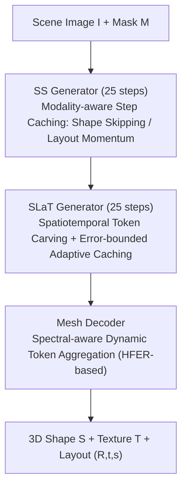

# Fast-SAM3D: 3Dfy Anything in Images but Faster

**Conference**: ICML 2026  
**arXiv**: [2602.05293](https://arxiv.org/abs/2602.05293)  
**Code**: https://github.com/wlfeng0509/Fast-SAM3D  
**Area**: 3D Vision  
**Keywords**: SAM3D Acceleration, Single-view 3D Reconstruction, Training-free Inference Optimization, Diffusion Step Caching, Token Pruning

## TL;DR
To address the slow inference speed of the SAM3D single-view 3D reconstruction model, this paper provides the first module-level latency profiling. Identifying performance bottlenecks caused by three types of heterogeneity (shape/layout dynamics, texture sparsity, and geometric spectral differences), the authors propose Fast-SAM3D. This training-free framework utilizes modality-aware step caching, spatiotemporal token carving, and spectral-aware token aggregation to achieve a 2.67× speedup at the object level with negligible quality loss, even slightly improving the reconstruction F-Score from 92.34 to 92.59.

## Background & Motivation

**Background**: Single-view, open-world, mask-conditioned 3D asset generation models like SAM3D have become critical foundations for 3D perception and content creation. The standard pipeline follows a two-stage "coarse-to-fine" diffusion architecture: "Sparse Structure (SS) generator → Sparse Latent (SLaT) generator → Mesh Decoder," which enables direct reconstruction of multi-object 3D models and decoupled layout information from a single image.

**Limitations of Prior Work**: The inference cost of SAM3D is extremely high. Module-level profiling shows an end-to-end latency of ~462 s per scene, dominated by the SLaT generator (9.7 s/object, 219.8 T FLOPs) and the Mesh Decoder (13.8 s/object, 324 T FLOPs), with the SS generator also taking 4.1 s. Such latency renders SAM3D nearly unusable for interactive deployment.

**Key Challenge**: General diffusion acceleration techniques (uniform step skipping, random token pruning, or multi-view caching like Fast3DCache) fail when applied to SAM3D. Random Drop reduces 3D-IoU from 0.403 to 0.094, and Fast3DCache only yields a 1.03× speedup. The root cause is not the techniques themselves but the "multi-level heterogeneity" within SAM3D: (i) shape tokens in the SS stage are smooth along the denoising trajectory, whereas layout tokens (controlling R/t/s) fluctuate rapidly; (ii) refinement updates in the SLaT stage are spatially sparse; (iii) in the Mesh decoder stage, tolerance for token downsampling varies significantly across objects with different geometric complexities.

**Goal**: Decomposition into three sub-problems: (1) enabling step-skipping in the SS generator without causing layout drift; (2) achieving both temporal reuse and spatial pruning of tokens in the SLaT generator; (3) enabling the Mesh decoder to adaptively aggregate tokens based on object complexity.

**Key Insight**: The authors elevate "heterogeneity" to a unified design principle—**computational power should be allocated non-uniformly**, matching stage difficulty and instance complexity. This implies different computational budgets for different semantic roles (shape vs. layout), different spatial positions at different timesteps, and different input instances.

**Core Idea**: Three targeted, plug-and-play, training-free modules are inserted across the three stages to exploit redundancy simultaneously, forming a unified "heterogeneity-aware" acceleration framework that reduces object-level latency to 37% of the original.

## Method

### Overall Architecture
Ours addresses the slow execution of the SAM3D "SS generator → SLaT generator → Mesh decoder" diffusion pipeline. The mechanism of Fast-SAM3D is to maintain the original SAM3D weights while inserting plug-and-play acceleration modules at each stage, ensuring computational resources are spent non-uniformly based on "stage difficulty + instance complexity."

The pipeline receives a scene image $I$ and a target object mask $M$, outputting 3D shape $S$, texture $T$, and layout parameters $(R,t,s)$. The first stage (SS generator) runs 25 diffusion steps with decoupled caching rules for shape and layout tokens. The second stage (SLaT generator) also runs 25 steps but spatially recomputes only high-saliency tokens and temporally skips steps based on trajectory curvature. The final Mesh decoder adaptively selects downsampling intensity based on the spectral energy of the instance and aggregates sparse 3D tokens via coordinate quantization and max-pooling.

### Key Designs

**1. Modality-aware Step Caching (SS Generator): Skip shape, cache layout to avoid pose drift**

The SS stage suffers from different denoising dynamics between shape and layout tokens. Shape tokens are short-range near-linear, while layout tokens controlling $(R,t,s)$ exhibit high-frequency jitter. Uniform caching causes systematic pose drift. Ours treats them separately: shape tokens use first-order finite difference $\nabla \mathbf{v}^{\text{shape}}_t$ for Taylor extrapolation $\hat{\mathbf{v}}^{\text{shape}}_{t-i}$. Layout tokens use linear extrapolation combined with momentum smoothing from the last full evaluation anchor:

$$\hat{\mathbf{v}}^{\text{layout}}_{t-i} = \beta \cdot \mathbf{v}^{\text{layout}}_{\text{lin}}(t-i) + (1-\beta) \cdot \mathbf{v}^{\text{layout}}_{\text{anchor}},\quad \beta \in [0,1)$$

This "rubber band" anchor pulls back potential divergence.

**2. Spatiotemporal Token Carving + Adaptive Caching (SLaT Generator): Reducing spatial and temporal redundancy**

SLaT refinement updates are extremely sparse. Ours constructs a unified saliency metric:

$$\mathcal{J}_i(t) = \tfrac{1}{2}\big(\mathcal{M}_i(t)+\gamma \mathcal{A}_i(t)\big)+\tfrac{1}{2}\mathcal{S}_{\text{freq}}(i)$$

Only top-K tokens enter the backbone. In the temporal dimension, curvature $\kappa_t$ estimates trajectory non-linearity. To prevent error accumulation, the cumulative relative change $E_t = \sum \varepsilon_n$ triggers a full evaluation refresh once it exceeds a threshold $\mathcal{E}$, providing an error-bounded guardrail for skipping steps.

**3. Spectral-aware Dynamic Token Aggregation (Mesh Decoder): Adaptive compression based on instance complexity**

Different objects tolerate downsampling differently. Ours computes the High-Frequency Energy Ratio (HFER) for the mask $\mathbf{M}_{2D}$ and coarse voxel $\mathbf{V}_{3D}$:

$$\mathcal{H}(\mathbf{X}) = \frac{\sum_{\omega \in \Omega_{\text{high}}} \|\mathcal{F}(\mathbf{X})[\omega]\|_2^2}{\sum_{\omega \in \Omega_{\text{total}}} \|\mathcal{F}(\mathbf{X})[\omega]\|_2^2}$$

A joint ratio $\mathcal{H}_{\text{joint}}$ determines the downsampling factor $\mathcal{S} \in \{1.25, 1.5, 2.0\}$. Simple objects are compressed aggressively, while complex ones preserve details.

### Loss & Training
The entire method is **training-free**. It does not modify SAM3D weights, requires no distillation, and performs no quantization. All modules are inserted during inference. Hyper-parameters were selected via grid search on a small validation set.

## Key Experimental Results

### Main Results
Comparison with SOTA acceleration schemes on Toys4K, Aria Digital Twin (ADT), and ISO3D using SAM3D as the base:

| Method | Uni3D↑ | CD↓ | $F_1$@0.05↑ | vIoU↑ | 3D-IoU↑ | Scene Time(s)↓ | Object Time(s)↓ | Object Accel. |
|------|--------|-----|-------------|-------|---------|--------------|--------------|----------|
| SAM-3D (base) | 0.369 | 0.022 | 92.34 | 0.543 | 0.403 | 462.3 | 31.04 | 1.00× |
| Random Drop | 0.264 | 0.030 | 83.52 | 0.327 | 0.094 | 402.2 | 15.93 | 1.95× |
| Uniform Merge | 0.329 | 0.023 | 91.48 | 0.540 | 0.367 | 366.8 | 15.43 | 2.01× |
| Fast3DCache | 0.348 | 0.022 | 91.31 | 0.505 | 0.051 | 443.3 | 30.14 | 1.03× |
| TaylorSeer | 0.344 | 0.028 | 90.95 | 0.504 | 0.374 | 265.6 | 22.93 | 1.35× |
| EasyCache | 0.342 | 0.028 | 87.06 | 0.432 | 0.186 | 244.9 | 23.11 | 1.34× |
| **Fast-SAM3D** | **0.350** | **0.022** | **92.59** | **0.552** | 0.375 | **229.7** | **11.60** | **2.67×** |

### Ablation Study
Modular performance on Toys4K (Scene Time):

| SS | SLaT | Mesh | CD↓ | $F_1$@0.05↑ | vIoU↑ | Scene Time(s)↓ |
|----|------|------|-----|-------------|-------|--------------|
| ✗ | ✗ | ✗ | 0.022 | 92.34 | 0.543 | 462.3 |
| ✓ | ✓ | ✓ | 0.022 | 92.59 | 0.552 | **229.7** |

### Key Findings
- **Mesh module provides the largest contribution**: Opening only the Mesh module reduces time from 462 s to 320 s, identifying the mesh decoder as the primary bottleneck.
- **Acceleration improves quality**: The SLaT module alone improves $F_1$ from 92.34 to 92.50, likely because saliency-based carving acts as a spatial filter for noise.
- **SS module is critical for layout**: Techniques that fail to protect layout tokens (like Random Drop) see a 75% drop in 3D-IoU. The momentum anchor is key.
- **Hyper-parameter sensitivity**: Global performance drops significantly if the cache stride $k$ exceeds the local linear region ($k \ge 4$).

## Highlights & Insights
- **Heterogeneity as an acceleration cue**: The modular design based on modality, spatiotemporal, and spectral layers demonstrates that non-uniform computation allocation is a powerful principle for multi-stage models.
- **Error-bounded switching**: Using cumulative relative change as a guardrail for step-skipping ensures stability without needing manual step schedules.
- **Spectral proxies for routing**: FFT-based HFER is a computationally cheap yet effective proxy for instance-level complexity routing.
- **Orthogonality of speed and quality**: Fast-SAM3D shows that identifying redundancies can lead to significant speedups without sacrificing geometric or layout accuracy.

## Limitations & Future Work
- Ours is limited to the inference layer and does not replace backbone improvements.
- Generalization to other single-view foundations (e.g., Hunyuan3D) has not been systematically verified.
- The method introduces several thresholds ($k, \beta, K, \mathcal{E}, w, \tau$) that may require recalibration across different datasets.
- Future work could explore instance-adaptive carving ratios $K$ and strides $k$ predicted by a lightweight controller.

## Related Work & Insights
- **vs. TaylorSeer / EasyCache**: These uniform temporal caching schemes cause pose drift in SAM3D; ours solves this via modality-aware decoupling.
- **vs. Fast3DCache**: Fast3DCache relies on cross-view redundancy, which is absent in single-view scenarios (leading to only 1.03× gain). Ours shifts the focus to modality and temporal redundancy.
- **vs. Distillation / Quantization**: Fast-SAM3D is training-free and can be used in conjunction with these heavy-optimization routes.

## Rating
- Novelty: ⭐⭐⭐⭐
- Experimental Thoroughness: ⭐⭐⭐⭐
- Writing Quality: ⭐⭐⭐⭐
- Value: ⭐⭐⭐⭐

<!-- RELATED:START -->

## Related Papers

- [\[CVPR 2026\] SAM 3D: 3Dfy Anything in Images](../../CVPR2026/3d_vision/sam_3d_3dfy_anything_in_images.md)
- [\[CVPR 2026\] UIKA: Fast Universal Head Avatar from Pose-Free Images](../../CVPR2026/3d_vision/uika_fast_universal_head_avatar_from_pose-free_images.md)
- [\[CVPR 2026\] Simple but Effective Triplet-Based Compression Strategies for Compact Visual Localization](../../CVPR2026/3d_vision/simple_but_effective_triplet-based_compression_strategies_for_compact_visual_loc.md)
- [\[CVPR 2026\] Faster-GS: Analyzing and Improving Gaussian Splatting Optimization](../../CVPR2026/3d_vision/faster-gs_analyzing_and_improving_gaussian_splatting_optimization.md)
- [\[ICLR 2026\] UFO-4D: Unposed Feedforward 4D Reconstruction from Two Images](../../ICLR2026/3d_vision/ufo-4d_unposed_feedforward_4d_reconstruction_from_two_images.md)

<!-- RELATED:END -->
