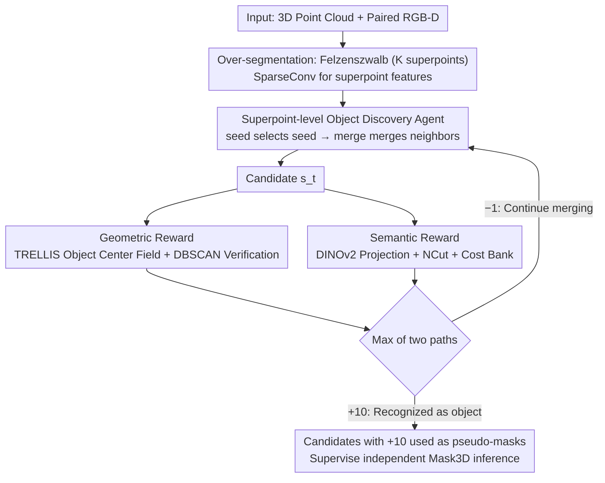

# FoundObj: Self-supervised Foundation Models as Rewards for Label-free 3D Object Segmentation

**Conference**: ICML 2026  
**arXiv**: [2605.27178](https://arxiv.org/abs/2605.27178)  
**Code**: https://github.com/vLAR-group/FoundObj  
**Area**: 3D Vision / Unsupervised Learning / Reinforcement Learning  
**Keywords**: Label-free 3D segmentation, superpoint merging, RL reward, DINOv2, TRELLIS

## TL;DR
This paper proposes FoundObj, which utilizes 2D/3D self-supervised foundation models (DINOv2 + TRELLIS) as rewarders. By employing a "superpoint merging + PPO" RL agent, it achieves multi-class 3D object segmentation in complex indoor scenes without any scene-level human annotations, improving the unsupervised SOTA AP from 19.6 to 24.2 on ScanNet/S3DIS/ScanNet200.

## Background & Motivation

**Background**: Mainstream 3D scene object segmentation still relies on dense point-level annotations (e.g., Mask3D) or multi-modal aligned data (e.g., open-vocabulary methods derived from CLIP/SAM). To eliminate the need for annotations, two unsupervised technical routes have recently emerged: one projects 2D self-supervised semantics from DINO/v2 into 3D (UnScene3D, Part2Object), while the other leverages geometric priors from 3D object reconstruction/generation models (EFEM, GrabS, EvObj).

**Limitations of Prior Work**: Purely semantic routes (DINO-based) excel at distinguishing inter-class differences but lack "objectness" within DINO features, making it difficult to separate adjacent objects of the same class (e.g., several chairs placed together). Purely geometric routes (GrabS/EFEM) can accurately extract objects with clear shapes but are often restricted to a single class (chairs) and rely on dynamic cylinders as proxies, failing to adapt to objects with arbitrary shapes like flat cabinets against walls.

**Key Challenge**: Defining "what an object is" — cognitive science points out that object perception is jointly defined by geometry (shape/structure) and semantics (identity/distinction from background). Current unsupervised methods typically use only one aspect, leading to inherent blind spots.

**Goal**: To segment (a) multiple adjacent instances of the same class (multiple chairs) and (b) objects with diverse inter-class shapes (flat cabinets, tables, doors) simultaneously without using any 3D scene annotations, while maintaining cross-dataset and long-tail generalization capabilities.

**Key Insight**: Allow an RL agent to "grow" object candidates bottom-up on the superpoint graph of a scene. Use two complementary foundation model rewards—TRELLIS (3D object geometric prior) + DINOv2 (2D semantic prior)—to score candidates along independent axes of geometric consistency and semantic uniqueness.

**Core Idea**: Transform "what an object is" from a set of handcrafted rules or a single prior into "differentiable feedback provided by semantic + geometric foundation models," using PPO to train a superpoint merging strategy.

## Method

### Overall Architecture
FoundObj addresses the problem of enabling a model to judge "what counts as an object" and extract it from complex indoor scenes without 3D scene annotations. The central idea is to reformulate segmentation as a reinforcement learning problem: a small agent "grows" object candidates bottom-up on a superpoint graph, while two foundation models (which do not participate in gradient updates) act as judges to provide scores.

Specifically, given an input 3D scene point cloud $\bm{P}$ (with paired RGB-D images used to project 2D DINOv2 features back to 3D), the Felzenszwalb algorithm first over-segments the scene into $K$ initial superpoints. a SparseConv network extracts features for each superpoint. Subsequently, a seed policy network selects a starting point, and a merge policy network repeatedly selects neighbors to merge, resulting in increasingly larger candidates $\bm{s}_0, \bm{s}_1, \cdots, \bm{s}_T$ at each step. Each candidate is simultaneously sent to a geometric reward module (TRELLIS + object center field, checking if geometric points converge into a single object) and a semantic reward module (DINOv2 + semantic consistency NCut, checking for significant semantic distinction from the background). The max of the two reward paths is taken—if either modality recognizes it as an object, a +10 reward is given and the episode ends; otherwise, a −1 reward is given to encourage the agent to continue merging. The agent is trained using PPO. Finally, all candidates receiving a +10 reward are used as pseudo-masks to supervise an independent Mask3D for downstream inference.

### Key Designs

**1. Superpoint-level Object Discovery Agent: Using Learnt Hierarchical Merging to Replace GrabS Cylinder Proxies**

Geometric methods like GrabS use a dynamic cylinder as an object proxy, which inherently assumes objects have near-regular shapes. This approach fails for flat wall cabinets or L-shaped sofas and only handles single categories like chairs. FoundObj reformulates object discovery as a two-step discrete action on a superpoint graph. The seed policy performs self-attention on all $K$ superpoint features, outputs a softmax probability $\bm{p}_{seed} = \bm{\pi}_{seed}([\bm{f}_1, \dots, \bm{f}_K])$, and samples a seed $\bm{s}_0$. The merge policy then performs self-attention + sigmoid on the seed and its $Q$ neighbors within a 0.1m range, calculating a merge probability $\bm{p}_{merge} = \bm{\pi}_{merge}(\bm{f}_0, [\bm{f}_0^1, \dots, \bm{f}_0^Q])$ for each neighbor. Neighbors are merged into the candidate based on these probabilities until a +10 reward is received or the step limit $T$ is reached. By discretizing the action space into $K$ superpoints, the model retains the ability to represent arbitrary shapes while reducing the search scale from raw points to superpoints, making RL solvable. Furthermore, step-by-step merging gives the agent a chance to bypass local errors compared to one-shot graph algorithms.

**2. Geometric Reward: TRELLIS Object Center Field + DBSCAN Verification**

TRELLIS is essentially an auto-encoder and cannot directly determine if something is an object. FoundObj adds a Transformer decoder head $\bm{g}_{center}$ to its pre-trained encoder to explicitly model the geometric prior that "an object is a point cloud converging toward a single center." This head regresses a vector $\bm{v}_m = \bm{o}_c - \bm{o}_m$ for each point pointing to the object's centroid (centroid $\bm{o}_c = \frac{1}{M}\sum \bm{o}_m$), pre-trained offline on ABO + 3D-Future furniture data using $\ell_2$ loss. During inference, the candidate $\bm{s}_t$ is fed in to obtain the displacement $\bm{v}_t$. DBSCAN (radius $r=0.05$) is then run on the shifted point cloud $(\bm{s}_t + \bm{v}_t)$. If the main cluster coverage is $\geq \alpha=30\%$, it indicates the points converge to a center, and a +10 reward is given; otherwise, the reward is −1. This avoids the high cost of direct reconstruction comparison, and DBSCAN makes validation more robust to partial occlusion and noise. The true value of the geometric reward lies in compensating for semantic weaknesses—DINO features lack "objectness" and cannot split adjacent same-class chairs, whereas the center field provides the only splitting signal in such scenarios.

**3. Semantic Reward: DINOv2 Projection + Semantic Consistency NCut + Adaptive Cost Bank**

This path is responsible for determining if a candidate region is semantically distinct from the background. FoundObj first projects 2D DINOv2 features to 3D along depth maps and averages them per superpoint to construct a scene-level $K \times K$ cosine similarity matrix $\mathcal{S}$ and a 0.1m adjacency matrix $\mathcal{A}$. Their element-wise product $(\mathcal{S} * \mathcal{A})$ encodes both spatial adjacency and semantic similarity. The candidate's one-hot mask $O_t$ is treated as a cut on this scene graph. Drawing from Normalized Cut, the split cost is calculated as $\mathcal{C} = \mathcal{C}_{boundary} / \mathcal{C}_{vol}$ (lower boundary similarity and fuller cut volume result in a smaller cost, indicating an independent object). Crucially, a fixed threshold is not used—cost distributions vary significantly between rooms with dense versus sparse furniture. Thus, FoundObj maintains a "top-20 lowest cost bank" for each scene. A candidate cost receives +10 if it falls within the current scene's top 20 object-like slots; otherwise, it receives −1. This adaptive mechanism encourages the agent to explore diverse objects without being overwhelmed by low-quality noise candidates, which is key to its zero-shot performance across ScanNet/S3DIS/ScanNet200.

### Loss & Training
The agent itself is trained using standard PPO, with the supervision signal being the max of the two reward paths (+10/−1). The geometric center field head $\bm{g}_{center}$ is pre-trained offline on ABO + 3D-Future using $\ell_2$. The semantic module has zero trainable parameters and acts purely as a rewarder based on DINOv2 projection + cost bank. After training, all candidates receiving a +10 reward are used as pseudo-masks to train a standalone Mask3D (following the two-stage recipe of GrabS). Benchmarking only requires running this lightweight Mask3D inference.

## Key Experimental Results

### Main Results

ScanNet validation set (18 classes, class-agnostic AP):

| Method | AP | AP@50 | AP@25 |
|------|----|----|----|
| EFEM (Geometric) | 8.0 | 16.7 | 22.3 |
| GrabS (Geometric, single-class) | 14.0 | 27.2 | 39.4 |
| UnScene3D (DINO-based) | 18.5 | 37.8 | 63.7 |
| Part2Object (DINOv2-based, Prev. SOTA) | 19.6 | 38.4 | 64.9 |
| Concerto+DINOv2 (Strong Baseline) | 19.8 | 41.2 | 72.2 |
| **Ours (FoundObj)** | **24.2** | **46.2** | **74.7** |
| Mask3D (Supervised Upper Bound) | 61.2 | 83.0 | 93.0 |

Cross-dataset Zero-shot (trained on ScanNet, tested directly): S3DIS-Area5 AP increased from 10.4 (Part2Object) to 12.8 (close to supervised Mask3D's 13.0); S3DIS 6-fold AP increased from 8.6 to 11.4; Long-tail ScanNet200 AP increased from 15.2 to 18.1 (+19% relative gain).

### Ablation Study

| Configuration | AP | AP@50 | AP@25 | Description |
|------|----|----|----|------|
| Full FoundObj | 24.2 | 46.2 | 74.7 | Full model |
| w/o Geometric Reward | 19.5 | 40.2 | 72.7 | Degrades to DINO-only, -4.7 AP |
| w/o Semantic Reward | 15.3 | 37.2 | 67.6 | -8.9 AP, but still higher than GrabS |
| DBSCAN $r=0.02$ | 21.9 | 43.6 | 76.8 | Too strict, fewer identified |
| DBSCAN $r=0.1$ | 22.5 | 43.6 | 72.5 | Too loose, more false positives |
| Bank size = 10 | 20.9 | 41.8 | 72.1 | Repeatedly focuses on salient objects |
| Bank size = 40 | 21.1 | 41.4 | 73.3 | Low-quality candidates mixed in |

Isolated prior comparison under fair conditions (Table 6 DINO-only): FoundObj using only DINO achieves 19.5 AP, on par with Part2Object (19.6), while surpassing it in AP@50 (40.2 vs 38.4) and AP@25 (72.7 vs 64.9). This suggests the RL agent itself is more proficient at utilizing the same features compared to NCut/projection-based pipelines.

### Key Findings
- The semantic reward is more significant than the geometric reward (an 8.9 AP drop vs a 4.7 AP drop when removed). This is attributed to the fact that DINOv2 is trained on much larger data than TRELLIS, resulting in more discriminative features.
- The true value of the geometric reward lies in compensating for semantic shortfalls: DINO is incapable of splitting adjacent objects of the same class (like chairs), where the geometric center field provides the only splitting signal. This is a primary reason for the 7.8 point surge in ScanNet AP@50 (38.4 $\rightarrow$ 46.2) compared to the previous SOTA.
- The Cost Bank, seemingly an engineering detail, is actually critical: replacing a global threshold with a scene-adaptive top-20 ensures no performance drop during zero-shot transfers across ScanNet/S3DIS/ScanNet200.
- On S3DIS-Area5, unsupervised FoundObj (12.8) nearly matches supervised Mask3D (13.0), reflecting that supervised methods overfit the training domain in out-of-distribution scenes, while foundation model priors are more stable.

## Highlights & Insights
- The "Foundation Models as Rewarders" framework is highly transferable: while traditional methods use these models for input features or contrastive targets, this work demonstrates that using them as "judges" for RL rewards is more elegant. Foundation models do not participate in gradients but guide small agents through +10/−1 discrete signals, avoiding complex feature alignment engineering.
- The "complementary max" combination of the two reward modules is clever: taking the max instead of a weighted sum is equivalent to "accept if either modality recognizes it as an object," allowing the agent to rely on geometry when semantics are ambiguous and vice versa.
- Superpoint + agent merging essentially transforms segmentation into "learnable hierarchical clustering on a graph." Compared to one-shot graph algorithms like NCut, RL's step-by-step merging allows the model to backtrack or bypass local errors.

## Limitations & Future Work
- Dependency on paired 2D images and depth (to project DINOv2 back to 3D) makes its applicability to outdoor scenes with pure LiDAR or unpaired RGB (e.g., KITTI) questionable.
- The geometric center field $\bm{g}_{center}$ is trained on furniture/common objects from ABO + 3D-Future; the assumption of center convergence may fail for ultra-thin structures (curtains, wires) or ultra-large objects (floors, walls), though these failure modes are not quantitatively reported.
- It remains a two-stage "pseudo-label $\rightarrow$ Mask3D" process: the +10 rewards are discrete and sparse, and the details regarding PPO training efficiency and stability were not fully discussed.
- No evaluation of the inference speed for pure RGB-D was provided—the cost of superpoint construction, agent rollout, and two foundation model forward passes for offline pseudo-label generation is likely high.
- Future directions: Integrating SAM3D instead of DINOv2 projection for semantic rewards could further mitigate 2D$\rightarrow$3D projection errors; introducing multi-view consistency constraints for geometric rewards could enable extension to outdoor environments.

## Related Work & Insights
- **vs UnScene3D / Part2Object**: These also use DINO/v2 semantic priors but perform "feature projection + one-shot NCut/grouping," failing to separate adjacent instances of the same class. FoundObj uses an RL agent + geometric reward complementarity, leading to a 7.8 point increase in AP@50.
- **vs GrabS / EvObj / EFEM**: These also treat segmentation as an "agent searching for objects," but GrabS is limited to single-class regular objects due to its cylinder proxy. FoundObj uses a superpoint-merging agent and adds semantic rewards to cover multiple classes and arbitrary shapes.
- **vs Supervised Mask3D**: Matching Mask3D performance in zero-shot S3DIS Area-5 scenes suggests that "foundation model priors + unsupervised agents" can be more desirable than "target domain supervised training" for cross-domain real-world deployment.

## Rating
- Novelty: ⭐⭐⭐⭐ The "foundation models as rewarders" framework and the "geometric center field + semantic NCut bank" combination are clean new designs, though individual components (PPO agent, DINO projection, NCut) draw from GrabS/UnScene3D.
- Experimental Thoroughness: ⭐⭐⭐⭐ Covers three benchmarks, cross-dataset zero-shot, long-tail, individual DINO/TRELLIS comparisons, and 4 sets of ablations; only lacks training cost and robustness analysis.
- Writing Quality: ⭐⭐⭐⭐ The motivation-method-experiment logic is clear, and the roles of geometry/semantics are well-explained; formulas and symbols are dense but self-contained.
- Value: ⭐⭐⭐⭐ Unsupervised 3D segmentation SOTA + zero-shot performance approaching the supervised bound offers direct value for 3D scenarios where annotations are scarce. The "foundation model as rewarder" concept provides methodological inspiration for other 3D or embodied tasks.

<!-- RELATED:START -->

## Related Papers

- [\[CVPR 2026\] Towards Foundation Models for 3D Scene Understanding: Instance-Aware Self-Supervised Learning for Point Clouds](../../CVPR2026/3d_vision/towards_foundation_models_for_3d_scene_understanding_instance-aware_self-supervi.md)
- [\[AAAI 2026\] Parameter-Free Fine-tuning via Redundancy Elimination for Vision Foundation Models](../../AAAI2026/3d_vision/parameter-free_fine-tuning_via_redundancy_elimination_for_vision_foundation_mode.md)
- [\[CVPR 2026\] MonoSAOD: Monocular 3D Object Detection with Sparsely Annotated Label](../../CVPR2026/3d_vision/monosaod_monocular_3d_object_detection_with_sparsely_annotated_label.md)
- [\[ICML 2026\] Geometry-Guided Modeling of Foundation Features Enables Generalizable Object Shape Deformation Learning](geometry-guided_modeling_of_foundation_features_enables_generalizable_object_sha.md)
- [\[CVPR 2026\] ArtPro: Self-Supervised Articulated Object Reconstruction with Adaptive Integration of Mobility Proposals](../../CVPR2026/3d_vision/artpro_self-supervised_articulated_object_reconstruction_with_adaptive_integrati.md)

<!-- RELATED:END -->
