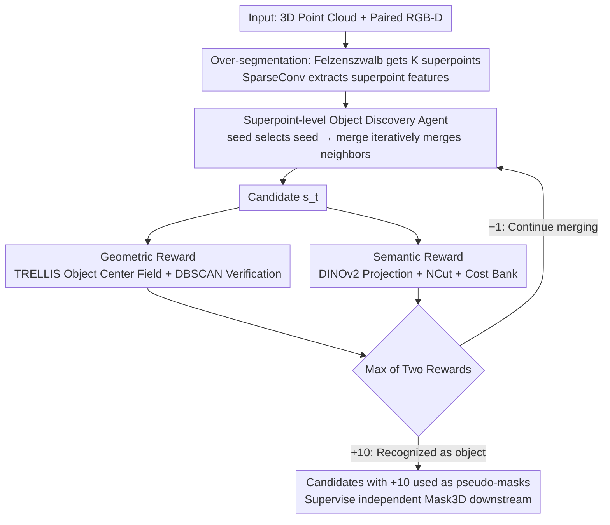

# FoundObj: Self-supervised Foundation Models as Rewards for Label-free 3D Object Segmentation

**Conference**: ICML 2026  
**arXiv**: [2605.27178](https://arxiv.org/abs/2605.27178)  
**Code**: https://github.com/vLAR-group/FoundObj  
**Area**: 3D Vision / Unsupervised Learning / Reinforcement Learning  
**Keywords**: Label-free 3D segmentation, superpoint merging, RL rewards, DINOv2, TRELLIS

## TL;DR
This paper proposes FoundObj, which utilizes 2D/3D self-supervised foundation models (DINOv2 + TRELLIS) as rewarders. By employing a "superpoint merging + PPO" RL agent, it achieves multi-class 3D object segmentation in complex indoor scenes without any scene-level human annotations. It improves the unsupervised SOTA AP on ScanNet/S3DIS/ScanNet200 from 19.6 to 24.2.

## Background & Motivation

**Background**: Mainstream 3D scene object segmentation still relies on dense point-level annotations (e.g., Mask3D) or multimodal alignment data (e.g., open-vocabulary methods derived from CLIP/SAM). To eliminate the need for annotations, two unsupervised technical routes have recently emerged: one projects 2D self-supervised semantics from DINO/v2 into 3D (UnScene3D, Part2Object); the other utilizes 3D object reconstruction/generation models to provide geometric priors (EFEM, GrabS, EvObj).

**Limitations of Prior Work**: Pure semantic routes (DINO-based) excel at distinguishing inter-class differences but lack "objectness" within DINO features, making it difficult to separate adjacent objects of the same class (e.g., several chairs placed together). Pure geometric routes (GrabS/EFEM) can accurately extract objects with clear shapes but are often limited to a single class (e.g., chairs) and rely on dynamic cylinders as proxies, failing to adapt to arbitrarily shaped objects like flat cabinets against walls.

**Key Challenge**: The definition of "what constitutes an object"—cognitive science points out that object perception is jointly defined by geometry (shape/structure) and semantics (identity/differentiation from the background). Current unsupervised methods typically use only one aspect, leading to respective blind spots.

**Goal**: To simultaneously segment (a) multiple adjacent instances of the same class and (b) objects with various inter-class shapes (cabinets, tables, doors) without using any 3D scene annotations, while maintaining cross-dataset and long-tail generalization capabilities.

**Key Insight**: An RL agent is tasked with "growing" object candidates bottom-up on the scene's superpoint graph. These candidates are scored along two independent axes—geometric consistency and semantic uniqueness—using two complementary foundation model rewards: TRELLIS (3D object geometric prior) and DINOv2 (2D semantic prior).

**Core Idea**: Redefine "what is an object" from hand-crafted rules or a single prior to "differentiable feedback provided by semantic and geometric foundation models," using PPO to train a superpoint merging strategy.

## Method

### Overall Architecture
FoundObj addresses the problem of identifying "what counts as an object" and extracting it from complex indoor scenes without 3D annotations. The overall approach reformulates segmentation as a reinforcement learning problem: a small agent grows object candidates bottom-up on a superpoint graph, with two non-differentiable foundation models serving as judges to provide scores.

Specifically, given an input 3D scene point cloud $\bm{P}$ (with paired RGB-D images to project 2D DINOv2 features back to 3D), the Felzenszwalb algorithm first over-segments the scene into $K$ initial superpoints. SparseConv extracts features for each superpoint. Subsequently, a seed policy network selects a starting point, and a merge policy network iteratively selects neighbors to merge, resulting in a growing candidate $\bm{s}_0, \bm{s}_1, \cdots, \bm{s}_T$ at each step. Each candidate is simultaneously sent to a geometric reward module (TRELLIS + object center field, checking if the point cloud geometrically converges into a single object) and a semantic reward module (DINOv2 + semantic consistency NCut, checking if it is semantically distinct from the background). The maximum of the two rewards is taken—if either modality recognizes it as an object, a +10 reward is given and the episode ends; otherwise, a −1 reward is given to encourage further merging. The agent is trained using PPO. Finally, all candidates receiving a +10 reward are used as pseudo-masks to supervise an independent Mask3D for downstream inference.

### Key Designs

**1. Superpoint-level Object Discovery Agent: Learnable Hierarchical Merging Replacing GrabS Cylindrical Proxies**

Geometric methods like GrabS use a dynamic cylinder as an object proxy, which inherently assumes objects have near-regular shapes. This fails for flat cabinets or L-shaped sofas and is limited to single categories. FoundObj reformulates object discovery as a two-step discrete action on a superpoint graph. The seed policy performs self-attention on all $K$ superpoint features to output a softmax probability $\bm{p}_{seed} = \bm{\pi}_{seed}([\bm{f}_1, \dots, \bm{f}_K])$ and samples a seed $\bm{s}_0$. The merge policy then performs self-attention + sigmoid on the seed and its $Q$ neighbors within a 0.1m range to calculate a merging probability $\bm{p}_{merge} = \bm{\pi}_{merge}(\bm{f}_0, [\bm{f}_0^1, \dots, \bm{f}_0^Q])$. Neighbors are sampled and merged until a +10 reward is received or the step limit $T$ is reached. This discretizes the action space to $K$ superpoints, preserving the ability to represent arbitrary shapes while compressing the search scale from raw points to superpoints, making RL solvable. Iterative merging also allows the agent to bypass local errors compared to one-shot graph algorithms.

**2. Geometric Reward: TRELLIS Object Center Field + DBSCAN Verification**

TRELLIS is an auto-encoder and cannot directly determine if something is an object. FoundObj adds a Transformer decoder head $\bm{g}_{center}$ to its pre-trained encoder to explicitly model the geometric prior that "an object is a point cloud converging toward a single center." This head regresses a vector $\bm{v}_m = \bm{o}_c - \bm{o}_m$ for each point pointing toward the object centroid $\bm{o}_c = \frac{1}{M}\sum \bm{o}_m$, trained offline on ABO + 3D-Future furniture data using $\ell_2$ loss. During inference, candidate $\bm{s}_t$ is input to obtain displacements $\bm{v}_t$. DBSCAN (radius $r=0.05$) is run on the shifted point cloud $(\bm{s}_t + \bm{v}_t)$. If the main cluster coverage $\geq \alpha=30\%$, the points are deemed to converge to a center, yielding a +10 reward; otherwise, −1. This avoids the high cost of reconstruction comparison, and DBSCAN provides robustness to occlusion and noise. The geometric reward compensates for semantic weaknesses: DINO features lack "objectness" and fail to separate adjacent identical chairs, whereas the center field provides the necessary signal.

**3. Semantic Reward: DINOv2 Projection + Semantic Consistency NCut + Adaptive Cost Bank**

This module determines if the candidate region is semantically distinct from the background. FoundObj projects 2D DINOv2 features into 3D along the depth map and averages them per superpoint to construct a scene-level $K \times K$ cosine similarity matrix $\mathcal{S}$ and a 0.1m adjacency matrix $\mathcal{A}$. Their element-wise product $(\mathcal{S} * \mathcal{A})$ encodes both spatial adjacency and semantic similarity. Treating the candidate's one-hot mask $O_t$ as a cut in this scene graph, the Normalized Cut cost is calculated as $\mathcal{C} = \mathcal{C}_{boundary} / \mathcal{C}_{vol}$ (lower boundary similarity and fuller volume indicate a more independent object). Crucially, instead of using a fixed threshold, FoundObj maintains a "top-20 lowest cost bank" for each scene. A candidate receives a +10 reward if its cost falls within these top-20 most object-like slots; otherwise, it receives −1. This adaptivity encourages diverse object exploration and prevents being overwhelmed by low-quality noise, which is key to maintaining zero-shot performance across ScanNet/S3DIS/ScanNet200.

### Loss & Training
The agent is trained using standard PPO, with the supervision signal being the maximum of the two rewards (+10/−1). The geometric center field head $\bm{g}_{center}$ is pre-trained offline on ABO + 3D-Future using $\ell_2$ loss. The semantic module has zero trainable parameters and acts as a pure rewarder based on DINOv2 projection and the cost bank. After training, all candidates receiving +10 are used as pseudo-masks to train an independent Mask3D (following the two-stage recipe of GrabS). Benchmarking only requires running this lightweight Mask3D inference.

## Key Experimental Results

### Main Results

ScanNet validation set (18 classes, class-agnostic AP):

| Method | AP | AP@50 | AP@25 |
|------|----|----|----|
| EFEM (Geometric) | 8.0 | 16.7 | 22.3 |
| GrabS (Geometric, Single-class) | 14.0 | 27.2 | 39.4 |
| UnScene3D (DINO-based) | 18.5 | 37.8 | 63.7 |
| Part2Object (DINOv2-based, Prev. SOTA) | 19.6 | 38.4 | 64.9 |
| Concerto+DINOv2 (Strong Baseline) | 19.8 | 41.2 | 72.2 |
| **FoundObj (Ours)** | **24.2** | **46.2** | **74.7** |
| Mask3D (Supervised Upper Bound) | 61.2 | 83.0 | 93.0 |

Cross-dataset Zero-shot (Train on ScanNet, Test directly): S3DIS-Area5 AP increased from 10.4 (Part2Object) to 12.8 (close to supervised Mask3D's 13.0); S3DIS 6-fold AP increased from 8.6 to 11.4; Long-tail ScanNet200 AP increased from 15.2 to 18.1 (+19% relative Gain).

### Ablation Study

| Configuration | AP | AP@50 | AP@25 | Description |
|------|----|----|----|------|
| Full FoundObj | 24.2 | 46.2 | 74.7 | Complete Model |
| w/o Geometric Reward | 19.5 | 40.2 | 72.7 | Degrades to DINO-only, 4.7 AP Drop |
| w/o Semantic Reward | 15.3 | 37.2 | 67.6 | 8.9 AP Drop, still higher than GrabS |
| DBSCAN $r=0.02$ | 21.9 | 43.6 | 76.8 | Too strict, fewer objects identified |
| DBSCAN $r=0.1$ | 22.5 | 43.6 | 72.5 | Too loose, more false positives |
| Bank size = 10 | 20.9 | 41.8 | 72.1 | Repeatedly targets salient objects |
| Bank size = 40 | 21.1 | 41.4 | 73.3 | Low-quality candidates included |

Isolated prior comparison under fair conditions (Table 6 DINO-only): FoundObj achieves 19.5 AP using only DINO, comparable to Part2Object (19.6), while outperforming in AP@50 (40.2 vs 38.4) and AP@25 (72.7 vs 64.9). This suggests the RL agent itself utilizes the same features more effectively than NCut/projection pipelines.

### Key Findings
- Semantic rewards are more critical than geometric rewards (8.9 AP vs. 4.7 AP drop when removed). Authors attribute this to DINOv2's training data scale being much larger than TRELLIS, making features more discriminative.
- The true value of geometric rewards lies in compensating for semantic weaknesses: DINO is incapable of splitting adjacent objects of the same class, where the geometric center field becomes the only splitting signal. This is the primary reason for the 7.8 point surge in ScanNet AP@50 (38.4 $\rightarrow$ 46.2).
- The "Cost bank" detail is a crucial engineering insight: replacing a global threshold with a scene-adaptive top-20 allows the method to maintain zero-shot performance across ScanNet/S3DIS/ScanNet200.
- Unsupervised FoundObj (12.8) nearly matches supervised Mask3D (13.0) on S3DIS-Area5, reflecting that foundation model priors are more stable than supervised methods that overfit the training domain in out-of-distribution scenes.

## Highlights & Insights
- The framework of "using foundation models as rewarders" is highly transferable: Whereas traditional methods use foundation model features as input or contrastive targets, this work demonstrates that treating them as discrete RL "judges" (+10/−1) is more elegant, avoiding complex feature alignment.
- The "complementary max" combination of the two reward modules is clever: Taking the max is equivalent to "accept if either modality recognizes it," allowing the agent to rely on geometry when semantics are ambiguous and vice versa, significantly outperforming single-threshold approaches.
- Superpoint-based agent merging effectively converts segmentation into "learnable hierarchical clustering on a graph." Compared to one-shot cuts, RL's iterative merging allows the model to backtrack or bypass local errors.

## Limitations & Future Work
- Dependency on paired 2D images and depth (for DINOv2 projection): Applicability to pure LiDAR or unpaired RGB outdoor scenes (e.g., KITTI) remains uncertain.
- Geometric center field $\bm{g}_{center}$ is trained on ABO + 3D-Future furniture/common objects; the center convergence assumption might fail for ultra-thin structures (curtains, wires) or ultra-large objects (floors, walls), though these failure modes were not quantitatively reported.
- Still a two-stage "pseudo-label $\rightarrow$ Mask3D" process: The agent's +10 reward is discrete and sparse, and the details of PPO training efficiency and stability are not fully discussed.
- No evaluation of pure RGB-D inference speed: The cost of superpoint construction + agent rollout + two foundation model forward passes for offline pseudo-label generation is likely high.
- Future directions: Integrating SAM3D into semantic rewards could mitigate 2D-3D projection errors; introducing multi-view consistency to geometric rewards could enable expansion to outdoor environments.

## Related Work & Insights
- **vs. UnScene3D / Part2Object**: Also uses DINO/v2 semantic priors, but they perform "feature projection + one-shot NCut/grouping," failing to split adjacent instances of the same class. FoundObj's RL agent + geometric reward synergy yields a 7.8 point Gain in AP@50.
- **vs. GrabS / EvObj / EFEM**: Also treats segmentation as an "agent searching for objects," but GrabS is limited by cylindrical proxies to regular shapes. FoundObj uses a superpoint merging agent with semantic rewards to cover multiple classes and arbitrary shapes.
- **vs. Supervised Mask3D**: Matching Mask3D performance in the zero-shot S3DIS Area-5 scenario suggests that "foundation model priors + unsupervised agents" can be more desirable than "target domain supervised training" for cross-domain real-world deployment.

## Rating
- Novelty: ⭐⭐⭐⭐ The "foundation models as rewarders" framework and the "geometric center field + semantic NCut bank" combination represent clear new designs, although individual components (PPO agent, DINO projection, NCut) draw from GrabS/UnScene3D.
- Experimental Thoroughness: ⭐⭐⭐⭐ Three benchmarks + cross-dataset zero-shot + long-tail + DINO/TRELLIS controlled experiments + 4 ablation groups provide comprehensive coverage; lacks only detailed training cost and robustness analysis.
- Writing Quality: ⭐⭐⭐⭐ Motivation-Method-Experiment logic is clear; the roles of geometry vs. semantics are well-explained. Math is dense but self-contained.
- Value: ⭐⭐⭐⭐ SOTA in unsupervised 3D segmentation and approaching supervised upper bounds cross-domain; offers direct practical value for label-scarce 3D scenarios. The "foundation model as rewarder" methodology is inspiring for other 3D/embodied tasks.

<!-- RELATED:START -->

## Related Papers

- [\[CVPR 2026\] Towards Foundation Models for 3D Scene Understanding: Instance-Aware Self-Supervised Learning for Point Clouds](../../CVPR2026/3d_vision/towards_foundation_models_for_3d_scene_understanding_instance-aware_self-supervi.md)
- [\[AAAI 2026\] Parameter-Free Fine-tuning via Redundancy Elimination for Vision Foundation Models](../../AAAI2026/3d_vision/parameter-free_fine-tuning_via_redundancy_elimination_for_vision_foundation_mode.md)
- [\[CVPR 2026\] MonoSAOD: Monocular 3D Object Detection with Sparsely Annotated Label](../../CVPR2026/3d_vision/monosaod_monocular_3d_object_detection_with_sparsely_annotated_label.md)
- [\[ICML 2026\] Geometry-Guided Modeling of Foundation Features Enables Generalizable Object Shape Deformation Learning](geometry-guided_modeling_of_foundation_features_enables_generalizable_object_sha.md)
- [\[CVPR 2026\] Foundry: Distilling 3D Foundation Models for the Edge](../../CVPR2026/3d_vision/foundry_distilling_3d_foundation_models_for_the_edge.md)

<!-- RELATED:END -->
