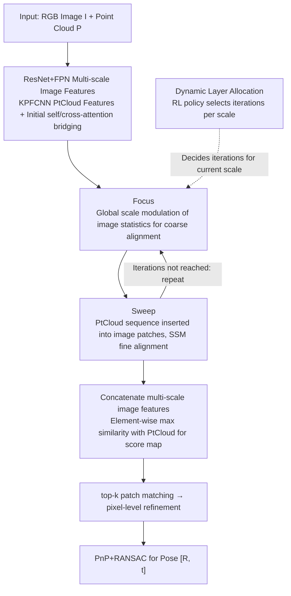

# FSI2P: A Hierarchical Focus–Sweep Registration Network with Dynamically Allocated Depth

**Conference**: ICML 2026  
**arXiv**: [2605.07607](https://arxiv.org/abs/2605.07607)  
**Code**: None  
**Area**: 3D Vision / Cross-modal Registration  
**Keywords**: Image-to-Point Cloud Registration, Mamba/SSM, RL Layer Selection, Focus-Sweep, Multi-scale Interaction

## TL;DR
This paper abstracts the human observation process of "glancing first, then examining block-by-block" into a two-stage Focus-Sweep paradigm. It replaces Transformer with Mamba for image-to-point cloud interaction and utilizes reinforcement learning to dynamically determine the number of interaction layers at each scale, achieving SOTA performance in I2P registration on RGB-D Scenes V2 and 7-Scenes.

## Background & Motivation

**Background**: The mainstream pipeline for image-to-point cloud (I2P) registration has transitioned from "detect-then-match" to "detection-free" coarse-to-fine frameworks, such as 2D3D-MATR, B2-3D, and CA-I2P. These rely on multi-scale features and Transformer cross-attention to establish patch-level correspondences, followed by PnP+RANSAC to solve for the pose.

**Limitations of Prior Work**: The authors observed two overlooked issues through experiments: first, stacking too many cross-attention layers leads to "attention drift," where small deviations in early layers are repeatedly amplified (the Matthew effect), causing the MMD to actually rise. Second, while multi-scale designs alleviate some scale differences, scale ambiguity still occurs in scenes with repetitive textures due to similar features across different resolutions, leading to misalignments.

**Key Challenge**: Cross-modal alignment inherently requires long-range interaction, necessitating many stacked layers. However, more layers increase the likelihood of drift. Furthermore, determining the optimal number of layers is a discrete and non-differentiable decision that standard gradient descent cannot learn. There is a dual trade-off between "requiring deep interaction" and "drift from deep interaction," as well as "learnable depth" and "discrete decision-making."

**Goal**: (1) Design a cross-modal interaction mechanism that is more stable than Transformer cross-attention and capable of suppressing scale ambiguity; (2) Assign a data-adaptive interaction depth for each scale, allowing the model to "stop when it has seen enough," much like a human.

**Key Insight**: Cognitive psychology indicates that humans perform two steps during cross-modal matching: first, global scale estimation and coarse scanning (Focus), followed by detailed block-by-block comparison (Sweep). This sequential, directional process with long-term memory naturally aligns with the scanning mechanism of SSM (Mamba). Determining "how many looks are enough" is essentially a policy that can be optimized via RL.

**Core Idea**: Replace fixed-depth Transformer cross-attention with Mamba-based alternating "Focus-Sweep" interactions and use RL to learn the iterative depth at each scale.

## Method

### Overall Architecture
FS-I2P addresses detection-free registration from image to point cloud: given an RGB image $I\in\mathbb{R}^{H\times W\times 3}$ and a point cloud $P\in\mathbb{R}^{N\times 3}$ from the same scene, it outputs a rigid transformation $[R,\mathbf{t}]$. The overall approach mimics the human two-stage observation process—"scanning first for an overview, then examining details block-by-block"—by using Mamba scanning instead of Transformer cross-attention and letting the data decide the number of iterations at each scale.

The process follows a coarse-to-fine strategy: three scales of image features $F_{Ia}, F_{Ib}, F_{Ic}$ are extracted via ResNet+FPN, and point cloud features $F_P$ are extracted via KPFCNN, followed by initial self/cross-attention for bridging. The core hierarchical Focus-Sweep interaction module then processes each scale's image features: Focus for global coarse alignment and Sweep for detailed block-level interaction. The number of FS-Layer repetitions at each scale is dynamically allocated by an RL policy network. After interaction, multi-scale image features are concatenated and compared with point cloud features via element-wise max cosine similarity to generate a score map. This enables top-k patch matching and pixel-level refinement, with the pose $[R, \mathbf{t}]$ solved via PnP+RANSAC.

### Key Designs

**1. Focus: One-time "alignment" of image features using global point cloud scale to prevent cumulative drift**

Focus corresponds to the human "initial glance." It targets the issue where Transformer's early attention biases are amplified over layers (Matthew effect). Instead of building an explicit cross-attention matrix, it compresses the "global flavor" of the point cloud into channel-wise modulation factors to rearrange image statistics: $F_P$ is globally average-pooled and linearly projected into three sets of factors $[\alpha,\beta,\gamma]=\text{Linear}(\text{AvgPool}(F_P))$. Image features then undergo mean/variance adjustment as $F'_i=\gamma\cdot\text{VSSM}(\alpha\cdot F_i+\beta)+F_i$ (where VSSM is the visual SSM feed-forward layer of VMamba). Since coarse alignment is compressed into low-overhead norm modulation, it aligns multi-scale image features to the point cloud scale from the source, preventing the subsequent Sweep's SSM from being misled by incorrect scales.

**2. Sweep: Inserting point cloud sequences into image patches using SSM's recency bias for fine-grained alignment**

Sweep corresponds to "examining block-by-block" and is the primary driver for accurate matching. It addresses the lack of sequential constraints in cross-attention. It follows a Partition-Scan-Recover process: Partition divides image $F_i\in\mathbb{R}^{h\times w\times C}$ into $P=hw/o^2$ non-overlapping patches $[F_i^1,\dots,F_i^t]$; Scan constructs a hybrid sequence $F_H=[F_i^1 F_P, F_i^2 F_P,\dots, F_i^t F_P]$, repeatedly inserting the point cloud sequence after each image patch before passing it through VSSM; Recover decomposes the scan results back to image features, while point cloud features are weighted and averaged as $F_P^{re}=\sum_u \lambda_u F_P^t/t$ using learnable weights $\lambda=[\lambda_1,\dots,\lambda_t]$. Crucially, SSM is more sensitive to tokens closer to the current time; as each new patch is entered, the subsequent point cloud sequence "reminds" the model, forcing repeated alignment of local regions with the global point cloud. This maintains local precision and global receptive fields, while Mamba's linear complexity makes this dense insertion computationally feasible.

**3. Dynamic Layer Allocation: Using RL to select "looks" per scale, turning discrete depth decisions into learnable policies**

This design allows the iteration counts $\{n_1,n_2,n_3\}$ for the three FS-Layer scales to be determined by data (allowing a scale to be skipped with 0 iterations). It addresses the fact that depth is discrete and cannot be learned by gradient descent, and that too many layers lead to drift while too few limit accuracy. The mean+max pooling of image and point cloud tokens are concatenated to form state $s$. A lightweight policy network $g_\theta$ outputs action logits $\mathbf{z}=g_\theta(s)$, yielding a categorical distribution over depths $\pi_\theta(n\mid s)=\text{Softmax}(\mathbf{z})$. During training, action $a\sim\pi_\theta(\cdot\mid s)$ is sampled and $\log p=\log\pi_\theta(a\mid s)$ is recorded; during inference, the greedy $a=\arg\max\mathbf{z}$ is used. Rewards are derived directly from global registration metrics (Inlier Ratio / FMR / RR), updated via policy gradient. Compared to fixed depth or heuristics, using registration quality as a reward naturally mirrors human behavior—"stop when the target is found"—making depth selection adaptive to different scenes.

### Loss & Training
The training objective is the standard I2P registration loss (patch-level correspondence supervision + refinement-level supervision) + the policy gradient $\mathcal{L}_{RL}=-\mathbb{E}[R\cdot\log p]$, where reward $R$ is constructed from registration inlier counts / distance errors. The maximum allowed depth $l_{\max}$ is a hyperparameter, and iterations for the three scales are selected independently within $0..l_{\max}$.

## Key Experimental Results

### Main Results
Evaluated on two public benchmarks: RGB-D Scenes V2 (4 scenes) and 7-Scenes (7 scenes), using three standard metrics: Inlier Ratio (IR), Feature Matching Recall (FMR), and Registration Recall (RR).

| Dataset | Metric | FS-I2P (Ours) | Flow-I2P | 2D3D-MATR | Remarks |
|--------|------|--------------|---------|-----------|------|
| RGB-D Scenes V2 (mean) | IR | **42.9** | 40.1 | 32.4 | +2.8 vs prev. SOTA |
| RGB-D Scenes V2 (mean) | FMR | **94.4** | 93.3 | 90.8 | Best (parity with B2-3D) |
| 7-Scenes (mean) | IR | **53.9** | 52.0 | 50.1 | Average of 7 scenes |
| 7-Scenes (mean) | FMR | 92.4 | 91.6 | 92.1 | Tied with SOTA |

Improvements are particularly significant on Scene-11 / Scene-12 (highly repetitive textures), validating the mitigation of scale ambiguity.

### Ablation Study

| Configuration | RGB-D V2 mean IR | Explanation |
|------|------------------|------|
| Full FS-I2P | 42.9 | Complete model |
| w/o Focus (Sweep only) | Significant drop | Lack of global scale alignment; multi-scales interfere |
| w/o Sweep (Focus only) | Sharp drop | Insufficient local interaction based only on norm modulation |
| w/o Dynamic Layer (Fixed 4) | Slightly lower | Fixed depth cannot adapt; Fig 3 shows MMD rises if Transformer is too deep |
| Mamba → Transformer | Drop | Proves Mamba is more than a replacement; it yields structural gains against the Matthew effect |

### Key Findings
- In Transformers, MMD (distance between image and point cloud feature distributions) decreases then increases as depth grows. FS-I2P avoids this drift via SSM + RL adaptive depth; T-SNE visualizations show tighter clustering.
- The policy learned by Dynamic Layer Allocation is interpretable: it increases iterations for specific scales in high-scale-variance scenes and skips scales in simple structures, validating the "observation on demand" hypothesis.
- Neither Focus nor Sweep is strong enough alone; their alternation is key to performance. This indicates cross-modal alignment requires both global scale priors and fine-grained block comparison, similar to two-stage human perception.

## Highlights & Insights
- Aligning architecture choice with human perception (sequential sensitivity + linear complexity of Mamba) creates an elegant "motivation-to-backbone" link.
- The engineering trick of "repeatedly inserting point cloud sequences after image patches" is clever: it leverages SSM's recency bias to implement iterative alignment without explicit cross-attention, potentially transferable to any sequence-to-set cross-modal matching task (e.g., text-to-point cloud).
- Turning "interaction depth" from a manually tuned hyperparameter into an RL policy is a first for detection-free frameworks, explicitly dynamizing "how many looks."
- The paper provides concrete evidence of the Matthew effect (MMD curves across depths) rather than vague claims about cross-attention overfitting, backed by data for the SSM vs. Transformer debate.

## Limitations & Future Work
- Authors admit RL training requires global rewards; the transferability of reward design to larger I2P datasets (e.g., KITTI) is unverified.
- Self-critique: The state $s$ for the policy network uses relatively coarse mean+max pooling; the learned policy might remain conservative in geometrically complex scenes.
- Cross-dataset transfer results for the RL policy (e.g., train on RGB-D V2 → test on 7-Scenes) are missing, making it hard to judge if the policy overfits the scale distribution of a specific benchmark.
- Lack of comparison with outdoor LiDAR datasets (KITTI, NuScenes); current validation is limited to indoor RGB-D scenes.
- Future work could extend Focus-Sweep to multi-view I2P, using RL to select both layer depth and views.

## Related Work & Insights
- **vs 2D3D-MATR**: Both are detection-free coarse-to-fine, but 2D3D-MATR uses fixed-depth Transformer cross-attention; Ours uses Mamba + RL dynamic depth, proving significantly more robust to repetitive textures.
- **vs B2-3D**: B2-3D uses hierarchical cross-attention for scale ambiguity; Ours replaces attention with norm-adaptive Focus and block-wise SSM Sweep, addressing the Matthew effect in stacked attention.
- **vs Flow-I2P / Diff2I2P**: Flow-I2P follows Beltrami flow, while Diff2I2P uses depth-conditioned diffusion; Ours follows a "Cognitive Engineering + SSM" route, requiring no additional depth/diffusion priors and only a single pass at inference.
- **Transferable Insights**: (1) The concept of using SSM token order as an anchor for cross-modal alignment is applicable to any heterogeneous sequence fusion; (2) The RL-for-layers paradigm is applicable to any task where backbone depth is a hyperparameter (dynamic Transformers, dynamic diffusion steps).

## Rating
- Novelty: ⭐⭐⭐⭐ Focus-Sweep paradigm + Mamba interaction + RL dynamic depth is a first for I2P, though individual components exist.
- Experimental Thoroughness: ⭐⭐⭐⭐ Extensive comparison across benchmarks and 5 baselines; evidence for the Matthew effect provided; outdoor scenarios missing.
- Writing Quality: ⭐⭐⭐⭐ Clear logic from motivation to method; cognitive psychology analogies are persuasive; formulas and diagrams are well-coordinated.
- Value: ⭐⭐⭐⭐ Robustly advances SOTA in the practical I2P field; the RL depth-selection approach is valuable for other dynamic architectures.

<!-- RELATED:START -->

## Related Papers

- [\[ICCV 2025\] CA-I2P: Channel-Adaptive Registration Network with Global Optimal Selection](../../ICCV2025/3d_vision/ca-i2p_channel-adaptive_registration_network_with_global_optimal_selection.md)
- [\[CVPR 2026\] Rethinking 2D-3D Registration: A Novel Network for High-Value Zone Selection and Representation Consistency Alignment](../../CVPR2026/3d_vision/rethinking_2d-3d_registration_a_novel_network_for_high-value_zone_selection_and_.md)
- [\[CVPR 2026\] MHopReg: Efficient Hierarchical Multi-Hop Graph Search for Point Cloud Registration](../../CVPR2026/3d_vision/mhopreg_efficient_hierarchical_multi-hop_graph_search_for_point_cloud_registrati.md)
- [\[NeurIPS 2025\] DualFocus: Depth from Focus with Spatio-Focal Dual Variational Constraints](../../NeurIPS2025/3d_vision/dualfocus_depth_from_focus_with_spatio-focal_dual_variational_constraints.md)
- [\[ECCV 2024\] Equi-GSPR: Equivariant SE(3) Graph Network Model for Sparse Point Cloud Registration](../../ECCV2024/3d_vision/equi-gspr_equivariant_se3_graph_network_model_for_sparse_point_cloud_registratio.md)

<!-- RELATED:END -->
