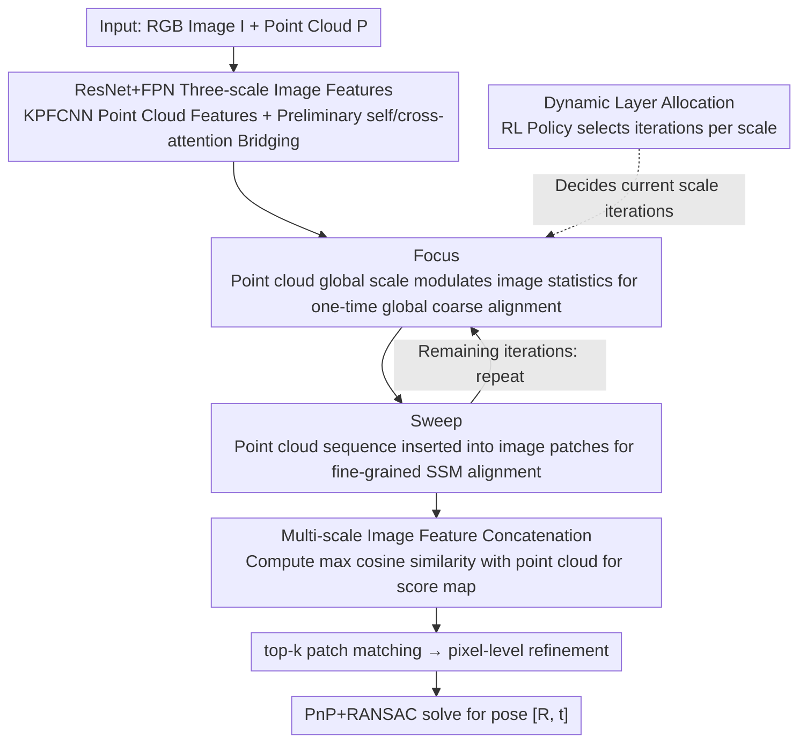

# FSI2P: A Hierarchical Focus–Sweep Registration Network with Dynamically Allocated Depth

**Conference**: ICML 2026  
**arXiv**: [2605.07607](https://arxiv.org/abs/2605.07607)  
**Code**: None  
**Area**: 3D Vision / Cross-modal Registration  
**Keywords**: Image-to-PointCloud Registration, Mamba/SSM, RL Layer Selection, Focus-Sweep, Multi-scale Interaction

## TL;DR
This paper abstracts the human observation process of "glancing first, then scrutinizing per block" into a Focus-Sweep two-stage paradigm. It replaces Transformer with Mamba for image-point cloud interaction and uses reinforcement learning to dynamically determine the number of interaction layers at each scale, achieving SOTA in I2P registration on RGB-D Scenes V2 and 7-Scenes.

## Background & Motivation

**Background**: The mainstream pipeline for image-to-point cloud (I2P) registration has transitioned from "detect-then-match" to "detection-free" coarse-to-fine frameworks, such as 2D3D-MATR, B2-3D, and CA-I2P. These rely on multi-scale features and Transformer cross-attention to establish patch-level correspondences, followed by PnP+RANSAC for pose estimation.

**Limitations of Prior Work**: Through experiments, the authors observed two overlooked issues: first, stacking too many cross-attention layers leads to "attention drift," where small deviations in early layers are repeatedly amplified (the Matthew effect), causing the MMD to actually increase; second, while multi-scale designs alleviate some scale differences, they still suffer from scale ambiguity in repetitive texture scenes due to similar textures across different resolutions, leading to misalignments.

**Key Challenge**: Cross-modal alignment inherently requires long-range interaction, necessitating many layers; however, more layers increase the risk of drift. Furthermore, determining the optimal number of layers is a discrete, non-differentiable decision that standard gradient descent cannot learn. A dual trade-off exists between "needing deep interaction" and "drift from deep interaction," as well as "learnable depth" and "discrete decisions."

**Goal**: (1) Design a cross-modal interaction mechanism that is more stable than Transformer cross-attention and can suppress scale ambiguity; (2) Provide a data-adaptive interaction depth for each scale, allowing the model to "stop when it has seen enough," much like a human.

**Key Insight**: Cognitive psychology indicates that humans perform cross-modal matching in two steps: first, global scale estimation and coarse scanning (Focus), followed by patch-wise fine comparison (Sweep). This sequential, directional process with long-term memory maintenance naturally fits the scanning mechanism of SSM (Mamba). Furthermore, "how many times to look" is essentially a strategy that can be optimized via RL.

**Core Idea**: Utilize Mamba-based alternating "Focus-Sweep" interactions and use RL to learn the iterative depth at each scale, replacing the fixed-depth cross-attention of Transformers.

## Method

### Overall Architecture
FS-I2P addresses detection-free image-to-point cloud registration: given an RGB image $I\in\mathbb{R}^{H\times W\times 3}$ and a point cloud $P\in\mathbb{R}^{N\times 3}$ from the same scene, it outputs a rigid transformation $[R,\mathbf{t}]$. The overall approach mimics the human two-stage observation process—scanning for a general idea first, then examining block-by-block. It replaces Transformer cross-attention with Mamba scanning and lets the data determine how many times to look at each scale.

Following a coarse-to-fine pipeline: first, ResNet+FPN extracts three scales of image features $F_{Ia}, F_{Ib}, F_{Ic}$, and KPFCNN extracts point cloud features $F_P$, followed by an initial self/cross-attention layer for preliminary bridging. Subsequently, features enter the hierarchical Focus-Sweep interaction module. For each scale, image features undergo Focus (global coarse alignment) and Sweep (patch-wise fine interaction). The number of times this FS-Layer pair repeats at each scale is dynamically allocated by an RL policy network. After interaction, multi-scale image features are concatenated and matched against the three scales of point cloud features using cosine similarity to obtain a score map. Top-k patch matching and pixel-level refinement are then performed, with the final pose $[R, \mathbf{t}]$ solved via PnP+RANSAC.

### Key Designs

**1. Focus: One-time "Alignment" of Image Features Using Point Cloud Global Scale to Avoid Drift**

Focus corresponds to the human "glance" and addresses the issue where early deviations in Transformer attention are amplified in subsequent layers (Matthew effect). It does not build an explicit cross-attention matrix. Instead, it compresses the "overall style" of the point cloud into channel-wise modulation factors to rearrange image statistics: first, global average pooling is applied to $F_P$, followed by a linear projection to obtain three sets of factors $[\alpha, \beta, \gamma] = \text{Linear}(\text{AvgPool}(F_P))$. Then, image feature means and variances are adjusted via $F'_i = \gamma \cdot \text{VSSM}(\alpha \cdot F_i + \beta) + F_i$ (where VSSM is the visual SSM feed-forward layer of VMamba). Since coarse alignment is compressed into one-time norm modulation, the overhead is minimal, and it pulls multi-scale image features into the point cloud's scale, preventing subsequent Sweep SSMs from being misled by incorrect scales.

**2. Sweep: Repeatedly Inserting Point Cloud Sequences between Image Patches to Leverage SSM Recency Bias for Fine-grained Alignment**

Sweep corresponds to "looking back and forth at pieces" and is the primary driver for accurate matching. it addresses the lack of sequential constraints and attention drift in cross-attention. It consists of three steps: Partition-Scan-Recover. Partition divides the image $F_i\in\mathbb{R}^{h\times w\times C}$ into $P=hw/o^2$ non-overlapping patches $[F_i^1,\dots,F_i^t]$ with window size $o$. Scan constructs a mixed sequence $F_H=[F_i^1 F_P, F_i^2 F_P,\dots, F_i^t F_P]$, where the point cloud sequence is repeatedly inserted after each image patch before passing through a VSSM layer. Recover splits the scanned results back into image features (via straightforward reshaping), while point cloud features are weighted and averaged using learnable weights $\lambda=[\lambda_1,\dots,\lambda_t]$ as $F_P^{re}=\sum_u \lambda_u F_P^t/t$. The key is that SSMs are "more sensitive to tokens closer to the current time step." Every time a new patch is entered, the following point cloud sequence "reminds" the model, forcing it to repeatedly align the current local region with the global point cloud. This maintains local fine-grained comparison while preserving the global receptive field, and Mamba's linear complexity makes this dense repetitive insertion computationally feasible.

**3. Dynamic Layer Allocation: Using RL to Select Iterations per Scale, Transforming Discrete Depth Decisions into a Learnable Strategy**

This design allows the iteration counts $\{n_1, n_2, n_3\}$ for the three scales of FS-Layers to be determined by data (allowing a scale to be 0 or skipped). The pain point is that layer count is discrete and non-differentiable, making it unlearnable by standard gradient descent, whereas too few layers are inaccurate and too many cause drift. The approach concatenates the mean+max pooling of image and point cloud tokens into a state $s$. A lightweight policy network $g_\theta$ outputs action logits $\mathbf{z}=g_\theta(s)$, yielding a categorical distribution over candidate depths $\pi_\theta(n \mid s) = \text{Softmax}(\mathbf{z})$. During training, actions $a \sim \pi_\theta(\cdot \mid s)$ are sampled and $\log p = \log \pi_\theta(a \mid s)$ is recorded; during inference, the action is taken greedily as $a = \arg\max \mathbf{z}$. Rewards are derived directly from global registration constraints (Inlier Ratio / FMR / RR, etc.) and updated via policy gradient. Compared to fixed depth or heuristics, using registration quality as a reward naturally aligns with the human behavior of "stopping once the target is found" and makes depth selection adaptive to different scenes.

### Loss & Training
The training objective is the standard I2P registration loss (patch-level correspondence supervision + refinement supervision) + policy gradient $\mathcal{L}_{RL} = -\mathbb{E}[R \cdot \log p]$, where reward $R$ is constructed from registration inlier counts / distance errors. The maximum allowed depth $l_{\max}$ is a hyperparameter, and the three scales can independently select values in the range $0 \dots l_{\max}$.

## Key Experimental Results

### Main Results
Evaluation on two public benchmarks: RGB-D Scenes V2 (4 scenes) and 7-Scenes (7 scenes), using three common metrics: Inlier Ratio (IR), Feature Matching Recall (FMR), and Registration Recall (RR).

| Dataset | Metric | FS-I2P (Ours) | Flow-I2P | 2D3D-MATR | Remarks |
| :--- | :--- | :--- | :--- | :--- | :--- |
| RGB-D Scenes V2 (mean) | IR | **42.9** | 40.1 | 32.4 | +2.8 vs. previous best |
| RGB-D Scenes V2 (mean) | FMR | **94.4** | 93.3 | 90.8 | Tied for best with B2-3D |
| 7-Scenes (mean) | IR | **53.9** | 52.0 | 50.1 | Average across 7 scenes |
| 7-Scenes (mean) | FMR | 92.4 | 91.6 | 92.1 | Tied with SOTA |

Improvements are particularly significant in Scene-11 / Scene-12 (scenes with severe repetitive textures), validating the mitigation of scale ambiguity.

### Ablation Study

| Configuration | RGB-D V2 mean IR | Description |
| :--- | :--- | :--- |
| Full FS-I2P | 42.9 | Full model |
| w/o Focus (Sweep only) | Lower | Lacks global scale alignment; multi-scales interfere |
| w/o Sweep (Focus only) | Much Lower | Lacks fine-grained patch interaction; norm modulation insufficient |
| w/o Dynamic Layer (Fixed 4 layers) | Slightly Lower | Fixed depth cannot adapt; Figure 3 shows MMD rising with depth in Transformers |
| Mamba → Transformer swap | Lower | Proves Mamba is more than just a component; it structurally mitigates the Matthew effect |

### Key Findings
- While the MMD (distance between image and point cloud feature distributions) in Transformers decreases then increases as depth increases, FS-I2P avoids this drift through SSM + RL adaptive depth. T-SNE visualizations show tighter clustering.
- The strategy learned by Dynamic Layer Allocation is interpretable: it tends to increase depth at specific scales in scenes with large scale differences and skip scales in simple geometric scenes, validating the "observe-on-demand" hypothesis.
- Focus and Sweep are not strong enough individually; their alternation is the primary performance driver. This indicates that cross-modal alignment requires both global scale priors and fine-grained patch comparison, similar to two-stage human perception.

## Highlights & Insights
- Aligning the architectural choice with human perception theories (using Mamba's "sequential sensitivity + linear complexity") creates an elegant "motivation → backbone" link.
- The "repeatedly inserting point cloud sequences after image patches" is a clever engineering trick. By leveraging the SSM property of being more sensitive to recent tokens, it achieves repeated alignment without explicit cross-attention, potentially transferable to any cross-modal task with one sequence and one set (e.g., text-to-point cloud).
- Turning "interaction depth"—previously a manually tuned hyperparameter—into an RL strategy makes this the first work in the detection-free series to explicitly dynamize "how many times to look."
- The paper provides concrete evidence of the Matthew effect (MMD curves across depths), moving beyond vague claims that "cross-attention is prone to overfitting," providing data-backed support for the SSM vs. Transformer debate.

## Limitations & Future Work
- The authors acknowledge that RL training requires differentiable/semi-differentiable global rewards; the transferability of reward designs to larger I2P datasets (e.g., KITTI) is unverified.
- Self-assessment: The state $s$ for the policy network uses only mean+max pooling, which is relatively coarse; learned strategies might remain conservative in geometrically complex scenes.
- The paper does not provide RL policy transfer results across datasets (e.g., train on RGB-D V2 → test on 7-Scenes), making it hard to judge if the strategy overfits the scale distribution of a specific benchmark.
- Comparison with outdoor LiDAR large-scale registration (KITTI, NuScenes) is missing. Validation is currently limited to indoor RGB-D scenes.
- Future work could extend Focus-Sweep to multi-view I2P (matching multiple images to one point cloud), using RL to select both layer depth and viewpoints.

## Related Work & Insights
- **vs. 2D3D-MATR**: Both are detection-free/coarse-to-fine, but 2D3D-MATR uses Transformer cross-attention with fixed depth; Ours uses Mamba + RL dynamic depth, proving much more robust to repetitive textures.
- **vs. B2-3D**: B2-3D uses hierarchical cross-attention for scale ambiguity; Ours replaces attention with norm-adapted Focus + patch-wise SSM Sweep, addressing the Matthew effect in stacked attention.
- **vs. Flow-I2P / Diff2I2P**: Flow-I2P uses Beltrami flow, and Diff2I2P uses depth-conditioned diffusion; Ours follows a "Human Cognition + SSM" cognitive engineering route, requiring no extra depth/diffusion priors and only a single pass during inference.
- **Value**: (1) The idea of using SSM token ordering to construct cross-modal alignment anchors can be generalized to any heterogeneous sequence fusion; (2) The RL-enabled depth allocation paradigm is applicable to any task where backbone depth is a hyperparameter (dynamic Transformers, dynamic diffusion steps).

## Rating
- Novelty: ⭐⭐⭐⭐ Focus-Sweep paradigm + Mamba interaction + RL dynamic depth; the combination is a first for I2P, though individual components exist.
- Experimental Thoroughness: ⭐⭐⭐⭐ Two benchmarks, three metrics, comprehensive comparison with 5 recent baselines; provides experimental evidence for the Matthew effect; lacks outdoor large-scale scenes.
- Writing Quality: ⭐⭐⭐⭐ Clear motivation→method chain; cognitive psychology analogy makes architecture choices persuasive; formulas and diagrams are well-coordinated.
- Value: ⭐⭐⭐⭐ Solidly advances SOTA in the practical I2P direction; the RL depth selection idea is insightful for other dynamic architectures.

<!-- RELATED:START -->

## Related Papers

- [\[CVPR 2026\] CMHANet: A Cross-Modal Hybrid Attention Network for Point Cloud Registration](../../CVPR2026/3d_vision/cmhanet_a_cross-modal_hybrid_attention_network_for_point_cloud_registration.md)
- [\[ICCV 2025\] CA-I2P: Channel-Adaptive Registration Network with Global Optimal Selection](../../ICCV2025/3d_vision/ca-i2p_channel-adaptive_registration_network_with_global_optimal_selection.md)
- [\[CVPR 2026\] MHopReg: Efficient Hierarchical Multi-Hop Graph Search for Point Cloud Registration](../../CVPR2026/3d_vision/mhopreg_efficient_hierarchical_multi-hop_graph_search_for_point_cloud_registrati.md)
- [\[NeurIPS 2025\] DualFocus: Depth from Focus with Spatio-Focal Dual Variational Constraints](../../NeurIPS2025/3d_vision/dualfocus_depth_from_focus_with_spatio-focal_dual_variational_constraints.md)
- [\[ECCV 2024\] Equi-GSPR: Equivariant SE(3) Graph Network Model for Sparse Point Cloud Registration](../../ECCV2024/3d_vision/equi-gspr_equivariant_se3_graph_network_model_for_sparse_point_cloud_registratio.md)

<!-- RELATED:END -->
