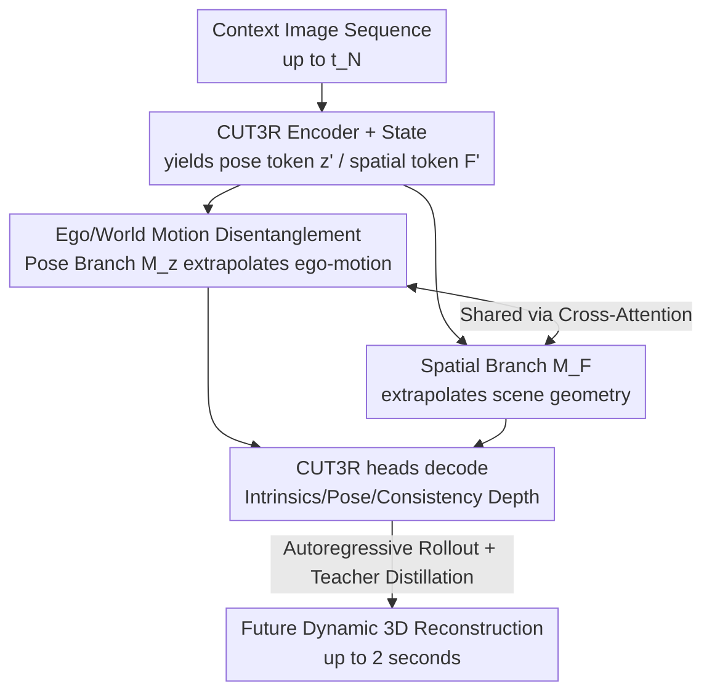

# Future Dynamic 3D Reconstruction: A 3D World Model with Disentangled Ego-Motion

**Conference**: ICML2026  
**arXiv**: [2606.18250](https://arxiv.org/abs/2606.18250)  
**Code**: [Project Page fr3d-wm.github.io](https://fr3d-wm.github.io)  
**Area**: 3D Vision / World Models / Representation Learning  
**Keywords**: World Models, Dynamic 3D Reconstruction, Ego-motion Disentanglement, Teacher-Student Distillation, Zero-shot Generalization

## TL;DR
This paper proposes FR3D—the first world model designed for "future dynamic 3D reconstruction." It **disentangles camera ego-motion from scene motion** within the latent space of a pre-trained 3D reconstruction model (CUT3R). By using two masked Transformers to extrapolate pose and geometry respectively and leveraging teacher-student distillation for nearly cost-free training, it achieves zero-shot generalization, enabling the prediction of 3D scenes 2 seconds into the future from monocular input.

## Background & Motivation
**Background**: Generative world models have recently achieved impressive photorealism in "environment simulation" (e.g., Sora) using 2D video diffusion models, often serving as interactive environments or simulators for autonomous driving. They synthesize environmental evolution directly in pixel space.

**Limitations of Prior Work**: These 2D models operate strictly on the image plane, thereby **entangling camera trajectories with scene evolution**. This entanglement fundamentally limits the model's ability to maintain coherent 3D geometry throughout a rollout—long-term predictions often exhibit "hallucinated physics," such as object deformation, disappearance, and inconsistent depth-dependent motion parallax. For agents operating in the physical world (e.g., autonomous driving), geometric integrity must take precedence over photorealism.

**Key Challenge**: Existing world models either operate in pixel/2D feature space (treating the world as a stack of 2D planes, which inevitably leads to temporal inconsistency) or perform occupancy prediction/sensor data synthesis in 3D **without disentangling ego-motion from world motion**. Furthermore, generalizable large-scale models rely on extreme scaling (e.g., 22M GPU hours, 20M hours of video), which is impractical for specific downstream tasks. The root problem is the inability to distinguish changes caused by ego-motion from changes caused by external entities within 2D features; the model cannot differentiate whether "I moved" or "the world moved."

**Goal**: Maintain a **persistent 3D latent representation** extending into the future while explicitly separating the two types of motion, all while maintaining low data and computational requirements.

**Key Insight**: The authors observe that 3D reconstruction is "retrospective" (reconstructing the past from observed frames), while world models are "prospective." By learning to perform **temporal extrapolation within the latent space of a feed-forward 3D reconstruction model**, one can naturally inherit its 3D inductive biases and generalization capabilities. Simultaneously, the camera pose can be extracted as an independent latent variable axis—effectively treating "ego-motion as a latent proxy for action."

**Core Idea**: Autoregressively extrapolate scene states and agent poses within the unified 3D latent space of a feed-forward reconstruction model (CUT3R). Use a disentangled pose/spatial dual-branch to eliminate ambiguity between ego-motion and world motion, and utilize teacher-student distillation to leverage the "spatial common sense" of the foundation model.

## Method

### Overall Architecture
FR3D receives a context image sequence (up to time $t_N$) and autoregressively outputs unified 3D scene reconstructions + ego-camera poses starting from $t_{N+1}$, **without accessing corresponding images during prediction**. The key is operating not in pixel space, but in the latent space of a frozen feed-forward 3D reconstruction model, CUT3R. First, the CUT3R encoder encodes context images into per-frame image tokens. These interact with an accumulated state $s$ via CUT3R's dual decoders to obtain "history-rich" pose tokens $z'$ and spatial tokens $F'$. Then, two masked Transformers (pose branch $M_z$ and spatial branch $M_F$) share information via cross-attention to collaboratively extrapolate the next frame's tokens. Finally, pre-trained CUT3R heads decode the predicted tokens into camera intrinsics, poses, and multi-view consistent depth to assemble the future 3D reconstruction. The student model is trained to mimic the frozen teacher's (CUT3R) token space using a smooth L1 loss.

### Key Designs

**1. Temporal Extrapolation in Frozen 3D Reconstruction Latent Space: Inheriting 3D Inductive Bias**
Instead of predicting in pixel or 2D feature space, the model learns to "move forward in time" within the latent space of the feed-forward 3D reconstruction model CUT3R. Formally, a predefined encoder $\mathcal{E}$ encodes $N$ context images into image tokens $F=\mathcal{E}(I)\in\mathbb{R}^{N\times D\times H_F\times W_F}$. Following CUT3R, history is compressed into a state $s_{t-1}\in\mathbb{R}^{768\times768}$. The state and current tokens interact via cross-attention in two interconnected decoders $\mathcal{D}_F$ and $\mathcal{D}_s$, outputting history-rich tokens and an updated state: $[z_t', F_t'], s_t=\mathcal{D}_F([z,F_t])\circlearrowleft\!\circ\!\circlearrowright\mathcal{D}_s(s_{t-1})$. The advantage is the direct inheritance of the strong generalization and 3D consistency from CUT3R, which was pre-trained on 32 datasets for approximately one month, avoiding the need to build 3D priors from scratch.

**2. Disentangled Ego-Motion and World Motion: Camera Pose as an Independent Latent Axis**
Previous world models only extrapolated spatial image tokens, mixing ego-motion and world motion dynamics within shared spatial features. FR3D additionally learns to operate within the **latent space of camera poses**. This offers two direct benefits: first, the pose latent variable provides all necessary parameters for reconstructing a dynamic 3D environment from monocular images (assuming constant intrinsics); second, separating pose and spatial latent variables allows the model to distinguish "changes caused by the ego-camera" from "actual 3D scene dynamics." This addresses the fundamental ambiguity in world modeling—determining whether the camera or the objects moved. The paper describes this as "treating inferred ego-motion as a latent proxy for action," essentially using estimated ego-motion as the action $a_t$ in the world model formulation for driving scenarios without explicit action labels.

**3. Pose/Geometry Dual Masked Transformer with Cross-Attention: Mutual Task Constraints**
To process pose tokens $z_t'$ and spatial tokens $F_t'$, two independent masked Transformers are introduced: $M_z$ for extrapolating the next most likely pose token, and $M_F$ for the corresponding spatial token. These are then decoded by pre-trained heads. Crucially, the authors found that **sharing information** is superior to independent extrapolation: $[z_{t_{N+1}}', F_{t_{N+1}}']=M_z([z_{t_1}',...,z_{t_N}'])\circlearrowleft\!\circ\!\circlearrowright M_F([F_{t_1}',...,F_{t_N}'])$. The intuition is clear: the pose (camera translation and rotation) determines how the static scene structure changes in projection from $t$ to $t+1$, so predicting pose simplifies the extrapolation of static depth. Conversely, the depth at $t+1$ constrains where the camera could be and from which perspective it observes. Coupling the two branches via cross-attention tightens the solution space. Ablation A3→A5 (adding info sharing) reduced ATE from 0.489 to 0.223, representing the largest gain in pose accuracy.

**4. Teacher-Student Distillation + Autoregressive Rollout Training: Zero-shot Generalization without Massive Data**
The training objective is to learn operations within the latent space of the frozen feed-forward 3D reconstruction model. The authors use CUT3R as a teacher: given an image sequence of length $N+1$, the teacher pre-computes "state-rich 3D scene tokens" for each step. Simultaneously, the first $N$ tokens are fed to $M_z$ and $M_F$ to extrapolate the next token. A smooth L1 loss is applied between the student's prediction and the teacher's token. Pose loss: $\mathcal{L}_{\text{pose}}=\mathbb{E}_{s\sim\mathcal{S}}[\ell(\tilde{z}_{t_{N+1}}', z_{t_{N+1}}')]$; spatial loss is averaged over all token positions. Total loss: $\mathcal{L}=\mathcal{L}_{\text{spatial}}+\lambda\mathcal{L}_{\text{pose}}$ (with $\lambda=10$ to balance scales). An **autoregressive training paradigm** is used: context tokens come not only from the teacher but also include the student's own predicted (noisy) tokens. A sliding window gradually increases the proportion of student predictions with a fixed context length $N_c=4$. This teaches the student to continue predicting on its own noisy tokens (aligning training/testing and improving long-context performance) and expands the training sequences to reduce rollout drift. This approach allows FR3D to achieve strong zero-shot generalization with significantly less data and compute than current SOTA.

### Loss & Training
Training is conducted solely on the Waymo Open Dataset (as it is within the CUT3R training distribution, providing reliable student supervision). KITTI and nuScenes are used for purely zero-shot evaluation (out-of-distribution for both FR3D and the oracle). The spatial Transformer has 12 layers/8 heads/1152 hidden dims; the pose Transformer has 4 layers/4 heads/1152 hidden dims, with 4 cross-attention layers inserted equidistantly. Context is fixed at 4 frames, with a training rollout limit of 5 steps. CUT3R features are cached. AdamW ($\beta_1=0.9, \beta_2=0.99$) is used with an effective batch size of 32 on 8×A100. Pre-training lr is $1\times10^{-4}$, fine-tuning is $5\times10^{-5}$, both with cosine annealing. Smooth L1 $\beta=0.1$.

## Key Experimental Results

### Main Results
The table below shows zero-shot depth estimation on KITTI and nuScenes ($\mathrm{AbsR}\downarrow$, lower is better). CUT3R is the oracle upper bound (seeing all frames). FR3D significantly outperforms Copy Last and the two Foresight baselines across all future steps, maintaining a lead up to $t+2$ seconds.

| Dataset | Step | Metric | Copy Last | DINO-Foresight | FR3D | CUT3R (oracle) |
|---------|------|--------|-----------|----------------|------|---------------|
| KITTI | t+0.6s | AbsR↓ | 0.141 | 0.128 | **0.116** | 0.088 |
| KITTI | t+1.0s | AbsR↓ | 0.163 | 0.156 | **0.132** | 0.087 |
| KITTI | t+2.0s | AbsR↓ | 0.190 | 0.197 | **0.178** | 0.086 |
| nuScenes | t+1.25s | AbsR↓ | 0.218 | 0.242 | **0.197** | 0.162 |
| nuScenes | t+2.5s | AbsR↓ | 0.242 | 0.283 | **0.229** | 0.163 |

For pose estimation, FR3D also significantly outperforms the only comparable baseline, CUT3R-Foresight+$M_z$: ATE for KITTI at $t+1$s drops from 0.424 to 0.256, and for nuScenes at $t+1.25$s from 0.459 to 0.192.

### Ablation Study
The table below shows ablations for key FR3D components on Waymo (A0–A6 at 224×224 resolution).

| ID | Configuration | Depth AbsR↓ (t+2s) | Pose ATE↓ (t+1s) | Description |
|------|------|-------------------|------------------|------|
| A0 | CUT3R oracle | 0.132 | 0.137 | Upper bound (full visibility) |
| A2 | CUT3R-Foresight | 0.183 | — | Baseline swapping tokens only |
| A3 | A2 + Pose Model $M_z$ | 0.183 | 0.489 | Adding pose extrapolation |
| A4 | A3 + Autoregressive | 0.179 | 0.405 | Autoregressive rollout training |
| A5 | A3 + Info Sharing | 0.173 | 0.223 | Dual-branch cross-attention |
| A6 | A4+A5 = FR3D | **0.158** | **0.219** | Full model |

### Key Findings
- **Information Sharing (A5) contributes most to pose accuracy**: Adding dual-branch cross-attention dropped ATE from 0.489 (A3) to 0.223, validating the core design of "mutual constraints between pose and depth." Autoregressive training (A4) primarily improves long-term temporal drift.
- **Disentanglement brings long-term stability**: On long horizons like $t+2$s, the 2D feature baseline (DINO-Foresight) performs similarly to or worse than Copy Last (KITTI t+2s 0.197 vs 0.190), while FR3D remains superior, indicating that 3D disentanglement suppresses geometric drift over time.
- **Zero-shot generalization across datasets**: Trained only on Waymo, the model stays leading on KITTI/nuScenes despite being completely out-of-distribution, by inheriting CUT3R's generalization priors.
- At higher resolutions (A7–A9, 512×336), FR3D $t+2$s AbsR reaches 0.152, further approaching the oracle 0.104.

## Highlights & Insights
- **"World Modeling in Reconstruction Latent Space" is a clever reuse**: By stitching retrospective 3D reconstruction (CUT3R) with prospective world modeling, the model benefits from a month of pre-training across 32 datasets, avoiding the 22M GPU hour threshold. This paradigm of "extrapolating in a frozen foundation model's latent space" is transferable to various prediction tasks requiring 3D priors.
- **Ego-motion as a "Latent Proxy for Action"**: In driving videos without explicit action labels, using estimated ego-motion as $a_t$ in the world model formula resolves ego/world motion ambiguity and allows the model to predict "what the scene looks like if the camera moves this way."
- **Solid geometric intuition regarding mutual branch constraints**: Pose determines how static structures projectedly change; depth constrains where the camera is. This symmetric coupling is clearly demonstrated by the ablation data (ATE 0.489 → 0.223).

## Limitations & Future Work
- Heavy dependency on the oracle's (CUT3R) quality and training distribution: Training data must fall within the CUT3R distribution; performance with a weaker reconstruction backbone is unknown.
- Dynamic regions remain a weakness: The geometric intuition (camera motion determines static structure projection) holds only for static scenes and smooth trajectories; dynamic object regions are outliers, which the authors acknowledge.
- Assumptions of constant intrinsics and validation up to only 2–2.5 seconds; drift in longer horizons is not fully explored.
- Personal view: The method is essentially a "high-fidelity imitator of teacher tokens." Its performance ceiling is capped by the oracle (all metrics lag significantly behind the CUT3R oracle). It learns to predict future tokens rather than truly understanding physics, and might still drift when extrapolating to extreme motions not seen during training.

## Related Work & Insights
- **vs. Feature-Prediction World Models (DINO-Foresight / DINO-WM / FUTURIST)**: These perform prospective prediction in 2D/2.5D visual feature spaces, relying on dataset-specific decoders/heads and lack 3D construction. FR3D extrapolates in a unified 3D latent space and decodes with universal oracle heads, showing stronger zero-shot generalization and long-term stability.
- **vs. 3D World Models (OccWorld / Copilot4D / DiST-4D / Drive-OccWorld)**: These perform occupancy prediction or point cloud diffusion, often requiring expensive occupancy labels or LiDAR, and usually do not explicitly disentangle ego/world motion. FR3D uses monocular input and explicit disentanglement.
- **vs. Feed-forward 3D Reconstruction (DUSt3R / MASt3R / VGGT / Spann3R / CUT3R)**: These reconstruct **observed** geometry (retrospective). FR3D extends this line to "predicting **future** 3D scene information (including static/dynamic structures and camera poses)," representing a task-level extension.

## Rating
- Novelty: ⭐⭐⭐⭐⭐ Defined the "Future Dynamic 3D Reconstruction" task. The combination of "extrapolating in frozen reconstruction latent space + explicit ego/world motion disentanglement" is genuinely novel.
- Experimental Thoroughness: ⭐⭐⭐⭐ Solid zero-shot results on KITTI/nuScenes + Waymo ablations, but lacks specialized evaluation for longer horizons and dynamic regions.
- Writing Quality: ⭐⭐⭐⭐⭐ Clear logical chain for motivation, geometric intuition, and dual-branch coupling.
- Value: ⭐⭐⭐⭐ Practically significant for autonomous driving/embodied prediction, offering a low-cost path to repurpose foundation models for 3D world modeling.

<!-- RELATED:START -->

## Related Papers

- [\[CVPR 2025\] Estimating Body and Hand Motion in an Ego-sensed World](../../CVPR2025/3d_vision/estimating_body_and_hand_motion_in_an_ego-sensed_world.md)
- [\[CVPR 2026\] Motion 3-to-4: 3D Motion Reconstruction for 4D Synthesis](../../CVPR2026/3d_vision/motion_3-to-4_3d_motion_reconstruction_for_4d_synthesis.md)
- [\[CVPR 2026\] DuoMo: Dual Motion Diffusion for World-Space Human Reconstruction](../../CVPR2026/3d_vision/duomo_dual_motion_diffusion_for_world-space_human_reconstruction.md)
- [\[AAAI 2026\] Distilling Future Temporal Knowledge with Masked Feature Reconstruction for 3D Object Detection](../../AAAI2026/3d_vision/distilling_future_temporal_knowledge_with_masked_feature_reconstruction_for_3d_o.md)
- [\[CVPR 2026\] Choreographing a World of Dynamic Objects](../../CVPR2026/3d_vision/choreographing_a_world_of_dynamic_objects.md)

<!-- RELATED:END -->
