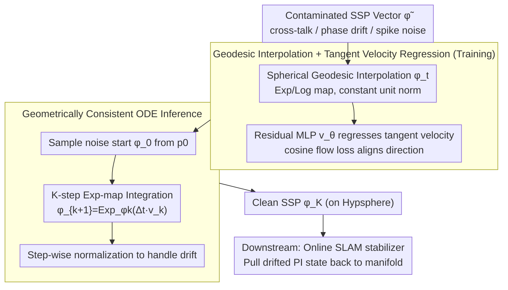

# Geodesic Flow Matching for Denoising High-Dimensional Structured Representations

**Conference**: ICML 2026  
**arXiv**: [2606.00248](https://arxiv.org/abs/2606.00248)  
**Code**: https://github.com/kremHabashy/CleanupSSP  
**Area**: Representation Learning / Flow Matching / Neurosymbolic / Manifold Geometry  
**Keywords**: Geodesic Flow Matching, Spatial Semantic Pointer (SSP), Clifford Torus, Neurosymbolic Cleanup, Spiking Neural SLAM

## TL;DR
Addressing High-dimensional structured representations like Spatial Semantic Pointers (SSP) embedded within Clifford tori on the unit hypersphere in Vector Symbolic Architectures, the authors demonstrate that standard Flow Matching with Euclidean linear interpolation "cuts through" the sphere's interior, causing magnitude collapse and phase destruction. Consequently, they propose **Geodesic Flow Matching (GFM)** using Log/Exp maps to constrain the flow to the sphere, reducing path error by 72% in spiking neural SLAM and enabling a path integrator with 1500 neurons to achieve the accuracy of a 2500-neuron baseline.

## Background & Motivation

**Background**: Vector Symbolic Architectures (VSA, specifically Plate's HRR) encode symbols into high-dimensional vectors, performing compositional reasoning via bundling (addition) and binding (circular convolution). Spatial Semantic Pointers (SSP) extend this by encoding continuous coordinates $x\in\mathbb{R}^m$ into $d>1000$ dimensional vectors using Fourier phases $\tilde\phi(x)_j=e^{i\langle\theta_j, x\rangle}$, creating a continuous "position-vector" cognitive map for path integration, SLAM, and hippocampal-entorhinal models. All VSA systems rely on a critical step—**cleanup**: mapping vectors contaminated by cross-talk, phase drift, or spike noise back onto the manifold of legal representations.

**Limitations of Prior Work**: Traditional cleanup follows two paths. First, discrete prototypes (Hopfield networks), which are unsuitable for continuous SSPs. Second, grid lookup + L-BFGS optimization, which either suffers from combinatorial explosion due to grid resolution or becomes "trapped" by incorrect prototypes (snap to wrong prototype) under high noise. Recently, Diffusion/Flow Matching has been viewed as modern continuous associative memory, but direct application faces two issues: (a) Diffusion requires hundreds of sampling steps, which is prohibitive for low-latency robotics/SLAM; (b) While Conditional Flow Matching (CFM) compresses this into a deterministic ODE with few steps, it **assumes Euclidean geometry**.

**Key Challenge**: The valid states of SSPs are not arbitrary points in Euclidean space but are constrained to a Clifford torus $\subset \mathbb{S}^{d-1}$—each Fourier component $e^{i\langle\theta_j,x\rangle}$ must maintain unit norm. CFM uses linear interpolation $\phi_t=(1-t)\phi_0+t\phi_1$, which corresponds to a **chord** between two points on a sphere rather than a geodesic. During intermediate steps, $\|\phi_t\|<1$, leading to magnitude collapse and destroyed phases. Empirical results show that Euclidean CFM produces states that "look like valid SSPs" under high noise but have **shifted spatial positions** (Figure 4b) because the phase structure is compromised.

**Goal**: (i) Provide a cleanup method for high-dimensional representations like SSPs where "tori are nested within hyperspheres"; (ii) Utilize few-step ODE inference instead of diffusion iterations; (iii) Validate cleanup value within a real spiking neural SLAM closed-loop.

**Key Insight**: Chen & Lipman (2024) generalized flow matching to general Riemannian manifolds (Riemannian Flow Matching), but only explored low-dimensional settings with Gaussian priors. This paper bets that pushing the Log/Exp mapping mechanism to extremely high-dimensional ($d>1000$), non-Gaussian scenarios—where the target distribution is grid-based SSP encoding—will yield benefits from geometric priors that **stabilize and increase with dimensionality**.

**Core Idea**: Replace the CFM interpolation $\phi_t = (1-t)\phi_0 + t\phi_1$ with spherical geodesics $\phi_t = \mathrm{Exp}_{\phi_0}(t\cdot \mathrm{Log}_{\phi_0}(\phi_1))$. The velocity field $v_\theta$ regresses only tangent space vectors, ensuring the entire sampling trajectory remains on $\mathbb{S}^{d-1}$, preserved phase structure at its root.

## Method

### Overall Architecture
GFM treats cleanup not as a discrete search for the nearest prototype in the embedding domain, but as a **generative transport problem from a noise distribution $p_0$ to a legal SSP distribution $p_1$**, forcing the transport trajectory to strictly adhere to the unit hypersphere $\mathbb{S}^{d-1}$.

The pipeline operates as follows: The input is a vector $\tilde\phi\in\mathbb{R}^d$ contaminated by cross-talk, phase drift, and spike noise, approximately following $p_0$—an isotropic Gaussian on the hypersphere, obtained by sampling $z\sim\mathcal{N}(0,I_d)$ and normalizing to $\phi_0=z/\|z\|$. During training, for each time step $t\sim\mathcal{U}[0,1]$, $\phi_0$ is interpolated to a legal SSP $\phi_1$ along a spherical geodesic (rather than a Euclidean line) to obtain an intermediate state $\phi_t$. A residual MLP $v_\theta(\phi_t,t)$ regresses the tangent space velocity at this point. During inference, a noise starting point $\phi_0$ is sampled from $p_0$, and a $K$-step ODE integration based on Exp-maps is performed: $\phi_{k+1}=\mathrm{Exp}_{\phi_k}(\Delta t\,v_k)$, with explicit normalization at each step to prevent numerical drift. The output $\phi_K$ is a clean SSP on $\mathbb{S}^{d-1}$ that can be decoded into spatial coordinates.

Downstream, this cleanup acts as an **online stabilizer** between the spiking path integrator (PI) and the VSA map, periodically pulling drifted PI states back to the manifold before landmark binding to stabilize the SLAM loop.

### Key Designs

**1. Geometric Failure Diagnosis: Proving Euclidean CFM Fails for SSPs**

The paper begins by diagnosing why standard Conditional Flow Matching fundamentally fails for SSPs. It formalizes three noise sources: cross-talk from bundling $\epsilon\sim\mathcal{N}(0,\tfrac{n-1}{d}I_d)$, phase drift from recurrence following $\mathrm{WrappedNormal}(0,t\sigma^2)$, and spike decoding noise $\sigma^2 d/N_{tot}$. The core issue is that CFM's target velocity field $u_t=\phi_1-\phi_0$ corresponds to a **chord** rather than a geodesic. Chord interpolation results in $\|\phi_t\|<1$ for $t\in(0,1)$, which destroys the unit norm necessary for the Fourier phase $e^{i\langle\theta_j,x\rangle}$. Spatial information is encoded in the phase; thus, when magnitude collapses, the phase is corrupted. Visualization (Figure 4b) shows that Euclidean flow outputs vectors that "look like valid SSPs" but are **shifted in spatial position**.

**2. Geodesic Interpolation + Tangent Space Velocity Regression**

To address magnitude collapse, GFM moves the probability path to the sphere using Log/Exp maps. Training interpolation becomes $\phi_t=\mathrm{Exp}_{\phi_0}(t\cdot\mathrm{Log}_{\phi_0}(\phi_1))$, a spherical great arc where $\|\phi_t\|=1$ throughout. The target velocity $u_t=\frac{d}{dt}\mathrm{Exp}_{\phi_0}(tv)\big|_{v=\mathrm{Log}_{\phi_0}(\phi_1)}$ is the instantaneous tangent along the arc, maintaining a constant speed $\|v\|$ and remaining orthogonal to the position vector. Thus, $v_\theta$ learns valid tangent space velocities. The loss is changed from MSE to a cosine flow loss:

$$\mathcal{L}_{\cos}=1-\frac{v_\theta^\top \dot\phi_t}{\|v_\theta\|\,\|\dot\phi_t\|},$$

This penalizes direction deviation only, as SSP semantics are encoded in angles rather than magnitudes. Log-maps are implemented with $[-1,1]$ clipping of inner products and an $\epsilon=10^{-8}$ floor for orthogonal components to prevent numerical collapse.

**3. Geometrically Consistent ODE Inference**

Inference must also follow geodesics to preserve the geometric prior. Starting from $\phi_0\sim p_0$, GFM updates each step using $\phi_{k+1}=\mathrm{Exp}_{\phi_k}(\Delta t\,v_\theta(\phi_k,t_k))$, followed by explicit normalization $\phi_{k+1}\leftarrow\phi_{k+1}/\|\phi_{k+1}\|$. This $K$-step process is significantly faster than diffusion. Because Exp-map updates naturally resolve tangent vectors without leaving the manifold, GFM acts as a **continuous attractor field** rather than a discrete projection, allowing it to be inserted into recursive loops without breaking integration dynamics.

### Loss & Training
- **Loss**: Cosine flow loss (Eq. 10) for directional alignment.
- **Architecture**: $v_\theta$ is a residual MLP with 3 ResBlocks. Each block has two Linear layers + GELU + Dropout(0.1) + LayerNorm, with a bottleneck schedule ($2d\to d, 4d\to d, 2d\to d$). Time is incorporated via 32-dim sinusoidal embeddings.
- **Samples**: Clean SSPs use Sobol quasi-random sampling for uniform spatial coverage; noise is projected from $\mathcal{N}(0,I_d)$ onto the sphere.
- **Strategy**: Euclidean CFM is intentionally trained **without** spherical projection to study the failure mode of interior "shortcuts," while GFM uses geodesic interpolation.

## Key Experimental Results

### Main Results

Summary of core SLAM results (Table 1, RMSE in meters):

| PI Neurons | Method | RMSE (m) | Description |
|------------|------|----------|------|
| 1000 | Grid | 0.586 ± 0.121 | Discrete cleanup, limited resolution |
| 1000 | Euclidean FM | 0.449 ± 0.068 | Euclidean interpolation |
| 1000 | **Geodesic FM** | **0.162 ± 0.055** | 72% reduction vs Grid, 64% vs Euclidean |
| 1500 | Grid | 0.249 ± 0.239 | High variance |
| 1500 | Euclidean FM | 0.204 ± 0.103 | |
| 1500 | **Geodesic FM** | **0.076 ± 0.026** | **72% reduction vs Grid**, 10x lower variance |
| 2500 | Grid | 0.083 ± 0.017 | Grid catches up with more neurons |
| 2500 | **Geodesic FM** | **0.078 ± 0.009** | |

In high-dimensional cleanup ($d=1015$), GFM's advantage over Euclidean FM grows rapidly from $d\approx 50$, stabilizing at $d\approx 200$, and maintaining a $\sim 10\%$ gap for $d>500$.

### Ablation Study

| Configuration | Key Metric | Description |
|------|---------|------|
| Geodesic Flow (Full) | 1500 Neuron RMSE: 0.076m | Full model |
| Euclidean Flow | 1500 Neuron RMSE: 0.204m | Error increases ~2.7× without geodesics |
| Feedforward Regression | Diffuse spatial distribution | Collapses to target mean; outputs a bundle, not a point |
| Grid Lookup | Fails in SLAM | Discrete snapping causes jumps, breaking PI dynamics |
| L-BFGS Optimization | OK for static signals | Trapped by local minima under high noise |

### Key Findings
- **Geodesic vs Linear** is the root of the performance gap: Upgrading to GFM reduces RMSE from 0.204m to 0.076m in the 1500-neuron scenario. Euclidean flow causes position drift because magnitude collapse destroys phase.
- **Discrete methods are fragile in closed-loop systems**: While Grid is strong in static benchmarks, its discrete "snapping" in recursive loops creates discontinuities that destabilize path integration. GFM provides a continuous attractor field that smooths states back to the manifold.
- **Resource Equivalence**: GFM with 1500 neurons $\approx$ baseline with 2500 neurons, effectively "trading" geometric priors for 40% neural resource savings.
- **Failure Modes**: Euclidean FM yields position drift (phase loss), Feedforward yields bundling (mean collapse), and Grid yields discrete jumps (wrong prototype snapping).

## Highlights & Insights
- The "diagnosis-driven" writing style is effective: by formalizing noise sources (Section 3.3) and proving CFM's failure (Section 3.4), the method in Section 4 becomes a logical necessity.
- Redefining cleanup as generative transport represents a paradigm shift from discrete search (Hopfield/Grid) to continuous flow in embedding space. This is applicable to any hyperspherical embedding (e.g., Hyperspherical VAE, normalized LLM embeddings).
- Few-step ODE inference combined with geometric priors enables the first "manifold-aware associative memory" practical for low-latency real-time systems.
- Using **cosine flow loss** instead of MSE prevents the velocity field from being contaminated by irrelevant magnitude errors when semantics are encoded in direction.

## Limitations & Future Work
- The current $v_\theta$ is a standard MLP; conversion to a fully spiking network (e.g., via snnTorch) is needed for neuromorphic hardware.
- The framework is currently bound to hyperspherical topology. Other VSA families (e.g., Boolean hypercube, complex-valued HRR on circles) would require different Log/Exp mapping selections.
- SLAM experiments were conducted in synthetic 2D environments (50 landmarks, 60s navigation); validation with real odometry or visual front-ends is pending.
- Future Work: (i) Cleanup directly on the Clifford torus for tighter phase constraints; (ii) Adaptive step counts $K$ based on noise levels; (iii) Application to LLM normalized embeddings to mitigate hallucinations.

## Related Work & Insights
- **vs Conditional Flow Matching (Lipman 2022)**: CFM assumes Euclidean geometry; this paper proves this is a failure point for spherical representations.
- **vs Riemannian Flow Matching (Chen & Lipman 2024)**: RFM provides the framework; this is the first application to extremely high-dimensional ($d>1000$) structured representations (SSP) validated in closed-loop systems.
- **vs Grid / L-BFGS Cleanup (Dumont 2023)**: Conventional methods are discrete or non-convex; GFM is generative transport, which is robust and preserves dynamics.
- **vs SO(3) Diffusion (Braun 2024)**: Parallel application of manifold-aware generative transport, though focused on rotation groups rather than hyperspherical VSA cleanup.

## Rating
- **Novelty**: ⭐⭐⭐⭐ First to scale Riemannian flow matching to high-dim neurosymbolic representations.
- **Experimental Thoroughness**: ⭐⭐⭐ Solid SLAM results across neuron scales/noise, but lacks real-world datasets and hardware latency curves.
- **Writing Quality**: ⭐⭐⭐⭐ Excellent causal chain from diagnosis to method.
- **Value**: ⭐⭐⭐⭐ Practical improvement for neuromorphic computing and "direction-centric" embeddings.

<!-- RELATED:START -->

## Related Papers

- [\[CVPR 2026\] GeodesicNVS: Probability Density Geodesic Flow Matching for Novel View Synthesis](../../CVPR2026/3d_vision/geodesicnvs_probability_density_geodesic_flow_matching_for_novel_view_synthesis.md)
- [\[CVPR 2026\] HyperGaussians: High-Dimensional Gaussian Splatting for High-Fidelity Animatable Face Avatars](../../CVPR2026/3d_vision/hypergaussians_high-dimensional_gaussian_splatting_for_high-fidelity_animatable_.md)
- [\[CVPR 2026\] Optical Flow Matching: Reframing Optical Flow as Continuous Transport Dynamics](../../CVPR2026/3d_vision/optical_flow_matching_reframing_optical_flow_as_continuous_transport_dynamics.md)
- [\[ICML 2026\] SIMPC: Learning Self-Induced Mirror-Point Consistency for Unsupervised Point Cloud Denoising](simpc_learning_self-induced_mirror-point_consistency_for_unsupervised_point_clou.md)
- [\[CVPR 2026\] UniPixie: Unified and Probabilistic 3D Physics Learning via Flow Matching](../../CVPR2026/3d_vision/unipixie_unified_and_probabilistic_3d_physics_learning_via_flow_matching.md)

<!-- RELATED:END -->
