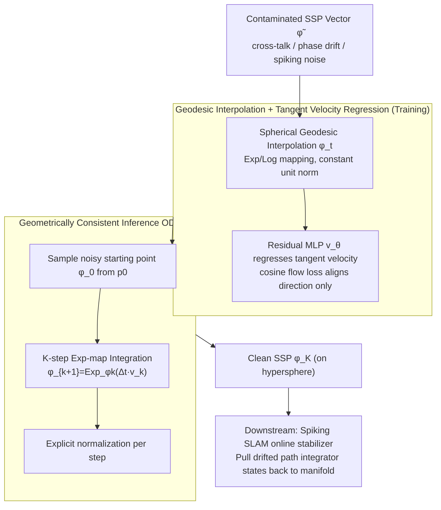

# Geodesic Flow Matching for Denoising High-Dimensional Structured Representations

**Conference**: ICML 2026  
**arXiv**: [2606.00248](https://arxiv.org/abs/2606.00248)  
**Code**: https://github.com/kremHabashy/CleanupSSP  
**Area**: Representation Learning / Flow Matching / Neuro-symbolic / Manifold Geometry  
**Keywords**: Geodesic Flow Matching, Spatial Semantic Pointer (SSP), Clifford Torus, Neuro-symbolic Cleanup, Spiking Neural SLAM

## TL;DR
Focusing on high-dimensional structured representations like Spatial Semantic Pointers (SSPs) in Vector Symbolic Architectures—which are "embedded in a Clifford torus within a unit hypersphere"—the authors observe that Euclidean linear interpolation in standard Flow Matching passes through the sphere's interior, causing amplitude collapse and phase destruction. By using Log/Exp maps to constrain the flow to the sphere via **Geodesic Flow Matching (GFM)**, they reduce path error in spiking neural SLAM by 72% and enable a 1500-neuron path integrator to match the accuracy of a 2500-neuron baseline.

## Background & Motivation

**Background**: Vector Symbolic Architectures (VSA, focusing on Plate 95 HRR here) encode symbols into high-dimensional vectors, performing compositional reasoning via bundling (addition) and binding (circular convolution). Spatial Semantic Pointers (SSP) extend this by encoding continuous coordinates $x\in\mathbb{R}^m$ into $d>1000$ dimensional vectors using Fourier phases $\tilde\phi(x)_j=e^{i\langle\theta_j, x\rangle}$. This creates continuous "position-vector" cognitive maps for path integration, SLAM, and hippocampal-entorhinal models. All VSA systems rely on a critical step—**cleanup**: projecting vectors contaminated by cross-talk, phase drift, or spiking noise back onto the valid representation manifold.

**Limitations of Prior Work**: Traditional cleanup follows two paths: (1) discrete prototypes (Hopfield networks), which are unsuitable for continuous SSPs; or (2) grid lookup + L-BFGS optimization, which either suffers from exponential grid resolution scaling or "snaps to the wrong prototype" under high noise. While recent works view diffusion/flow matching as modern continuous associative memories, directly applying them poses two issues: (a) diffusion requires numerous sampling steps, which is too slow for low-latency robotics; (b) Conditional Flow Matching (CFM) compresses this into a few-step ODE but **assumes Euclidean geometry**.

**Key Challenge**: The valid states of SSPs are not arbitrary points in Euclidean space but are constrained to a Clifford torus $\subset \mathbb{S}^{d-1}$—every Fourier component $e^{i\langle\theta_j,x\rangle}$ must maintain unit magnitude. CFM’s linear interpolation $\phi_t=(1-t)\phi_0+t\phi_1$ corresponds to a **chord** between two points on a sphere rather than a geodesic. At intermediate times, $\|\phi_t\|<1$, causing amplitude collapse and phase destruction. Empirical tests show that Euclidean CFM under high noise produces states that "look like valid SSPs" but have **shifted spatial positions** (Figure 4b) because the phases were corrupted.

**Goal**: (i) Provide a cleanup method for high-dimensional structured representations like SSPs where "tori are nested in hyperspheres"; (ii) use few-step ODE inference instead of diffusion iterations; (iii) validate cleanup value in a real-world closed-loop spiking neural SLAM system.

**Key Insight**: Although Chen & Lipman (2024) generalized flow matching to Riemannian Manifolds (RFM), it has only been tested in low dimensions with Gaussian priors. This paper wagers that for extremely high-dimensional, non-Gaussian scenarios ($d>1000$) where the target is a gridded SSP encoding, the benefits of geometric priors will **stabilize and grow with dimensionality**.

**Core Idea**: Replace the CFM interpolation $\phi_t = (1-t)\phi_0 + t\phi_1$ with a spherical geodesic $\phi_t = \mathrm{Exp}_{\phi_0}(t\cdot \mathrm{Log}_{\phi_0}(\phi_1))$. The velocity field $v_\theta$ regresses only tangent space vectors, ensuring the entire sampling trajectory remains on $\mathbb{S}^{d-1}$, fundamentally preserving the phase structure.

## Method

### Overall Architecture
GFM treats cleanup as a **generative transport problem from a noise distribution $p_0$ to a valid SSP distribution $p_1$**, forcing the transport trajectory to remain on the unit hypersphere $\mathbb{S}^{d-1}$ rather than performing a discrete search for the nearest prototype.

The pipeline is as follows: The input is a vector $\tilde\phi\in\mathbb{R}^d$ contaminated by cross-talk, phase drift, or spiking noise, approximating $p_0$—an isotropic Gaussian on the hypersphere (sampled via $z\sim\mathcal{N}(0,I_d)$ and normalized to $\phi_0=z/\|z\|$). During training, for each time step $t\sim\mathcal{U}[0,1]$, $\phi_0$ is interpolated to a clean SSP $\phi_1$ along a spherical geodesic to obtain the intermediate state $\phi_t$. A residual MLP $v_\theta(\phi_t,t)$ then regresses the tangent space velocity at this point. During inference, a noisy starting point $\phi_0$ is sampled from $p_0$, and a $K$-step ODE integration based on the Exp-map is performed: $\phi_{k+1}=\mathrm{Exp}_{\phi_k}(\Delta t\,v_k)$, with explicit normalization at each step to handle numerical drift. The final output $\phi_K$ is a clean SSP on $\mathbb{S}^{d-1}$ that can be decoded into spatial coordinates.

Downstream, this cleanup module serves as an **online stabilizer** between the spiking path integrator (PI) and the VSA map, pulling drifted PI states back to the manifold and stabilizing the SLAM loop.

### Key Designs

**1. Geometry Failure Diagnosis: Proving Euclidean CFM fails in the SSP domain**

The work starts by diagnosing why standard CFM fails for SSPs. Noise sources are formalized into three distributions: cross-talk from bundling $\epsilon\sim\mathcal{N}(0,\tfrac{n-1}{d}I_d)$, phase drift from recurrence $\mathrm{WrappedNormal}(0,t\sigma^2)$, and decoding noise $\sigma^2 d/N_{tot}$. The issue is that CFM’s target velocity $u_t=\phi_1-\phi_0$ corresponds to a **chord** rather than a geodesic. Chord interpolation results in $\|\phi_t\|<1$ for $t\in(0,1)$, which destroys the unit magnitude necessary for Fourier phases $e^{i\langle\theta_j,x\rangle}$. Visualizations of SSP similarity kernels (Figure 4b) show that Euclidean-generated vectors are **shifted in the spatial domain** even if they look like valid SSPs—a chain reaction of "amplitude collapse → phase drift → incorrect decoding."

**2. Geodesic Interpolation + Tangent Velocity Regression: Ensuring training targets are valid tangent vectors**

To maintain the phase structure, GFM moves the probability path to the sphere using Log/Exp maps. Training interpolation becomes $\phi_t=\mathrm{Exp}_{\phi_0}(t\cdot\mathrm{Log}_{\phi_0}(\phi_1))$, the spherical arc connecting $\phi_0$ and $\phi_1$, ensuring $\|\phi_t\|=1$. The target velocity $u_t=\frac{d}{dt}\mathrm{Exp}_{\phi_0}(tv)\big|_{v=\mathrm{Log}_{\phi_0}(\phi_1)}$ is the instantaneous tangent along this arc. The loss function is switched from MSE to a cosine flow loss:

$$\mathcal{L}_{\cos}=1-\frac{v_\theta^\top \dot\phi_t}{\|v_\theta\|\,\|\dot\phi_t\|},$$

penalizing only directional deviation, as SSP semantics are encoded in angles. Numerical stability is handled by clipping inner products and adding a floor $\epsilon=10^{-8}$ to orthogonal components.

**3. Geometrically Consistent Inference ODE: Preserving geometry from training to sampling**

If inference reverts to Euclidean steps, the geometric priors are lost. GFM performs inference starting from $\phi_0\sim p_0$ using $\phi_{k+1}=\mathrm{Exp}_{\phi_k}(\Delta t\,v_\theta(\phi_k,t_k))$, followed by explicit normalization. This requires only a few dozen steps $K$, making it much cheaper than diffusion. Crucially, the Exp-map update acts as a **continuous attractor field** rather than a discrete projection, allowing the cleanup module to be inserted into recursive loops without breaking integration dynamics.

## Key Experimental Results

### Main Results

Core SLAM results (Table 1, RMSE in meters):

| PI Neurons | Method | RMSE (m) | Note |
|------------|------|----------|------|
| 1000 | Grid | 0.586 ± 0.121 | Insufficient resolution |
| 1000 | Euclidean FM | 0.449 ± 0.068 | Linear interpolation |
| 1000 | **Geodesic FM** | **0.162 ± 0.055** | 72% better than Grid |
| 1500 | Grid | 0.249 ± 0.239 | High variance |
| 1500 | Euclidean FM | 0.204 ± 0.103 | |
| 1500 | **Geodesic FM** | **0.076 ± 0.026** | **72% better than Grid** |
| 2500 | Grid | 0.083 ± 0.017 | Grid catches up with more neurons |
| 2500 | **Geodesic FM** | **0.078 ± 0.009** | |

### Ablation Study

| Configuration | Key Metric | Note |
|------|---------|------|
| Geodesic Flow (full) | 0.076m RMSE (1500 neurons) | Full model |
| Euclidean Flow | 0.204m RMSE (1500 neurons) | Replacing geodesic with linear interpolation increases error by ~2.7× |
| Feedforward Regression | Diffuse spatial distribution | Without ODE iterations, regression collapses to the target mean |
| Grid Lookup | Fails in SLAM loops | Discrete snapping creates discontinuities that break PI dynamics |

### Key Findings
- **Geodesics vs. Chords**: Upgrading Euclidean FM to GFM reduces RMSE from 0.204m to 0.076m. Figure 4 confirms the "amplitude collapse → phase destruction" causal chain.
- **Brittleness of Discrete Methods**: Grid lookup is strong in static benchmarks but fails in recursive SLAM loops because "snapping" creates jumps that destabilize trajectory integration. GFM provides a smooth continuous attractor field.
- **Resource Equivalence**: GFM with 1500 neurons $\approx$ baseline with 2500 neurons, effectively saving 40% of neural resources through geometric priors.

## Highlights & Insights
- The "diagnosis-driven" narrative is compelling: formalizing noise sources (3.3) and proving CFM’s failure (3.4) makes the proposed solution a logical necessity.
- Redefining cleanup as generative transport is a paradigm shift from discrete searching (Hopfield/Grid) to continuous flow in embedding space. This is applicable to any hyperspherical embedding (e.g., Hyperspherical VAE).
- Using cosine flow loss instead of MSE is a critical trick for hyperspherical representations where semantics are angular.

## Limitations & Future Work
- The current $v_\theta$ is a standard MLP; conversion to a fully spiking network (SNN) for neuromorphic hardware is needed.
- The framework is currently tied to hyperspherical topology; other VSA families (e.g., Boolean hypertubes $\{-1,+1\}^d$) would require different Log/Exp maps.
- SLAM experiments used synthetic 2D benchmarks; testing with real-world odometry or visual front-ends is a future step.

## Related Work & Insights
- **vs. Conditional Flow Matching (Lipman 2022)**: GFM patches the failure of Euclidean interpolation on curved representation manifolds.
- **vs. Riemannian Flow Matching (Chen & Lipman 2024)**: GFM scales RFM to $d>1000$ and non-Gaussian targets in a real closed-loop system.
- **vs. Hopfield Networks**: GFM treats generative denoising as a continuous attractor, aligning with theoretical views that denoising acts as a continuous associative memory.

## Rating
- Novelty: ⭐⭐⭐⭐ (First scaling of RFM to high-dim structured neuro-symbolic representations).
- Experimental Thoroughness: ⭐⭐⭐ (SLAM results are solid, but synthetic datasets and missing trade-off curves for $K$ are minor gaps).
- Writing Quality: ⭐⭐⭐⭐ (Extremely clear causal logic and effective visualizations).
- Value: ⭐⭐⭐⭐ (Practical engineering improvements for neuromorphic and neuro-symbolic SLAM).

<!-- RELATED:START -->

## Related Papers

- [\[CVPR 2026\] GeodesicNVS: Probability Density Geodesic Flow Matching for Novel View Synthesis](../../CVPR2026/3d_vision/geodesicnvs_probability_density_geodesic_flow_matching_for_novel_view_synthesis.md)
- [\[CVPR 2026\] Optical Flow Matching: Reframing Optical Flow as Continuous Transport Dynamics](../../CVPR2026/3d_vision/optical_flow_matching_reframing_optical_flow_as_continuous_transport_dynamics.md)
- [\[CVPR 2026\] HyperGaussians: High-Dimensional Gaussian Splatting for High-Fidelity Animatable Face Avatars](../../CVPR2026/3d_vision/hypergaussians_high-dimensional_gaussian_splatting_for_high-fidelity_animatable_.md)
- [\[ICML 2026\] SIMPC: Learning Self-Induced Mirror-Point Consistency for Unsupervised Point Cloud Denoising](simpc_learning_self-induced_mirror-point_consistency_for_unsupervised_point_clou.md)
- [\[CVPR 2026\] UniPixie: Unified and Probabilistic 3D Physics Learning via Flow Matching](../../CVPR2026/3d_vision/unipixie_unified_and_probabilistic_3d_physics_learning_via_flow_matching.md)

<!-- RELATED:END -->
