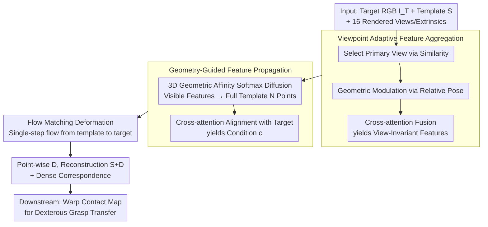

# Geometry-Guided Modeling of Foundation Features Enables Generalizable Object Shape Deformation Learning

**Conference**: ICML 2026  
**arXiv**: [2605.29661](https://arxiv.org/abs/2605.29661)  
**Code**: https://GODeform.github.io/ (Project homepage, code status TBD)  
**Area**: 3D Vision / Monocular Shape Reconstruction / Category-level Deformation  
**Keywords**: Template Deformation, Foundation Model Features, Geometry-Guided Propagation, Viewpoint Adaptation, Flow Matching

## TL;DR
This paper proposes GODeform: 2D foundation model features (e.g., DINOv3) are mapped onto category template surfaces for geometry-guided propagation and cross-view fusion. A point-wise deformation field from template to target is then learned via Flow Matching, enabling 3D shape recovery from a single image across large deformations, arbitrary viewpoints, and unseen categories, directly supporting dexterous grasp transfer.

## Background & Motivation

**Background**: Monocular 3D shape recovery follows two main paradigms. One is generative reconstruction (LRM / Wonder3D / Phidias), which pursues high fidelity but relies heavily on the training distribution. The other is the "deformation paradigm"—predicting a deformation field from a category template to the target (ShapeMatcher, KP-RED, etc.), leveraging the template's topology to stabilize the geometry of occluded regions.

**Limitations of Prior Work**: Generative methods often "hallucinate" unreasonable geometry in self-occluded areas and are sensitive to viewpoint changes. Deformation methods mostly use visual encoders trained from scratch on small datasets, leading to unstable cross-category semantics. Furthermore, when the target and template differ significantly (e.g., four-legged chair → sofa), predicted deformation fields suffer structural degradation and fail to generalize to novel categories.

**Key Challenge**: Deformation requires establishing point-wise fine correspondence between the **3D topology of the template** and the **2D observation of the target**. However, 2D foundation models only provide features on visible surfaces without 3D geometric priors, while 3D foundation models are limited by data scale and lack the generalization of 2D models. Directly combining them often fails due to semantic mismatches caused by viewpoint variations.

**Goal**: Design a unified deformation framework that satisfies three generalization axes simultaneously—large template/target variance, arbitrary target viewpoints, and unseen object categories—while directly driving downstream robotic dexterous grasping.

**Key Insight**: The authors propose making "2D foundation features geometrically aware" by diffusing strong semantic correspondences from the image side across the entire 3D surface using the template's topology. Camera poses are used to explicitly distinguish "viewpoint artifacts" from "actual deformation."

**Core Idea**: Reformulate deformation learning as "Flow Matching conditioned on geometry-guided foundation features." Foundation features of visible points are diffused across the entire surface via geometric affinity, and multi-view information is fused into a viewpoint-invariant template representation using relative poses.

## Method

### Overall Architecture
GODeform aims to recover 3D shapes under large deformations, arbitrary viewpoints, and unseen categories from a single target RGB image. The core concept is to rewrite "deformation" as "point-wise flow conditioned on geometrically aware foundation features." Inputs include a target RGB $I_{\mathcal{T}}$, a category-level 3D template point cloud $\mathcal{S} \in \mathbb{R}^{N\times 3}$, and 16 pre-rendered views of the template $\{I_{\mathcal{S}}^k\}$ with their extrinsic parameters $\{\mathbf{E}_{\mathcal{S}}^k\}$. The output is a point-wise deformation field $\mathcal{D} \in \mathbb{R}^{N\times 3}$, where the reconstructed result is $\hat{\mathcal{T}} = \mathcal{S} + \mathcal{D}$, naturally providing dense correspondence.

The process consists of three steps: First, select a primary template view most semantically similar to the target, and fuse information from other views using relative poses to obtain "viewpoint-invariant" visible point features. Second, diffuse these sparse features to all $N$ points of the template using 3D geometric affinity, then align them with target image features via cross-attention to form the condition $\mathbf{c}$. Finally, learn a velocity field using Flow Matching conditioned on $\mathbf{c}$ to "flow" template points to target positions. Deformation is modeled as a continuous ODE $d\phi_t/dt = \mathbf{v}_t(\phi_t \mid \mathbf{c})$, with the velocity field $v_\theta$ supervised along a linear interpolation path $\mathbf{x}_t = (1-t)\mathbf{x}_0 + t\mathbf{x}_1$. Inference is a single step $\mathcal{D} = v_\theta(\mathcal{S}, 0, \mathbf{c})$ taking ~0.67s.

### Key Designs

**1. Viewpoint Adaptive Feature Aggregation: Decoupling Viewpoint Artifacts from Actual Deformation**

Foundation features change based on camera perspective even for the same 3D structure. To prevent the network from mistaking "viewpoint drift" for shape change, the model selects a primary template view $I_{\mathcal{S}}^*$ based on DINOv3 cosine similarity with target $I_{\mathcal{T}}$ as an anchor. Relative camera transformations $\mathbf{P}_{\text{rel}}^k$ are calculated, flattened, and projected into pose embeddings $\mathbf{e}^k$ to "geometrically modulate" features. This informs the network where each feature was captured. Cross-attention then fuses these into a view-invariant representation $\tilde{\mathbf{F}}_{\text{partial}}$.

**2. Geometry-Guided Feature Propagation: Spanning Sparse Semantics across the 3D Surface**

Visible point features $\mathbf{F}_{\text{vis}}$ (covering only the front side) must be propagated to the entire $N$-point template to handle occluded regions. A lightweight 3D encoder calculates geometric embeddings $\mathbf{G} \in \mathbb{R}^{N\times d}$ to determine affinity $S_{ji}$ between visible point $i$ and any point $j$. Semantics are distributed via a weighted softmax:

$$\mathbf{f}_j^{\text{complete}} = \sum_i \frac{\exp(S_{ji}/\tau)}{\sum_k \exp(S_{jk}/\tau)}\, \mathbf{f}_i^{\text{vis}}$$

This ensures that geometrically similar points (e.g., the front and back of a chair leg) share semantics. The complete features are then aligned with target features $\mathbf{F}_{\mathcal{T}}$ to produce the condition $\mathbf{F}_{\text{aligned}}$ for Flow Matching.

**3. Flow Matching: Continuous Flow vs. Single-step Offset Regression**

Instead of regressing a single offset, deformation is modeled as a continuous trajectory. Training involves linear interpolation between $\mathbf{x}_0 = \mathcal{S}$ and $\mathbf{x}_1 = \mathcal{T}$, supervising the velocity field $\mathbf{u}_t = \mathbf{x}_1 - \mathbf{x}_0$ via the Flow Matching loss $\mathcal{L}_{\text{FM}}$. Because the trajectory is linear (constant velocity), inference can be performed in a single step at $t=0$, providing the efficiency of a single-step rectified flow (0.67s) while maintaining robustness to structural differences.

### Loss & Training
The total loss includes several geometric regularizations: $\mathcal{L} = \lambda_{\text{FM}}\mathcal{L}_{\text{FM}} + \lambda_{\text{CD}}\mathcal{L}_{\text{CD}} + \lambda_{\text{Lap}}\mathcal{L}_{\text{Lap}} + \lambda_{\text{ARAP}}\mathcal{L}_{\text{ARAP}} + \lambda_{\text{reg}}\mathcal{L}_{\text{reg}} + \lambda_{\text{sil}}\mathcal{L}_{\text{sil}}$. These cover global alignment (Chamfer), local continuity (Laplacian), local rigidity (ARAP), magnitude constraints, and multi-view silhouette consistency. The model is trained on seven ShapeNetv2 categories (chair, table, etc.) as a single unified model.

## Key Experimental Results

### Main Results
Two evaluation settings: Retrieved Template (most similar via DINOv3) vs. Random Template (standardized templates to test large deformation robustness).

| Dataset / Setting | Metric | Ours (MV) | KP-RED | ShapeMatcher | Note |
|--------|------|------|----------|----------|------|
| Seen / Retrieved | CD $(10^{-3})$ ↓ | **2.38** | 3.05 | 5.92 | 22% better than KP-RED |
| Seen / Retrieved | S-IoU (%) ↑ | **48.79** | 46.73 | 40.47 | |
| Seen / Random | CD $(10^{-3})$ ↓ | **2.46** | 5.10 | 13.02 | Baselines' CD doubles; Ours stays stable |
| Seen / Random | S-IoU (%) ↑ | **47.31** | 42.05 | 34.36 | |
| Unseen / Retrieved | CD $(10^{-3})$ ↓ | **3.69** | N/A | N/A | Baselines fail cross-category |
| Unseen / Random | S-IoU (%) ↑ | **52.57** | N/A | N/A | Maintains ~52% S-IoU on unseen |

In the "Random Template" column, baselines fail when the template is dissimilar, while GODeform remains robust (CD 2.38 → 2.46), proving the effectiveness of geometry-guided foundation features.

### Ablation Study
| Configuration | CD ($10^{-3}$, Random) | S-IoU (%, Random) | Description |
|------|---------|---------|------|
| Our-MV (Full) | **2.46** | **47.31** | Full Model |
| w/o FM | 2.74 | 43.57 | Regression instead of FM; CD increases 11% |
| w/o Prop. | 2.95 | 41.10 | No diffusion (occlusion filled with mean); largest drop |
| w/o PrimSel. | 2.84 | 44.40 | No primary view selection |
| w/o PoseAware. | 2.79 | 44.47 | Multi-view average without pose embeddings |
| Our-SV | 2.61 | 46.78 | Single-view template; still outperforms baselines |

### Key Findings
- **Propagation is the Core**: Removing geometric propagation (w/o Prop.) causes the largest performance drop, as the network lacks signals for occluded regions.
- **Viewpoint Fusion requires Anchoring**: Naive multi-view fusion (averaging) performs worse than single-view prompts. Success requires primary view anchoring and pose modulation.
- **Engineering Value**: Tested on a Shadow Hand in Isaac Gym and a real NAVIAI AW-1 robot, achieving a 77% success rate in grasping by warping contact maps via the learned deformation field.

## Highlights & Insights
- **Explicit Geometric Sensitization of Foundation Features**: Rather than simple concatenation, using 3D geometric affinity as a "propagation bridge" is elegant. It allows 2D semantics to be "spread" across the 3D surface without requiring 3D foundation model pre-training.
- **Viewpoint Modulation**: The discovery that "naive multi-view fusion is worse than single-view" is an important counter-intuitive find, highlighting the necessity of geometric anchoring.
- **Utilization of Dense Correspondence**: The work fully utilizes the byproduct of deformation—dense correspondence—to warp contact maps for zero-shot robot grasp transfer.

## Limitations & Future Work
- **Occlusion**: Single-view input is ill-posed. If critical parts (e.g., a mug handle) are fully hidden, the model lacks 2D deformation cues, leading to geometric errors.
- **Template Dependency**: Requires a pre-defined template pool (approx. 50 per category), making it less applicable to "free-form" objects (e.g., soft bodies).
- **Sim-to-Real**: While real-world grasping was successful on four categories, robustness to transparent or highly reflective objects remains unaddressed.

## Related Work & Insights
- **ShapeMatcher (CVPR'24)**: Relies on retrieval quality and per-category training. Ours is unified and 81% better in CD under large deformations.
- **KP-RED (2024)**: Uses sparse keypoints; Ours uses point-wise Flow Matching, capturing better details without requiring GT depth during inference.
- **Generative vs. Deformation**: Generative models hallucinate; Ours uses template topology as a fallback to ensure category-level geometric validity.

## Rating
- Novelty: ⭐⭐⭐⭐ — Effective integration of Flow Matching and geometry-guided propagation.
- Experimental Thoroughness: ⭐⭐⭐⭐⭐ — Extensive cross-quadrant evaluation and real-world robotics validation.
- Writing Quality: ⭐⭐⭐⭐ — Equations and logic are clear.
- Value: ⭐⭐⭐⭐⭐ — Solves cross-category and large-deformation issues in the deformation paradigm with direct engineering utility for embodied AI.

<!-- RELATED:START -->

## Related Papers

- [\[CVPR 2026\] SGSoft: Learning Fused Semantic-Geometric Features for 3D Shape Correspondence via Template-Guided Soft Signals](../../CVPR2026/3d_vision/sgsoft_learning_fused_semantic-geometric_features_for_3d_shape_correspondence_vi.md)
- [\[NeurIPS 2025\] Learning Generalizable Shape Completion with SIM(3) Equivariance](../../NeurIPS2025/3d_vision/learning_generalizable_shape_completion_with_sim3_equivariance.md)
- [\[CVPR 2026\] Online3R: Online Learning for Consistent Sequential Reconstruction Based on Geometry Foundation Model](../../CVPR2026/3d_vision/online3r_online_learning_for_consistent_sequential_reconstruction_based_on_geome.md)
- [\[ICML 2026\] FoundObj: Self-supervised Foundation Models as Rewards for Label-free 3D Object Segmentation](foundobj_self-supervised_foundation_models_as_rewards_for_label-free_3d_object_s.md)
- [\[CVPR 2026\] Exploring 6D Object Pose Estimation with Deformation](../../CVPR2026/3d_vision/exploring_6d_object_pose_estimation_with_deformation.md)

<!-- RELATED:END -->
