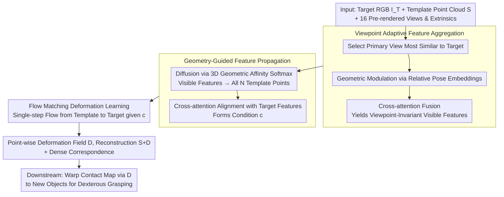

# Geometry-Guided Modeling of Foundation Features Enables Generalizable Object Shape Deformation Learning

**Conference**: ICML 2026  
**arXiv**: [2605.29661](https://arxiv.org/abs/2605.29661)  
**Code**: https://GODeform.github.io/ (Project page, code status to be confirmed)  
**Area**: 3D Vision / Monocular Shape Reconstruction / Category-level Deformation  
**Keywords**: Template Deformation, Foundation Model Features, Geometry-Guided Propagation, Viewpoint Adaptation, Flow Matching

## TL;DR
This paper proposes GODeform, which attaches 2D foundation model (e.g., DINOv3) features onto category template surfaces for geometry-guided propagation and cross-view fusion. It employs Flow Matching to learn a point-wise deformation field from template to target, enabling 3D shape recovery from a single image under large deformations, arbitrary viewpoints, and unseen categories, directly supporting dexterous grasping transfer.

## Background & Motivation

**Background**: Monocular 3D shape recovery follows two main paradigms. One is generative reconstruction (LRM / Wonder3D / Phidias), which seeks high fidelity but relies heavily on the training distribution. The other is the "deformation paradigm," which predicts a deformation field from a category template to the target (ShapeMatcher, KP-RED, etc.), leveraging the template's topology to stabilize geometry in occluded regions.

**Limitations of Prior Work**: Generative methods often "hallucinate" unreasonable geometry in self-occluded areas and are sensitive to viewpoint changes. Deformation-based methods typically use visual encoders trained from scratch on small datasets, resulting in unstable cross-category semantics. When the target and template differ significantly (e.g., four-legged chair $\rightarrow$ sofa, double-layer table $\rightarrow$ single-layer table), the predicted deformation fields suffer from structural degradation and fail to generalize to entirely new categories.

**Key Challenge**: Deformation requires establishing fine point-to-point correspondences between the **3D topology of the template** and the **2D observation of the target**. However, 2D foundation models only provide features on the visible surfaces of images and lack 3D geometric priors. Conversely, 3D foundation models are limited by 3D data scale, showing much weaker generalization than 2D counterparts. Simply combining them leads to semantic correspondence failure due to viewpoint discrepancies.

**Goal**: Design a unified deformation framework that satisfies three generalization axes: large deformation (template/target discrepancy), arbitrary target viewpoints, and unseen object categories, while directly enabling downstream robotic dexterous grasping.

**Key Insight**: The authors bet on "making 2D foundation features geometry-aware." This involves diffusing the strong semantic correspondence from the image domain across the entire surface using the 3D topology of the template, while explicitly distinguishing "viewpoint artifacts" from "true deformation" using camera poses.

**Core Idea**: Reformulate deformation learning as "Flow Matching conditioned on geometry-guided foundation features." Foundation features on visible points are diffused to the entire surface via geometric affinity, and multi-view information is fused into viewpoint-invariant template representations through relative poses.

## Method

### Overall Architecture
GODeform aims to recover 3D shapes from a single target RGB image under large deformations and arbitrary viewpoints across seen and unseen categories. The approach treats "deformation" as a point-wise flow conditioned on geometry-aware foundation features. Inputs consist of a target RGB image $I_{\mathcal{T}}$, a category-level 3D template point cloud $\mathcal{S} \in \mathbb{R}^{N\times 3}$, and 16 pre-rendered views of that template $\{I_{\mathcal{S}}^k\}$ with their extrinsic parameters $\{\mathbf{E}_{\mathcal{S}}^k\}$. The output is a point-wise deformation field $\mathcal{D} \in \mathbb{R}^{N\times 3}$, where the reconstruction $\hat{\mathcal{T}} = \mathcal{S} + \mathcal{D}$ naturally provides dense correspondence between the template and the target.

The transformation follows three steps. First, it selects a primary view from the template's 16 views most semantically similar to the target, then fuses information from other views using relative camera poses to obtain "viewpoint-invariant" visible point features. Second, these features are diffused to all $N$ template points (including back sides and occluded areas) via 3D geometric affinity and aligned with target image features using cross-attention to form the condition $\mathbf{c}$. Finally, a velocity field is learned via Flow Matching, "flowing" template points to target positions. Deformation is modeled as a continuous ODE $d\phi_t/dt = \mathbf{v}_t(\phi_t \mid \mathbf{c})$, where the velocity field $v_\theta$ is supervised along a linear interpolation path $\mathbf{x}_t = (1-t)\mathbf{x}_0 + t\mathbf{x}_1$. Since the linear trajectory implies constant velocity, inference takes a single step at $t=0$ to obtain $\mathcal{D} = v_\theta(\mathcal{S}, 0, \mathbf{c})$ in approximately 0.67s.

### Key Designs

**1. Viewpoint Adaptive Feature Aggregation: Explicitly Decoupling "Viewpoint Artifacts" from "True Deformation"**

Foundation features change when a 3D structure is viewed from different camera angles. If not addressed, the deformation network might mistake "viewpoint drift" for shape variation. This step selects a primary view $I_{\mathcal{S}}^*$ from $K=16$ template views using cosine similarity in the DINOv3 feature space. It then computes relative camera transformations $\mathbf{P}_{\text{rel}}^k = (\mathbf{E}_{\mathcal{S}}^*)^{-1} \mathbf{E}_{\mathcal{S}}^k$ for all other views, projects the flattened rotation and translation into a pose embedding $\mathbf{e}^k$, and adds this to the corresponding visible point features for "geometric modulation." This explicitly informs the network of the camera angle. Finally, cross-attention merges these into $\tilde{\mathbf{F}}_{\text{partial}}$, ensuring features are encoded independently of viewpoint-induced variance.

**2. Geometry-Guided Feature Propagation: Spreading Front-facing Semantics across the 3D Surface**

The viewpoint-invariant features only cover surfaces visible in the image, leaving the back and occluded regions of the template blank. To avoid unguided deformation in these regions, invisible point features are derived from visible ones. A lightweight 3D encoder computes geometric embeddings $\mathbf{G} \in \mathbb{R}^{N\times d}$ for the full template to measure similarity $S_{ji} = \mathbf{g}_j \cdot \mathbf{g}_i / (\|\mathbf{g}_j\|\|\mathbf{g}_i\|)$. Semantics are then diffused from $M$ visible points $\mathbf{F}_{\text{vis}}$ to all $N$ points via a softmax-weighted sum:

$$\mathbf{f}_j^{\text{complete}} = \sum_i \frac{\exp(S_{ji}/\tau)}{\sum_k \exp(S_{jk}/\tau)}\, \mathbf{f}_i^{\text{vis}}$$

This ensures that geometrically similar points share semantics (e.g., the occluded back of a chair leg inherits features from the visible front). These complete features are then aligned with target features $\mathbf{F}_{\mathcal{T}}$ via cross-attention to form the Flow Matching condition.

**3. Flow Matching Deformation Learning: Continuous Flow vs. One-time Regression**

Direct offset regression can be unstable under large complex deformations. This approach treats deformation as a continuous trajectory from the template to the target distribution conditioned on $\mathbf{c}$. During training, linear interpolation is used between $\mathbf{x}_0 = \mathcal{S}$ and $\mathbf{x}_1 = \mathcal{T}$, supervising the velocity field to align with $\mathbf{u}_t = \mathbf{x}_1 - \mathbf{x}_0$ (Flow Matching loss $\mathcal{L}_{\text{FM}}$). Inference is performed in a single step at $t=0$, which is faster than iterative ODE solvers and more robust to topological differences.

### Loss & Training
The total loss combines multiple geometric regularizations: $\mathcal{L} = \lambda_{\text{FM}}\mathcal{L}_{\text{FM}} + \lambda_{\text{CD}}\mathcal{L}_{\text{CD}} + \lambda_{\text{Lap}}\mathcal{L}_{\text{Lap}} + \lambda_{\text{ARAP}}\mathcal{L}_{\text{ARAP}} + \lambda_{\text{reg}}\mathcal{L}_{\text{reg}} + \lambda_{\text{sil}}\mathcal{L}_{\text{sil}}$. These include Chamfer Distance (CD) for global alignment, Laplacian for local continuity, ARAP (As-Rigid-As-Possible) for local stiffness, and silhouette loss for multi-view consistency. A single model is trained across seven ShapeNetv2 categories.

## Key Experimental Results

### Main Results
Two settings: Retrieved Template (most similar template via DINOv3) vs. Random Template (introduces large deformations).

| Dataset / Setting | Metric | Ours (MV) | KP-RED | ShapeMatcher | Note |
|--------|------|------|----------|----------|------|
| Seen / Retrieved | CD $(10^{-3})$ ↓ | **2.38** | 3.05 | 5.92 | 22% better than KP-RED |
| Seen / Retrieved | S-IoU (%) ↑ | **48.79** | 46.73 | 40.47 | |
| Seen / Random | CD $(10^{-3})$ ↓ | **2.46** | 5.10 | 13.02 | Baseline CD doubles; ours remains stable |
| Seen / Random | S-IoU (%) ↑ | **47.31** | 42.05 | 34.36 | |
| Unseen / Retrieved | CD $(10^{-3})$ ↓ | **3.69** | N/A | N/A | Baselines fail cross-category |
| Unseen / Random | S-IoU (%) ↑ | **52.57** | N/A | N/A | ~52% S-IoU on unseen categories |

In the "Random Template" column, the baseline CD jumps from 3.05 to 5.10, while GODeform shows negligible change (2.38 to 2.46), demonstrating robustness to template selection.

### Ablation Study

| Configuration | CD ($10^{-3}$, Random) | S-IoU (%, Random) | Description |
|------|---------|---------|------|
| Ours (Full) | **2.46** | **47.31** | Full Model |
| w/o FM | 2.74 | 43.57 | Direct regression; CD increases by 11% |
| w/o Prop. | 2.95 | 41.10 | Zero-filling occluded points; largest performance drop |
| w/o PrimSel. | 2.84 | 44.40 | No primary view selection; mean query used |
| w/o PoseAware. | 2.79 | 44.47 | No pose embeddings in view fusion |
| Our-SV | 2.61 | 46.78 | Single primary view only; still outperforms baselines |

### Key Findings
- **Propagation is Essential**: The "w/o Prop." variant drops significantly, indicating that failing to diffuse features to occluded regions forces the network to "blindly guess."
- **Naive Multi-view Fusion is Harmful**: "w/o PrimSel" and "w/o PoseAware" perform worse than the single-view (Our-SV) version. Explicit geometric anchoring is required to benefit from multiple views.
- **Downstream Utility**: Dexterous grasping transfer achieves a 77% success rate on real-world objects (bowl/bottle/mug/lotion pump), validating the engineering value of the dense correspondences.

## Highlights & Insights
- **Explicit Geometry-Awareness**: Instead of implicit feature concatenation, the paper uses a "3D geometric affinity propagation bridge." This allows 2D semantics to be projected onto the full 3D surface without requiring 3D foundation model pre-training.
- **Viewpoint Modulation**: The discovery that "naive fusion is worse than single view" is a counter-intuitive finding that highlights the necessity of explicit pose modulation.
- **Single-step Efficiency**: Using a single-step Flow Matching inference (0.67s) makes the method practical for real-time robotic applications compared to iterative ODE solvers.

## Limitations & Future Work
- **Occlusion Limits**: When critical target features (e.g., a mug handle) are entirely occluded, the model lacks 2D clues, leading to geometric misalignment.
- **Template Dependency**: The method requires a pre-built template pool per category, making it less suitable for "free-form" objects like soft bodies or biological entities.
- **Template Rendering**: Prerendering 16 template views adds offline overhead.
- **Future Directions**: Potential for multi-view target inputs and integration of VLM semantic priors.

## Related Work & Insights
- **vs. ShapeMatcher (CVPR'24)**: ShapeMatcher depends on retrieval quality and is trained per category. GODeform is unified and 81% better in CD under large deformations.
- **vs. KP-RED (2024)**: KP-RED uses sparse keypoints; GODeform uses dense point-level Flow Matching for better detail and does not require GT depth.
- **vs. Generative Models (LRM/Wonder3D)**: Generative models hallucinate missing parts, whereas GODeform guarantees category-level structural reasonableness via template priors.

## Rating
- **Novelty**: ⭐⭐⭐⭐ — Integration of Flow Matching and geometry-guided propagation is effective, though individual components are known.
- **Experimental Thoroughness**: ⭐⭐⭐⭐⭐ — Extensive cross-category testing and real-world robot validation.
- **Writing Quality**: ⭐⭐⭐⭐ — Clear organization, though some loss weights are relegated to the appendix.
- **Value**: ⭐⭐⭐⭐⭐ — High potential for embodied AI pipelines by solving generalization in the deformation paradigm.

<!-- RELATED:START -->

## Related Papers

- [\[CVPR 2026\] SGSoft: Learning Fused Semantic-Geometric Features for 3D Shape Correspondence via Template-Guided Soft Signals](../../CVPR2026/3d_vision/sgsoft_learning_fused_semantic-geometric_features_for_3d_shape_correspondence_vi.md)
- [\[NeurIPS 2025\] Learning Generalizable Shape Completion with SIM(3) Equivariance](../../NeurIPS2025/3d_vision/learning_generalizable_shape_completion_with_sim3_equivariance.md)
- [\[ICML 2026\] FoundObj: Self-supervised Foundation Models as Rewards for Label-free 3D Object Segmentation](foundobj_self-supervised_foundation_models_as_rewards_for_label-free_3d_object_s.md)
- [\[CVPR 2026\] Online3R: Online Learning for Consistent Sequential Reconstruction Based on Geometry Foundation Model](../../CVPR2026/3d_vision/online3r_online_learning_for_consistent_sequential_reconstruction_based_on_geome.md)
- [\[CVPR 2026\] Exploring 6D Object Pose Estimation with Deformation](../../CVPR2026/3d_vision/exploring_6d_object_pose_estimation_with_deformation.md)

<!-- RELATED:END -->
