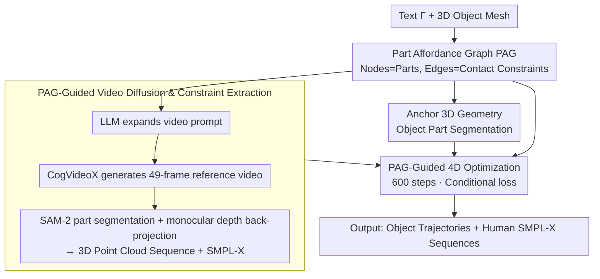

# HOI-PAGE: Zero-Shot Human-Object Interaction Generation with Part Affordance Guidance

**Conference**: ICML 2026  
**arXiv**: [2506.07209](https://arxiv.org/abs/2506.07209)  
**Code**: https://craigleili.github.io/projects/hoipage (Project Page)  
**Area**: 3D Vision / Human-Object Interaction Generation / Video Diffusion  
**Keywords**: 4D HOI, Part-level affordance, Affordance graph, Video diffusion distillation, Zero-shot generation

## TL;DR
HOI-PAGE enables an LLM to first "reason" precisely which body part should contact which object component, encoding this reasoning into a "Part Affordance Graph" (PAG). This PAG then drives 3D part segmentation, video diffusion, and optimization, generating 4D human-object interaction sequences for complex scenarios like "multiple people/single object" or "single person/multiple objects" without any 4D training data.

## Background & Motivation
**Background**: The mainstream approach for 4D Human-Object Interaction (HOI) generation relies on diffusion models (e.g., HOI-Diff, CHOIS), which denoise joint tokens representing the overall motion of the human and object. These methods are trained on ground-truth 4D grasping/carrying datasets like BEHAVE or GRAB, which have limited object vocabularies and primarily cover "single-person, single-object" scenarios.

**Limitations of Prior Work**: Collecting training data is expensive and scarce. When generalizing to new objects (e.g., a guitar or a lawnmower), the human often "floats" near the object, resulting in obvious interpenetration, lack of contact, or misalignment between the action and the text. Scenarios involving multiple people or multiple objects are nearly impossible to handle due to the exponential growth in potential contact relations.

**Key Challenge**: The essence of HOI is not the proximity of the human's centroid to the object's centroid, but rather the fine-grained contact between specific body parts and functional object components (e.g., hands gripping a handle, feet on a pedal). Global pose-level modeling discards this part-level semantic layer; models fail to learn it without data and merely memorize distributions rather than reasoning when data is available.

**Goal**: To generate 4D sequences starting from a single text prompt and several 3D objects without relying on any 4D HOI training data. These sequences should explicitly model part-level affordances (e.g., "which hand holds which handle") and scale to multi-person/multi-object scenes.

**Key Insight**: LLMs already possess commonsense knowledge about daily interactions (e.g., which hand holds the base and which hand presses the surface when ironing clothes). By explicitly grounding this "interaction script" from the linguistic space into a graph structure—and then mapping it to 3D geometry, video, and optimization—the burden of vision-motion generation can be distributed among existing strong prior components.

**Core Idea**: Use an LLM to infer a **Part Affordance Graph (PAG)** as the script for the entire pipeline. Nodes represent parts, and edges represent contact constraints. The PAG unifiedly directs 3D object part segmentation, video diffusion prompts, and the contact/penetration/smoothness terms in the 4D optimization loss.

## Method

### Overall Architecture
HOI-PAGE aims to generate 4D sequences with fine-grained part-level interactions—such as "which hand grips which handle"—starting from a text prompt $\Gamma$ and 3D object meshes $\{O\}$, without any 4D HOI ground-truth data. The strategic approach avoids solving the entire problem end-to-end with a single model. Instead, it decomposes "commonsense scripts," "visual motion," and "geometric precision" into three components where each excels, linked by a unified graph.

The pipeline begins with a text prompt $\Gamma$ (e.g., "A person ironing clothes on an ironing board") and 3D meshes $\{O\}$. An LLM first reasons a **Part Affordance Graph (PAG)**, where nodes represent parts and edges represent contact constraints, including whether contact is persistent and whether the object moves. This graph then guides three parallel paths: anchoring to 3D geometry for part segmentation, expanding into prompts for video diffusion to generate reference videos, and acting as hard constraints for the final optimization. Video diffusion handles "how the person and object roughly move," while monocular depth and human recovery parse the video into 2D/3D point clouds and SMPL-X sequences. Finally, 600 steps of gradient descent "calibrate" the object poses under PAG constraints. The output consists of object trajectories $\{(R_t, t_t)\}_{t=1}^{T}$ ($T=49$ frames) and human SMPL-X parameters $\{\Theta_t\}_{t=1}^{T}$. Notably, **only the final optimization step is tunable; the LLM, video diffusion, depth estimation, human recovery, and SAM-2 are all frozen**, which is the core of its "zero-shot" nature.

### Key Designs

**1. Part Affordance Graph (PAG): Decoupling HOI Semantic Constraints for LLM Reasoning**

The primary difficulty in HOI generation is that it consists of discrete part-level constraints (e.g., hand on handle, foot on pedal) rather than pose-level distributions. PAG explicitly encodes these constraints into a graph $G=(V,E)$ as the unified control signal. Nodes $V=V_o \cup V_h$ include object parts and 12 human part categories. Each object/person is assigned a virtual parent node $v$ with motion states $(a_r, a_\tau)$ indicating whether it rotates or translates. Each edge $e=(v_1,v_2)$ represents a part-level contact with two attributes: $a_c$ (whether contact is **persistent**) and $a_s$ (whether contact is **relatively static**, e.g., hand holding a handle vs. an iron sliding on a board). The graph is generated by an LLM (DeepSeek series) via in-context reasoning.

This design decouples "commonsense reasoning" from "geometric execution." The problem of learning interactions without 4D data is transformed into a geometric optimization problem constrained by a graph. Furthermore, the graph structure is naturally scalable to multi-person/multi-object scenes by simply adding nodes and edges.

**2. PAG-Guided Video Diffusion and Constraint Extraction: Using Diffusion for Motion Priors**

To determine the rough motion of humans and objects, the system leverages video diffusion. An LLM expands the original text $\Gamma$ into a detailed video prompt $\Gamma^+$ (e.g., "right hand holds the handle tightly, left hand presses the surface") based on PAG edges. CogVideoX then generates a 49-frame reference video. FLUX is used to generate five initial frame candidates, from which GPT-4o selects the most anatomically plausible one as an anchor. After generation, open-vocabulary detection and SAM-2 are used for part-level segmentation. These masks are back-projected into 3D part point clouds using monocular depth estimation, and human SMPL-X sequences $\{\Theta_t\}$ are extracted.

Crucially, the extracted human motion is "isolated," object poses are not yet solved, and the video's geometric precision is insufficient. Thus, the video serves as a "soft reference" for motion, while the final "pinning" of object poses is left to the hard constraints of the PAG during optimization.

**3. PAG-Guided 4D Optimization: Lifting Video to 4D with Conditional Losses**

The final step solves for object trajectories $\{(R_t, t_t)\}_{t=1}^{T}$ to fit 2D/3D observations from the video while satisfying PAG contact constraints, avoiding interpenetration, and maintaining temporal smoothness. This is achieved via a weighted sum of four loss terms:

$$L_{\text{total}} = \lambda_{\text{fit}} L_{\text{fit}} + \lambda_{\text{con}} L_{\text{con}} + \lambda_{\text{pen}} L_{\text{pen}} + \lambda_{\text{smo}} L_{\text{smo}}$$

$L_{\text{fit}}$ measuresChamfer distance at both object and part levels in 2D and 3D. The contact term $L_{\text{con}} = L_{cc} + L_{cd}$ handles persistence: if $a_c=\text{true}$, it averages nearest neighbors across all frames; if $a_c=\text{false}$, it uses the minimum across frames. The contact dynamics term $L_{cd}$ penalizes relative displacement if $a_s=\text{true}$ and encourages smooth changes via $L_2\big(P_t^{v_2 \to v_1}, \tfrac{1}{2}(P_{t-1}^{v_2 \to v_1}+P_{t+1}^{v_2 \to v_1})\big)$ if $a_s=\text{false}$. $L_{\text{pen}}$ uses pre-computed SDFs to penalize human vertices entering objects. $L_{\text{smo}}$ toggles between spherical linear interpolation and penalizing all changes based on $(a_r, a_\tau)$.

The PAG's power lies in "loss conditioning by edge/node": the same code handles "persistent grip" vs. "momentary touch" or "static object" vs. "moving object" simply by switching four boolean attributes. Optimization runs for 600 steps with four gravity-aligned initial rotations to avoid local minima in Chamfer distance.

### Loss & Training
**No model training is performed**. Only the object poses are optimized in the final stage. The LLM, CogVideoX, depth estimation, human recovery, and SAM-2 are all frozen. Optimization selects the best result from four random initializations. CogVideoX uses 50 denoising steps for 49 frames. $\lambda$ weights are empirically determined.

## Key Experimental Results

### Main Results
A self-constructed Sketchfab dataset was used (24 objects, 16 single-person prompts, 5 multi-person/multi-object prompts) for comparison with HOI-Diff and CHOIS.

| Metric | HOI-Diff | CHOIS | HOI-PAGE |
|------|---------|-------|----------|
| VideoCLIP ↑ (Semantics) | 0.233 | 0.239 | **0.250** |
| Obj Smoothness ↓ | 0.035 | 0.009 | **0.006** |
| Obj Diversity ↑ | 0.72 | 0.49 | **0.80** |
| Non-collision ↑ | 0.98 | 0.98 | **0.99** |
| Contact ↑ | 0.76 | 0.64 | **0.92** |

Perceptual evaluation shows HOI-PAGE defeating baselines with 91%–99% binary preference. In 1-5 rating, HOI-PAGE scored ~4.0 (Realism: 3.97, Text Matching: 4.07), while baselines scored $\leq 1.9$.

### Ablation Study

| Configuration | VideoCLIP ↑ | Smoothness ↓ | Diversity ↑ | Contact ↑ | Notes |
|------|-----|-----|-----|-----|-----|
| Full | 0.290 | 0.004 | 0.83 | 0.76 | Baseline |
| w/o Part Fit (PF) | 0.290 | 0.004 | 0.81 | 0.76 | Coarser poses |
| w/o Part Contact (PC) | 0.289 | 0.011 | 0.71 | **0.26** | Contact failure |
| w/o Obj Motion State (OMS) | 0.290 | 0.006 | 0.78 | 0.73 | Unexpected motion |

### Key Findings
- **Removing PC results in Contact dropping from 0.76 to 0.26**: This indicates that the LLM-inferred contact graph is critical; geometric loss alone cannot enforce semantic constraints like "hand must grip handle."
- **HOI-Diff has smoother human motion (0.007) but lowest diversity (0.35)**: This reveals over-fitting in supervised models—they memorize training distributions rather than generating diverse, realistic actions.
- **Zero-shot outperforms supervised**: HOI-PAGE surpasses both baselines trained on 4D ground truth across all dimensions. This is particularly evident for unseen objects (e.g., lawnmowers), which are absent from baseline training sets.
- **Scaling to multi-scenarios is cost-free**: Performance remains stable (Single: 4.0, Multi-human: 4.17, Multi-object: 4.46) by simply updating the PAG nodes/edges without algorithm changes.

## Highlights & Insights
- **Using an LLM as a "Director" rather than a "Writer"**: Generating a structured constraint graph (nodes + edges + attributes) rather than a long prompt allows vision/geometry modules to execute constraints strictly, bypassing LLM/VLM hallucination issues.
- **The "Conditional Loss" via PAG is elegant**: A unified implementation handles eight loss modes through four boolean attributes, avoiding specialized pipelines for different interactions.
- **Complementarity of vision and geometry**: HOI-PAGE compensates for the geometric inaccuracy of video models and the semantic weakness of geometric models by assigning tasks to the most suitable components (LLM for script, Diffusion for motion, SDF for precision).

## Limitations & Future Work
- Optimization relies heavily on video diffusion quality; complex backgrounds or large camera movements can lead to failures in geometry extraction.
- Point clouds derived from monocular depth are noisy. Object poses are dominated by Chamfer fitting, which may be unreliable for small/thin objects (e.g., forks, pens).
- LLM attribute generation (e.g., "persistent contact") depends on prompt engineering.
- Efficiency: 6-10 minutes per optimization (with 4 initializations) is not real-time. Extensions to very long sequences or high-intensity actions (jumping, rolling) are unverified.

## Related Work & Insights
- **vs. HOI-Diff / CHOIS**: These learn joint human-object pose distributions end-to-end and depend on 4D data. HOI-PAGE decouples semantics (LLM) from geometry (optimization), outperforming them zero-shot.
- **vs. ZeroHSI / ZeroHOI / DAViD**: While these are also zero-shot and use video diffusion, they treat humans and objects as global entities. HOI-PAGE is the first to introduce explicit part-level graph structures for multi-HOI scalability.
- **vs. PiGraphs / iMapper**: PiGraphs used "interaction graphs" for static synthesis. HOI-PAGE evolves this into the 4D/Video diffusion era using LLMs for reasoning.

## Rating
- Novelty: ⭐⭐⭐⭐ Driving geometric optimization via LLM-inferred graph structures is a clear and effective departure from joint denoising.
- Experimental Thoroughness: ⭐⭐⭐ Comprehensive comparisons and ablations, though lack of standard 4D benchmarks (BEHAVE/GRAB) is a slight drawback.
- Writing Quality: ⭐⭐⭐⭐ Clear staged methodology and well-defined PAG attributes.
- Value: ⭐⭐⭐⭐ The "zero 4D data + scalability" approach provides significant progress for the HOI generation community.

<!-- RELATED:START -->

## Related Papers

- [\[AAAI 2026\] AnchorHOI: Zero-shot Generation of 4D Human-Object Interaction via Anchor-based Prior Distillation](../../AAAI2026/3d_vision/anchorhoi_zero-shot_generation_of_4d_human-object_interactio.md)
- [\[CVPR 2026\] ReGenHOI: Unifying Reconstruction and Generation for 3D Human-Object Interaction Understanding](../../CVPR2026/3d_vision/regenhoi_unifying_reconstruction_and_generation_for_3d_human-object_interaction_.md)
- [\[CVPR 2026\] HandDreamer: Zero-Shot Text to 3D Hand Model Generation using Corrective Hand Shape Guidance](../../CVPR2026/3d_vision/handdreamer_zero-shot_text_to_3d_hand_model_generation_using_corrective_hand_sha.md)
- [\[CVPR 2026\] CARI4D: Category Agnostic 4D Reconstruction of Human-Object Interaction](../../CVPR2026/3d_vision/cari4d_category_agnostic_4d_reconstruction_of_human_object_interaction.md)
- [\[ECCV 2024\] Zero-Shot Multi-Object Scene Completion](../../ECCV2024/3d_vision/zero-shot_multi-object_scene_completion.md)

<!-- RELATED:END -->
