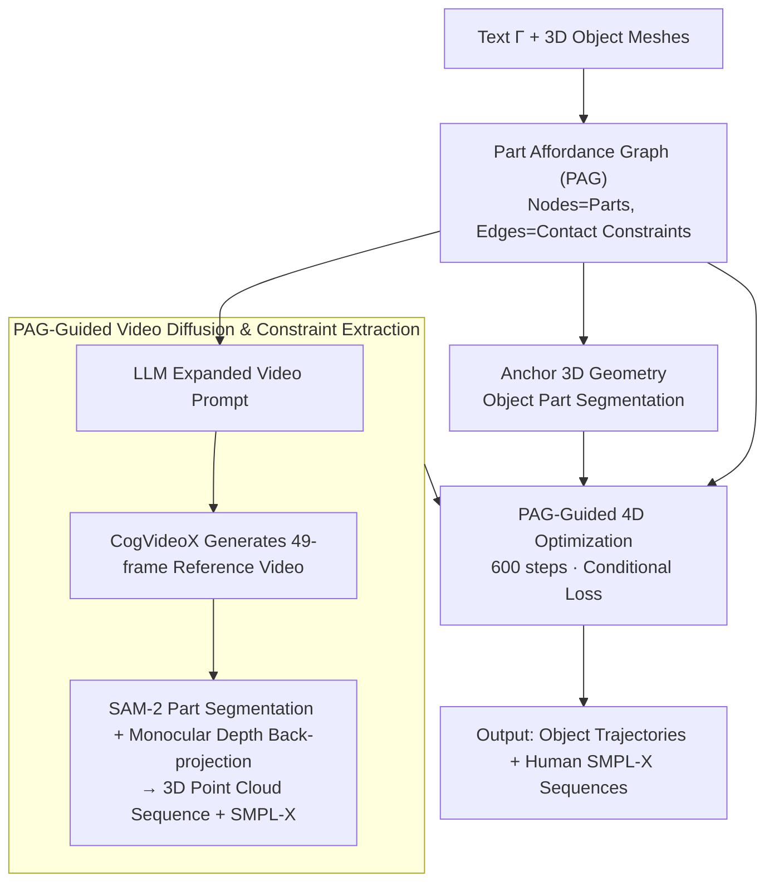

# HOI-PAGE: Zero-Shot Human-Object Interaction Generation with Part Affordance Guidance

**Conference**: ICML 2026  
**arXiv**: [2506.07209](https://arxiv.org/abs/2506.07209)  
**Code**: https://craigleili.github.io/projects/hoipage (Project Homepage)  
**Area**: 3D Vision / Human-Object Interaction Generation / Video Diffusion  
**Keywords**: 4D HOI, part-level affordance, affordance graph, video diffusion distillation, zero-shot generation

## TL;DR
HOI-PAGE enables LLMs to first "reason" about which specific body parts should contact which object parts, formalizing the reasoning results into a "Part Affordance Graph" (PAG). This graph then drives 3D part segmentation, video diffusion, and optimization-based solving, allowing for the generation of 4D human-object interaction sequences in zero-shot scenarios (zero 4D training data) that handle complex cases such as "multiple-person single-object" or "single-person multiple-objects."

## Background & Motivation
**Background**: The mainstream approach for 4D Human-Object Interaction (HOI) generation involves diffusion models (e.g., HOI-Diff, CHOIS) that denoise joint tokens of combined body and object motions. These methods rely on ground-truth 4D grasping/carrying data like BEHAVE or GRAB for training, resulting in narrow object vocabularies that primarily cover "single-person single-object" scenes.

**Limitations of Prior Work**: 4D training data collection is expensive and scarce. When generalizing to new objects (e.g., guitars, lawnmowers), humans often "float near the object," leading to obvious interpenetration, lack of contact, or misalignment between actions and text. Scenarios involving multiple persons or objects are nearly impossible to handle due to the exponential growth in interaction relations.

**Key Challenge**: The essence of HOI is not the "proximity of human centroid to object centroid," but rather fine-grained contact between "specific body parts ↔ specific functional object parts" (e.g., hand gripping a handle, foot pressing a pedal). Modeling at the global pose level loses this part-level semantics, making it impossible to learn without data and resulting in memorization of distributions rather than reasoning even when data exists.

**Goal**: To generate 4D sequences starting from a text prompt and several 3D objects without relying on any 4D HOI training data. These sequences should explicitly model part-level affordances (e.g., "which hand holds which handle") and scale to multiple-person/multiple-object scenes.

**Key Insight**: LLMs already possess common-sense knowledge regarding daily interactions (e.g., which hand holds the iron’s plate and which hand presses the surface). By grounding this "interaction script" from the linguistic space into a graph structure—mapped to 3D geometry, video, and optimization—the burden of vision-to-motion generation can be distributed across "existing strong prior components."

**Core Idea**: An LLM reasons a **Part Affordance Graph (PAG)** as the script for the entire pipeline—nodes represent parts and edges represent contact constraints. The PAG then directs 3D object part segmentation, video diffusion prompts, and various contact/penetration/smoothness losses in 4D optimization.

## Method

### Overall Architecture
HOI-PAGE addresses the generation of 4D sequences with fine-grained interactions (e.g., "which hand holds which handle") from text $\Gamma$ and 3D meshes $\{O\}$ without any ground-truth 4D HOI data. The approach avoids solving everything end-to-end with a single model. Instead, it decomposes the problem into "common-sense script—visual motion—geometric precision," tasks assigned to components best suited for them, all unified by a graph.

The pipeline starts with text $\Gamma$ (e.g., "a person ironing clothes on an ironing board") and 3D meshes $\{O\}$. An LLM first reasons a **Part Affordance Graph (PAG)**, defining node-to-node contacts, contact duration, and object mobility. This graph is then used for three parallel tasks: anchoring to 3D geometry for part segmentation, expanding into prompts for video diffusion to generate reference videos, and serving as hard constraints for the final optimization step. Video diffusion provides the "rough motion." Monocular depth and human recovery segment the video into 2D/3D point clouds and SMPL-X sequences. Finally, 600 steps of gradient descent "correct" the object poses under PAG constraints. The output consists of object trajectories $\{(R_t, t_t)\}_{t=1}^{T}$ ($T=49$ frames) and human SMPL-X parameters $\{\Theta_t\}_{t=1}^{T}$. Notably, **only the final optimization step is tunable; the LLM, video diffusion, depth estimation, human recovery, and SAM-2 are all frozen**, which characterizes its "zero-shot" nature.

### Key Designs

**1. Part Affordance Graph (PAG): Decoupling HOI Semantic Constraints to LLM Reasoning**

The difficulty of HOI generation lies in the fact that its essence is a set of discrete part-level constraints (hand-holding-handle) rather than pose-level distributions. The PAG explicitly encodes these constraints as a graph $G=(V,E)$, serving as a unified control signal. Nodes $V=V_o \cup V_h$ include object parts and 12 types of human parts (hands, feet, hips, etc.). Each object/person is attached to a virtual parent node $v$ with motion states $(a_r, a_\tau)$ marking whether it rotates or translates. Each edge $e=(v_1,v_2)$ represents a contact with two attributes: $a_c$ (whether contact is **persistent**) and $a_s$ (whether the contact is **relatively static**, e.g., hand holding handle vs. iron sliding on a board). The graph is generated via in-context reasoning using an LLM (DeepSeek).

This design decouples "common-sense reasoning" from "geometric execution." The problem of needing 4D data is transformed into a geometric optimization problem under graph constraints. Furthermore, this structure naturally scales; multi-person/multi-object scenes are handled by simply adding nodes and edges without changing the pipeline.

**2. PAG-Guided Video Diffusion & Constraint Extraction: Diffusion for Motion as a Soft Reference**

To provide motion cues, the LLM expands text $\Gamma$ into a detailed video prompt $\Gamma^+$ (e.g., "right hand tightly grips handle") based on PAG edges, which is fed into CogVideoX. FLUX generates candidate first frames, GPT-4.1 selects the most anatomically plausible one as an anchor, and a 49-frame video is diffused. Post-generation, open-vocabulary detection and SAM-2 segment the video by PAG part names. Monocular depth estimation (Wang et al. 2024) back-projects masks into 3D part point cloud sequences, while SMPL-X sequences $\{\Theta_t\}$ are extracted (Shen et al. 2024).

Crucially, the extracted human motion is "isolated" and the object poses are not yet solved; the video's geometric precision is insufficient. Thus, the video serves as a "soft reference" for motion, while the final alignment is performed in the optimization stage. This division of labor avoids the geometric inaccuracies of video models and the semantic limitations of geometric-only models.

**3. PAG-Guided 4D Optimization: "Lifting" Video to 4D with Conditional Losses**

The final step solves for object trajectories $\{(R_t, t_t)\}_{t=1}^{T}$ to fit 2D/3D observations, satisfy PAG contact constraints, avoid human interpenetration, and maintain temporal smoothness. This is achieved via a weighted sum of four loss terms:

$$L_{\text{total}} = \lambda_{\text{fit}} L_{\text{fit}} + \lambda_{\text{con}} L_{\text{con}} + \lambda_{\text{pen}} L_{\text{pen}} + \lambda_{\text{smo}} L_{\text{smo}}$$

Where $L_{\text{fit}}$ covers 2D+3D Chamfer distance for object/part levels. The contact term $L_{\text{con}} = L_{cc} + L_{cd}$ uses $L_{cc}$ to average nearest-neighbor distances across all frames if $a_c=\text{true}$, or only at the minimum frame if $a_c=\text{false}$. The contact dynamics $L_{cd}$ penalizes relative displacement if $a_s=\text{true}$, or encourages smooth variation via $L_2\big(P_t^{v_2 \to v_1}, \tfrac{1}{2}(P_{t-1}^{v_2 \to v_1}+P_{t+1}^{v_2 \to v_1})\big)$ if $a_s=\text{false}$. $L_{\text{pen}}$ uses pre-computed SDFs to penalize body vertices entering objects, and $L_{\text{smo}}$ switches between spherical linear interpolation (Slerp) and rigid immobility based on $(a_r, a_\tau)$ in the PAG.

The PAG ensures all losses are "conditionalized by edges/nodes"—the same code handles "persistent grip" and "brief touch" by switching boolean attributes. Optimization runs for 600 steps with 4 different initial rotations around the gravity axis to avoid local minima.

### Loss & Training
The entire process involves **no model training**. Only the object poses are optimized in the final step. All components (LLM, Video Diffusion, Depth, etc.) are frozen. Optimization uses the best result from 4 random initializations; CogVideoX uses 50 denoising steps; $\lambda$ weights are empirically set.

## Key Experimental Results

### Main Results
The authors constructed a Sketchfab dataset (24 daily 3D objects, 16 single-person prompts, 5 multi-person/multi-object prompts) and compared HOI-PAGE with HOI-Diff and CHOIS, which are trained on 4D ground truth.

| Metric | HOI-Diff | CHOIS | HOI-PAGE |
|------|---------|-------|----------|
| VideoCLIP ↑ (Semantics) | 0.233 | 0.239 | **0.250** |
| Obj. Smoothness ↓ | 0.035 | 0.009 | **0.006** |
| Obj. Diversity ↑ | 0.72 | 0.49 | **0.80** |
| Non-collision ↑ | 0.98 | 0.98 | **0.99** |
| Contact ↑ | 0.76 | 0.64 | **0.92** |

In perceptual evaluations, HOI-PAGE outperformed both baselines with 91%–99% binary preference. On a 1-5 scale, HOI-PAGE achieved ~4.0 (Realism: 3.97, Text Matching: 4.07), while baselines scored ≤ 1.9.

### Ablation Study

| Configuration | VideoCLIP ↑ | Smoothness ↓ | Diversity ↑ | Contact ↑ | Notes |
|------|-----|-----|-----|-----|-----|
| Full | 0.290 | 0.004 | 0.83 | 0.76 | Complete PAG constraints |
| w/o Part Fitting (PF) | 0.290 | 0.004 | 0.81 | 0.76 | Coarser object poses |
| w/o Part Contact (PC) | 0.289 | 0.011 | 0.71 | **0.26** | Contact failure, jitter |
| w/o Obj. Motion State (OMS) | 0.290 | 0.006 | 0.78 | 0.73 | Motion in static phases |

### Key Findings
- **Contact score dropped from 0.76 to 0.26 without PC**: This shows the LLM-reasoned contact graph is the lifeline of the pipeline; geometric loss alone cannot enforce "holding a handle" semantics.
- **HOI-Diff has smoother human motion (0.007) but lowest diversity (0.35)**: This reveals overfitting in supervised models—memorizing training distributions rather than generating diverse actions.
- **Zero-shot outperforms supervised**: HOI-PAGE consistently beats baselines trained on 4D ground truth across almost all dimensions. This is particularly evident for unseen objects (e.g., lawnmower), which baselines fail to generalize to.
- **Scalability is "free"**: Scores for single-person (4.0), multi-person (4.17), and multi-object (4.46) remain stable or improve by simply adding nodes to the graph.

## Highlights & Insights
- **Using LLM as "Director" rather than "Writer"**: Allowing the LLM to output a structured constraint graph (nodes/edges/attributes) rather than just long prompts enables rigid execution by vision/geometry modules, bypassing LLM/VLM hallucination issues.
- **Elegant Unified Loss via PAG**: The conditional loss design uses $a_c/a_s/a_r/a_\tau$ to toggle eight loss modes. This engineering efficiency avoids writing separate pipelines for different interactions.
- **Complementary Weaknesses**: HOI-PAGE recognizes that video diffusion is geometrically weak while geometric priors are semantically weak. By partitioning tasks—Semantic script (LLM), Visual motion (Diffusion), Geometric precision (SDF Optimization)—it serves as a paradigm for modular zero-shot pipelines.

## Limitations & Future Work
- Optimization relies on video quality; complex backgrounds or significant camera motion can cause geometric extraction to fail.
- Point clouds from monocular depth are noisy. Object poses are dominated by Chamfer fitting, which might be unreliable for small/thin objects (e.g., forks) not featured in the current dataset.
- The accuracy of PAG attributes depends on prompt engineering; while DeepSeek was used, VLM stability remains a concern.
- Optimization time (6-10 mins) and multiple initializations are not suitable for real-time. Extension to long sequences or extreme motions (jumping/tumbling) is unverified.

## Related Work & Insights
- **vs HOI-Diff / CHOIS**: They learn joint distributions end-to-end and require 4D data. HOI-PAGE outperforms them zero-shot by separating semantics and geometry.
- **vs ZeroHSI / ZeroHOI / DAViD**: While these are also zero-shot and use video diffusion, they treat humans/objects as monolithic entities. HOI-PAGE is the first to introduce explicit part-level graph structures and scale to multi-agent/multi-object scenes.
- **vs PiGraphs / iMapper**: PiGraphs used "interaction graphs" for static scenes. HOI-PAGE adapts this to the 4D/Video Diffusion era, using LLMs to reason the graph structure to bypass data dependencies.

## Rating
- Novelty: ⭐⭐⭐⭐ Formulating LLM reasoning into an explicit graph to drive geometric optimization is a clear, differentiated approach (part-level vs. global-level).
- Experimental Thoroughness: ⭐⭐⭐ Comprehensive comparisons/ablations, though benchmarks are self-constructed and multi-agent experiments are small-scale.
- Writing Quality: ⭐⭐⭐⭐ Clear stage-wise methodology and well-explained conditional losses.
- Value: ⭐⭐⭐⭐ Significant for the HOI generation community due to zero-data requirement and scalability.

<!-- RELATED:START -->

## Related Papers

- [\[AAAI 2026\] AnchorHOI: Zero-shot Generation of 4D Human-Object Interaction via Anchor-based Prior Distillation](../../AAAI2026/3d_vision/anchorhoi_zero-shot_generation_of_4d_human-object_interactio.md)
- [\[CVPR 2026\] HandDreamer: Zero-Shot Text to 3D Hand Model Generation using Corrective Hand Shape Guidance](../../CVPR2026/3d_vision/handdreamer_zero-shot_text_to_3d_hand_model_generation_using_corrective_hand_sha.md)
- [\[CVPR 2026\] CARI4D: Category Agnostic 4D Reconstruction of Human-Object Interaction](../../CVPR2026/3d_vision/cari4d_category_agnostic_4d_reconstruction_of_human_object_interaction.md)
- [\[ECCV 2024\] Zero-Shot Multi-Object Scene Completion](../../ECCV2024/3d_vision/zero-shot_multi-object_scene_completion.md)
- [\[CVPR 2026\] Zoo3D: Zero-Shot 3D Object Detection at Scene Level](../../CVPR2026/3d_vision/zoo3d_zero-shot_3d_object_detection_at_scene_level.md)

<!-- RELATED:END -->
