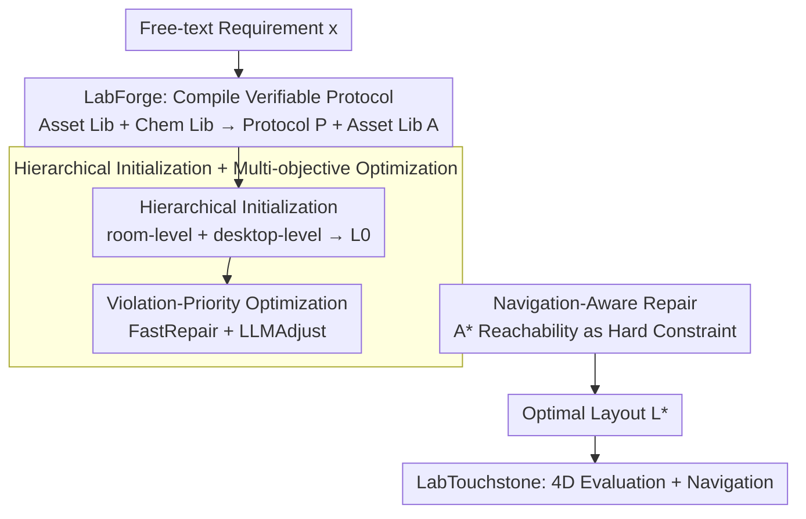

# LabBuilder: Protocol-Grounded 3D Layout Generation for Interactable and Safe Laboratory

**Conference**: ICML 2026  
**arXiv**: [2605.02288](https://arxiv.org/abs/2605.02288)  
**Code**: None  
**Area**: 3D Vision / Embodied Environment Generation  
**Keywords**: Lab Scene Generation, Protocol Grounding, Chemical Safety, Navigation Reachability, Hierarchical Layout

## TL;DR
LabBuilder compiles free-text experimental descriptions into "Asset-Chemical Protocols," and subsequently utilizes hierarchical generation + geometric/chemical multi-objective optimization + navigation repair to produce 3D chemistry laboratory layouts that are both visually plausible and executable for robotic experimental workflows.

## Background & Motivation
**Background**: 3D indoor scene generation primarily serves domestic environments, relying on datasets like 3D-FRONT. The goal is "visual plausibility"—ensuring no geometric intersections and reasonable furniture color coordination. Recent works have utilized LLMs as layout planners, transforming language descriptions into interactive scenes via a Text → Structured JSON → Rendering pipeline.

**Limitations of Prior Work**: Directly applying these methods to chemistry laboratories leads to failure. In domestic scenes, chairs and tables only need to "fit and not overlap." Conversely, laboratory entities like fume hoods, alcohol lamps, flammable reagents, and glassware possess **protocol-level semantics**: chemicals must be arranged by reaction type, flammables must be distant from heat sources, glassware cannot be near table edges, and robot arms must reach targets. Domestic generators treat reagent bottles as decorations, lacking knowledge of chemical properties and failing to verify whether a robot can navigate from workstation A to fume hood B.

**Key Challenge**: Existing methods only constrain "static geometric validity + visual plausibility" during generation, leaving executability and safety for post-hoc evaluation. In a laboratory, executability is the design constraint itself—a minor geometric shift (e.g., moving an alcohol lamp 20 cm) can invalidate the experimental protocol or trigger safety incidents.

**Goal**: Given a free-text experimental requirement (e.g., "Set up an SN2 substitution reaction"), automatically generate a 3D lab layout where: (i) all assets required by the protocol are instantiated; (ii) layouts are geometrically conflict-free and compliant with wall placement; (iii) chemical safety constraints are satisfied; (iv) robots can reach required equipment station-by-station according to protocol steps.

**Key Insight**: The authors reformulate scene generation as "protocol-grounded constraint optimization." By using LLMs + knowledge bases to compile free-text into machine-verifiable structured protocols, the protocol directly drives layout search and repair, moving executability from post-hoc evaluation to the front-end generation loop.

**Core Idea**: Utilizing "Asset Knowledge Bases + Chemical Knowledge Bases" as priors, experimental requirements are compiled into schema-based protocols. A three-stage closed-loop process—hierarchical initialization + violation-priority local search (geometric/chemical) + navigation reachability repair—is then used to generate the laboratory.

## Method

### Overall Architecture
LabBuilder aims to transform a single free-text experimental requirement into a 3D laboratory where robots can truly execute tasks. The process is broken down into a compile-generate-evaluate pipeline: the front-end **LabForge** compiles free-text and heterogeneous assets into a structured protocol $\mathcal{P}$ and an asset library $\mathcal{A}$; the intermediate **LabGen** performs hierarchical initialization to obtain a candidate layout $\mathcal{L}_0$, followed by joint geometric-chemical optimization $\Phi$, and finally navigation-aware repair $\Upsilon$ to converge to the optimal layout $\mathcal{L}^\star$; the back-end **LabTouchstone** scores the layout across four dimensions (geometric compliance, feasibility FSR, chemical safety, semantic rationality) and performs point-goal navigation evaluation. The pipeline succeeds because the protocol $\mathcal{P}$ serves a dual role—it is both the "target specification" for asset placement and the "constraint template" for identifying violations.

### Key Designs

**1. LabForge: Compiling free-text into verifiable protocols to drive layout**

The pain point is that LLMs emitting "positioning JSON" directly often cause physical conflicts and lack chemical safety semantics—they treat reagents as decorations. LabForge constructs an intermediate representation by building an asset annotation library of 176 laboratory entities (with geometric, semantic, and safety attributes) and an experimental library covering 7 reaction types (substitution, protection/deprotection, condensation, cyclization, redox, functional group transformation, alkylation/acylation). Given requirement $x$ and knowledge base context $\mathcal{C}$, the LLM performs Retrieval-Augmented Generation (RAG) to produce a protocol $\mathcal{P}$ with strict schema and normalized asset references. It then performs constraint checking against asset library $\mathcal{A}$ to ensure all references are groundable. This acts as a schema validator for the generator, preventing hallucinated assets or missing instruments. Statistically, each protocol contains an average of 5.27 reagents, 9.87 instruments, 9.00 operational steps, and 4.30 navigations, providing sufficient complexity for constraints.

**2. Hierarchical Initialization + Multi-objective Optimization: Managing combinatorial search scale**

The continuous configuration space of a laboratory is massive; a single LLM pass for an entire room would fail. LabGen decomposes the layout into two granularities: room-level, which determines functional areas and 6-DoF poses for large equipment $(\mathcal{R}, \pi) \sim p_\theta(\cdot \mid x, \mathcal{P}, \mathcal{A})$, and desktop-level, which determines the placement of small instruments and reagents on each bench $\mathcal{D}_s \sim p_\theta(\cdot \mid \cdot, s, \mathcal{R}, \pi)$. Merging these gives the initial layout $\mathcal{L}_0$. The optimization target rewards both geometric validity and chemical safety:

$$\mathbb{F} = w_{\text{geo}} f_{\text{geo}} + w_{\text{chem}} f_{\text{chem}}$$

The core of the search is the **violation-priority** acceptance criterion—it first compares the number of hard-constraint violations $v(\mathcal{L})$. The one with fewer violations wins; semantic scores $\mathbb{F}$ are only compared if violations are tied. This pushes the search to eliminate "illegal geometry" first before pursuing better safety ratings, avoiding oscillation in invalid solution spaces. The repair operator $\Phi$ follows two paths: FastRepair handles simple geometric conflicts algorithmically (cheap), while LLMAdjust is called only for tasks requiring semantic reasoning (e.g., "move acetone into the fume hood"). Optimization converges to a local optimum at the room-level before refining at the desktop-level, with each level managing only $O(10)$ objects.

**3. Navigation-Aware Repair: Robot reachability as a hard constraint**

Physically valid layouts might still trap a robot between two workstations. LabGen integrates reachability directly into the generation loop by projecting the 3D scene into a 2D occupancy grid, dilating it by the robot's radius, and planning paths for every (start, goal) pair in the protocol via $A^\star$. Planning failures are categorized into three types—endpoint occupied, out of room boundaries, or topologically disconnected—and mapped to a binary indicator $f_{\text{reach}} \in \{0, 1\}$. If $f_{\text{reach}} = 0$, the repair operator $\mathcal{L}_{t+1} = \Upsilon(\mathcal{L}_t, \mathcal{P}, \mathcal{A})$ is iteratively called to move obstacles or adjust functional zones until all step-to-step transitions in the protocol have collision-free paths.

### Loss & Training
LabBuilder is a search-and-verify pipeline rather than a trainable model and does not use gradient-based training. The final layout is derived through constraint optimization:

$$\mathcal{L}^\star = \arg\max_\mathcal{L} \mathbb{F}(\mathcal{L}, \mathcal{P}, \mathcal{A})$$

where $f_{\text{geo}}$ encodes asset-level geometric constraints and $f_{\text{chem}}$ is derived from protocol hazard annotations. The set of hard constraints includes flammable isolation, reagent storage, incompatible chemical separation, and glassware distance from table edges.

## Key Experimental Results

### Main Results
Comparison with Holodeck and SceneWeaver across 30 real chemistry experiments (Table 2):

| Method | OB↓ | CN↓ | Asset↑ | Nav↑ | Flam.↑ | Lay↑ |
|------|-----|-----|--------|------|--------|------|
| Holodeck | 10.8 | 0.20 | 0.700 | – | 0.239 | 5.61 |
| SceneWeaver | 5.61 | 0.35 | 0.226 | – | 0.097 | 4.57 |
| **LabBuilder** | **0.07** | **0.17** | **0.833** | **0.966** | **0.725** | **9.00** |

Boundary violations (OB) are nearly zeroed, chemical safety and asset availability significantly lead, and LLM semantic rating (Lay) reaches 9/10.

### Ablation Study

| Configuration | OB↓ | CN↓ | Asset↑ | Nav↑ | Flam.↑ |
|------|-----|-----|--------|------|--------|
| Ours (w/o annotation) | 0.25 | 0.36 | 0.786 | 0.952 | — |
| Ours (full) | 0.07 | 0.17 | 0.833 | 0.966 | 0.725 |

Removing asset annotations doubles collisions and significantly increases boundary violations, proving that the geometric and chemical semantics in $\mathcal{A}$ are vital for the optimizer.

### Key Findings
- The violation-priority criterion in geometric/chemical optimization is critical: it ensures the search moves "illegal geometry" to zero before optimizing semantic scores, preventing wasted computation in invalid regions.
- The object count (Obj) is higher than baselines (23.2 vs 10-15), indicating the generator does not "cheat" by reducing items but actually instantiates all required instruments.
- Navigation success rate is 96.6%, with failures typically caused by thin instruments (e.g., distillation setups) blocking paths, suggesting room for improvement in occupancy grid shape abstraction.

## Highlights & Insights
- "Front-loading executability into the generation loop" is a key conceptual shift. Previous domestic generators failed in labs because they treated chemical safety as an optional metric; this work treats it as a hard constraint integrated into the acceptance/rejection criteria.
- The hierarchical + violation-priority search provides a reusable LLM-in-the-loop paradigm: using algorithms for cheap geometric tasks and reserving LLMs for high-level semantic repairs.
- Protocols as intermediate representations provide elegant decoupling: the upstream can accept any free-text while the downstream only sees schema-based protocols. Adding new reaction types requires only expanding the experiment library, not modifying the generator.

## Limitations & Future Work
- The asset library currently consists of 176 entities; coverage for long-tail specialized instruments (e.g., gloveboxes, cryogenic setups) is insufficient and requires continuous annotation effort.
- Chemical safety constraints are currently a collection of discrete hard rules, making it difficult to express temporal safety semantics like "ventilation status during long-duration reactions."
- Navigation evaluation only considers point-goal reachability, not robot arm reach-and-grasp feasibility, which may reveal further issues on dual-arm platforms.

## Related Work & Insights
- **vs Holodeck**: Holodeck focuses on open-vocabulary domestic scenes where assets lack functional semantics. Its performance in OB/Flammability is significantly worse, showing domestic priors are ineffective in labs.
- **vs SceneWeaver**: SceneWeaver introduces geometric constraint verification but lacks protocol grounding. Its asset availability is only 0.226, making experiments unexecutable and showing that "geometric correctness" $\neq$ "experimental readiness."
- **vs UP-VLA / Protocol-driven Robots**: This work provides a bridge from "protocol → executable environment" for the embodied AI community. Future VLA models could directly consume $\mathcal{P}$ for supervision, eliminating the need for manual scene setup.

## Rating
- Novelty: ⭐⭐⭐⭐ Systematic integration of protocol grounding and chemical hard constraints into scene generation.
- Experimental Thoroughness: ⭐⭐⭐⭐ 30 experiments, three baselines, ablation studies, and navigation evaluation.
- Writing Quality: ⭐⭐⭐⭐ Clear three-module structure with well-placed formulas and pseudo-code.
- Value: ⭐⭐⭐⭐⭐ Laboratory automation is a high-value direction; this provides a practical environment synthesis solution.

<!-- RELATED:START -->

## Related Papers

- [\[ICML 2026\] STABLE: Simulation-Ready Tabletop Layout Generation via a Semantics–Physics Dual System](stable_simulation-ready_tabletop_layout_generation_via_a_semantics-physics_dual_.md)
- [\[CVPR 2026\] Repurposing 3D Generative Model for Autoregressive Layout Generation](../../CVPR2026/3d_vision/repurposing_3d_generative_model_for_autoregressive_layout_generation.md)
- [\[ICCV 2025\] REPARO: Compositional 3D Assets Generation with Differentiable 3D Layout Alignment](../../ICCV2025/3d_vision/reparo_compositional_3d_assets_generation_with_differentiable_3d_layout_alignmen.md)
- [\[NeurIPS 2025\] PhysX-3D: Physical-Grounded 3D Asset Generation](../../NeurIPS2025/3d_vision/physx-3d_physical-grounded_3d_asset_generation.md)
- [\[ICML 2026\] PhyScene3D: Physically Consistent Interactive 3D Tabletop Scene Generation](physcene3d_physically_consistent_interactive_3d_tabletop_scene_generation.md)

<!-- RELATED:END -->
