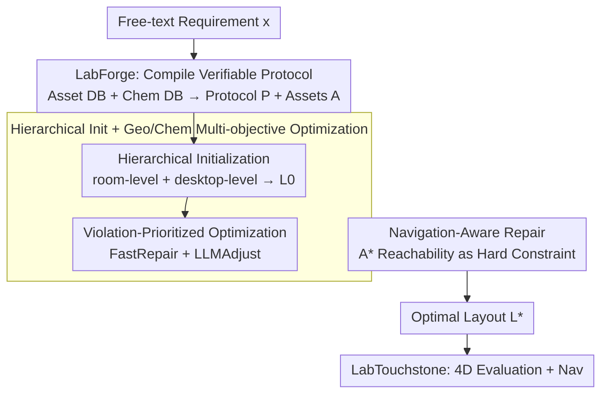

# LabBuilder: Protocol-Grounded 3D Layout Generation for Interactable and Safe Laboratory

**Conference**: ICML 2026  
**arXiv**: [2605.02288](https://arxiv.org/abs/2605.02288)  
**Code**: None  
**Area**: 3D Vision / Embodied Environment Generation  
**Keywords**: Laboratory scene generation, protocol grounding, chemical safety, navigation reachability, hierarchical layout

## TL;DR
LabBuilder compiles free-text experimental descriptions into "asset-chemical protocols," then utilizes hierarchical generation combined with geometric/chemical multi-objective optimization and navigation repair to produce 3D chemistry laboratory layouts that are both visually plausible and executable for robotic experimental workflows.

## Background & Motivation
**Background**: Most 3D indoor scene generation methods focus on residential environments, relying on datasets like 3D-FRONT. The primary goal is visual plausibility—ensuring geometric non-interference and reasonable furniture color coordination. Recent works have utilized LLMs as layout planners, transforming language descriptions into rendered scenes via text-to-structured-JSON pipelines.

**Limitations of Prior Work**: Directly migrating these methods to chemistry laboratories leads to failure. While home furniture only requires fitting without overlap, laboratory equipment—such as fume hoods, alcohol lamps, flammable reagents, and glassware—is governed by **protocol-level semantics**. Chemicals must be arranged by reaction type, flammables must stay away from heat sources, glassware cannot be placed near table edges, and robot arms must be able to reach them. Generic generators treat reagent bottles as decorations, lacking knowledge of their chemical properties or the ability to verify if a robot can navigate from station A to station B.

**Key Challenge**: Existing methods only constrain "static geometric validity + visual plausibility" during generation, leaving executability and safety for post-hoc evaluation. However, in a laboratory, executability is a primary design constraint—a minor geometric change (e.g., shifting an alcohol lamp 20 cm) can invalidate the entire experimental workflow or even cause a safety hazard.

**Goal**: Given a free-text experimental requirement (e.g., "Set up an SN2 substitution reaction"), automatically generate a 3D lab layout where: (i) all assets required by the protocol are instantiated; (ii) layouts are geometrically conflict-free and compliant with wall placement; (iii) chemical safety constraints are satisfied; and (iv) robots can reach all required equipment according to the protocol steps.

**Key Insight**: The authors reformulate scene generation as "constrained optimization grounded in protocols." They use LLMs with a knowledge base to compile free-text into machine-verifiable structured protocols. These protocols then directly drive layout searching and repairing, shifting executability assessment from a post-hoc evaluation to a core component of the generation loop.

**Core Idea**: By using "Asset Knowledge Base + Chemical Knowledge Base" as priors, experimental requirements are compiled into schema-based protocols. The lab is then generated through a three-stage closed-loop process: hierarchical initialization, local search prioritized by geometric/chemical violations, and navigation reachability repair.

## Method

### Overall Architecture
LabBuilder treats the conversion of free-text requirements into robot-executable 3D labs as a compilation-generation-evaluation pipeline. The front-end **LabForge** compiles free-text and heterogeneous assets into structured protocols $\mathcal{P}$ and an asset library $\mathcal{A}$. The middle-tier **LabGen** uses the protocol to perform hierarchical initialization for a candidate layout $\mathcal{L}_0$, followed by joint geometric and chemical optimization $\Phi$. Finally, a navigation-aware repair $\Upsilon$ is applied to converge on the optimal layout $\mathcal{L}^\star$. The back-end **LabTouchstone** scores the output across four dimensions: geometric compliance, feasibility (FSR), chemical safety, and semantic rationality, supplemented by point-goal navigation evaluation. The protocol $\mathcal{P}$ serves as both a "target specification" for assets and a "constraint template" for the optimizer.

### Key Designs

**1. LabForge: Compiling Free-text into Verifiable Protocols**

Directly generating layout JSONs via LLMs often causes physical conflicts and lacks chemical safety semantics. LabForge addresses this by compiling an intermediate representation. It constructs an asset library of 176 laboratory entities with geometric, semantic, and safety annotations. It also extracts an experimental library covering 7 reaction types (substitution, protection/deprotection, etc.). Given requirement $x$ and context $\mathcal{C}$, the LLM performs Retrieval-Augmented Generation (RAG) to output a strictly structured protocol $\mathcal{P}$ with normalized asset references. This acts as a schema validator to prevent hallucinated or missing equipment.

**2. Hierarchical Initialization + Multi-objective Optimization**

To handle the immense search space, LabGen splits layout generation into two granularities: room-level for functional zoning and large equipment 6-DoF poses $(\mathcal{R}, \pi) \sim p_\theta(\cdot \mid x, \mathcal{P}, \mathcal{A})$, and desktop-level for the placement of small instruments and reagents $\mathcal{D}_s \sim p_\theta(\cdot \mid \cdot, s, \mathcal{R}, \pi)$. The optimization objective balances geometric validity and chemical safety:

$$\mathbb{F} = w_{\text{geo}} f_{\text{geo}} + w_{\text{chem}} f_{\text{chem}}$$

The search employs a **violation-priority** acceptance criterion: it first compares the number of hard-constraint violations $v(\mathcal{L})$. Layouts with fewer violations win directly; the semantic score $\mathbb{F}$ is only compared if violation counts are equal. The repair operator $\Phi$ combines FastRepair (for cheap geometric tasks) and LLMAdjust (for semantic reasoning, e.g., "moving acetone into the fume hood").

**3. Navigation-Aware Repair: Reachability as a Hard Constraint**

Geometry-valid layouts may still be inaccessible to robots. LabGen integrates reachability into the generation loop by projecting the 3D scene into a 2D occupancy grid and performing $A^\star$ planning for every (start, goal) pair in the protocol. Planning failures (endpoint occupied, out of bounds, or disconnected) are mapped to a binary indicator $f_{\text{reach}} \in \{0, 1\}$. If $f_{\text{reach}} = 0$, the repair operator $\Upsilon$ is iteratively called to adjust obstacles or functional zones until all step-to-step transitions are collision-free.

### Loss & Training
LabBuilder is a search-and-verify pipeline rather than a traditionally trained model. The final layout is determined via constrained optimization:

$$\mathcal{L}^\star = \arg\max_\mathcal{L} \mathbb{F}(\mathcal{L}, \mathcal{P}, \mathcal{A})$$

where $f_{\text{geo}}$ encodes asset-level geometric constraints and $f_{\text{chem}}$ is derived from protocol safety annotations. Hard constraints include flammable isolation, reagent storage rules, incompatible chemical separation, and glassware distance from edges.

## Key Experimental Results

### Main Results
Comparison with Holodeck and SceneWeaver on 30 real-world chemistry experiments (Table 2):

| Method | OB↓ | CN↓ | Asset↑ | Nav↑ | Flam.↑ | Lay↑ |
|------|-----|-----|--------|------|--------|------|
| Holodeck | 10.8 | 0.20 | 0.700 | – | 0.239 | 5.61 |
| SceneWeaver | 5.61 | 0.35 | 0.226 | – | 0.097 | 4.57 |
| **LabBuilder** | **0.07** | **0.17** | **0.833** | **0.966** | **0.725** | **9.00** |

Boundary violations (OB) were nearly eliminated, while chemical safety and asset availability significantly outperformed baselines.

### Ablation Study

| Configuration | OB↓ | CN↓ | Asset↑ | Nav↑ | Flam.↑ |
|------|-----|-----|--------|------|--------|
| Ours (w/o annotation) | 0.25 | 0.36 | 0.786 | 0.952 | — |
| Ours (full) | 0.07 | 0.17 | 0.833 | 0.966 | 0.725 |

Removing asset annotations doubled collisions and significantly increased boundary violations, proving that $\mathcal{A}$'s geometric and chemical semantics are vital for the optimizer.

### Key Findings
- The violation-priority criterion is essential; it forces the search to resolve illegal geometries before optimizing for higher semantic scores.
- LabBuilder generated more objects (23.2 vs. 10-15), indicating that it successfully instantiates all instruments required by the protocol rather than simplifying the scene.
- Common navigation failures involve thin instruments (e.g., distillation setups) blocking paths, suggesting the need for finer shape abstractions in occupancy grids.

## Highlights & Insights
- Shifting "executability assessment to the front of the generation loop" is a major conceptual advancement. While previous generators treated safety as an optional metric, this work treats it as a hard constraint.
- The hierarchical + violation-prioritized search provides a reusable LLM-in-the-loop paradigm: utilizing algorithmic layers for cheap geometric tasks and reserving LLMs for high-level semantic repairs.
- Using a protocol as an intermediate representation provides elegant decoupling. The upstream can accept arbitrary text while the downstream only processes structured protocols, making it easy to expand to new reaction types.

## Limitations & Future Work
- The asset library is limited to 176 entities, lacking coverage for long-tail specialized equipment like gloveboxes or cryostat devices.
- Chemical safety is currently a set of discrete hard rules, making it difficult to express temporal safety semantics (e.g., ventilation requirements during long reactions).
- Navigation evaluation only considers point-goal reachability without assessing robot arm manipulation (reach + grasp) within the layout.

## Related Work & Insights
- **vs Holodeck**: Holodeck focuses on open-vocabulary residential scenes where assets lack functional semantics. Its failure in OB/Flammability metrics proves that home-environment priors do not transfer to labs.
- **vs SceneWeaver**: SceneWeaver introduces geometric constraint validation but lacks protocol grounding. Its low asset availability (0.226) demonstrates that "correct geometry" does not equate to "experimental feasibility."
- **vs UP-VLA**: This work provides a "protocol-to-executable-environment" bridge for the embodied AI community. Future VLA models could utilize these generated protocols for supervision.

## Rating
- Novelty: ⭐⭐⭐⭐ Protocol grounding + integration of chemical hard constraints in scene generation is systematically explored for the first time.
- Experimental Thoroughness: ⭐⭐⭐⭐ Extensive testing across 30 experiments, three baselines, and ablation studies.
- Writing Quality: ⭐⭐⭐⭐ Clear three-module structure with well-defined algorithms.
- Value: ⭐⭐⭐⭐⭐ Automated laboratory design is a high-demand area; this provides a practical environment synthesis solution.

<!-- RELATED:START -->

## Related Papers

- [\[ICML 2026\] STABLE: Simulation-Ready Tabletop Layout Generation via a Semantics–Physics Dual System](stable_simulation-ready_tabletop_layout_generation_via_a_semantics-physics_dual_.md)
- [\[CVPR 2026\] Repurposing 3D Generative Model for Autoregressive Layout Generation](../../CVPR2026/3d_vision/repurposing_3d_generative_model_for_autoregressive_layout_generation.md)
- [\[ICCV 2025\] REPARO: Compositional 3D Assets Generation with Differentiable 3D Layout Alignment](../../ICCV2025/3d_vision/reparo_compositional_3d_assets_generation_with_differentiable_3d_layout_alignmen.md)
- [\[CVPR 2026\] Grounded Latents for Entity-Centric 4D Scene Generation](../../CVPR2026/3d_vision/grounded_latents_for_entity-centric_4d_scene_generation.md)
- [\[CVPR 2026\] Lighting-grounded Video Generation with Renderer-based Agent Reasoning](../../CVPR2026/3d_vision/lighting-grounded_video_generation_with_renderer-based_agent_reasoning.md)

<!-- RELATED:END -->
