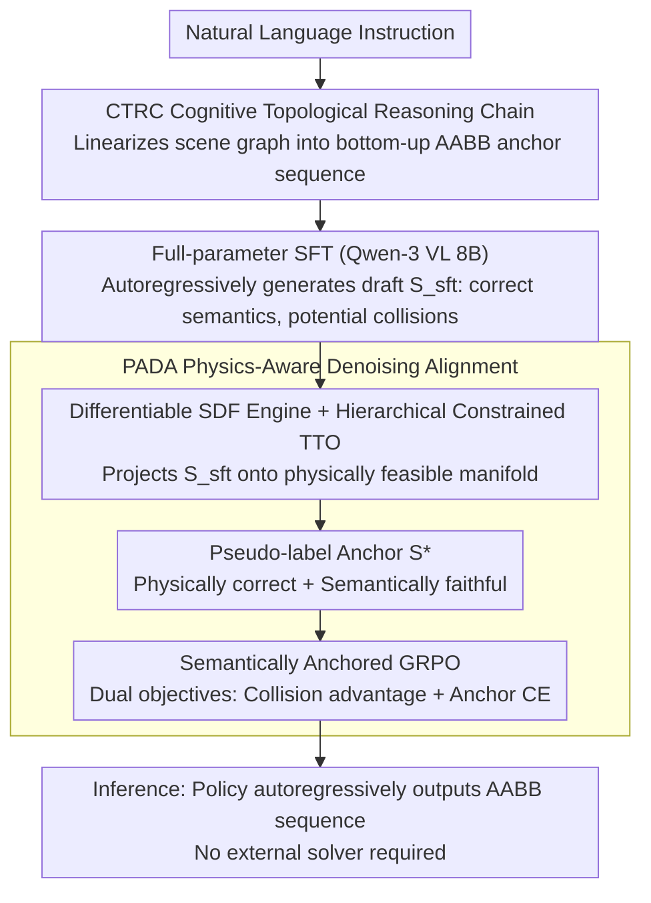

# PhyScene3D: Physically Consistent Interactive 3D Tabletop Scene Generation

**Conference**: ICML 2026  
**arXiv**: [2606.01649](https://arxiv.org/abs/2606.01649)  
**Code**: To be confirmed  
**Area**: 3D Vision / Scene Generation / Embodied AI  
**Keywords**: Tabletop Scene Generation, VLM, Differentiable SDF, Test-time Optimization, Physical Consistency

## TL;DR
PhyScene3D reshapes 3D tabletop scene generation into a "human-constructive" hierarchical sequential planning: it linearizes scene graphs into an AABB-based anchor sequence using the Cognitive Topological Reasoning Chain (CTRC), and then embeds a differentiable SDF physics engine into the VLM training loop via Physics-Aware Denoising Alignment (PADA). This allows the model-generated scenes to surpass the physical plausibility of human-annotated training data (reducing scene-level collision rates from 81.5% to 41.6% and asset-level rates to 3.86%).

## Background & Motivation

**Background**: Interactive 3D tabletop scenes (kinematically valid, penetration-free, and directly loadable into physics simulators like IsaacGym or SAPIEN) are a critical foundation for training general-purpose robot manipulation strategies. Current mainstream approaches are divided into three categories: (a) Agent-based solvers (e.g., Holodeck, I-Design) where LLMs output symbolic constraints for external solvers to determine poses; (b) Image-intermediated pipelines (generating 2D images, then parsing and retrieving assets); (c) End-to-end regression models (e.g., MesaTask) that directly regress 6D object poses from datasets.

**Limitations of Prior Work**: (a) Agent-based methods suffer from a "symbolic bottleneck"—LLMs lack fine-grained spatial awareness and often generate geometrically unsolvable graphs (e.g., floating or stacking issues), forcing downstream solvers to either break semantics or fail. (b) Multi-stage pipelines suffer from high latency and error accumulation. (c) End-to-end models are limited by the quality ceiling of training data—human-annotated sets like MesaTask-10k have an 81.5% scene-level collision rate; naive supervised learning forces the model to replicate these physically violating artifacts, preventing the production of reliable simulation scenes.

**Key Challenge**: Tabletop scenes are more difficult than indoor furniture layouts; they require strict 3D topology (e.g., a pen must be inside a holder, which must be on a book) with dense containment, support, and proximity relationships among 10–20 objects in a small space. The challenge is to simultaneously satisfy "semantic fidelity to instructions" and "zero physical penetration/floating." Pure RL optimization for physics leads to semantic drift (objects scatter to avoid collisions), while pure mimicry inherits data noise. This is a dual trap between reward-hacking and blind-mimicry.

**Goal**: Enable the generative model's physical plausibility to **surpass** the upper limit of the training data without sacrificing the semantic priors of the VLM, while maintaining generalization to out-of-distribution (OOD) scenes.

**Key Insight**: The authors make two key observations: (1) Humans follow a "anchor $\rightarrow$ lateral expansion $\rightarrow$ bottom-up stacking" hierarchical order when arranging tabletops; injecting this order as a strong structural inductive bias into the VLM can eliminate causal hallucinations like "placing content before the container." (2) Training data noise is not ground truth but rather an "imperfect reference that can be denoised." By backpropagating differentiable physical signals to VLM parameters, the model can learn layouts cleaner than those provided by human annotators.

**Core Idea**: Internalize the traditional "explicit planning + solver post-processing" workflow into the VLM's implicit reasoning. CTRC provides the structural backbone (linearized AABB anchor sequence), while PADA uses differentiable SDF + Test-Time Optimization (TTO) to "project" SFT outputs onto a physically feasible manifold. These projected pseudo-labels then serve as semantic anchors for GRPO training, distilling physical priors back into the policy.

## Method

### Overall Architecture
PhyScene3D addresses the generation of collision-free, non-floating tabletop scenes directly from natural language instructions. It decomposes the task into two layers: first, teaching the VLM to arrange objects sequentially like a human, and second, using a differentiable physics engine to correct the VLM. Given instruction $\mathcal{I}$, it outputs scene $\mathcal{S}=\{e_i\}_{i=1}^N$. Each entity $e_i$ is re-parameterized as a 3D AABB $\mathbf{b}_i=[x_{\min},x_{\max},\dots,z_{\max}]\in\mathbb{R}^6$. Using Qwen-3 VL 8B as the backbone, training proceeds in two stages: full-parameter SFT on MesaTask-CTRC data to learn the anchor sequence, followed by PADA using LoRA (r=16) + GRPO. During GRPO, each prompt uses TTO to project the SFT output $\mathcal{S}_{sft}$ onto a physically feasible manifold to create pseudo-label anchors $\mathcal{S}^*_{anchor}$ for joint training with RL exploration. At inference, only the VLM is needed to autoregressively output the AABB sequence.

### Key Designs

**1. Cognitive Topological Reasoning Chain (CTRC): Hard-coding "Container before Content"**

The primary pain point in tabletop generation is causal hallucination—VLMs often place a pen before the pen holder. CTRC reformulates this as an ordered bottom-up autoregressive process $P(\mathcal{S}|\mathcal{I})=\prod_{t=1}^{N}P(e_t|e_{<t},\mathcal{I})$, enforcing a "container $\rightarrow$ content" causal chain. It extracts a scene graph $G=(V,E)$ using geometric heuristics: containment defined by volume ratio and $IoU_{xy}$, support by $z$-alignment, and proximity via separating axes. The generation order follows an Anchor-Expansion strategy. Positional parameters are expressed as relative AABBs in the parent's local coordinate system, decoupling the vertical dimension by relationship types: for $\text{in}$ relationships, $z^{rel}_{\{min,max\}} = z^{abs}_{\{min,max\}}(e_{ch}) - z^{abs}_{min}(e_{pa})$, and for $\text{on}$ relationships, $z^{rel}_{\{min,max\}} = z^{abs}_{\{min,max\}}(e_{ch}) - z^{abs}_{max}(e_{pa})$. This anchors the search space to geometric invariants, eliminating floating/penetration hallucinations at the source.

**2. Differentiable SDF Physics Engine + Hierarchy-Constrained TTO: Projecting Semantic Plans to Physics**

TTO refines the CTRC drafts into physically feasible ones. Assets are represented as GPU-resident vectorized SDFs. For any pair of objects $A, B$, the differentiable collision energy is computed as:

$$\mathcal{L}_{sdf}(A,B) = \sum_{\mathbf{p}\in P_A} \text{ReLU}\big(-\phi_B(\mathbf{R}_B^\top(\mathbf{R}_A \mathbf{p} + \mathbf{t}_A - \mathbf{t}_B))\big),$$

where $\phi_B$ is the SDF field of $B$ and gradients "push" penetrating objects apart. To prevent semantic drift, TTO minimizes:

$$\min_\xi \big(\mathcal{L}_{sdf} + \lambda_{rel}\mathcal{L}_{rel}(\mathcal{G}) + \lambda_{reg}\|\xi - \xi_{init}\|^2\big),$$

where $\mathcal{L}_{rel}$ freezes parent-child relative positions for $\text{in}$ edges (treating them as a rigid body) and enforces $z^{rel}$ alignment for $\text{on}$ edges. This ensures the TTO achieves collision-free results while maintaining semantic intent.

**3. Physically-Projected Semantic Anchoring: Distilling TTO into VLM**

PADA treats TTO as a teacher to distill knowledge into the policy. During each RL round, $\mathcal{S}_{sft}$ is projected to $\mathcal{S}^*_{anchor}=\text{TTO}(\mathcal{S}_{sft})$. This anchor serves as dense supervision for GRPO, forming a dual-objective loss:

$$\mathcal{J}(\theta) = \mathbb{E}_{\mathcal{L}\sim\pi_\theta}\Big[\frac{1}{K}\sum_{k=1}^K A_k \frac{\pi_\theta(\mathcal{S}_k)}{\pi_{old}(\mathcal{S}_k)}\Big] + \alpha \cdot \mathcal{L}_{CE}(\pi_\theta, \mathcal{S}^*_{anchor}),$$

where $A_k$ is the advantage derived from collision scores, and the cross-entropy term uses the anchor as a "correction vector" to stabilize semantics. This internalizes the teacher's capability into the generative distribution, explaining why PADA's final Quality Pass Rate (QPR) surpasses inference-only TTO.

### Loss & Training
Two-stage training: (i) Full-parameter SFT micro-tuning Qwen-3 VL 8B on 9,429 samples with CTRC sequence labels. (ii) PADA using LoRA (r=16) for GRPO, where $K$ rollouts are generated per prompt. The advantage $A_k$ is derived from SCR/ACR, and the anchor weight $\alpha$ balances semantic stability against physical exploration. Training was conducted on a 640GB VRAM cluster.

## Key Experimental Results

### Main Results
Evaluated on the MesaTask-CTRC benchmark (866 samples) using Quality Pass Rate (QPR, GPT-Score > $\tau$ and collision-free) and Collision Rates:

| Method | QPR (τ=7) | GPT Score Avg | SCR ↓ | ACR ↓ |
|------|-----------|---------------|-------|-------|
| Reference (Human) | 17.1% | 8.87 | 81.5% | 8.19% |
| GPT-4o | 27.6% | 8.19 | 68.9% | 7.87% |
| Holodeck-table (Agent) | 2.7% | 4.60 | 2.7% | 0.47% |
| I-Design-table (Agent) | 19.0% | 6.53 | 39.1% | 5.94% |
| MesaTask (End-to-End) | 21.1% | 8.80 | 78.3% | 8.19% |
| **PhyScene3D (Ours)** | **46.5%** | **8.93** | **41.6%** | **3.86%** |

On OOD scenes (Cashier Counter, etc.), MesaTask's QPR collapsed to 1.01%, while Ours maintained 29.1% (~29× relative improvement).

### Ablation Study

| Configuration | QPR (τ=7) | GPT Avg | SCR ↓ | ACR ↓ |
|------|-----------|---------|-------|-------|
| Qwen-3 VL 8B (SFT only) | 19.2% | 8.84 | 80.1% | 8.18% |
| + CTRC | 21.6% | 8.96 | 77.8% | 7.60% |
| + GRPO (Pure RL) | 28.8% | 8.47 | 68.9% | 6.82% |
| + TTO (post-hoc) | 38.0% | 8.83 | 60.5% | 4.86% |
| **+ PADA (TTO-refined)** | **46.5%** | **8.93** | **41.6%** | **3.86%** |

Downstream Task (ManiSkill Robot Grabbing): Agents trained on Ours' scenes achieved a 50.4% IID success rate, compared to 4.6% for those trained on MesaTask.

### Key Findings
- **CTRC alone stabilizes semantics but barely improves physics**: Hierarchical bias is a prerequisite for subsequent PADA alignment.
- **Pure GRPO leads to reward hacking**: GPT-Score drops by 0.49 as the VLM learns to output sparse scenes to cheat collision scores.
- **PADA outperforms inference-only TTO (46.5% vs 38.0%)**: The VLM successfully internalizes physical constraints, producing initial outputs superior to those refined by TTO from noisy starts.
- **OOD Robustness**: Relative AABB representations capture topological invariants, leading to a 29× QPR improvement over prior end-to-end models on unseen scene types.

## Highlights & Insights
- **Surpassing the Data Ceiling**: The realization that training data is an "imperfect reference" allows the model to systematically exceed the quality of human annotations. This self-correction paradigm is transferable to other domains like CAD design or trajectory planning.
- **TTO-refined Anchors as Dense Supervision**: This bypassed the need for an explicit semantic reward model. Using the same SFT model for both prediction and anchor generation (via TTO projection) ensures semantics are preserved while physics is optimized.
- **Structural CoT**: CTRC is a structural inductive bias rather than mere prompt engineering, hard-coding human-like arrangement logic into the autoregressive order.

## Limitations & Future Work
- **AABB Conservativeness**: AABB may overestimate the occupancy of irregular shapes (like baskets with handles), relying on SDF to fix contact points. 
- **Zero Collision Difficulty**: In dense scenes with 10–20 objects, achieving absolute zero collision remains extremely difficult.
- **GPT-Score Dependence**: Dependency on GPT-4 as a judge introduces potential alignment bias.
- **Future Work**: Scaling to articulated objects (drawers, books) and upgrading AABB to Oriented Bounding Boxes (OBB).

## Related Work & Insights
- **Compared to Agent Solvers (Holodeck/I-Design)**: Ours internalizes planning into the VLM's implicit reasoning, removing the symbolic bottleneck and reducing latency.
- **Compared to MesaTask (End-to-End)**: While MesaTask is capped by the 81.5% SCR of its training set, Ours uses physics distillation to cut collision rates by half.
- **Compared to DiffuScene (Diffusion)**: Diffusion models fail in dense tabletop scenarios (QPR=0); this highlights the necessity of explicit physical boundary enforcement for clustered object generation.

## Rating
- Novelty: ⭐⭐⭐⭐⭐ Combining differentiable SDF, TTO, and GRPO into PADA to surpass training data limits is a significant intellectual contribution.
- Experimental Thoroughness: ⭐⭐⭐⭐⭐ Comprehensive benchmarks across 7 baselines, OOD tests, and downstream robot tasks.
- Writing Quality: ⭐⭐⭐⭐ Concepts like the blind-mimicry trap are well-articulated, though more human-evaluation calibration would be beneficial.
- Value: ⭐⭐⭐⭐⭐ Directly addresses the bottleneck of simulation environment generation for general robot learning.

<!-- RELATED:START -->

## Related Papers

- [\[ICML 2026\] STABLE: Simulation-Ready Tabletop Layout Generation via a Semantics–Physics Dual System](stable_simulation-ready_tabletop_layout_generation_via_a_semantics-physics_dual_.md)
- [\[ICCV 2025\] SuperMat: Physically Consistent PBR Material Estimation at Interactive Rates](../../ICCV2025/3d_vision/supermat_physically_consistent_pbr_material_estimation_at_interactive_rates.md)
- [\[CVPR 2025\] WonderWorld: Interactive 3D Scene Generation from a Single Image](../../CVPR2025/3d_vision/wonderworld_interactive_3d_scene_generation_from_a_single_image.md)
- [\[ICLR 2026\] One2Scene: Geometric Consistent Explorable 3D Scene Generation from a Single Image](../../ICLR2026/3d_vision/one2scene_geometric_consistent_explorable_3d_scene_generation_from_a_single_imag.md)
- [\[CVPR 2026\] PhysIR-Splat: Physically Consistent Thermal Infrared Radiative Transfer in 3D Gaussian Splatting](../../CVPR2026/3d_vision/physir-splat_physically_consistent_thermal_infrared_radiative_transfer_in_3d_gau.md)

<!-- RELATED:END -->
