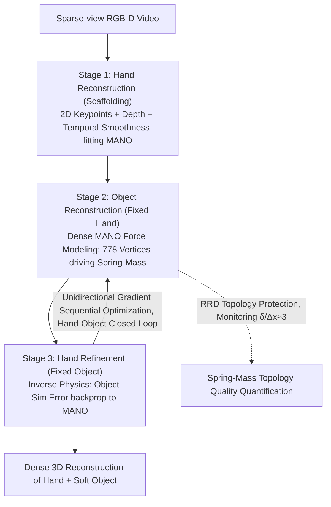

# PhysHanDI: Physics-Based Reconstruction of Hand-Deformable Object Interactions

**Conference**: ICML 2026  
**arXiv**: [2605.09538](https://arxiv.org/abs/2605.09538)  
**Code**: Not public  
**Area**: 3D Vision / Hand-Object Interaction Reconstruction / Physics Simulation  
**Keywords**: Hand-Object Interaction, Deformable Objects, Spring-Mass, MANO, Inverse Physics

## TL;DR
This paper proposes PhysHanDI, which couples the MANO hand model with a Spring-Mass soft body model. It uses dense hand meshes to drive the physical simulation of deformable objects and inversely utilizes object simulation to refine hand reconstruction, achieving SOTA dense 3D reconstruction for both hands and soft objects on sparse-view RGB-D videos.

## Background & Motivation
**Background**: Most existing hand-object interaction reconstruction methods assume objects are rigid or articulated (HOnnotate, ARCTIC, etc.), using a reference shape plus global or part-wise rigid transformations to describe object dynamics.

**Limitations of Prior Work**: Daily life involves many soft bodies—clothing, plush toys, charging cables—which exhibit large-scale, spatially rich non-rigid deformations where rigid frameworks fail completely. A few soft body works (HMDO, qi2025human) only process small-scale local deformations generated by finger pressing and cannot describe large-scale global deformations such as "bending a plush toy arm 180°".

**Key Challenge**: The most relevant work, PhysTwin, can simulate large deformations using a Spring-Mass physics model, but it simplifies the hand into approximately 30 sparse control points sampled directly from depth maps. This leads to two problems: (1) contact points are unobservable under occlusion, leading to inaccurate force modeling; (2) the Spring-Mass topology fitted using sparse control points (with a larger connection radius $\delta$) is suboptimal, undermining physics simulation stability. Furthermore, PhysTwin does not perform full 3D hand reconstruction.

**Goal**: (1) Provide dense 3D reconstruction for both hands and soft objects simultaneously; (2) use dense hand meshes to drive object simulation for accurate force modeling; (3) leverage object physics priors to improve hand reconstruction accuracy.

**Key Insight**: Since Spring-Mass simulation is highly dependent on control point geometry, replacing the control points from 30 sparse depth points with 778 dense vertices obtained from MANO fitting naturally results in a denser and more accurate contact set and a more reasonable connection radius.

**Core Idea**: Use dense MANO hand vertices as "virtual nodes" in a Spring-Mass system to close the hand-object physics coupling via hand $\to$ object force fields; then utilize inverse physics (backpropagating object simulation errors to MANO parameters) to form a complementary hand $\leftrightarrow$ object optimization.

## Method

### Overall Architecture
The problem to be solved is obtaining dense 3D reconstructions of both hands and soft objects from sparse-view (default three views) RGB-D video, where soft bodies exhibit large-scale non-rigid deformations (e.g., "bending a plush toy arm 180°") that invalidate rigid frameworks. The core strategy of PhysHanDI is to let the hand and object drive and refine each other within a differentiable physics simulation. The system parameterizes each hand as a MANO model $\Theta_h=\{\bm\theta,\bm\beta,\mathbf R,\mathbf t\}$ and each soft object as a Spring-Mass graph $\mathcal O=(\mathcal N, \mathcal E)$. Each node in the graph carries a position $\mathbf x_i$, velocity $\mathbf v_i$, unit mass, spring stiffness $s_{ij}$, damping $\gamma_{ij}$, and connection radius $\delta$.

The pipeline follows three sequential stages. The first stage is hand reconstruction: MANO is fitted frame-by-frame using only 2D keypoints, depth, and temporal smoothness losses. The second stage is object reconstruction given known hand parameters: MANO vertices are treated as force sources to perform forward simulation of the Spring-Mass system, and physical parameters of the springs are optimized by backpropagating Chamfer and CoTracker3 trajectory losses. The third stage is hand refinement: the object model is frozen, and object simulation errors are backpropagated to MANO parameters via inverse physics to obtain a physically more consistent hand. This hand $\to$ object $\to$ hand closed loop is the core structure of this method.

### Key Designs

**1. Dense MANO-driven Spring-Mass Force Modeling: Replacing 30 sparse control points with 778 hand vertices for accurate contact modeling**

The most relevant work, PhysTwin, simplifies the hand into approximately 30 sparse control points sampled from depth maps, leading to two issues: contact points are unobservable under occlusion, making force modeling inaccurate, and the fitted virtual spring topology is suboptimal, undermining simulation stability. PhysHanDI's approach is to inject contact forces using all 778 MANO vertices as virtual control nodes $\mathcal V'$. The force on each node is divided into three parts: spring, damping, and external forces $\mathbf F_i=\sum_{(i,j)\in\mathcal E}\mathbf F_{i,j}^{\text{spring}}+\mathbf F_{i,j}^{\text{damping}}+\mathbf F_i^{\text{external}}$, where the spring force follows Hooke's Law $\mathbf F_{i,j}^{\text{spring}}=s_{ij}(\|\mathbf x_j-\mathbf x_i\|-r_{ij})\frac{\mathbf x_j-\mathbf x_i}{\|\mathbf x_j-\mathbf x_i\|}$. "Virtual springs" $\mathcal E^{\text{virtual}}$ are automatically established for any hand-object pairs falling within the connection radius $\delta$, and Newton's second law is integrated over time with MANO vertex positions fixed as boundary conditions.

The reason dense vertices are effective lies in the topology. The virtual springs fitted by PhysTwin using 30 depth points are too long, with the ratio of radius to discrete resolution $\delta/\Delta x$ deviating significantly from the peridynamics recommended value of 3, causing waves to diffuse excessively within the object and distorting contact modeling. With 778 dense vertices, $\delta$ naturally falls into a reasonable range, concentrating contact forces on the actual contact surface rather than scattering them into non-contact areas.

**2. Inverse Physics-driven Hand Refinement: Using "Object Physical Consistency" to supervise hand pose**

Hand observation under single-view RGB-D is highly under-determined, as fingers are often occluded by the object or the hand itself; 2D keypoints and depth losses alone are insufficient. PhysHanDI conversely constrains the hand using the object's physical behavior: defining $\mathcal S_t(\Theta_h)$ as the differentiable simulation of object node positions at time $t$ given hand parameters, it solves:

$$\tilde\Theta_h=\arg\min_{\Theta_h}\frac{1}{T}\sum_t\big[\mathcal L_{ch}(\mathcal S_t(\Theta_h),\mathcal P)+\lambda_{tr}\mathcal L_{tr}(\mathcal S_t(\Theta_h),\mathbf T)\big]$$

where $\mathcal P$ is the observed point cloud and $\mathbf T$ represents CoTracker3 trajectories. Gradients are backpropagated through the differentiable integration of the Spring-Mass system to $\Theta_h$. This acts as an additional constraint—"the hand must cause the object to deform as observed"—excluding many physically impossible poses and providing a form of supervision that upgrades hand reconstruction from "fitting pixels" to "fitting physics."

**3. Three-stage Sequential Optimization and Topological Protection: Unidirectional gradients to avoid trivial solutions and quantitative monitoring of topology quality**

If the hand and object are optimized jointly, a trivial solution where "object deformation compensates for hand error" often occurs. PhysHanDI therefore adopts strict sequential optimization: first optimize the object with the hand fixed, then refine the hand with the object fixed, iterating through stages while only allowing unidirectional gradients per stage. The object stage follows PhysTwin's differentiable simulation, but since the control source is replaced by dense MANO, the optimized $\delta$ becomes significantly smaller. To explicitly ensure the topology is near-optimal, the authors introduce the Radius-to-Resolution Deviation metric $RRD=|(\delta/\Delta x)/r-1|$ (with recommended $r=3$; smaller $RRD$ indicates a closer match to peridynamics recommendations) to quantify topology quality, ensuring every stage moves toward a physically interpretable direction.

### Loss & Training
The hand stage optimizes $\min_{\Theta_h}\mathcal L_{2D}+\lambda_d\mathcal L_d+\lambda_t\mathcal L_t$, where the three terms are 2D keypoint reprojection error, depth map rendering difference, and temporal smoothness of parameters between adjacent frames. The object stage uses Chamfer loss $\mathcal L_{ch}$ to measure the distance between simulated nodes and point clouds, plus $\mathcal L_{tr}$ to measure the $\ell_2$ difference from CoTracker3 pseudo-GT trajectories. The hand refinement stage reuses $\mathcal L_{ch}+\lambda_{tr}\mathcal L_{tr}$, but gradients are applied to MANO parameters. Since no GT mass information is available, all nodes are assigned unit mass. The entire process does not train any new networks; it consists entirely of per-video differentiable optimization.

## Key Experimental Results

### Main Results
The method was compared against PhysTwin, Spring-Gaus, and GS-Dynamics on the PhysTwin-dense subset (excluding sequences with only needle-point contact) and a self-built DenseHDI dataset (19 sequences, 10 types of soft objects).

| Dataset | Task | Metric | PhysTwin | PhysHanDI | Gain |
|--------|------|------|----------|-----------|------|
| PhysTwin-dense | Recon+Re-sim | $CD_{dyn}$ ↓ | 10.78 | 8.32 | -22.8% |
| PhysTwin-dense | Recon+Re-sim | Track Err. ↓ | 1.00 | 0.89 | -11% |
| PhysTwin-dense | Future Pred. | $CD_{dyn}$ ↓ | 16.32 | 14.35 | -12% |
| DenseHDI | Recon+Re-sim | CD ↓ | 5.59 | 5.06 | -9.5% |
| DenseHDI | Future Pred. | CD ↓ | 7.98 | 7.54 | -5.5% |

Spring-Gaus simulation collapsed under sparse three-view inputs ($CD_{dyn}=27.79$), and GS-Dynamics degenerated to learning only minute motions in short sequences ($CD_{dyn}=33.37$).

### Ablation Study
**Single-view Future Prediction (PhysTwin fails in this setting due to contact point identification failure):**

| Configuration | Hand CD ↓ | CD ↓ | Track Err. ↓ |
|------|-----------|------|--------------|
| Ours w/o Hand Refinement | 7.36 | 42.8 | 7.57 |
| Ours Full | 7.17 | 33.5 | 6.75 |

**Spring-Mass Topology Quality ($RRD$ lower is closer to peridynamics recommendation):**

| Method | $RRD_{\text{object}}$ ↓ | $RRD_{\text{virtual}}$ ↓ |
|------|-------------------------|--------------------------|
| PhysTwin | 0.64 | 2.63 |
| PhysHanDI | 0.32 | 0.35 |

The virtual spring $RRD$ decreased by 7×, indicating that dense hand control almost completely eliminated the topological distortion of "elongated spring hard contact" seen in PhysTwin.

### Key Findings
- Under sufficient multi-view input, the initial MANO fitting is already quite good; inverse physics refinement is primarily effective in under-determined scenarios like "single-view future prediction"—Hand CD dropped from 7.36 to 7.17, and object CD dropped by 9.3 mm.
- In robustness tests (adding noise to depth/track/controller), the CD of this method remained nearly constant under perturbed tracking (5.30→5.56), while PhysTwin jumped to 9.60, demonstrating that dense hands as contact cues can absorb most upstream noise.
- Topology analysis reveals a transferable principle: simulation accuracy primarily depends on the ratio of the Spring-Mass discretization to the connection radius $\delta/\Delta x$, and the controller density directly determines whether this ratio can fall within the recommended range.

## Highlights & Insights
- **Inverse Physics for Hand Supervision**: This is the first work to use "object physical consistency" to refine hand poses, upgrading hand reconstruction from "fitting pixels" to "fitting physics." The approach is elegant and transferable to any hand-object differentiable simulation framework.
- **Topology Quality Inferred from Control Source Density**: Introduction of the $\delta/\Delta x\approx 3$ empirical rule from peridynamics into hand-object simulation, using $RRD$ to quantify "why PhysTwin is inferior," explaining the necessity of dense control from a theoretical perspective.
- **Training-Free Physics Prior**: The entire pipeline does not train new networks; all differentiable optimizations are performed on each video, making it naturally friendly to small datasets or new objects.

## Limitations & Future Work
- Unit mass assumption: All mass nodes use $m_i=1$, failing to distinguish between light soft objects (gauze) and heavy ones (wet towels). Future integration of material priors or multimodal tactile sensing could unlock finer dynamics.
- Dependence on RGB-D + multi-view CoTracker3 pseudo-GT trajectories for supervision; transition to pure monocular RGB still depends on the accuracy ceiling of upstream depth/tracking estimation.
- Supports only the Spring-Mass category of "continuum + discrete spring" models, providing limited modeling capability for high-order phenomena like self-contact in clothing folds or topological changes (tearing) in fabric.
- Real-time performance not discussed: the cost of differentiable simulation + inverse physics optimization on long videos is an engineering bottleneck.

## Related Work & Insights
- **vs PhysTwin (jiang2025phystwin)**: Both use Spring-Mass for object simulation, but PhysTwin uses ≈30 sparse depth sampling points as control, while this method uses 778 MANO vertices; this method additional provides full hand reconstruction and a hand refinement loop.
- **vs HMDO / qi2025human**: HMDO assumes local deformation under finger point contact, while this method handles large-scale global deformation.
- **vs Spring-Gaus (zhong2024reconstruction) / GS-Dynamics (zhang2024dynamics)**: These require either dense views or long sequences to learn dynamics; this method remains stable under three-view short sequences due to the strong prior of explicit MANO + physics simulation.
- **Insight**: The hand $\leftrightarrow$ object inverse physics approach can be transferred to robot $\leftrightarrow$ object (inferring contact parameters from robotic hand joint motion to optimize motion planning) and body $\leftrightarrow$ scene (refining body pose after a person sits on a sofa) scenarios.

## Rating
- Novelty: ⭐⭐⭐⭐⭐ Inverse physics for hand refinement is a first-of-its-kind closed loop in hand-object reconstruction.
- Experimental Thoroughness: ⭐⭐⭐⭐ Covers three-view, single-view, four types of perturbations, and topology quantification; only lacks long-term evaluation on real-world open objects.
- Writing Quality: ⭐⭐⭐⭐ Clear storyline (hand $\to$ object $\to$ hand); the intersection of physics and learning is well-explained.
- Value: ⭐⭐⭐⭐ Provides a new physics-learning baseline for soft body grasping reconstruction in AR/VR and robotic teleoperation.

<!-- RELATED:START -->

## Related Papers

- [\[CVPR 2026\] ArtHOI: Taming Foundation Models for Monocular 4D Reconstruction of Hand-Articulated-Object Interactions](../../CVPR2026/3d_vision/arthoi_taming_foundation_models_for_monocular_4d_reconstruction_of_hand-articula.md)
- [\[CVPR 2026\] ForeHOI: Feed-forward 3D Object Reconstruction from Daily Hand-Object Interaction Videos](../../CVPR2026/3d_vision/forehoi_feed-forward_3d_object_reconstruction_from_daily_hand-object_interaction.md)
- [\[CVPR 2026\] PAD-Hand: Physics-Aware Diffusion for Hand Motion Recovery](../../CVPR2026/3d_vision/pad-hand_physics-aware_diffusion_for_hand_motion_recovery.md)
- [\[CVPR 2026\] Glove2Hand: Synthesizing Natural Hand-Object Interaction from Multi-Modal Sensing Gloves](../../CVPR2026/3d_vision/glove2hand_synthesizing_natural_hand-object_interaction_from_multi-modal_sensing.md)
- [\[ECCV 2024\] D-SCo: Dual-Stream Conditional Diffusion for Monocular Hand-Held Object Reconstruction](../../ECCV2024/3d_vision/d-sco_dual-stream_conditional_diffusion_for_monocular_hand-held_object_reconstru.md)

<!-- RELATED:END -->
