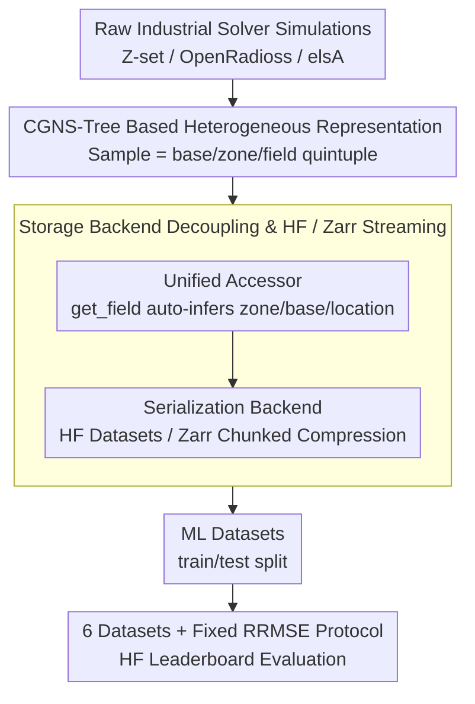

# PLAID: A Unified Data Model for Machine Learning on Heterogeneous Physics Simulations

**Conference**: ICML 2026  
**arXiv**: [2505.02974](https://arxiv.org/abs/2505.02974)  
**Code**: https://github.com/PLAID-lib/plaid (Available)  
**Area**: Scientific Computing / Physics Simulation / Datasets & Benchmarks  
**Keywords**: Physics-ML, Heterogeneous Meshes, Surrogate Models, Data Standards, Benchmarking

## TL;DR
PLAID proposes a unified data model and open-source library for heterogeneous physical simulation data, releasing 6 industrial-grade datasets and reproducible benchmarks covering structural mechanics and CFD. It transforms "variable mesh, variable topology, and variable dimension" real-world simulation data into standardized benchmarks accessible to the machine learning community.

## Background & Motivation

**Background**: Training surrogate models to accelerate PDE simulations has emerged as an independent track. Mainstreams include GNNs like MeshGraphNets based on message passing, operator learning methods such as Fourier Neural Operators (FNO), and recent mesh transformers or implicit neural representations, supported by infrastructures like PyTorch Geometric, DGL, and PhysicsNeMo.

**Limitations of Prior Work**: Unlike NLP with web-scale text or CV with billion-scale image-text pairs, physics-ML datasets have long remained "small, narrow, private, and inconsistent in format." They are either toy problems like PDEBench or The Well that only support regular structured grids, or ad-hoc datasets bound to specific solvers and libraries, offering almost no interoperability.

**Key Challenge**: The complexity of real industrial simulation stems from "heterogeneity"—samples in a single dataset can have different shapes, node counts, connectivity, element types, or even topologies (e.g., the number of holes in porous materials), and may undergo temporal remeshing. Existing ML data formats assume "tensors with fixed shape," forcing the community to discard this heterogeneity and regress to structured grids for academic evaluation, which fails to reflect true industrial generalization capabilities.

**Goal**: To decompose this gap into three sub-problems: (1) Designing a data abstraction that preserves industrial-grade CGNS simulation complexity while being efficiently consumable by ML frameworks; (2) Providing a library and online storage backend to make construction, I/O, and streaming access simple and scalable; (3) Providing a set of truly heterogeneous industrial-grade datasets and public benchmark protocols for fair comparison across modeling paradigms.

**Key Insight**: Instead of reinventing the wheel, the authors acknowledge CGNS as the de facto industrial standard for CFD/FEM. PLAID reuses the hierarchical simulation tree of CGNS as the underlying schema, adding an "ML-friendly" layer of metadata for samples, inputs, outputs, and splits. It leverages Hugging Face and Zarr—already accepted by the community—to lower engineering barriers.

**Core Idea**: Utilizing a three-layer stack consisting of a "CGNS tree + ML metadata + standardized accessor + HF distribution" to encapsulate heterogeneous physical simulation data as first-class citizens in ML, while defining de facto standards with 6 industrial datasets and 5 mainstream methodology benchmarks.

## Method

### Overall Architecture

PLAID addresses the issue where industrial simulation data cannot be directly consumed by ML frameworks. While existing ML formats assume fixed tensor shapes, industrial CFD/FEM data is inherently heterogeneous. PLAID's approach is a three-layer stack: the bottom layer uses CGNS trees for heterogeneous structures; the middle layer uses a unified accessor to decouple storage formats from physical bytes; the top layer hosts datasets and benchmarks on Hugging Face for continuous evaluation.

Specifically, inputs are raw simulations from industrial solvers like Z-set, OpenRadioss, and elsA. These are encapsulated into `Sample` units (each containing a CGNS tree with multiple bases and fields). The library provides high-level access and parallel I/O, serializing data to HF Datasets or Zarr backends. The final outputs are ML datasets with dedicated train/test splits, consumable by GNNs, operators, or transformers, evaluated via a fixed RRMSE protocol on a community leaderboard.

### Key Designs

**1. Heterogeneous Sample Representation: Making "Variable Mesh and Topology" First-Class**  
Heterogeneity is the primary engineering pain point. PLAID defines the abstract unit as a `Sample`, which reuses the `base/zone/field` hierarchy of CGNS. A single sample can support multiple bases (different dimensions or physical quantities on different meshes). Each field is explicitly located via a quintuple: `name, zone_name, base_name, location ∈ {Vertex, CellCenter, FaceCenter}, time`. Consequently, remeshing, dynamic field appearance, and multi-dimensional mesh coexistence are standard cases rather than exceptions. This design avoids the "proprietary format" trap by building on the established CGNS standard.

**2. Storage Backend Decoupling & HF/Zarr Streaming: Scalable Access for GB-scale Datasets**  
Industrial datasets often reach several gigabytes, making full memory loading impractical. PLAID decouples the data model from the storage format. The library exposes a unified accessor (e.g., `sample.get_field(name)`), while the backend handles byte serialization and parallel I/O. Datasets can be stored as YAML+CGNS files or serialized into Hugging Face Datasets or Zarr (chunked compression + remote storage). This supports streaming and feature-wise partial reads, allowing users to pull only specific fields without downloading the entire dataset.

**3. Six Progressively Heterogeneous Datasets & Fixed RRMSE Protocol**  
The paper releases 6 industrial-grade datasets (Tensile2d, 2D_MultiScHypEl, 2D_ElPlDynamics, Rotor37, 2D_profile, VKI-LS59) generated by solvers like Z-set and OpenRadioss. These datasets stress-test geometric, mesh, and topological variations. Evaluation is standardized using the Relative Root Mean Square Error (RRMSE):

$$\mathrm{RRMSE}_f = \Big(\frac{1}{n_\star}\sum_i \frac{1}{N^i}\frac{\|\mathbf{f}^i_{\rm ref}-\mathbf{f}^i_{\rm pred}\|_2^2}{\|\mathbf{f}^i_{\rm ref}\|_\infty^2}\Big)^{1/2}$$

Total error is the mean of RRMSE across all fields and scalars. Testing set labels are private, with submissions automatically scored via the HF platform.

### Loss & Training

PLAID does not mandate training losses but specifies **evaluation metrics**. All methods are trained on unified splits, and relative errors are calculated per field/scalar via RRMSE to produce a `total_error`. For time-dependent datasets (2D_ElPlDynamics), field trajectories are stacked before RRMSE calculation, providing trajectory-level error assessment.

## Key Experimental Results

### Main Results

The table below shows the `total_error` (lower is better, bold for best, underlined for second best) of 6 representative methods across the 6 PLAID datasets. No single method dominates all datasets, highlighting the "heterogeneity challenge."

| Dataset | MGN | MMGP | Vi-Transf. | Augur | FNO | MARIO |
|--------|-----|------|------------|-------|-----|-------|
| Tensile2d | 0.0673 | **0.0026** | 0.0116 | 0.0154 | 0.0123 | 0.0038 |
| 2D_MultiScHypEl | 0.0437 | — | 0.0325 | **0.0232** | 0.0302 | 0.0573 |
| 2D_ElPlDynamics | 0.1202 | — | 0.0227 | 0.0346 | **0.0215** | 0.0319 |
| Rotor37 | 0.0074 | **0.0014** | 0.0029 | 0.0033 | 0.0313 | 0.0017 |
| 2D_profile | 0.0593 | 0.0365 | 0.0312 | 0.0425 | 0.0972 | **0.0307** |
| VKI-LS59 | 0.0684 | 0.0312 | 0.0193 | 0.0267 | 0.0215 | **0.0124** |

### Key Findings
- **MMGP dominates when samples can be aligned** (Tensile2d 0.0026, Rotor37 0.0014), but fails as soon as topological changes occur. This indicates that "alignment" is a powerful but fragile inductive bias in physics-ML.
- **MARIO (Implicit Neural Representation) performs best on smooth or shock-dominated CFD tasks** (2D_profile, VKI-LS59), but lags in solid mechanics tasks with local stress concentrations and topological changes, suggesting coordinate-based latent representations struggle with discrete topological shifts.
- **FNO performance drops significantly on Rotor37 and 2D_profile** because projecting anisotropic or 3D meshes to regular grids introduces both approximation error and computational overhead. This supports the argument that benchmarks must preserve native mesh structures.
- **Vi-Transformer and Augur provide robust median performance**, validating that mesh partitioning and tokenization are currently the most robust paradigms against heterogeneity.

## Highlights & Insights
- **Adopting CGNS conventions is a mature engineering decision**: By adding "ML metadata" on top of the industry standard rather than creating a new format, PLAID avoids the vacuum of a "custom format" ecosystem while remaining compatible with tools like ParaView.
- **Explicitly defining heterogeneity as an evaluation axis** provides high-impact perspective: Previous models ranked highly on PDEBench might fail under topological changes. This coordinate system is likely to become a standard requirement for subsequent physics-ML papers.
- **Embedding the benchmark in Hugging Face** is a savvy engineering move: It provides zero-maintenance infrastructure, a built-in leaderboard, and immediate community traffic.

## Limitations & Future Work
- The current scope is limited to structural mechanics and CFD, excluding domains like electromagnetics or combustion.
- Private ground truth for test sets prevents overfitting but creates a barrier for researchers wanting to perform detailed failure mode analysis.
- The benchmark lacks comparison under equal computational budget constraints; thus, `total_error` should not be interpreted purely as algorithmic superiority.

## Related Work & Insights
- **vs The Well (Ohana 2024)**: The Well only supports structured grids; PLAID supports un-structured meshes, topological changes, and multi-dimensional bases.
- **vs PDEBench**: PLAID adds industrial FEM solver data from Z-set and OpenRadioss, filling the gap in non-linear solid mechanics.
- **vs CGNS**: PLAID complements CGNS by standardizing "ML-consumable datasets" on top of the raw simulation hierarchy.

## Rating
- **Novelty**: ⭐⭐⭐⭐ (Infrastructure work providing a needed bridge for the field).
- **Experimental Thoroughness**: ⭐⭐⭐⭐⭐ (Comprehensive 6x6 matrix plus a continuous evaluation platform).
- **Writing Quality**: ⭐⭐⭐⭐ (Clear structure and high-impact visualizations).
- **Value**: ⭐⭐⭐⭐⭐ (Likely to become a de facto standard benchmark for physics-ML within 1–2 years).

<!-- RELATED:START -->

## Related Papers

- [\[CVPR 2026\] UniPixie: Unified and Probabilistic 3D Physics Learning via Flow Matching](../../CVPR2026/3d_vision/unipixie_unified_and_probabilistic_3d_physics_learning_via_flow_matching.md)
- [\[AAAI 2026\] GSAP-ERE: Fine-Grained Scholarly Entity and Relation Extraction Focused on Machine Learning](../../AAAI2026/3d_vision/gsap-ere_fine-grained_scholarly_entity_and_relation_extraction_focused_on_machin.md)
- [\[ICML 2026\] PhysHanDI: Physics-Based Reconstruction of Hand-Deformable Object Interactions](physhandi_physics-based_reconstruction_of_hand-deformable_object_interactions.md)
- [\[CVPR 2026\] A Cookbook of 3D Vision: Data, Learning Paradigms, and Application](../../CVPR2026/3d_vision/a_cookbook_of_3d_vision_data_learning_paradigms_and_application.md)
- [\[NeurIPS 2025\] Galactification: Painting Galaxies onto Dark Matter Only Simulations Using a Transformer-Based Model](../../NeurIPS2025/3d_vision/galactification_painting_galaxies_onto_dark_matter_only_simulations_using_a_tran.md)

<!-- RELATED:END -->
