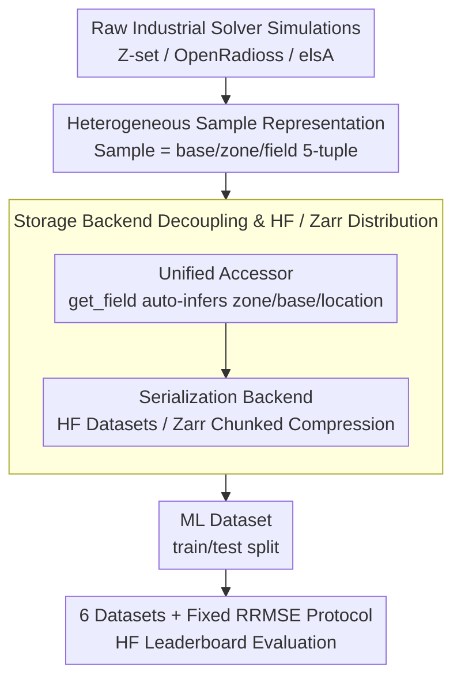

# PLAID: A Unified Data Model for Machine Learning on Heterogeneous Physics Simulations

**Conference**: ICML 2026  
**arXiv**: [2505.02974](https://arxiv.org/abs/2505.02974)  
**Code**: https://github.com/PLAID-lib/plaid (Available)  
**Area**: Scientific Computing / Physics Simulation / Datasets & Benchmarks  
**Keywords**: Physics-ML, Heterogeneous Meshes, Surrogate Models, Data Standards, Benchmarking

## TL;DR
PLAID proposes a unified data model and open-source library for heterogeneous physical simulation data, releasing six industrial-grade datasets covering structural mechanics and CFD alongside reproducible benchmarks. It transforms real-world "variable mesh, variable topology, and variable dimension" simulation data into standardized benchmarks accessible to the machine learning community.

## Background & Motivation

**Background**: Training surrogate models with machine learning to accelerate PDE simulations has become an independent research track. Dominant approaches include GNNs like MeshGraphNets based on message passing, operator learning methods such as Fourier Neural Operators (FNO), and recent developments in mesh transformers and implicit neural representations (INR), supported by infrastructure like PyTorch Geometric, DGL, and PhysicsNeMo.

**Limitations of Prior Work**: Unlike NLP with web-scale text or CV with billion-scale image-text pairs, datasets in physics-ML have long remained "small, narrow, private, and inconsistent in format." They are either toy problems supporting only regular structured grids (e.g., PDEBench, The Well) or ad-hoc datasets tied to specific solvers and libraries, offering almost no interoperability.

**Key Challenge**: The complexity of real industrial simulations stems precisely from "heterogeneity"—samples within the same dataset may have different shapes, node counts, connectivity, element types, or even topologies (e.g., varying numbers of holes in porous materials), and may undergo remeshing over time. Existing ML data formats assume "tensors with fixed shape," forcing the community to strip away this heterogeneity and retreat to structured grids for academic evaluation, resulting in benchmarks that fail to reflect real-world industrial generalization.

**Goal**: This work decomposes the gap into three sub-problems: (1) Designing a data abstraction that retains industrial-grade complexity (CGNS-compatible) while being efficiently consumable by ML frameworks; (2) Providing a library and online storage backend to make construction, I/O, and streaming access simple and scalable; (3) Providing a set of genuinely heterogeneous industrial datasets and public benchmark protocols to allow for fair comparisons across different modeling paradigms.

**Key Insight**: Rather than reinventing the wheel, the authors recognize CGNS as the de facto industrial standard for CFD/FEM. PLAID reuses the hierarchical CGNS simulation tree as the underlying schema, adding an "ML-friendly" layer for sample, input, output, and partition metadata. Distribution is offloaded to Hugging Face and Zarr, leveraging established infrastructure to lower engineering barriers.

**Core Idea**: Utilizing a three-layer stack comprising "CGNS tree + ML metadata + standardized accessor + HF distribution," PLAID encapsulates heterogeneous physics simulation data as first-class citizens in ML datasets. The track's de facto standard is then defined using six industrial datasets and benchmarks for five mainstream methods.

## Method

### Overall Architecture

PLAID addresses the inability of industrial simulation data to be directly consumed by ML frameworks. While existing ML formats assume fixed tensor shapes, industrial CFD/FEM data is inherently heterogeneous. PLAID's approach is to build a three-layer stack: the bottom layer uses the CGNS tree as a schema to carry heterogeneous structures; the middle layer uses a unified accessor to decouple storage formats from physical bytes; and the top layer hosts datasets and evaluation protocols on Hugging Face for continuous operation.

Specifically, the input consists of raw simulations from industrial solvers (e.g., Z-set, OpenRadioss, elsA). These are encapsulated by the data model layer into `Sample` objects (each containing a CGNS tree with multiple bases/fields). The library layer provides high-level access and parallel I/O, while the distribution layer serializes data into HF Datasets or Zarr backends. The final output is an ML dataset with train/test splits consumable by GNNs, operators, or transformers, evaluated via a community leaderboard using a fixed RRMSE protocol.

### Key Designs

**1. Heterogeneous Sample Representation based on CGNS Tree: Making "Variable Mesh and Topology" First-Class Citizens**

The primary engineering pain point in physics-ML is heterogeneity—different node counts, connectivity, and element types within one dataset. PLAID defines the abstract unit as a `Sample`, reusing the CGNS `base/zone/field` hierarchy. A single sample can host multiple bases, naturally supporting multi-support structures (e.g., 2D flow fields alongside 1D blade surface fields). Each field is explicitly located via a five-tuple: `name, zone_name, base_name, location∈{Vertex, CellCenter, FaceCenter}, time`. Consequently, remeshing, dynamic field appearance, and multi-dimensional mesh coexistence are standard scenarios rather than "special cases." By adding ML conventions to CGNS rather than creating a new schema, PLAID ensures compatibility with industrial solvers and visualization tools like ParaView.

**2. Storage Backend Decoupling and HF / Zarr Streaming: Enabling Field-wise Access for GB-scale Datasets**

Industrial datasets often reach gigabyte scales (e.g., 2D_ElPlDynamics at 8.6GB), making full memory loading impractical. PLAID decouples the data model from physical storage. The library layer exposes a unified accessor (e.g., `sample.get_field(name)`), while the backend handles serialization and parallel I/O. Datasets can be stored as human-readable YAML+CGNS files or serialized as Hugging Face Datasets or Zarr for chunked compression and remote object storage. This supports field-wise streaming—users can pull only required fields without downloading the entire dataset, a critical engineering capability missing from simpler "npz/h5" packaging.

**3. Six Progressive Heterogeneous Datasets + Fixed RRMSE Protocol: Stress-testing Heterogeneity**

PLAID provides six industrial-grade datasets (Tensile2d, 2D_MultiScHypEl, 2D_ElPlDynamics, Rotor37, 2D_profile, VKI-LS59) generated by solvers like Z-set and OpenRadioss. Mean node counts per sample range from 5k to 37k, testing geometric, mesh, and topological variations. The most complex, 2D_MultiScHypEl, uses varying hole counts to trigger topological changes. Evaluation uses a unified Relative Root Mean Square Error (RRMSE):

$$\mathrm{RRMSE}_f = \Big(\frac{1}{n_\star}\sum_i \frac{1}{N^i}\frac{\|\mathbf{f}^i_{\rm ref}-\mathbf{f}^i_{\rm pred}\|_2^2}{\|\mathbf{f}^i_{\rm ref}\|_\infty^2}\Big)^{1/2}$$

The `total_error` is the mean of RRMSEs across all fields and scalars. Testing set outputs are kept private, with submissions automatically scored by the HF platform.

### Loss & Training

PLAID does not prescribe training losses but standardizes **evaluation metrics**. After training on a unified split, relative errors for each field/scalar are calculated via RRMSE and aggregated into a `total_error`. For transient datasets (2D_ElPlDynamics), field trajectories are stacked before calculating RRMSE, providing a trajectory-level error assessment.

## Key Experimental Results

### Main Results

The table below shows the `total_error` for six representative methods across the six PLAID datasets (lower is better; bold is best, underscored is second best). No single method dominates all datasets, highlighting the challenge of heterogeneity.

| Dataset | MGN | MMGP | Vi-Transf. | Augur | FNO | MARIO |
|--------|-----|------|------------|-------|-----|-------|
| Tensile2d | 0.0673 | **0.0026** | 0.0116 | 0.0154 | 0.0123 | 0.0038 |
| 2D_MultiScHypEl | 0.0437 | — | 0.0325 | **0.0232** | 0.0302 | 0.0573 |
| 2D_ElPlDynamics | 0.1202 | — | 0.0227 | 0.0346 | **0.0215** | 0.0319 |
| Rotor37 | 0.0074 | **0.0014** | 0.0029 | 0.0033 | 0.0313 | 0.0017 |
| 2D_profile | 0.0593 | 0.0365 | 0.0312 | 0.0425 | 0.0972 | **0.0307** |
| VKI-LS59 | 0.0684 | 0.0312 | 0.0193 | 0.0267 | 0.0215 | **0.0124** |

### Dataset Complexity Comparison

| Dataset | Samples | Avg nodes | Mesh | Heterogeneity Source |
|--------|--------|----------|------|--------|
| Tensile2d | 702 | 9,428 | tri | Variable mesh + nonlinear constitutive |
| 2D_MultiScHypEl | 1,140 | 5,692 | tri | Variable topology (hole count) |
| 2D_ElPlDynamics | 1,018 | 25,429 | tri | Transient + fracture erosion |
| Rotor37 | 1,200 | 29,773* | quad | 3D + shock wave position shift |
| 2D_profile | 400 | 37,042 | tri | Large deformation + transonic shock |
| VKI-LS59 | 839 | 36,421* | quad | Multi-support (2D flow + 1D surface) |

### Key Findings
- **MMGP dominates when samples can be aligned** (Tensile2d, Rotor37), but its mesh-morphing assumption fails completely under topological changes (2D_MultiScHypEl), hence the missing values.
- **MARIO (INR-based) performs best on smooth or shock-dominated CFD tasks** (2D_profile, VKI-LS59) but struggles with local stress concentrations and discrete topological changes in solid mechanics.
- **FNO shows significant performance degradation on Rotor37 and 2D_profile** due to approximation errors and computational costs when projecting anisotropic or 3D meshes onto regular grids.
- **Vi-Transformer and Augur provide robust median performance**, validating that mesh partitioning and tokenization are currently the most robust paradigms for heterogeneity.

## Highlights & Insights
- **The decision to add ML conventions to CGNS is a mature engineering choice**: By acknowledging established standards, PLAID avoids the "new format, zero ecosystem" trap.
- **Explicitly treating heterogeneity as an evaluation axis** provides a powerful perspective: Success on PDEBench does not guarantee performance under topological shifts. This framework forces future work to specify which types of heterogeneity they address.
- **Embedding the benchmark in Hugging Face** is a savvy engineering decision, leveraging existing UI, user systems, and traffic to build community momentum.

## Limitations & Future Work
- Currently limited to structural mechanics and CFD; electromagnetics, acoustics, and combustion are not yet included. Transient diagnostics like rollout stability are also reserved for future work.
- Private ground truth for the test set prevents overfitting but raises barriers for researchers wanting to perform error analysis or visualize failure modes locally.
- While covering multiple paradigms, the benchmark lacks diffusion-based PDE solvers and neural ODEs, and does not yet compare methods under equal computational budget constraints.

## Related Work & Insights
- **vs. The Well (Ohana 2024)**: The Well supports only structured grids; PLAID supports unstructured meshes, topological changes, and multi-dimensional coexistence.
- **vs. PDEBench / PDEArena**: PLAID fills the gap in industrial FEM and solid mechanics, which are often overlooked by fluids-focused benchmarks.
- **vs. CGNS**: PLAID is not a replacement but a layer on top; it standardizes "ML-consumable datasets" the way a PyTorch Dataset standardizes access to raw arrays.

## Rating
- Novelty: ⭐⭐⭐⭐ A systemic infrastructure work (Data + Benchmark + Library).
- Experimental Thoroughness: ⭐⭐⭐⭐⭐ Comprehensive 6x6 matrix plus a persistent community platform.
- Writing Quality: ⭐⭐⭐⭐ Clear structure; key arguments are well-supported by data.
- Value: ⭐⭐⭐⭐⭐ Directly raises the evaluation floor for the physics-ML track.

<!-- RELATED:START -->

## Related Papers

- [\[CVPR 2026\] UniPixie: Unified and Probabilistic 3D Physics Learning via Flow Matching](../../CVPR2026/3d_vision/unipixie_unified_and_probabilistic_3d_physics_learning_via_flow_matching.md)
- [\[AAAI 2026\] GSAP-ERE: Fine-Grained Scholarly Entity and Relation Extraction Focused on Machine Learning](../../AAAI2026/3d_vision/gsap-ere_fine-grained_scholarly_entity_and_relation_extraction_focused_on_machin.md)
- [\[ICML 2026\] PhysHanDI: Physics-Based Reconstruction of Hand-Deformable Object Interactions](physhandi_physics-based_reconstruction_of_hand-deformable_object_interactions.md)
- [\[NeurIPS 2025\] Galactification: Painting Galaxies onto Dark Matter Only Simulations Using a Transformer-Based Model](../../NeurIPS2025/3d_vision/galactification_painting_galaxies_onto_dark_matter_only_simulations_using_a_tran.md)
- [\[ICLR 2026\] Learning Unified Representation of 3D Gaussian Splatting](../../ICLR2026/3d_vision/learning_unified_representation_of_3d_gaussian_splatting.md)

<!-- RELATED:END -->
